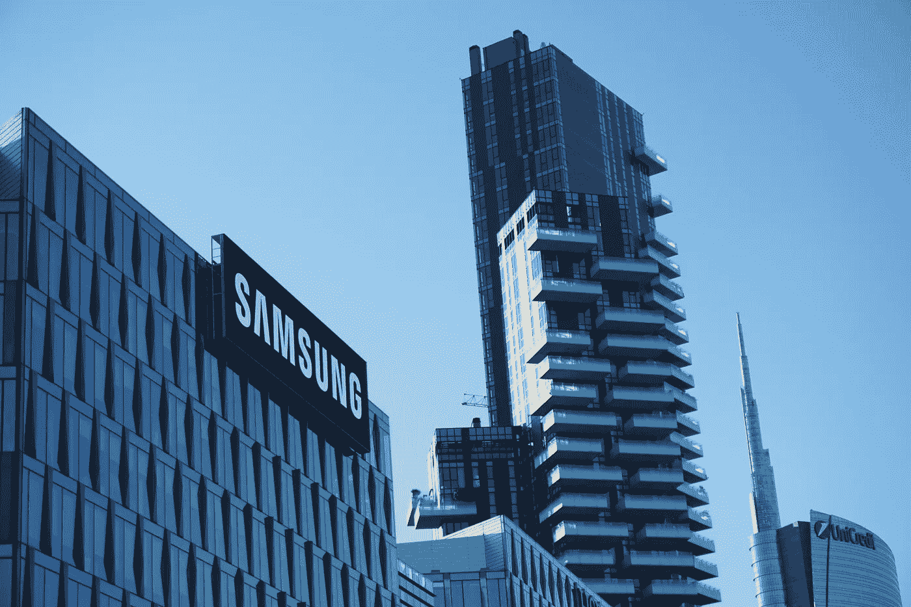

# 三星:从脱水鱼到价值 460 亿美元

> 原文：<https://medium.com/geekculture/samsung-from-dehydrated-fish-to-being-valued-at-46-billion-dollars-c089dc480488?source=collection_archive---------14----------------------->

## 从鱼到智能手机

Photo by [Babak Habibi](https://unsplash.com/@babak20?utm_source=unsplash&utm_medium=referral&utm_content=creditCopyText) on [Unsplash](https://unsplash.com/s/photos/samsung?utm_source=unsplash&utm_medium=referral&utm_content=creditCopyText)

# 介绍

三星。

听到它会想到什么？也许想到的是科技。可能会想到智能手机。也许你拥有他们的一种或多种产品。