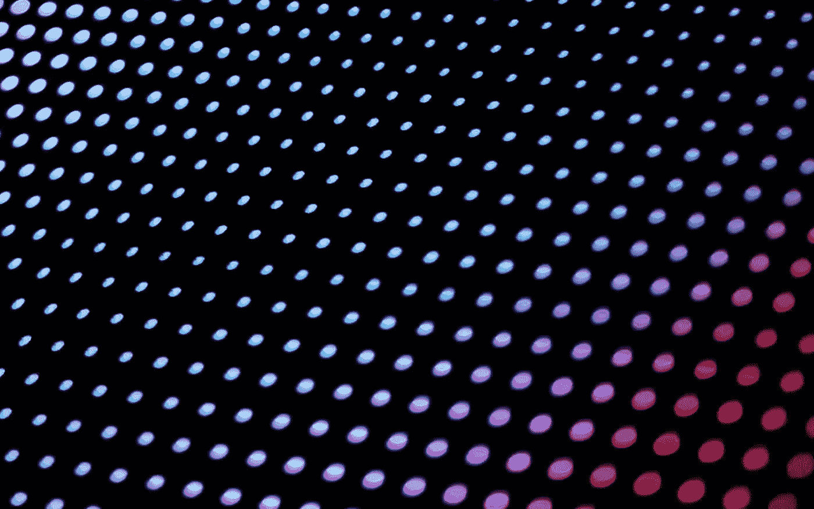

# 三星 QD-有机发光二极管:它能在 2022 年颠覆电视现状吗？

> 原文：<https://medium.com/geekculture/samsung-qd-display-can-it-upset-the-tv-status-quo-in-2022-58eee932544?source=collection_archive---------16----------------------->

## 韩国人正在采取行动实现这一目标，我们可能会很快发现这一点

Quantum Dots were used by Samsung in order to differentiate its LED/LCD TVs from the competition, but what if they were used with a self-emissive screen like an OLED? Now *that* would be neat, no? (Image: Samsung)

**当然，离 2021 年还有一段时间**，但是已经对今年的电视产品类别有了相当好的想法的人已经在期待着公告了…