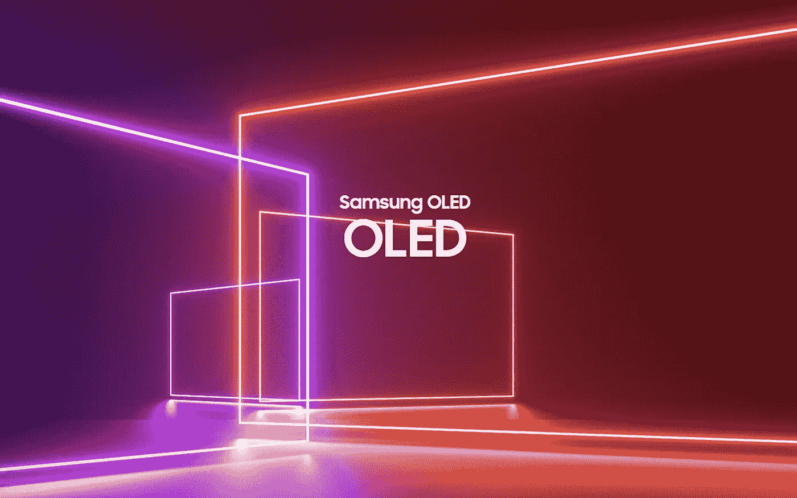

# 三星也将提供有机发光二极管电视——那将如何运作呢？

> 原文：<https://medium.com/geekculture/samsung-will-be-offering-oled-tvs-too-so-how-will-that-work-8eba0955ccb9?source=collection_archive---------17----------------------->

## 韩国在 2022 年有一个复杂的电视市场战略，下面是可能发生的事情

Samsung, the world’s biggest TV manufacturer, will be active in all three current display technologies this year — LED/LCD, QD-OLED and OLED — via a deal it made with LG Display. It’s a first for the Koreans and a rather exciting development for the TV market in general. (Image: Samsung)

**CES 2022** —期间 [**三星**](/geekculture/ces-2022-samsung-focuses-on-software-for-its-2022-smart-tvs-9b259e60730d) 、 [**LG**](/geekculture/ces-2022-lg-fails-to-excite-with-its-new-tvs-60496c08efb) 和索尼宣布了他们的新电视型号，包括 [**索尼的第一台 MiniLED 电视**](/geekculture/ces-2022-sony-gets-into-the-miniled-tv-game-too-8af8c372f6bc) 和 [**世界上第一台 QD-有机发光二极管电视**](/geekculture/ces-2022-sony-launches-the-worlds-first-qd-oled-tvs-7af23da17386)—[**更让画质爱好者兴奋**](https://debugger.medium.com/ces-2022-and-just-like-that-tvs-are-exciting-again-58aaf3125655) …