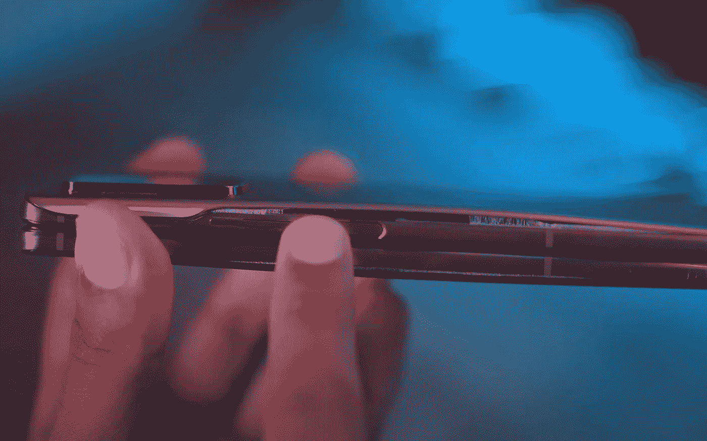

# 三星新的智能手机电池问题纯粹是技术因果报应

> 原文：<https://medium.com/geekculture/samsungs-new-smartphone-battery-issue-is-pure-tech-karma-d5b763f640fe?source=collection_archive---------0----------------------->

## 这是一个漫长的过程，韩国人再也承受不起他们过去表现出的那种傲慢了

Samsung is no stranger to controversy when it comes to quality control procedures for its smartphones, but this seems to potentially be one of its most serious problems yet. (Image: [Mrwhosetheboss](https://www.youtube.com/c/Mrwhosetheboss), YouTube)

公平地说，如果某些特质被反复证明是任何公司“DNA”的一部分，它们永远不会真正消失。公关烟雾和时间可能会暂时掩盖他们…