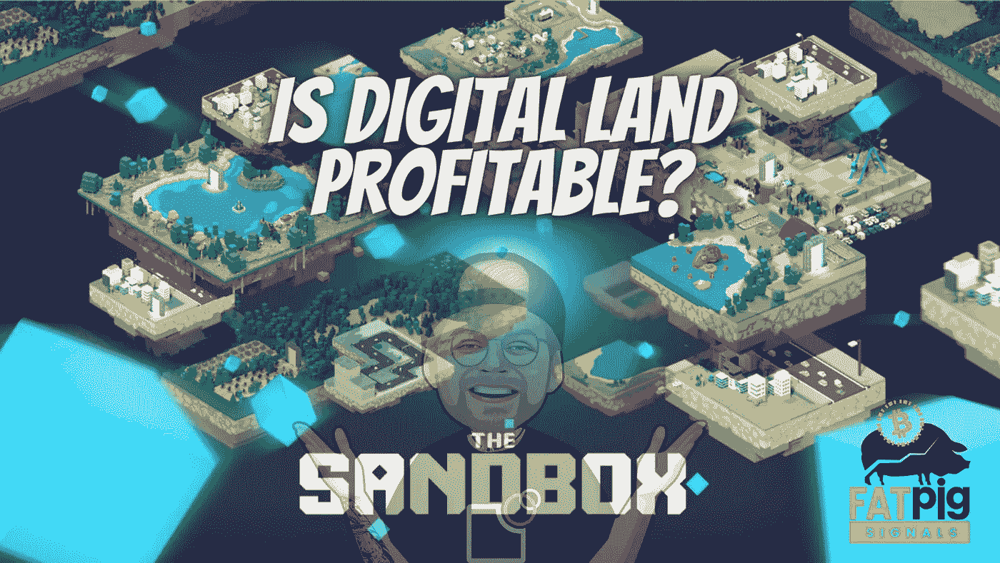

# 沙盒和围绕元宇宙数字土地的炒作

> 原文：<https://medium.com/geekculture/sandbox-and-the-hype-around-digital-land-in-the-metaverse-dcdde565f3e6?source=collection_archive---------19----------------------->

几乎每个对加密感兴趣的人现在都对沙币很熟悉。尤其是因为前脸书更名为 Meta 所引发的元宇宙炒作。

然而，由于当前的市场形势和沙子价格下跌，人们的兴趣再次明显下降。然而，这并不意味着它是正当的。事实上，塞巴斯蒂安·博格特…