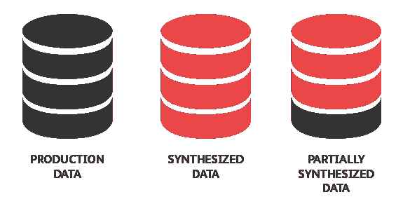
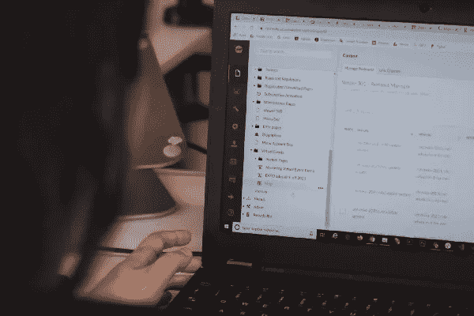
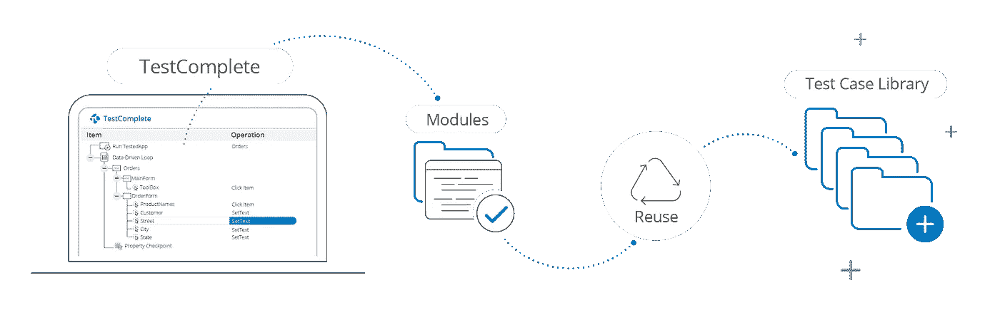
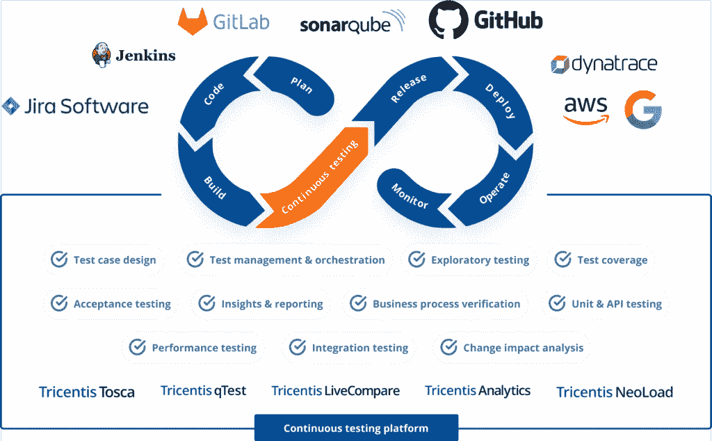
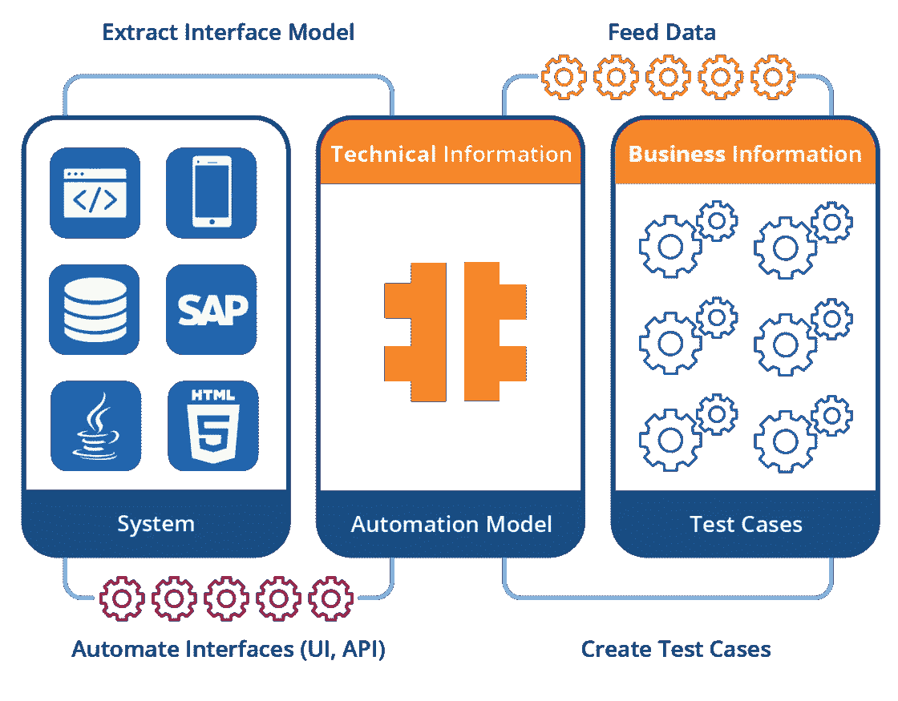

# SAP 测试最佳实践

> 原文：<https://medium.com/geekculture/sap-testing-best-practices-e4ead283bff9?source=collection_archive---------7----------------------->

## 让我们讨论一下当前行业中的最佳软件测试实践

如今，测试的复杂性急剧上升，尤其是对于依赖大型**企业资源规划(ERP)** 软件的企业。尽管 ERP 系统保证了日常运营中测试工作流程的顺畅，但仍有一些挑战需要克服，例如使用 **SAP — *最先进的 ERP 解决方案*** 有效实施这些 ERP 系统。

使用 SAP 作为 ERP 解决方案需要对不同的模块进行额外的配置，以检索期望的结果。因此，这些开销变化需要单独的以及综合的测试。测试是为了确保各种业务模块的功能保持不变。

在进入 SAP 测试及其最佳实践之前，让我们简单地探索一下 ERP 系统和 SAP 以及它们是如何工作的。

# **简介**

被称为企业资源规划的 ERP 是不断变化的 IT 世界中的绝对软件解决方案。它提供了一系列功能来管理跨多个部门的无数业务流程，包括销售、营销、生产、开发、CRM、人力资源等。允许数据和可用资源共享。

当今市场上领先的 ERP 解决方案是 SAP 系统。组织使用 SAP 无缝管理其业务流程、信息流、数据和解决方案，从而削减不必要的运营开支。但是首先，需要理解这些活动的特征，以确保在交付之前成功地执行了测试。

在 SAP 测试中，跨业务运作的多个单元得到测试。开发人员通常根据特定客户公司的定制需求修改基本模块。因此，开发人员需要确保当变更完成时，模块的合并工作良好，这就是 SAP 测试的作用。

客户可能会拒绝没有经过适当测试的模块。不断的更新也使我们不得不定期添加新的测试。任何采用 SAP 作为软件测试解决方案的组织都必须有一个定期的、可靠的测试程序。

因此，这里的问题陈述可以归结为以下内容:

> *“如何有效地测试具有内在 SAP 测试挑战的大型 ERP 软件，有无测试自动化？”*

# **SAP 测试的最佳实践**

最大的 SAP 测试挑战来自于测试数据和环境。

> 此外，根据 NIST 的说法，一个普通的测试团队花费至少 30%的精力来建立他们的测试环境，而不是进行实际的测试，这导致了 74%的项目延迟。

任何中型或跨国企业都可能面临一些常见的 SAP 测试挑战。以下被认为是 SAP 环境中的最佳测试实践:

1.  **高效的类似生产的测试数据**
2.  **使用自力更生的工具和方法**
3.  **测试&记录更新**
4.  **SAP 中小企业参与业务流程**
5.  **重复和重用任务**

我们现在将详细看看这里介绍的每一个测试实践。一个基于 SAP 的项目在测试和发布时需要一个完美的路线图或构建模块。我们还将讨论一些可以应用这些测试实践的示例场景。

## **高效的生产类测试数据**

任何 SAP 改造项目的最佳方法是使用**类似生产的数据**进行测试。数据量可能取决于客户需求—手动或集成测试。

它支持所需的数据量—深度和广度，并支持现实的基础架构指标。这种实践对于进行客户要求的性能测试非常有益。

> 将过去 15 到 20 年的测试数据放入 SAP 框架可能会很麻烦。数据集的多样性，或者系统可以处理的数据集的数量，可能会导致问题。从当前可用的大量数据中找到测试数据的有效组合是很麻烦的。

## **自力更生工具和方法的使用**

开始测试之前的最佳实践是追踪和回顾与开发相关的需求，包括技术和功能两方面。所有测试数据都应符合安全策略，被屏蔽，测试值不变。

拥有一个类似于实际生产现场的虚拟测试环境是有益的。数据库系统的代码库应该以集成的方式运行，允许集成管道和部署。

> 识别用于测试的业务流程的类型本身就是一个问题。通常，一些未测试的代码库或特性被推到生产中，在那里它可能会失败。

## **测试&记录更新**

随着软件模块的变化，测试、映射和文档的定期更新也是必要的。俗话说，“小橡子长成大橡树”，一个小小的改变可能会导致一连串的失败。

正如在上面的方法中所讨论的，使用行业认可的 SAP 测试工具和框架让你有一个**带有版本控制的测试脚本目录**。主要思想是以一种有组织的方式验证每个端到端场景。

> 在创建测试文档时，不提供关于新定制的详细信息是一个常见的错误。与此测试挑战相关的其他场景可能是 QA 团队很少或根本没有参与、文档模板不标准、对 SAP 原则了解很少或很少，或者文档杂乱，没有版本控制和不定期更新。

## **SAP 中小企业参与业务流程**

强烈建议将 **SAP 主题专家**纳入团队。它将确保对具有较高价值的测试用例进行优先测试。在您的生产环境中工作的人员保证了您业务的转型成功。他们是处理日常事务和运营的焦点。

因此，理解业务流程和吸收 SAP 测试原则是非常重要的。在这一领域，研讨会、知识传授会议或 SAP 专家的**参与**是必不可少的。

> 由于严格的截止日期，您可能会在这里或那里执行一些测试，这会不时地导致新的错误。这些错误现在需要被修复，并最终进入测试团队的手中。测试人员或 QA 分析师是唯一留下来识别 bug 修复的人。通常情况下，他们对 SAP 转型和流程一无所知。

## **重复和重用任务**

跟踪问题并记录为纠正过去的测试所采取的措施是已经涵盖的测试实践。如果经验教训没有被记录下来，人们可能会对已经测试过的测试用例重新开始这个过程。

我们需要建立一个定义良好的、**可重用的测试模式**和聚焦的脚本。测试模块应该可以很容易地重复一个经过验证的任务列表。通过这种测试实践，您的开发的可靠性提高了，自动化任务变得更加容易。

> 大公司 35%的 IT 预算都花在了测试上，迫切需要更多的测试自动化。您可能不知道是否可以重用已经存在的测试用例。您可能会看到一些重复出现的测试，并且可以作为一个测试批次重用。

# **使用 Tricentis Tosca 的解决方案**

今天，在不断变化的数字空间中蓬勃发展本身就是一个挑战。提供丰富的客户体验，同时处理业务风险是日常生活的一部分。因此，持续测试和自动化在这些高性能的业务中扮演着至关重要的角色。

随着时间的推移，传统的测试方法在某个地方达不到 ***精益和敏捷的心态*** 。开发周期减少了，每个周期在一到两周结束时发布解决方案的一部分。因此，旧的测试工具和技术也不能满足 DevOps 的需求。

现在让我们来介绍一下业界公认的软件测试平台 **Tricentis Tosca** 。除了上面讨论的一些挑战之外，它还帮助您克服传统的测试挑战。Tricentis 与 Tosca 一起配备了集成的软件测试解决方案，能够以最有效的方式以更低的成本管理测试用例。

T ricentis 只需点击几下鼠标，就可以将手动测试转换成自动化测试。现在，您的测试可以连续运行，从而获得高达 70%的高性能和风险覆盖率。Tosca 利用模型驱动的测试自动化方法，以及基于风险的测试和服务虚拟化，来交付企业所需的有价值的端到端测试。

在寻找完美测试工具的过程中，我们来到了 **Tricentis Tosca** 。它照顾到你能想到的一切！

*   通过扫描旧的测试、遗留代码或控件，Tosca 测试套件将生成手动、自动甚至探索性的测试。
*   在维护您的测试数据设计和模拟缺失系统的同时涵盖您的业务风险是 Tosca 可以利用的一个众所周知的特性。
*   借助 Java、SAP、Salesforce 等的强大功能，插入到您的持续集成管道或企业环境中，无缝地跨浏览器以及移动 API 进行测试。，Tricentis 的功能要多得多。

***综上所述，无论您在 SAP 之旅的哪个阶段，您都可以从 Tricentis 的测试自动化中获益，并随身携带。***

*感谢阅读到最后！希望有帮助…👩‍💻*

*如有疑问，请随时联系我们，或者只是打个招呼！👇*

 [## 软件工程师

### Chandrika Deb 是 Amdocs 的一名软件工程师，她喜欢学习新事物和帮助技术初学者。

chandrikadeb7.github.io](https://chandrikadeb7.github.io)