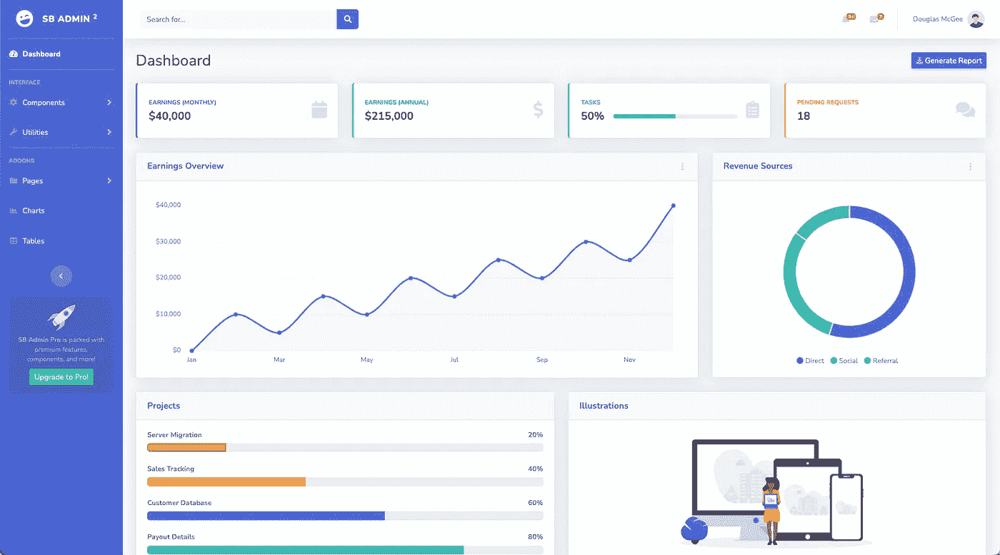

# 使用 Django 模板节省时间:引导管理

> 原文：<https://medium.com/geekculture/save-time-with-this-django-template-bootstrap-admin-7bdbf97813a7?source=collection_archive---------1----------------------->

## 用这个模板开始你的 Django 项目以节省时间

SB Admin Screenshot

每当你开始一个新的 Django 项目，你要做的是:

1.  创建 Django 项目
2.  创建应用程序
3.  添加和设置静态
4.  获取一些 HTML CSS 模板，复制