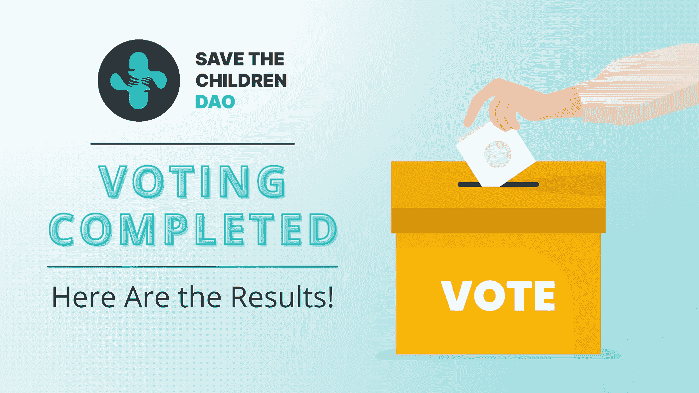
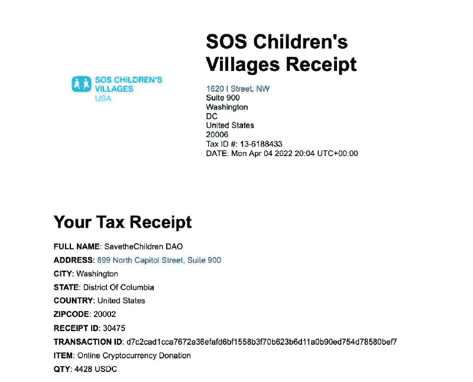

# SavetheChildrenDAO 投票已完成，结果如下！

> 原文：<https://medium.com/geekculture/savethechildrendao-voting-completed-here-are-the-results-1d1d82319c1a?source=collection_archive---------23----------------------->

2022 年 3 月 28 日，SavetheChildrenDAO 成功完成了为期三天的社区投票会议。投票是为了决定第一笔 BNB 捐款的去向。

在社区捐助者和投资者的帮助下以及收到的投票，该组织决定将他们的第一笔 BNB 捐款捐赠给全球最大的致力于弱势儿童的非营利组织之一**SOS 儿童村。**

**SavetheChildrenDAO 将向非政府组织美国 SOS 儿童村捐赠 50 BNB，这是由社区自己决定的。4 月 4 日，他们首次向组织捐赠了 10 BNB (4428 USDC)，并在[T5【本文](/@ChildrenDao/savethechildrendao-voting-completed-here-are-the-results-2f44e0d81b99) 分享了证明。**

**这是第一笔 10 BNB 捐款的收据证明！**

****

****关于 SOS 儿童村的更多信息****

**自 1949 年以来，国际组织 SOS 儿童村一直致力于帮助贫困儿童，为孤儿和被遗弃的儿童提供家园，确保他们的所有基本需求得到满足，并帮助他们塑造未来。该组织在世界各地拥有 2000 多个机构，是世界上最大的专门为失去父母的儿童服务的援助组织之一。**

**该组织设想的世界是，每个孩子都属于一个家庭，在平等的爱、尊重和安全中成长。**

**目前，由于俄乌战争，儿童处于悲惨的境地。数百名儿童被杀害，许多其他儿童分秒必争地为自己的生命而挣扎，为战争而战斗。**

**SOS 儿童村不知疲倦地努力保护乌克兰和欧洲周边国家的儿童和家庭的安全。**

**[**SavetheChildrenDAO**](https://savethechildrendao.org/#/)持有类似 SOS 儿童村的愿景。他们想为孩子们建立一个更好的世界，在那里他们将有最好的医疗支持、食物、教育、衣服、保护，以及茁壮成长的权利。为了确保儿童的健康和福祉得到保护，特别是在战争和流行病期间，SavetheChildrenDAO 的团队夜以继日地付出最大的努力。**

**他们与世界各地的许多社区和慈善机构合作，保护儿童，帮助他们恢复尊严。SOS 儿童村是他们的合作组织之一，他们向其提供了首次 BNB 支持。**

**他们计划在未来举办更多这样的投票活动，让社区成员更多地参与到[**SaveTheChildrenDAO**](/@ChildrenDao/savethechildrendao-helping-children-in-need-to-survive-thrive-78b6531341ae)的管理中来。**

**有关 SavetheChildrenDAO 的更多信息，请访问此处**

**[**网站**](https://savethechildrendao.org/) **|** [**推特**](https://twitter.com/ChildrenDao) **|** [**电报**](https://t.me/savethechildrendao) **|** [**不和**](https://discord.gg/pUVzPjkqdW) **|** [**中**](/@ChildrenDao)**