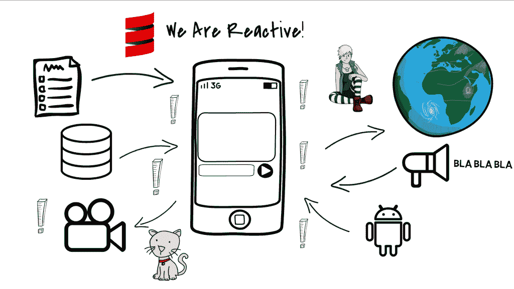
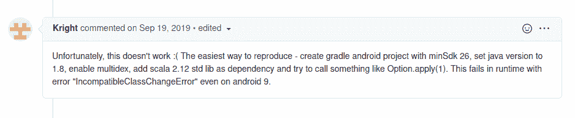
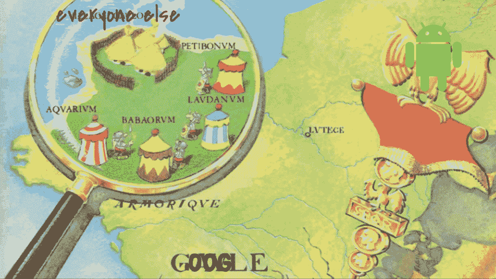
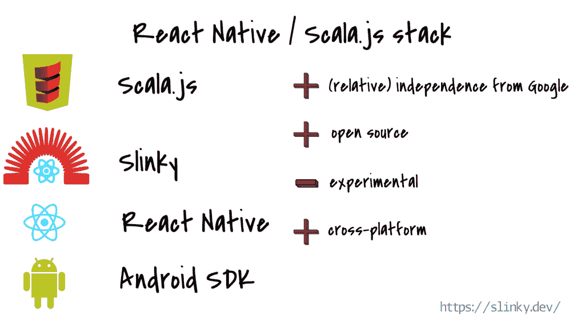
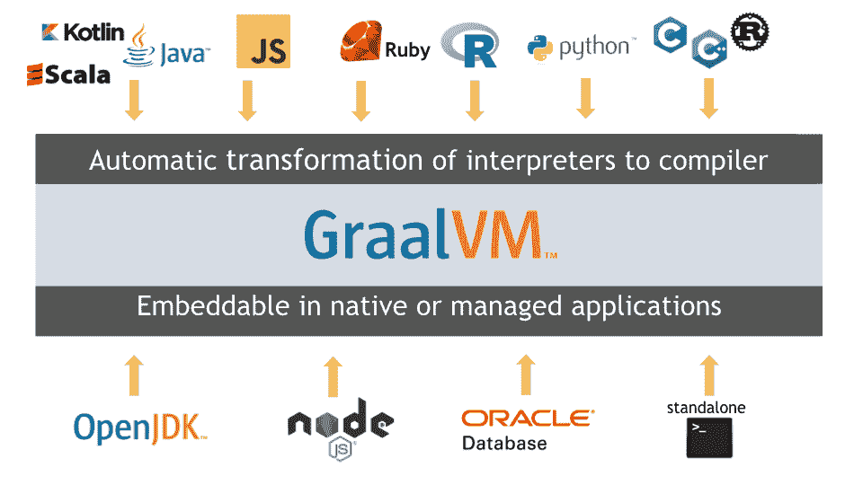
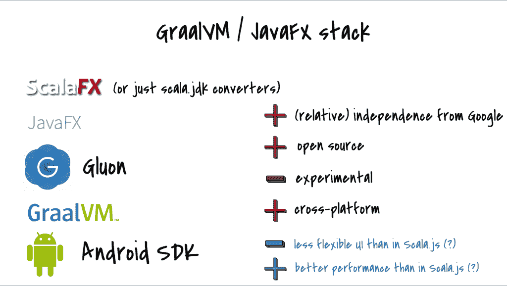
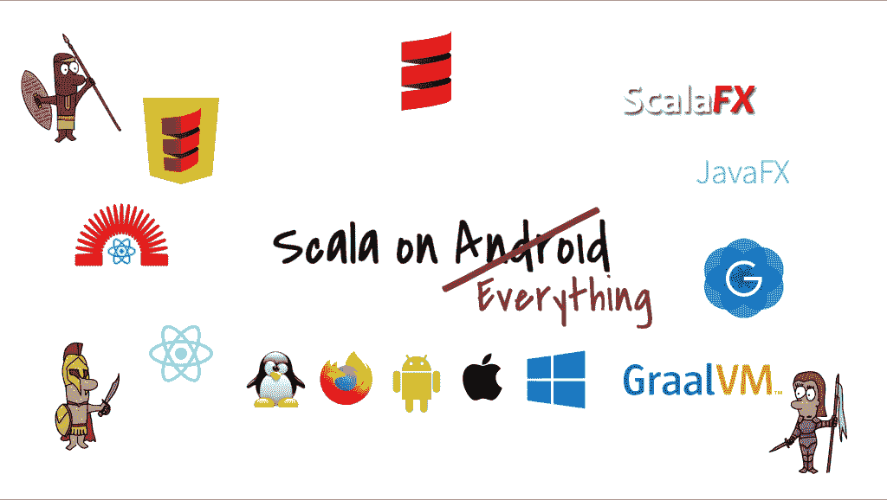

# Android 上的 Scala

> 原文：<https://medium.com/geekculture/scala-on-android-74874d056c1a?source=collection_archive---------7----------------------->

这是我在 2021 年 2 月在 [ScalaLove 发表的一篇会议演讲的转录本。发布会议视频时，将添加视频链接。](https://inthecity.scala.love/)

*   [幻灯片](https://drive.google.com/drive/folders/1fRqmRYMNMUgZCdqsvUDLaobgXppcnNGH?usp=sharing)
*   [GitHub 回购与实例](https://github.com/makingthematrix/scalaonandroid)

四年来，我一直在开发 Wire 的 Android 客户端，这是一个端到端的加密信使，用 Scala 编写。在 Android 中，我们处理很多来自不同来源的事件:用户、后端、Android 操作系统本身。我们编写的代码必须非常具有反应性——它还应该简洁，能够同时处理所有这些事件，以便从有限的资源中尽可能地挤出资源。Scala 应该在这些条件下茁壮成长。然而，它几乎不存在。仍然编写它的人被迫使用旧版本的库，在旧版本的语言本身之上，来修改 Gradle 脚本，并且基本上跳过无数不应该存在的漏洞。这些人中的大部分要么已经转向其他市场领域，要么转向其他编程语言。我想概述一下我们是如何陷入这种奇怪的境地的。过去有哪些在 Android 上引入 Scala 的尝试，它们是如何失败的。为了能够在 Android 上编写 Scala，目前还需要哪些技巧和让步。但我也想告诉你最近的发展，这让我有理由相信未来会更好。

在[I/O 2019 大会](https://events.google.com/io2019/recap)上，谷歌宣布全球 Android 设备数量超过 25 亿。无论我们如何看待谷歌，这都是一项了不起的成就。2017 年 5 月是 20 亿台设备。2015 年 9 月，用户数量达到了 14 亿……这与设备的数量不一样，但无论如何，这表明增长是稳定的，尽管世界上只有有限数量的智人。2019 年有 27.1 亿智能手机用户，因此即使考虑到一些人拥有不止一台设备，也清楚地表明，Android 是迄今为止手机上最大的平台，从绝对数字来看，也是地球上最受欢迎的操作系统。它一直占据移动市场 70-74%的份额，而它最大的竞争对手苹果的份额为 25-28%，其他平台并不存在。最重要的是，移动平台的前景是不均衡的。iOS 手机平均价格更高。它们在富裕国家和像我们这样的富人中更受欢迎。这就是为什么我们可能会认为 Android 和 iOS 比实际情况更加平均。但在全球各地，除了所谓的西方，安卓的存在要大得多。中国、印度、非洲、拉丁美洲、中东甚至东欧——这些市场充斥着 Android 设备，而且这些市场正在快速增长。([就看这里](https://gs.statcounter.com/os-market-share/mobile/worldwide))。

但这个演讲并不是要抨击苹果，为谷歌欢呼。恰恰相反。在这里，我只是想让你看看 Android 平台的规模，因为无论我们怎么想，它都太大了，不容忽视。

更多数据:

*   2019 年[70-80%的互联网流量](https://www.ciodive.com/news/70-of-internet-traffic-comes-from-mobile-phones/510120/)来自移动设备。
*   其中绝大部分来自应用程序，而不是移动友好网站，尽管我们在这里谈论的大多是大型应用程序，如脸书、Twitter、Instagram 等。这些大型应用创造了一种文化，即寻找一种能让我们在手机上做某些事情的应用，而不是去一个万能的网络浏览器。
*   (顺便说一下，移动设备上的网络浏览器也是一个应用程序)
*   谷歌 Play 商店目前有大约 300 万个应用程序。这些应用大部分是用 Java 和 Kotlin 编写的，但也有一些其他语言

脱离上下文，GitHub 上储存库的数量并不意味着什么——但是我们可以看看它们的比例:[https://github.com/topics/android](https://github.com/topics/android)。Android 平台上的 Java 规则(截至 2021 年 2 月 16 日，77754 个存储库中有 43699 个以 Android 为目标，主要编程语言是 Java)，仍然安全地高于 Kotlin (14438)，但我们必须记住 Kotlin 是一个相当新的参与者——只是在 2019 年 I/O 谷歌宣布它选择 Kotlin 作为 Android 平台上 Java 的继任者。Javascript 排在第三位(3315)，Dart 排在第四位(2915)，因为 Flutter 似乎也是 GitHub 上最受关注的 Android 项目，这就是为什么它出现在这张截图的背景中。我们稍后也会谈到这两个问题。

但在此之前…如果 Java 和 Kotlin 如此突出，那么为什么我们在这个榜单上没有看到 Scala 呢？毕竟，这是 JVM 上的第二种或第三种语言，现在是 Kotlin 的前 equo。如果你挖掘得更深，你会发现有 **45** 个主要编程语言是 Scala 的库，其中大部分都被放弃了或者只是小型的周末项目。其中比较突出的是我的雇主 Wire 的 Android 客户端应用程序[——还有我们来自 47deg 的朋友，他们几年前在 Android 上试验了 Scala，甚至在 Scala 中创建了](https://github.com/wireapp/wire-android/)[一个应用程序，用于跟踪 Scala Days 会议上的演讲](https://github.com/47degrees/scala-days-android)。

并不总是这样。从 2014 年到 2016 年左右，我们看到了一些用 Scala 编写的 Android 项目的兴起，包括库和终端用户应用。Scala 开发人员对 Android 的兴趣一直很小，但有一段时间，它似乎足以为我们开辟一个小天地。毕竟，Android 应用程序依赖于良好的事件处理和反应，与后端程序相比，它们通常很小，它们由小团队构建，需要快速行动，编写安全可靠但简洁的代码。Android 对我们来说看起来是一个完美的地方。这正是为什么 [Wire](https://wire.com/en/) 选择 Scala 作为其 Android 应用的原因。有一段时间这是有意义的。我们有三种主要的方法来构建 Android 应用。其中两个是通过两个主要构建工具的插件实现的:SBT 和格雷尔。如果你想走 Scala 的路，有[SBT-Android 插件](https://scala-android.org)。如果你想要一个更标准的 Android 方式，可能是因为你想将你的 Scala 代码与 Java 混合，你可以使用[的 gradle-scala-android 插件](https://github.com/saturday06/gradle-android-scala-plugin)。还有 [Scaloid](https://github.com/pocorall/scaloid) ，一个试图将 Android SDK 的易变特性包装成更适合函数式编程的库。

这三个都是在 2014 年左右创建的，通过 2016 年进行开发和维护，然后在 2017 年慢慢消亡。至少有几个原因可以解释为什么这一切都没有实现。谷歌做出了一些决定。事实上，Scala 社区很小，而且主要面向后端，所以我们决定专注于此……不过，在这里，我想谈谈一段时间以来被证明不可能克服的技术问题。

2014 年 3 月 [Java 8 发布](https://www.oracle.com/java/technologies/javase/8-whats-new.html)。在其他特性中，它引入了对 Java 中 lambda 表达式和 JVM 字节码的支持。当然，Scala 的 lambda 比这早得多，但在编译成字节码的过程中，它们必须被替换为——在 Java 语言层面上——相当于在使用 lambda 的地方创建一个新的内部类，该类中的一个方法相当于 lambda 代码，然后创建该类的一个实例，最后调用该实例上的方法。(例如:前的[，](https://drive.google.com/file/d/1V_BOZZpeoyJgIZmj5-IZaBeYI2i13T7l/view?usp=sharing)后的[)。想一想你一直在你的 Scala 项目中写了多少 lambda 表达式，想象一下对于它们中的每一个都必须有一个单独的类。你可以很容易地看到，它不仅使产生的字节码比需要的要大，而且在运行时，应用程序使用了更多的内存，速度也有点慢，因为它必须创建所有这些实例。所以很自然的，](https://drive.google.com/file/d/1Xi6ymSkonwAZLH_JrMk0-IgpFwEW3dKl/view?usp=sharing) [Scala 接受了新功能](https://www.infoq.com/articles/Scala-2-12-Only-Java8/)，当 2016 年 11 月，**2.12 版发布时，它需要新的 JVM。产生的字节码现在更小更快了。Scala 库和框架的开发者很快跟进了这个套件。他们项目的新版本利用了 JVM 上的新 lambdas。**

**问题是 Android 平台用的[不是 JVM](/android-news/closer-look-at-android-runtime-dvm-vs-art-1dc5240c3924) 。旧 Android 的虚拟机 Dalvik 和后来取代 Dalvik 的 ART 都采用 Java 字节码类，并将其进一步翻译成自己的字节码，对低内存需求进行了优化。Dalvik 和 ART 不需要理解每一条 JVM 指令。例如，当 Java 8 引入了对 lambda 表达式的支持时，它们保持不变。而当 [Scala 2.12 发布](https://www.scala-lang.org/news/2.12.0)时，原来是无法在 Android 上使用的。**

**一开始，这没什么大不了的。毕竟还是支持 Scala 2.11 的。从对 SBT Android 插件 GitHub repo 及其 Gitter 的评论中，我们可以看到，人们认为 lambda 问题和其他问题一样只是一个 bug。在 Gradle plugin 方面，我们在 Wire，还有许多其他人也尝试了一些实验，但是没有成功。然后【2017 年 5 月举行了 I/O 大会，谷歌选择支持 Kotlin 作为 Android 平台上的主要编程语言。Google 关于 Kotlin 的决定和 Scala 关于 Java 8 的决定在时间上如此接近，这两个决定一起传递了一个非常强烈的信息。如果你更喜欢 Scala，就不要考虑在 Android 上编程了。如果你更喜欢 Android，那就去看看其他编程语言，也就是 Kotlin。**

**渐渐地，Scala 生态系统的主要库开始放弃对 Scala 2.11 的支持，2019 年甚至 Wire 也改变了路线——我们开始寻找 Kotlin 开发者，并开始用 Kotlin 重写 Wire Android 应用程序，这一过程缓慢地持续至今。**

****

**好吧。也许我说的是东欧。在东欧，我们经常预计最坏的情况会发生，所以当它发生时，我们做好了准备，变得有点自大，说一些愚蠢的话，比如*“这就是问题？这不是问题。当零下 30 度的时候，北极熊走在我的镇上的街道上，这就是问题所在…”*。我们做一个节目，确保你知道为什么一切都是错的，但最终我们还是回去工作，把事情做好。所以，我已经告诉你为什么一切都是错的。现在让我们进入第二部分。**

**我们现在是在 2021 年，我们又回到了起点。Android 上的 Scala 几乎不存在。我们不战而退，放弃了这个星球上最大的 IT 市场。我想让你相信再试一次是有意义的吗？是的。这正是我想要的。这是一个现实的想法吗？嗯……是的。如果我不相信，我就不会在这里。但是我们需要面对事实——在目前的情况下，没有公司会冒险在 Android 上使用 Scala，这既是出于技术原因，也是因为没有足够多的 Scala 开发人员愿意使用旧的 Scala 2.11 和旧工具在 Android 上工作。但是如果公司对此不感兴趣，我们如何在 Android 上拥有更好的工具和更多的 Scala 开发人员呢？这是一个我们几年前就应该避免的鸡和蛋的问题。现在我们需要另一种方式，通过开源，来克服 lambda 表达式的问题，更新工具，并建立一个小而活跃的社区，让人们愿意在 Android 上编写 Scala。幸运的是，我们并不孤单。**

**但首先，让我们把一件事排除在外。2017 年 8 月，Android 8.0 推出了对 lambda 表达式的支持。从这一刻起，理论上，它再次有可能更新一个插件，并用 Scala 2.12 编译一个 Android 应用程序。当时这并不太实际，因为在 2017 年，只有一小部分 Android 设备安装了 Android 8，但现在，在 2021 年，只有大约 10%的手机运行 8.0 以下的 Android。我们可以决定，好吧，我们将忽略旧的机器人，新的插件将允许新设备上的现代 Scala。问题解决了。**

**不幸的是，事实并非如此。即使在 Androids 8 及以上版本上，ART 也不能完全兼容 Java 8。lambda 问题是第一个也是最突出的问题，但还有更多。我们只是没有被他们击中，因为我们被第一个阻止了，就像，一个当地的老板在路上，在一个视频游戏中，远在英雄可以到达最终级别之前。**

****

**这个评论来自其中一个插件的 GitHub repo。作者试图做到我上面描述的那样。像这样的问题还会有更多。**

**部分原因是因为谷歌一直在破坏东西。每隔一两年，新的图书馆就会取代旧的，只是为了被更新的图书馆取代。重要的功能被弃用，新的替代方案被引入，但并没有改善多少，它们只是要求我们以不同的方式做同样的事情。每当一个新的 Android 版本出来，在旧版本上运行良好的应用程序就会在新版本上随机崩溃，堆栈溢出充满了关于它的问题和答案，如“哦，因为这个版本你需要在做 Y 之前做 X，否则你会在 Z 位置得到 WTFException”。从事插件和 Scaloid 库工作的人根本不可能赶上。如果像谷歌那样行事，任何较小的公司都会很快失去客户，但谷歌就是谷歌，那么，安卓开发者应该何去何从？我们只是向前走，试着保持理智。**

**幸运的是，反抗的人很少。**

****

**(我知道如果“谷歌”和 Android 徽标在这张图片上交换位置会更有意义，但我忍不住像这样将“Gaule”改为“谷歌”)。**

**正如我上面提到的，其中有一小部分是用 Javascript 和 Dart 编写的，但数量并不少。它们是 Android 不是现存的唯一终端用户平台这一事实的结果。即使是最大的一个。有 iOS，但也有网络，而且——信不信由你——还有桌面。为了覆盖所有基地，IT 公司需要为所有基地或至少三大基地提供应用。但 Android 意味着 Java 或 Kotlin，iOS 意味着 Swift，Web 意味着多种形式的 Javascript。这意味着三个开发团队用非常不同的技术编写基本相同的应用程序。为了应对这种情况，人们创建了一些框架，试图让编写一次代码就可以在所有平台上运行并获得类似的良好用户体验成为可能。这里我们可以放心地忘记 Flutter 它来自 Google，需要人们用 Dart 编码——但是还有其他的。**

**早在 2013 年 5 月，脸书发布了其前端 JavaScript 库 React，并在 2015 年 3 月发布了 React Native。在此之前，脸书尝试用 HTML5 创建一个移动应用程序，就像容器中的网页一样。那次尝试失败了，但总的想法被证明是有趣的…只是实现必须在不同的层面上。所以，JavaScript，而不是 HTML5。React Native 允许开发人员用 JavaScript 编写他们的应用程序，然后将它们编译成给定平台上的原生应用程序:Android，但也可以是 iOS、Mac 和 Windows。如果你曾经在手机上使用过脸书应用，你会使用 React Native。或者你用了 Instagram 或者 Discord，或者 Pinterest，或者一堆其他的。**

**嗯，如果可以用 JavaScript 写的东西，也可以用 [Scala.js](https://www.scala-js.org/) 写。而作为 Scala.js 和 React Native 之间的桥梁，我们可以使用 [Slinky](https://slinky.dev/) 。这是整个堆栈:**

****

**尽管 [React Native](https://reactnative.dev/) 是由脸书创建的，但它是一个开源项目。你可以把它看作是对抗谷歌用每一个新的 SDK 扔给我们的任何东西的盟友。这不是一个完全防弹的盾牌，但由于 React Native 是开源的，Slinky 和 Scala.js 也是，我们与他们的关系与与谷歌的关系完全不同。一个缺点是……我认为 React Native 的人对 Scala.js 和 Slinky 了解不多。使用这个堆栈，我们肯定会遇到一些错误，当我们尝试任何不寻常的东西时，事情就会变得困难。但是，只要开始尝试它，构建你的应用程序，如果有任何问题，去其中一个项目，并提出问题…或者更好的是，在项目维护者的帮助下，尝试自己修复它。这样整个社区都会受益，越多的人这样工作，我们每个人都会变得更好。**

**另一个优势是，通过使用这个堆栈，我们不仅可以为 Android 编写应用程序，还可以同时为 Web、iOS 和桌面编写应用程序。这些平台之间存在差异，你需要付出一些额外的努力来让你的项目在所有平台上工作，但这仍然比直接在 Android SDK 中编写应用程序好得多，在 Android SDK 中，除了所有其他问题，我们只为 Android 编写，如果我们希望相同的应用程序在 iPhone 上工作，我们必须从头开始重新编写。**

**这就是自然反应。但这还不是全部。至少还有一种方法我想告诉你，一种给我们带来类似优势的方法，但方式不同。**

****

**[GraalVM](https://www.graalvm.org/) 是一个新的 Java 虚拟机和开发套件。它支持比您需要的更多的编程语言和执行模式，比如提前编译 Java 应用程序以实现快速启动和低内存占用。第一个生产就绪版本于 2019 年 5 月发布，当前版本来自今年 1 月。Scala 只是许多可能性中的一种，事实上，它很容易被包含进来，因为它已经在 JVM 上了。但是我们感兴趣的是 GraalVM 的另一端——即 GraalVM 可以将我们的代码编译成什么。**

**从 2019 年 11 月起，GraalVM 附带了一个名为[原生映像](https://www.graalvm.org/reference-manual/native-image/)的工具，该工具获取 Java 字节码，并将其转换为给定目标平台上的可执行文件。这个平台可以是 Mac、Linux、Windows、iOS、Android，甚至是嵌入式设备。但是仅仅有编译程序的能力是不够的。一个应用程序需要能够与底层操作系统对话。它需要在设备的屏幕上显示小部件，并且用户需要能够与它们进行交互。该应用程序还需要访问存储、数据库(如果有的话)，就像在 Android 上一样，还需要访问各种功能，如音频/视频系统，当然，它需要能够使用互联网连接。在 React Native 堆栈中，这由 React Native 处理。但是 GraalVM 只是一个编译器。在这个谜题中我们还需要一个元素。那块拼图是[胶子](https://gluonhq.com/)，一家为[提供与操作系统](https://gluonhq.com/gluon-substrate-and-graalvm-native-image-with-javafx-support/)对话功能的公司——无论是 Android、iOS 还是任何桌面。Gluon 也是 Java UI 库 [JavaFX](https://openjfx.io/) 的维护者。**

**JavaFX 并不是一个新事物。它最初是在 2008 年作为标准 JDK 的一部分发布的，从那以后，它经历了几年的坎坷。2018 年，它成为了一个独立的开源项目，在我个人看来，从那以后，它的发展速度比以往任何时候都快，并成为了其他一些图形和小部件库的基础。除此之外，它还为用 Gluon 和 GraalVM 编写的移动应用程序提供了 UI 组件。或者，如果你愿意，在 JavaFX 之上你可以使用 [ScalaFX](http://www.scalafx.org/) ，但是你也可以简单地使用 Scala-to-Java 转换器。**

****

**就像前面的情况一样，我们可以为许多平台编写几乎相同的代码，我们有一个屏蔽 Android 的层，这个层是开源的。如果出现任何问题，我们可以去其中一个项目，在维护人员的帮助下尝试解决问题。缺点是，在所有这些项目之间的边界上会出现一些问题。而且，每当有人修复某个东西或找到一个解决方案或变通办法时，这个解决方案对其他人都是有用的。它是可扩展的。我们的人手越多，情况就会越好。**

**关于这两个堆栈之间的比较:在我个人看来，区别主要在于 Scala.js 拥有 web 开发给我们的所有好东西。如果你想要一个非常规的用户界面，这可能是一个更好的选择。在 JavaFX 中，我们可能会发现尝试 UI 要困难一些。另一方面，用 GraalVM 编译的应用程序可能会更小更快，所以如果你想编写一个更占用资源的应用程序，比如移动视频游戏，或者你想让应用程序在较弱的手机上运行良好，它可能会更好**

**但我不希望你认为这里有某种竞争。没什么好争的。目前，Android 上几乎没有 Scala。除了 Wire 没有一家公司大规模在 Android 上写 Scala。如果现在你在简历中写你用 Scala 编写了一个 Android 应用，这不会给你任何加分，除非你可以在另一份工作的面试中谈论一些有趣的事情。如果我们想在 Android 上拥有 Scala，我们需要投入时间和精力。我们需要跨越时区、编程语言和人类语言，互相帮助。这并不容易。但如果我们做到了，我可以向你保证这将是有益的。会很有趣的。总有一天，我们将在 Android 平台上拥有自己的空间，尽管很小，我们将能够说“是的，是我让它发生的”。**

**这里还需要做一个修正。我开始谈论 Android 上的 Scala，但是，正如我多次提到的，我提出的两种方法都是跨平台的。它们不仅让我们能够在 Android 上编写 Scala。它们让我们可以在任何东西上写 Scala。**

****

**说到这里，我想是时候结束了。我 2021 年的项目是为 GraalVM 技术栈创建一系列教程和示例，最终——我希望——让我发布一款小型移动视频游戏。已经在这个链接下，你可以学习如何建立一个示例 Android 应用:[https://github.com/makingthematrix/scalaonandroid](https://github.com/makingthematrix/scalaonandroid) 更多信息将在接下来的几个月里。**

**此外，你可以随时联系我，我会尽力帮助你。**

**感谢你通读这一切😊**

****接下来:**如何用 GraalVM 和 JavaFX 搭建一个 Android app**

## **链接**

**移动市场统计**

*   **[https://gs.statcounter.com/os-market-share/mobile/worldwide](https://gs.statcounter.com/os-market-share/mobile/worldwide)**
*   **[https://www . statista . com/statistics/266210/number-of-available-applications-in-the-Google-play-store/](https://www.statista.com/statistics/266210/number-of-available-applications-in-the-google-play-store/)**
*   **[https://GS . statcounter . com/Android-version-market-share/mobile/world wide/# monthly-2017 08-2021 01](https://gs.statcounter.com/android-version-market-share/mobile/worldwide/#monthly-201708-202101)**
*   **[https://www . Reddit . com/r/Android/comments/4u 8 boi/smart phone _ CPU _ performance _ vs _ x86 _ CPU _ are/](https://www.reddit.com/r/Android/comments/4u8boi/smartphone_cpu_performance_vs_x86_cpus_are/)**
*   **[https://expandedramblings.com/index.php/android-statistics/](https://expandedramblings.com/index.php/android-statistics/)**
*   **[https://www . phone arena . com/news/best-high-graphics-games-offline-Android-IOs _ id 123524](https://www.phonearena.com/news/best-high-graphics-games-offline-android-ios_id123524)**
*   **[https://review42.com/smartphone-statistics/](https://review42.com/smartphone-statistics/)**
*   **[https://www . bluecorona . com/blog/mobile-marketing-statistics/](https://www.bluecorona.com/blog/mobile-marketing-statistics/)**
*   **[https://www . CIO dive . com/news/70-of-internet-traffic-comes-from-mobile-phones/510120/](https://www.ciodive.com/news/70-of-internet-traffic-comes-from-mobile-phones/510120/)**
*   **[https://www.statista.com/topics/876/android/](https://www.statista.com/topics/876/android/)**

**I/O 谷歌会议**

*   **[https://events.google.com/io2019/recap](https://events.google.com/io2019/recap)**
*   **[https://Android-developers . Google blog . com/2017/05/Google-io-2017-empowering-developers-to . html](https://android-developers.googleblog.com/2017/05/google-io-2017-empowering-developers-to.html)**

**在 Android 上编写 Scala 的老方法**

*   **[https://scala-android.org](https://scala-android.org)**
*   **[https://github.com/saturday06/gradle-android-scala-plugin](https://github.com/saturday06/gradle-android-scala-plugin)**
*   **[https://github.com/pocorall/scaloid](https://github.com/pocorall/scaloid)**
*   **[https://github . com/Scala-Android/SBT-Android/issues/334 # issue comment-533032010](https://github.com/scala-android/sbt-android/issues/334#issuecomment-533032010)**
*   **[https://scalac . io/Android-project-with-Scala-reflections-on-starting/](https://scalac.io/android-project-with-scala-reflections-on-starting/)**

**用老方法编写的项目**

*   **【https://github.com/wireapp/wire-android/ **
*   **[https://github.com/47degrees/nine-cards-v2](https://github.com/47degrees/nine-cards-v2)**
*   **[https://github.com/47degrees/scala-days-android](https://github.com/47degrees/scala-days-android)**
*   **[https://github.com/PkmX/lcamera](https://github.com/PkmX/lcamera)**

**Lambda 表达式问题**

*   **[https://www.infoq.com/articles/Scala-2-12-Only-Java8/](https://www.infoq.com/articles/Scala-2-12-Only-Java8/)**
*   **[https://stack overflow . com/questions/14818348/will-Android-Java-support-lambda-expression-in-Java-8](https://stackoverflow.com/questions/14818348/will-android-java-support-lambda-expression-in-java-8)**
*   **[https://jakewharton.com/androids-java-8-support/](https://jakewharton.com/androids-java-8-support/)**
*   **[https://developer.android.com/studio/write/java8-support](https://developer.android.com/studio/write/java8-support)**
*   **[https://www . infoq . com/articles/Java-8-Lambdas-A-Peek-Under-the-Hood/](https://www.infoq.com/articles/Java-8-Lambdas-A-Peek-Under-the-Hood/)**
*   **[https://www.scala-lang.org/news/2.12.0](https://www.scala-lang.org/news/2.12.0)**
*   **[https://Android . JL else . eu/closer-look-at-Android-runtime-dvm-vs-art-1 DC 5240 c 3924](https://android.jlelse.eu/closer-look-at-android-runtime-dvm-vs-art-1dc5240c3924)**

**Android 上的 Scala 通过 React Native + Scala.js**

*   **[https://reactnative.dev/](https://reactnative.dev/)**
*   **[https://slinky.dev/](https://slinky.dev/)**
*   **[https://slinky.dev/docs/scalajs-react-interop/](https://slinky.dev/docs/scalajs-react-interop/)**
*   **[https://github.com/japgolly/scalajs-react](https://github.com/japgolly/scalajs-react)**
*   **[https://engineering . FB . com/2015/03/26/Android/react-native-bring-modern-web-techniques-to-mobile/](https://engineering.fb.com/2015/03/26/android/react-native-bringing-modern-web-techniques-to-mobile/)**
*   **[https://www . cle evio . com/blog/16-top-apps-build-with-react-native-in-2020](https://www.cleevio.com/blog/16-top-apps-built-with-react-native-in-2020)**
*   **[https://www.scala-js.org/](https://www.scala-js.org/)**
*   **[https://www . Reddit . com/r/Scala/comments/fjtcnf/is _ any one _ writing _ react _ native _ with _ Scala/](https://www.reddit.com/r/scala/comments/fjtcnf/is_anyone_writing_react_native_with_scala/)**

**用 Javascript 编写 Android 应用程序的另一种方式**

*   **[https://ionicframework.com/](https://ionicframework.com/)**

**Android 上的 Scala 通过 GraalVM + JavaFX**

*   **[https://www.graalvm.org/reference-manual/native-image/](https://www.graalvm.org/reference-manual/native-image/)**
*   **[https://docs.gluonhq.com/](https://docs.gluonhq.com/)**
*   **[https://gluohq . com/gluon-substrate-and-graalvm-native-image-with-Java FX-support/](https://gluonhq.com/gluon-substrate-and-graalvm-native-image-with-javafx-support/)**
*   **[http://www.scalafx.org/](http://www.scalafx.org/)**
*   **[https://openjfx.io/](https://openjfx.io/)**
*   **[https://github.com/controlsfx/controlsfx](https://github.com/controlsfx/controlsfx)**

**移动游戏框架**

*   **[https://github.com/AlmasB/FXGL](https://github.com/AlmasB/FXGL)**
*   **[https://libgdx.badlogicgames.com/](https://libgdx.badlogicgames.com/)**
*   **[https://www.youtube.com/watch?v=qlJUrcpQXo8](https://www.youtube.com/watch?v=qlJUrcpQXo8)**

**om nom nom:[https://www . Android-apk . com/en/2011/05/Android-eating-apple/](https://www.android-apk.com/en/2011/05/android-eating-apple/)**