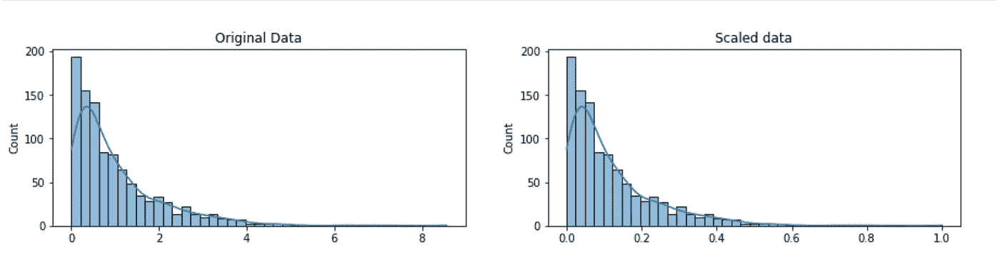
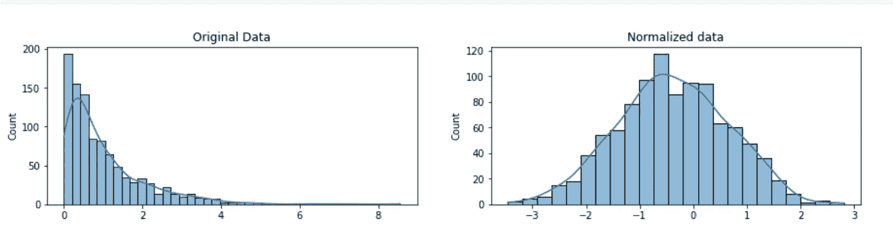
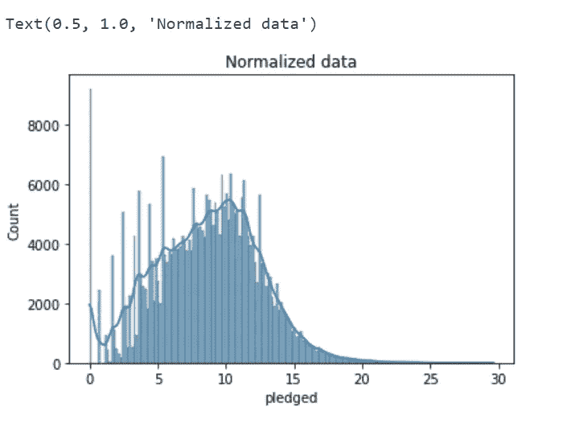

# 缩放与归一化，它们是一样的吗？

> 原文：<https://medium.com/geekculture/scaling-vs-normalization-are-they-the-same-348035afe5ca?source=collection_archive---------10----------------------->


Photo by [Stephen Phillips - Hostreviews.co.uk](https://unsplash.com/@hostreviews?utm_source=medium&utm_medium=referral) on [Unsplash](https://unsplash.com?utm_source=medium&utm_medium=referral)

本文将讨论任何数据的**缩放和**归一化之间的区别，并展示其**代码实现**。

## 缩放与正常化:有什么区别？

缩放和规范化之间很容易混淆，因为这两个术语**有时会互换使用**，更令人困惑的是，它们**非常相似**！在这两种情况下，**数字变量**被转换，因此**转换后的数据点**具有特定的有用属性。不同的是:

*   在**缩放**中，您正在更改数据的**范围**，而
*   在**标准化**中，您正在改变数据分布的**形状。**

## **缩放比例**

这意味着数据被转换，以便能够很好地适应特定的范围，如**0–100 或 0–1**。当方法**基于数据**点相距多远的度量时，数据被缩放，像[支持向量机(SVM)](https://en.wikipedia.org/wiki/Support_vector_machine) 或[k-最近邻(KNN)](https://en.wikipedia.org/wiki/K-nearest_neighbors_algorithm) 。利用这些算法，任何数字特征中的“1”的变化被赋予相同的重要性。

例如，您正在查看以**印度卢比**和**美元**计价的某些产品的价格。 **1** **美元**大约值 **83 印度卢比**比方说，但是价格没有按比例计算，像 SVM 或 KNN 这样的方法会认为 1 印度卢比的价格差异和 1 美元的价格差异一样重要！这显然不符合我们对世界的直觉。有了货币，它们可以根据需要进行兑换。但是如果有像**身高体重**这样的变量呢？他们**不会像**那样互相比较**多少** **磅应该等于一英寸**(或者多少**公斤**应该等于一**米**)或者比较水和油，他们完全是两个独立的实体。

通过**缩放**变量，可以帮助在**平等的基础上**比较不同的变量。下面的支线剧情可以让我们更好的洞察。



Original vs Scaled data (image from Kaggle course)

数据的**形状**不变，但是 X 轴上的刻度发生变化( **0 到 1** ，而不是**0 到 8** )。

为了更好地理解，我们来做下面的代码实现。使用的数据集是 [**Kickstarter 项目**](https://www.kaggle.com/datasets/kemical/kickstarter-projects) 数据集。 [**最小-最大缩放**](http://rasbt.github.io/mlxtend/user_guide/preprocessing/minmax_scaling/) 用于缩小一个范围内的数据。

```
# modules we'll use
import pandas as pd
import numpy as np

# for Box-Cox Transformation
from scipy import stats

# for min_max scaling
from mlxtend.preprocessing import minmax_scaling

# plotting modules
import seaborn as sns
import matplotlib.pyplot as plt

# read in all our data
kickstarters_2017 = pd.read_csv("ks-projects-201801.csv")

# set seed for reproducibility
np.random.seed(0)
```

使用的库有 **pandas，NumPy，minmax_scaling，stats** 等。理解缩放和规范化。选择**‘目标’**栏，并应用**最小 _ 最大缩放**。

```
original_goal_data = pd.DataFrame(kickstarters_2017.goal)

scaled_goal_data =  minmax_scaling(original_goal_data, columns=['goal'])

print('Original data\nPreview:\n', original_goal_data.head())
print('Minimum value:', float(original_goal_data.min()),
      '\nMaximum value:', float(original_goal_data.max()))
print('_'*30)

print('\nScaled data\nPreview:\n', scaled_goal_data.head())
print('Minimum value:', float(scaled_goal_data.min()),
      '\nMaximum value:', float(scaled_goal_data.max()))

Output:

Original data
Preview:
       goal
0   1000.0
1  30000.0
2  45000.0
3   5000.0
4  19500.0
Minimum value: 0.01 
Maximum value: 100000000.0
______________________________

Scaled data
Preview:
        goal
0  0.000010
1  0.000300
2  0.000450
3  0.000050
4  0.000195
Minimum value: 0.0 
Maximum value: 1.0
```

最小值和最大值从( **0.01 到 10⁸** )缩小到( **0 到 1)** 。

## **正常化**

**缩放**改变数据的**范围。标准化改变了观察值，使它们可以被描述为正态分布。**

[**正态分布:**](https://en.wikipedia.org/wiki/Normal_distribution) 也称为“钟形曲线”，这是一种特定的统计分布，其中大约**相等的观察值落在平均值**之上和之下，**平均值和中位数是相同的**，并且有更多的**观察值更接近平均值**。正态分布也被称为**高斯分布**。

一般来说，如果使用**机器学习或统计技术**，假设数据已经**正态分布**，则数据是标准化的。其中的一些例子包括 l **线性鉴别分析(LDA)和高斯朴素贝叶斯**(专业提示:任何名称中带有“高斯”的方法都可能假设正态性。)

我们在这里使用的标准化方法叫做 [Box-Cox 变换](https://en.wikipedia.org/wiki/Power_transform#Box%E2%80%93Cox_transformation)。让我们使用下面的支线图来快速浏览一下规范化一些数据是什么样子的:



Original vs normalized data (image from Kaggle)

我们数据的**形状**已经改变。在正常化之前，它几乎是 L 形的。但标准化后，它看起来更像一个**“钟形曲线”。**代码实现是。

```
# get the index of all positive pledges (Box-Cox only takes positive values)
index_positive_pledges = kickstarters_2017.pledged > 0
​
# get only positive pledges (using their indexes)
positive_pledges_only = kickstarters_2017.pledged.loc[index_positive_pledges]
​
# normalize the pledges (w/ Box-Cox)
normalized_values = pd.Series(stats.boxcox(positive_pledges_only)[0], 
                              name='pledged', index=positive_pledges_only.index)
​
# plot normalized data
ax = sns.histplot(normalized_values, kde=True)
ax.set_title("Normalized data")
```



Normalized data after the above code is implemented

这就把我们带到了文章的结尾。我解释了**和**代码实现**之间的**差异。我这里称之为[](https://www.kaggle.com/code/abhi2652254/exercise-scaling-and-normalization/edit)****。**随着更多的**端到端** **机器学习**项目(用例)，我们可以更好地理解概念的重要性，以及我们是否需要做每一步。******

**请查阅我的其他 [**文章**](/@abhi2652254) ，说 [**嗨**](https://www.linkedin.com/in/obhinaba17/) **。****