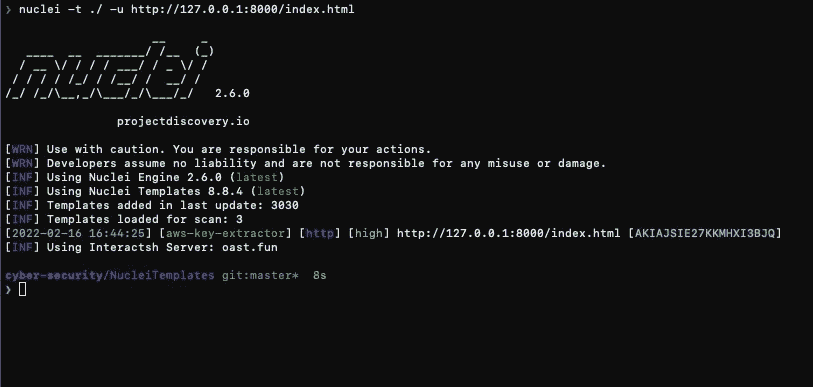

# 用探索项目的原子核扫描所有的东西

> 原文：<https://medium.com/geekculture/scanning-all-the-things-with-projectdiscoverys-nuclei-b5ceff93b56e?source=collection_archive---------3----------------------->

## 基于模板的漏洞扫描

H ello，🌎！在这篇博文中，我将向你展示如何使用[nucleus](https://github.com/projectdiscovery/nuclei)——一个强大的漏洞扫描工具，它是可定制的，基于 YAML，用 Go 编写，由 [ProjectDiscovery](https://github.com/projectdiscovery) 的出色人员创建。我将演练一下 nucleus 的安装，然后提供一些基本的 nucleus 模板