# 基于 ResNet 和 Transformer 的场景文本识别

> 原文：<https://medium.com/geekculture/scene-text-recognition-using-resnet-and-transformer-c1f2dd0e69ae?source=collection_archive---------2----------------------->

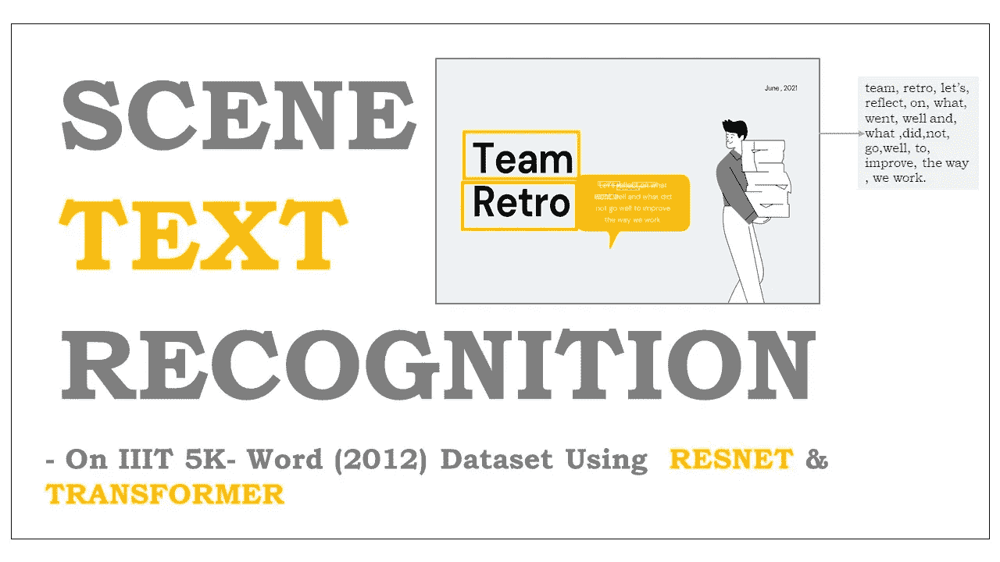

source by Dipak

我们遇到过许多不规则的裁剪过的图像，其中包含文本表示。已经引入了许多复杂的想法来从图像中提取文本。正如我所说的，光学字符识别(OCR)，基于 RNN 的 seq2seq 注意力方法被发现是从结构图像中提取序列信息的传统方法，但是许多研究人员发现，与不规则图像一起工作是非常困难的，并且训练时间使它们更加昂贵。基于 RNN 的 seq2seq 注意方法需要输入的序列表示，该序列表示随着输入的不同而变化，因此很难在数百万幅图像上进行训练。由于我们处理的是自然场景图像，因此大多数时候模型无法预测文本或字符。

基本上，如果我们选择任何一个模型，我们会发现它们都有一个共同点，那就是自我关注。它使模型能够通过位置对计算得出序列中不同位置之间的依赖关系。但是自我注意方法在单词序列中是有效的，在这种情况下，注意机制可以观察句子中的所有单词序列。在将图像翻译成文本的情况下，很难理解特征图，也很难创建依赖关系。简而言之，我将解释两个模型，这两个模型使用强大而复杂的方法来解决图像文本识别问题，以将二维 CNN 特征直接连接到由整体表示引导的基于注意力的序列编码器和解码器，并使用 ResNet 和 Transformer 的概念。

# **目录**

> *1。商务问题
> 2。绩效指标
> 3。数据来源
> 4。探索性数据分析:
> 5。ResNet 架构简介
> 6。变压器架构简介
> 7。型号:一个
> 8。型号:两个
> 9。未来工作
> 10。参考文献*

# ***1。商业问题***

在现实世界中，大多数时候我们都会遇到不同形式的图像。它可以是规则的、不规则的图像以及其中的文本格式。从它们中提取字符串是一项具有挑战性的任务。因此，我们已经获得了 5000 个不规则和自然场景图像的数据集，业务问题是使用最先进的深度学习概念从这些图像中成功预测字符串。

# 2.绩效指标:

我们使用了一个定制的 ***准确性度量*** ，它是给定预测字符串和真实字符串匹配的字符序列总数除以真实字符串中字符总数的比值。

# 3.数据源:

1.  IC Dar _ 2017 _ table _ dataset:[http://cvit . iiit . AC . in/research/projects/cvit-projects/the-iiit-5k-word-dataset](http://cvit.iiit.ac.in/research/projects/cvit-projects/the-iiit-5k-word-dataset)

我们将该数据集用于研究目的。

数据集引用的详细信息:

```
@InProceedings{MishraBMVC12,
  author    = "Mishra, A. and Alahari, K. and Jawahar, C.~V.",
  title     = "Scene Text Recognition using Higher Order Language Priors",
  booktitle = "BMVC",
  year      = "2012",
}
```

# 4.探索性数据分析

我们使用的是 IIIT 5000 字的数据集，该数据集包含总共 5000 个文本图像及其相应的。mat 格式。我们必须提取图像及其字符串。

下面显示了一些随机图像及其地面真实字符串字符

```
**#Displaying iamge with groundtruth string charcters
for** (batch, (inp, tar)) **in** enumerate(train_batches):
  **if** batch == 3:
    **break**
  plt.figure(figsize=(3, 3))        
  plt.title('Image' )
  plt.imshow(tf.keras.preprocessing.image.array_to_img(inp[0][0]))
  print(str(tar))
  plt.axis('off')
  plt.show()
```

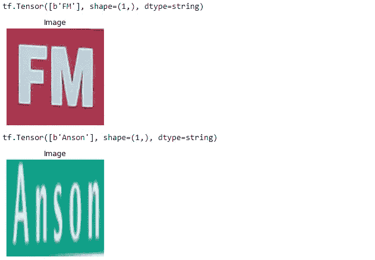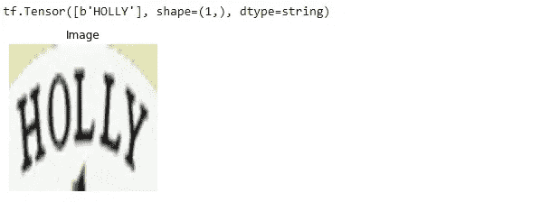

Scouce-IIIT 5K

# **5。ResNet 架构简介**

我们知道深度学习模型处理训练相当大量的隐藏层。最近的证据表明，更深的网络是非常重要的，并在 ImageNet 数据集上产生突出的结果。训练时间与我们使用的隐藏层数和激活类型成正比。所以训练更深层次的神经网络更加困难。在大型神经网络中，我们在反向传播时经常会遇到梯度消失的问题。

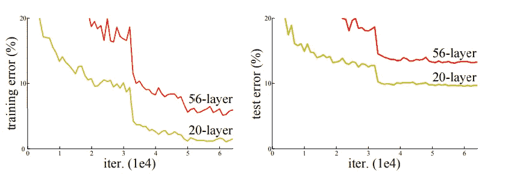

comparison between large and small neural network — [(source link)](https://arxiv.org/pdf/1512.03385.pdf)

正如我们所看到的，简单地堆叠层并不能减少训练误差，也不会导致模型过度拟合的问题。但是为了解决这个问题，我们可以在隐藏层之间添加一个中间归一化层，以解决收敛问题以及反向传播时的过拟合问题。

那么问题就来了，如果我们可以用一个中间规范化层来解决梯度问题，为什么我们还需要 ResNet 概念？

随着隐藏层的增加，训练错误会暴露出来，从而降低模型的性能。研究人员发现，退化与过度拟合无关，而只是由于添加了更多层，使得模型难以优化。因此，为了解决这个问题，ResNet 在堆叠层的顶部引入了身份映射，这为梯度提供了清晰的网络，从而可以轻松地进行反向传播。

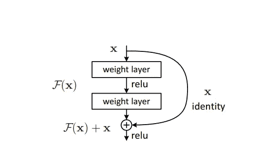

Bypassing identity mapping and adding with the residual network — [(source link)](https://arxiv.org/pdf/1512.03385.pdf)

F(x)定义堆叠层的输出，其大小可以是 2 层或更多层。然后快捷连接加上 ***relu 激活*** 前的剩余输出。[该操作既不增加额外参数也不增加计算复杂性，且可以容易地帮助使用随机梯度下降(SGD)的反向传播](https://arxiv.org/pdf/1512.03385.pdf)。通过这种机制，我们可以在不影响训练精度的情况下训练更深层次的神经网络。通过这种方式，加上“n”个堆叠在一起的层以及身份映射，创建了 ResNet 架构。

剩余网络的身份映射的数学方程如下所示

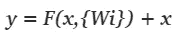

[source-link](https://arxiv.org/pdf/1512.03385.pdf)

在上述函数 ***F(x，{Wi})*** 中，表示要在整个堆叠层中学习的残差映射，而 ***x*** 是要添加残差的快捷连接，条件是两者应该具有相同的维数。

还有另一种方式来解释这个概念，那就是“高速公路网”。这种机制有点类似于 LSTM 网络。在高速公路网络中，我们可以控制是否将信息量添加到下一层。它具有数据依赖性，并且具有在 ResNet 架构的情况下不具有的参数。但是性能方面的 Resnet 被发现更具适应性，并且可以解决退化问题。

研究人员对普通网络和带有身份映射神经网络的残差网络进行了实验，发现即使增加额外的层数，ResNet 模型的性能也更好。我们可以比较普通网络和残差网络，残差网络具有相同的参数数量、深度、宽度和计算成本，但发现其给出的结果优于 ResNet。

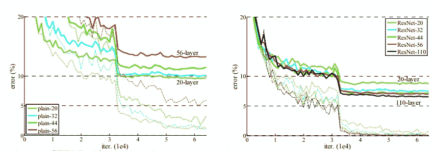

comparison between plain network and ResNet of different types — [(source -link)](https://arxiv.org/pdf/1512.03385.pdf)

有不同类型的 ResNet。一些例子是 ResNet 32、ResNet 50、ResNet 101 等。它们之间的共同区别是堆叠层内的层数和彼此相加的堆叠层数。

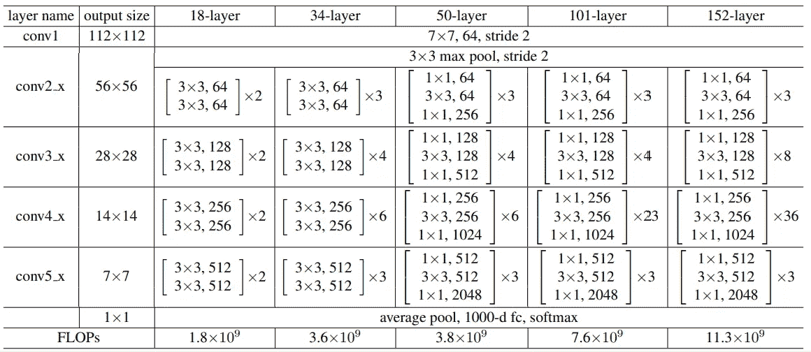

Types of ResNet architecture — [(source -link)](https://arxiv.org/pdf/1706.03762.pdf)

**现在的问题是为什么我们需要 ResNet 架构而不是 VGG 预训练来进行特征提取？**

由于我们知道深度学习网络非常深，这可能需要高计算能力，并且随着网络越来越深，模型经历过拟合和增加训练误差的机会更高。在图像到文本的任务中，我们需要一个网络，它可以更深入，但计算成本不高，并提供更好的精度增益。ResNet 战胜了 ImageNet 检测、ImageNet 本地化、COCO 检测和 COCO 分段挑战。

ResNet 的独特之处在于，即使增加了层数，它的复杂度仍低于 VGG-16/19。

# 6.变压器架构简介

在变形金刚进化之前，序列模式是用一种叫做 RNN 网络的概念来训练的。但是 RNN 在记忆长单词序列的过去信息方面非常失败，因此无法预测接下来的连续单词。为了解决这个问题，引入了具有内部遗忘门和加法门的长短期记忆(LSTM)。遗忘门仅允许来自先前时间步骤的部分信息传递到下一个时间步骤，添加门允许来自当前时间步骤的信息量与先前信息的部分相加。这个概念可以通过额外添加注意力概念来解决单词之间的长期依赖性。它仍然不能捕捉到大句子的依存关系，比如说 1000 个单词的句子。另外，我们知道句子的长度因句而异，所以训练时间也因句而异。因为在反向传播梯度时，我们必须为每个输入句子展开 LSTM 网络，并在每个时间步长计算梯度，因此这导致很长的训练时间。

因此，为了解决所有这些问题，研究人员提出了强大而简单的网络架构，**“变压器”**，这是一种基于注意力的机制，具有与递归模型相同的特征。最重要的是，我们可以在可行的时间内对训练应用并行化。

名为**“注意力是你所需要的一切”**的研究论文引入了名为“自我注意力”的概念，这种概念可以浏览整个输入句子，并创建单词依赖，甚至对长句也很有效。注意机制在完成阅读理解、机器翻译、提问和回答建模等任务时是成功的。它是一种简单的循环注意机制，具有端到端的记忆网络。它不需要序列比对的 RNNs 或卷积网络，但给出了更好的结果。

完整的变压器架构如下所示

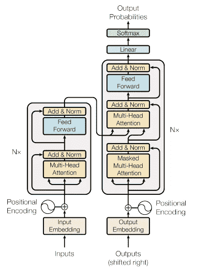

The Transformer architecture — [(source-link)](https://arxiv.org/pdf/1706.03762.pdf)

不要被上面的架构吓到。我将把这个架构分成几个部分，并对每个内部部分给出一个简单的解释。

整个架构分为编码器和解码器两部分。左半部分是**【编码器】**，右半部分是**【解码器】**。

**编码器:**它有 N 个堆叠的相同层，其中 N 可以是超参数。它分为两部分，即多头机构和位置前馈网络。对于每个叠加层，来自位置编码的输入向量并行通过多头和快捷连接，多头的输出加上快捷连接，然后进行层归一化。然后，输出将通过前馈网络，该网络独立且相同地应用于每个位置。残差网络被引入到每个子层中，以便在反向传播时易于收敛。

**解码器:-** 也是 N 个堆叠的相同层，其中 N 可以是超参数。它分为三部分，即掩蔽多头机构、2D 多头机构和位置式前馈网络。对于每个叠加层，来自位置编码的输入向量并行通过屏蔽多头和快捷连接，屏蔽多头的输出加上快捷连接，然后进行层归一化。然后，输出将通过下一个 2D 多头关注，在这里，来自编码器层的输出也被引入。然后，输出将通过前馈网络，该网络被分别且相同地应用于每个位置。残差网络被引入到每个子层中，以便在反向传播时易于收敛。

让我们按时间顺序讨论整个架构。为简单起见，我们假设一个编码器和一个解码器层。

不像 RNN 模型，我们按顺序传递输入单词，我们不需要做同样的程序。我们将一次传递整个一个句子或一批句子，然后进行单词嵌入。

**单词嵌入**将为每个边学习边训练的单词分配一个“d”维向量。为了确保每个单词都按顺序排列，嵌入层的输出将经过位置编码。

**位置编码**确保每个单词都在其位置上。它管理输入句子或一批句子的顺序模式。

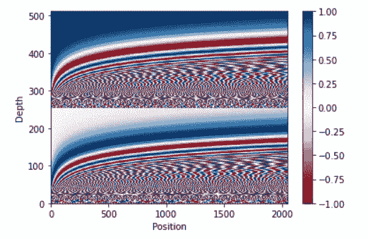

Visualization of positional encoding — [(source-link)](https://www.tensorflow.org/text/tutorials/transformer)

x 轴是单词位置，y 轴是每个单词的 512 维。如果我们放大上面的图片，我们会发现每个单词的位置都各不相同。位置编码的输出输入到多头注意和快捷连接。

**多头注意力**是“m”头注意力机制，其中 m 是超参数。在研究论文中，他们使用了 8 个定标的点积注意，该注意在内部为每个单词给出 8 个 512 维向量，并且来自每个定标的点积的结果被连接，并且经历具有((8 * 512) * k)维权重矩阵的点积。这些权重通过反向传播来学习。

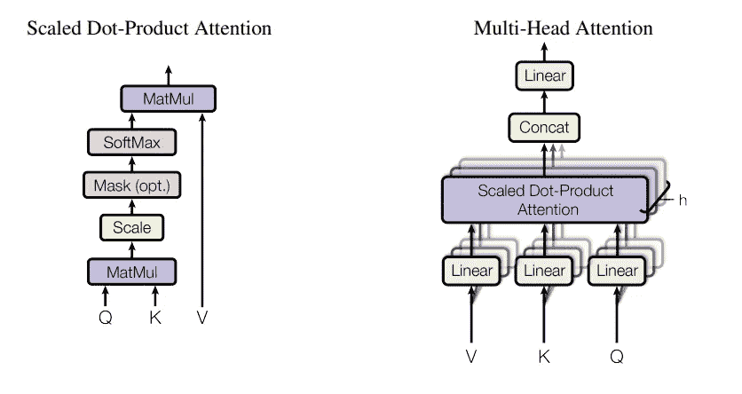

[Source — link](https://arxiv.org/pdf/1706.03762.pdf)

把多头注意力想象成一个内部有 8 个标度的点积注意力的函数，它需要的参数是 3 个向量。3 矢量只是前一层的输出，所有三个矢量都是相同的。它们被称为查询、键和值。比例点积注意力的输出是

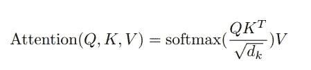

[Source — link](https://arxiv.org/pdf/1706.03762.pdf)

详细解释可以参考[杰伊·阿拉玛的](https://jalammar.github.io/illustrated-transformer/)博客。

多头注意力的输出将添加一个快捷连接，然后进行图层归一化。然后，它通过逐位置前馈网络，接着是层归一化，因此它是来自 1 个编码器的最终输出。

现在让我们来谈谈解码器，

与 RNN 不同，我们将解码器输入一次发送到单词嵌入层。这是一种**教学力**技术，这意味着我们从 softmax 获得的输出不会反馈到解码器，而是假设它已经预测了正确的序列并要求预测下一个单词序列的模型。它允许模型快速训练并且具有更少的计算成本。

**解码器**层有几乎相同的子层，除了一个额外的多头关注。第一个注意层是屏蔽的多头注意，其中**屏蔽的**指的是预测屏蔽，这意味着它限制单词序列预测该单词，因为我们必须预测下一个单词。编码器的输出将反馈给第二个多头注意，其余过程保持不变。解码器的输出通过最后一个 2D 密集层，然后是一个大小等于 vocab 大小的 softmax 层。

我使用了两个模型来成功提取字符串。我将详细讨论这两种模型。

# **7。型号:一个**

**ResNet 作为编码器和 Transformer 作为解码器相结合的架构简述:**

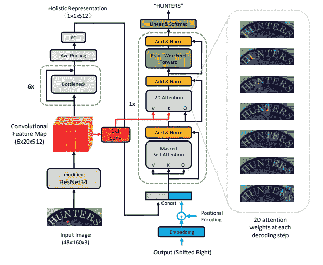

Model 1 architecture — [(source -link)](https://arxiv.org/pdf/1904.01375.pdf)

整个架构分为两个部分。左半部分是编码器，右半部分是解码器。

让我们首先进入编码器的细节。

# **编码器:**

ResNet type 34 用作特征映射和特征提取机制。修改后的 ResNet34 输出三维特征图。在我的实验中，我尝试使用改进的 ResNet50 用于更深层次的网络，与 ResNet34 相比，它可以给出更好的结果。特征映射进一步同时通过两个网络，即(1 * 1) conv 层和瓶颈。来自(1 * 1) conv 层的输出馈入解码器子层，即第二多重注意机制，并将其作为查询和关键向量。

在论文中，研究人员使用了六个堆叠的正常 ResNet34 作为具有剩余连接的瓶颈。最后一个堆栈瓶颈的输出进一步通过平均池，然后是大小为 512 的完全连接的密集层。来自密集层的输出是二维的，其被视为输入图像的文字嵌入。

# 解码器:

解码器嵌入层的输入是字符串。输入字符串是字符标记化的，带有附加的 **' <结尾> '** 作为字符串的结尾。我没有使用 **' < start > '** ，因为来自编码器最后一个密集层的输出在位置编码后被引入字符嵌入，作为字符串的开始。在论文中，他们将密集层图像字嵌入的编码器输出与位置编码连接在一起，但我在连接后进行了位置编码，以确保图像字嵌入首先出现，并作为 **' < start > '** 索引。

来自前一层的输出被馈送到掩蔽的多层注意力模型，随后通过添加残差网络进行层归一化。掩码与前瞻掩码相关联。然后，输出与来自特征映射的输出一起被馈送到二维注意层，随后通过添加残差网络进行层标准化。来自层归一化的输出被馈送到位置式前馈网络，随后通过添加残差网络进行层归一化，并最终通过 softmax 激活的 2 维密集层。

# 实验:

我用修改过的 ResNet50 试过上面的架构，用普通的 ResNet50 试过瓶颈。从最后一个瓶颈层出来的输出，接着是平均池，被重新整形为二维，然后传递到大小为 512 的密集层。我还尝试使用一个自定义的学习率和一个等于 4000 的步长，以及 Adam 作为优化器。我还尝试了**光束搜索**来预测更好的输出。我用 232 个时期训练了这个模型，发现该模型预测准确率为 87%,损失减少到 0.0903。

下面是关于第一个模型架构的代码。

预测样本如下所示:

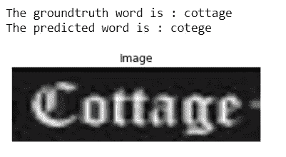

source-IIIT 5K

而相应的关注度图如下图所示:

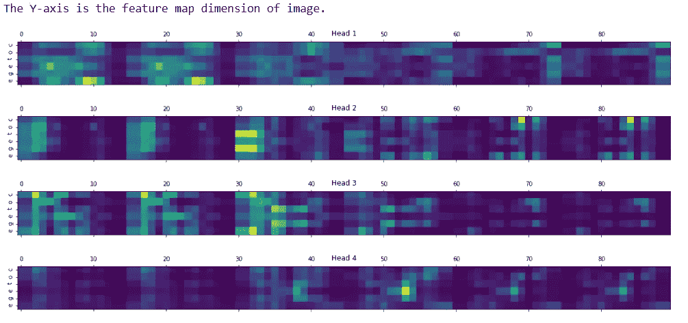

source by Dipak

# 8.型号:两个

**简要说明 ResNet101 作为变压器编码器的输入和变压器作为解码器的组合架构:**

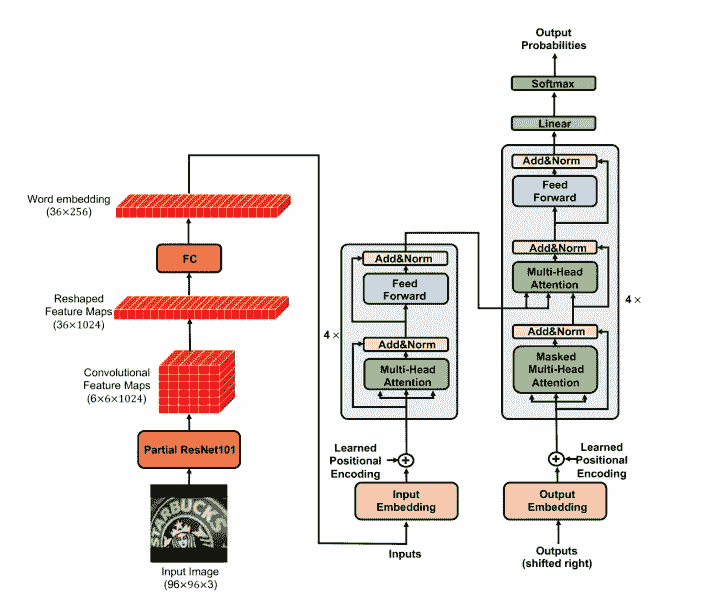

Model 2 architecture -[(source — link)](https://neurohive.io/en/news/transformer-model-used-to-recognize-text-in-images/)

我们在第一个模型中已经看到，ResNet 被视为编码器，而 transformer 被视为解码器。第二个模型的模型架构完全不同。这里，ResNet 用于特征图提取，来自图像字嵌入的输出被输入到编码器变换器。除此之外，一切都和我们在变压器架构基础中讨论的一样。

术语部分结果 101 指的是瓶颈模型，其可以进一步减少到期望的层，从而我们得到三维卷积特征图。它被进一步整形为一个 2 维特征图，随后是一个完全连接的 2 维密集层。最终输出被视为输入到编码器层的每个图像的字嵌入。我们使用 4 层堆叠的编码器和解码器以及 8 头多头注意力机制。

在这里，我也尝试使用一个自定义的学习率，一个温暖的步骤等于 4000，以及亚当作为一个优化器。我还尝试了**光束搜索**来预测更好的输出。我已经用 500 个时期训练了这个模型，并且发现该模型以 51%的准确度预测，损失减少到 0.37，这意味着与第一个模型相比，它不能预测。

下面是关于第一个模型架构的代码。

预测样本如下所示:

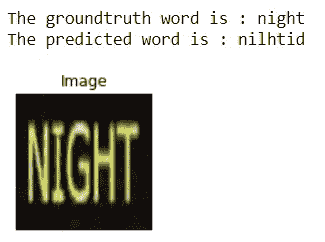

source — IIIT 5K

而相应的关注度图如下图所示:

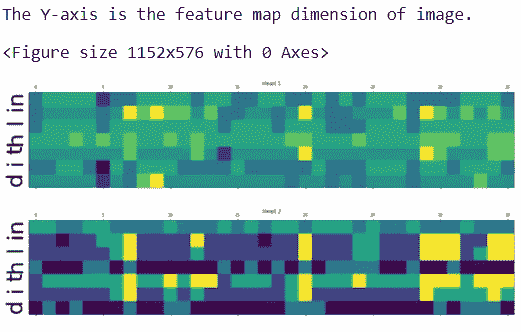

source by Dipak

我只展示了前两个结果。有关详细信息，您可以查看 GitHub 资源库。

# **9。未来工作:**

我想尝试不同的 ResNet 架构，并运行更多时代的模型。我没有做过我想尝试的数据扩充。

# 10.参考:

1.  [用于语言理解的变压器模型](https://www.tensorflow.org/text/tutorials/transformer)
2.  [注意力是你所需要的一切](https://arxiv.org/pdf/1706.03762.pdf)
3.  [图示变压器](https://jalammar.github.io/illustrated-transformer/)
4.  [用于图像识别的深度残差学习](https://arxiv.org/pdf/1512.03385.pdf)
5.  [用于场景文本识别的整体表征引导的注意网络](https://arxiv.org/pdf/1904.01375.pdf)
6.  [用于识别图像中文本的变压器型号](https://neurohive.io/en/news/transformer-model-used-to-recognize-text-in-images/)

**你可以从下面我的 GitHub 链接中查看所有细节:**

[](https://github.com/tiwaridipak103/Scene-Text-Recognition) [## tiwaridipak 103/场景-文本-识别

### 通过在 GitHub 上创建帐户，为 tiwaridipak 103/场景文本识别开发做出贡献。

github.com](https://github.com/tiwaridipak103/Scene-Text-Recognition) 

**我的 LinkedIn** :

[](https://www.linkedin.com/in/dipak-kr-tiwari/) [## 迪帕克 Kr。Tiwari -学生应用人工智能课程| LinkedIn

### 在一个可以增长知识、提高技能的组织中工作。此外，为…提供机会

www.linkedin.com](https://www.linkedin.com/in/dipak-kr-tiwari/)