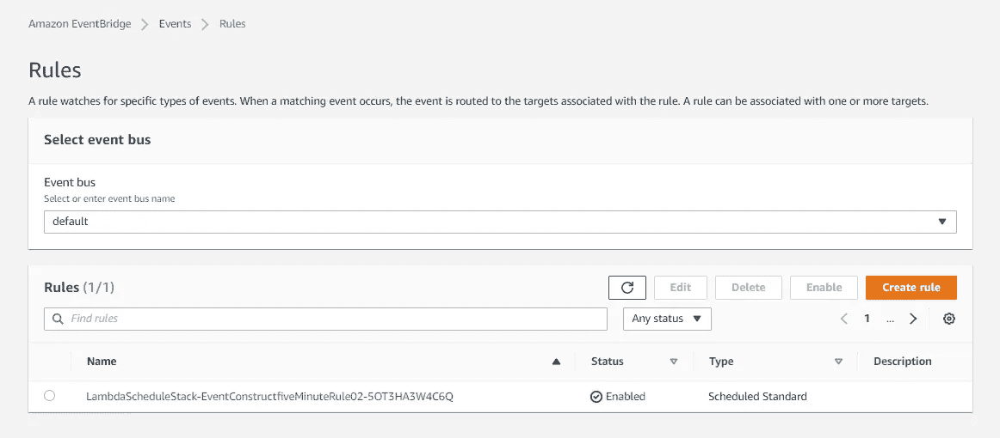
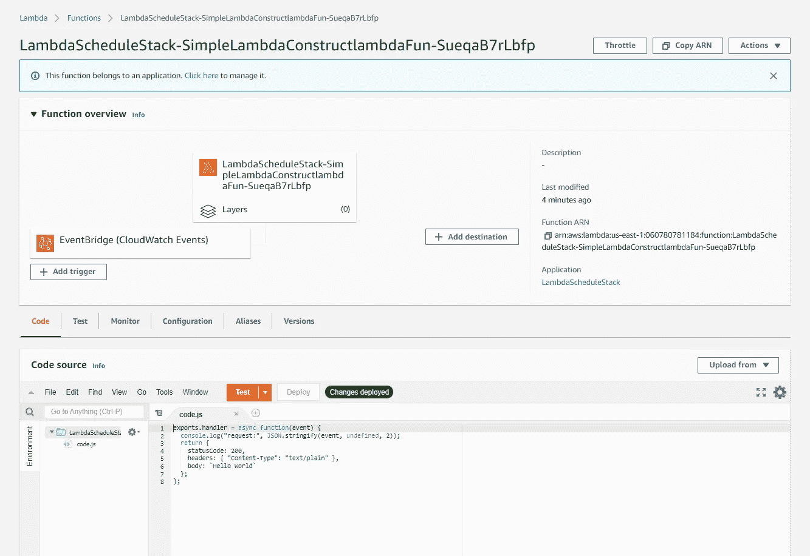
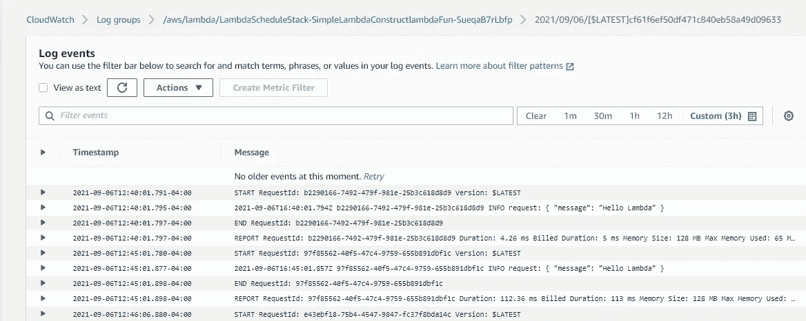

# 使用 EventBridge 和 AWS CDK 调度 AWS Lambda 调用

> 原文：<https://medium.com/geekculture/schedule-aws-lambda-invocations-with-eventbridge-and-aws-cdk-fbd7e4e670bb?source=collection_archive---------2----------------------->


Photo by [ian dooley](https://unsplash.com/@sadswim?utm_source=medium&utm_medium=referral) on [Unsplash](https://unsplash.com?utm_source=medium&utm_medium=referral)

AWS Lambda 非常适合运行不需要服务器全天候运行的作业。Lambda 函数可以被事件、其他 AWS 服务、AWS CLI 等等调用，这使得它非常灵活并且易于集成。

Lambda 的一个常见用例是需要每隔 x 段时间运行一次函数。例如，假设我们想要每 24 小时抓取一次网站的新内容，我们可以使用 AWS EventBridge 规则安排一个 Lambda 函数来完成这个任务。调度 Lambdas 可以运行任何常规的、周期性的工作负载。事实上，我就是这样为我的监控和警报服务 [Komonitor](https://komonitor.com/) 实现网站正常运行时间监控器的。

在本教程中，我们将使用 AWS CDK 来定义一个简单的 Lambda 函数，该函数将由 AWS EventBridge 规则每 5 分钟调用一次。

*本教程面向 AWS/AWS CDK 初学者/中间用户。*

## 先决条件

1.  AWS 帐户
2.  安装并配置 AWS CDK CLI。遵循 AWS 的这些设置说明
3.  对 CDK 堆栈和结构的基本理解。

# 项目设置+后续存储库

首先，我们需要建立一个 CDK 项目。

```
mkdir <PROJECT_NAME>cd <PROJECT_NAME>cdk initnpm install @aws-cdk/aws-events-targets @aws-cdk/aws-events @aws-cdk/aws-lambdarm -rf test/mkdir lib/lambda-code && touch lib/lambda-code/code.jsmkdir lib/constructs && cd lib/constructs && touch lambda-construct.ts event-construct.ts
```

上述命令将在`PROJECT_NAME`目录中初始化一个新的 CDK 项目，并添加一些我们将用来编写 Lambda 和事件构造以及 Lambda 代码的文件。

我已经创建了一个公共的 GitHub 库，包含了我们将在这里编写的所有代码，这样你就可以克隆它或者跟随它。

[GitHub 库](https://github.com/nramkissoon/AWS-CDK-Schedule-Lambda-Tutorial)

# 创建简单的 Lambda 函数

让我们在`code.js`中定义我们的 Lambda 函数代码:

这个处理程序只是记录函数接收到的事件，然后返回一个“Hello World”消息。

现在，让我们定义将在`lambda-construct.ts`中使用这段代码的 Lambda 函数。

上面的代码创建了一个新的包含 Lambda 函数的 CDK 构造。在类构造函数中，我们创建了一个新的 Lambda 函数，它在每次调用时简单地输出“Hello World”。`SimpleLambdaConstruct`类在类变量`this.lambda`中向外界公开了 Lambda 函数。

# 创建 AWS EventBridge 规则并集成 Lambda

现在，让我们在`event-rule.ts`中实现我们的事件规则构造。

上面的代码定义了一个每 5 分钟触发一次事件的事件规则。然而，我们需要将这个事件发送给我们的 Lambda 函数，它目前并不知道我们的事件规则的存在。这是我们需要做的最后一步。

在`lambda-schedule-stack.ts`中，我们实例化了我们的 lambda 和事件规则构造:

为了让我们的事件规则发送事件并调用我们的 Lambda，我们需要将 Lambda 函数作为*目标*添加到规则中。然后，我们给规则*权限*来调用 Lambda 函数。

# CDK 部署+验证一切正常

我们现在可以尝试将我们的 CDK 堆栈部署到 AWS。

```
cdk synth
cdk deploy
```

创建并准备使用所有 AWS 资源需要几分钟时间。完成后，如果您没有看到错误，您就可以登录到您的 AWS 帐户并查看创建的资源，以验证一切正常。

首先，让我们检查 EventBridge 控制台，查看我们的新规则:



Event Rule

如果我们转到 lambda 控制台，我们将看到我们的 Lambda 函数，以及我们的 EventBridge 触发器和处理程序代码:



Lambda function

最后，让我们看看我们的 Lambda 是否每 5 分钟被调用一次。如果你转到 Lambda 控制台中的 ****Monitor**** 选项卡，你会看到指向 CloudWatch 日志的链接，以获取该函数的调用。当然，您必须等待至少 5 分钟才能在日志中显示任何内容，但是，一旦调用了该函数，日志将如下所示:



Lambda invocation logs in CloudWatch

我们看到 EventBridge 每 5 分钟向函数发送一次“Hello Lambda”。成功！

# 清理+结论

为了避免在我们的 AWS 帐户中留下未使用的资源，我们可以通过以下方式删除 CDK 堆栈和相关资源:

```
cdk destroy
```

就是这样！现在您知道了如何使用 AWS EventBridge 规则在设定的时间表上运行任何 Lambda 函数。更好的是，您现在可以使用 AWS CDK 来定义您的资源，而不是在控制台中手动创建它们。