# 操作系统中的调度算法

> 原文：<https://medium.com/geekculture/scheduling-algorithms-in-operating-systems-d7d8b0d504aa?source=collection_archive---------0----------------------->

像人类一样，操作系统需要计划它的活动。这些活动是需要由操作系统执行的各种进程。操作系统需要恰当地调度所有进程，以确保它们在最短的时间内顺利执行。

为此，有许多调度算法，如**先来先服务** (FCFS)算法、**最短作业优先** (SJF)算法等。我们将详细讨论这些算法，但在此之前，我们需要了解一些术语。

1.  **到达时间**:流程到达处理器执行的时间。
2.  **等待时间**:流程开始执行前需要等待的时间。如果某个其他进程正在执行(在单处理器环境中)，或者当该进程所需的资源不可用时，该进程可能不得不等待。其计算方法如下:

> *等待时间=完成时间-到达时间-服务时间*

3.**服务时间/突发时间**:流程完成执行所需的时间。

4.**周转时间**:流程开始执行到流程到达的时间间隔。它是使用以下公式计算的:

> *周转时间=服务时间+等待时间*

现在，让我们看看不同的调度算法:

# 先来先服务(也称为 FCFS 或 FIFO 或非抢占式)算法:

在这个算法中，进程按照它们进入处理器的顺序执行。

考虑这个例子，

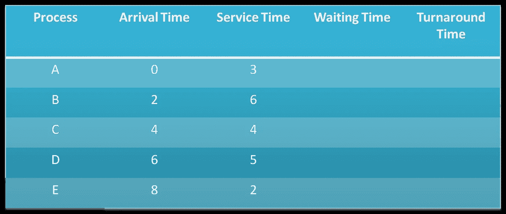

这里，有 5 个流程 A、B、C、D、E 及其到达时间和服务时间。

从给定的到达时间，我们可以看到进程 A 是第一个到达 0ms(毫秒)的进程。所以这个过程开始执行。

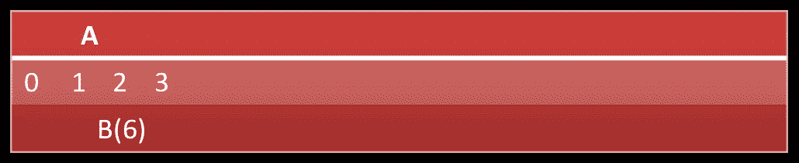

这是执行队列。进程 A 从 0 开始执行，一直持续到 3，即执行完毕。同时，进程 B 在 2ms 时到达，并被添加到等待队列中。注:括号“()”中的值表示工艺所需的服务时间/突发时间。

接下来，从等待队列中删除进程 B，并开始执行:

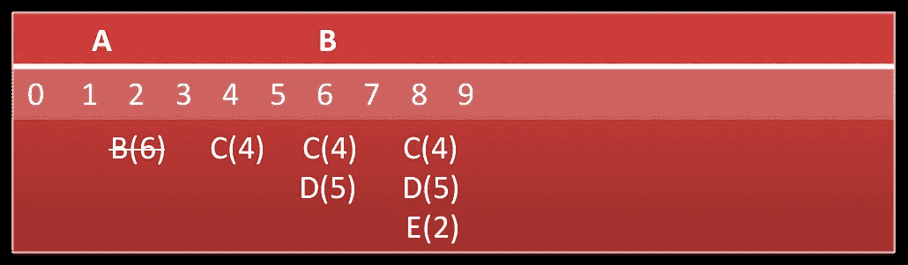

进程 B 执行到 9 毫秒。同时，进程 C、D、E 到达并被添加到等待队列中。

位于队列第一位的 c 开始执行下一个。

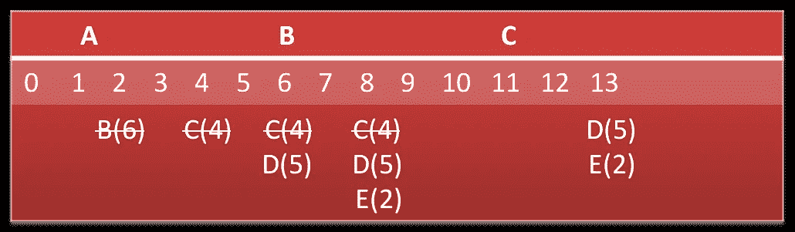

它执行 4 毫秒。没有新的进程添加到等待队列中。下一个要执行的进程是 d。

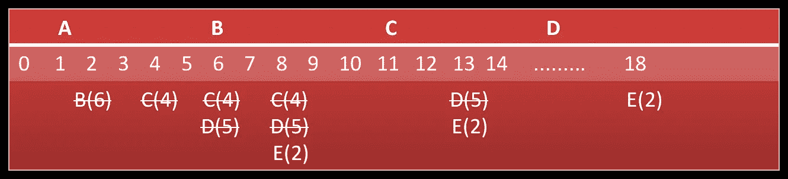

d 从 13 到 18 执行 5 毫秒。之后，E 是剩下的唯一要执行的进程。所以接下来执行 E。

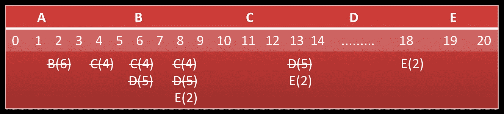

如您所见，所有流程都成功执行。现在让我们用上面提到的公式来计算等待时间和周转时间。

以下是获得的结果:

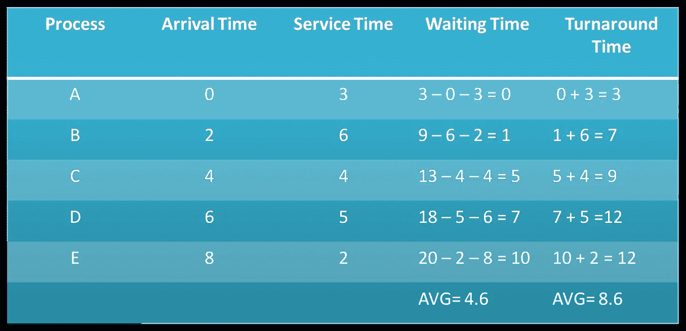

这就是 FCFS 算法。

优势:

这很简单。

缺点:

1.  与 I/O 绑定的进程相比，更倾向于 CPU 绑定的进程。
2.  如果一个较长的进程开始执行，较短的进程必须等待很长时间，这导致较短的进程饥饿。

为了克服这个缺点，我们有了下一个算法。

# 最短的作业优先/最短的流程其次:

在该算法中，首先执行需要最少时间的进程。

让我们首先考虑

## 非抢占式最短作业优先算法:

让我们考虑这个例子:

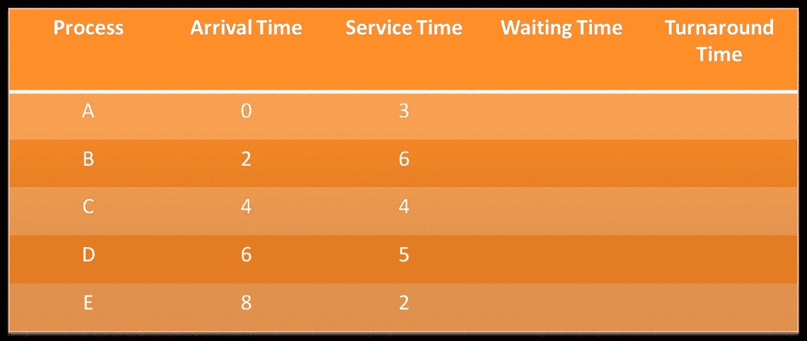

进程 A 是第一个进入处理器的进程。所以它开始执行。

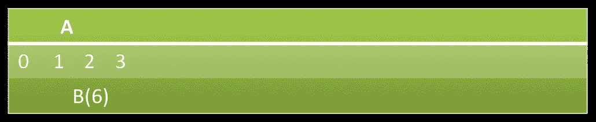

b 现在是队列中唯一的进程，所以它开始执行。当进程到达时，它们被添加到等待队列中。

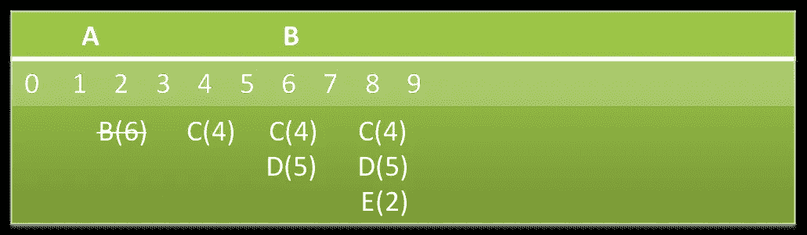

现在，在等待队列中，我们可以看到，进程 E 是需要最少执行时间的进程。因此，进程 E 开始执行。

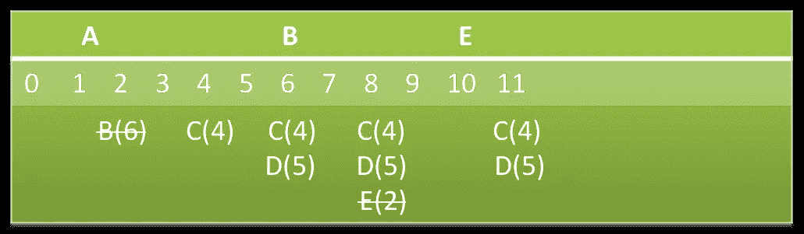

c 是需要最少时间的进程，接下来开始执行。

最后，D 开始执行

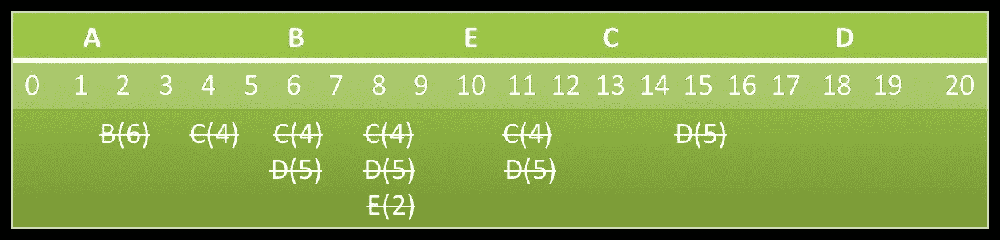

这就是 SJF 算法的工作原理。

现在，让我们来计算等待和周转时间。

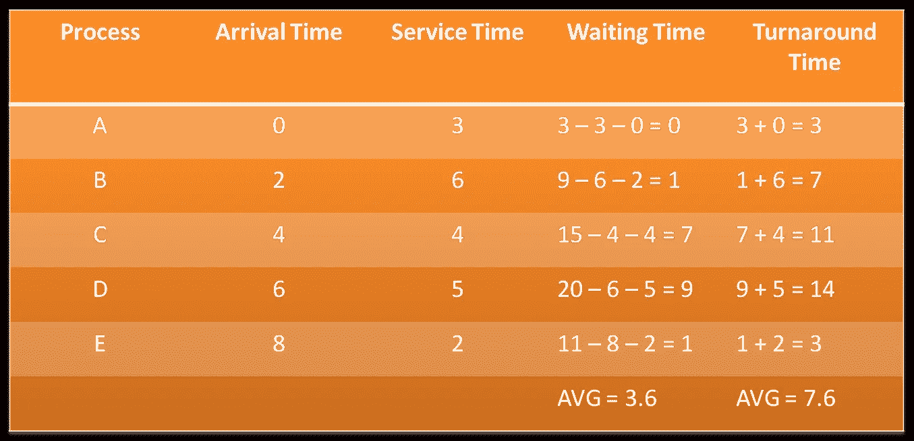

优势:

1.  对更长的过程没有偏见。
2.  缩短响应时间。

缺点:

1.  可变性增加，因此可预测性降低。
2.  需要知道流程的处理时间。
3.  较长进程可能会出现饥饿。

使用以下方法可以进一步缩短等待和周转时间:

## 抢先最短作业优先算法(最短剩余时间优先):

在这种方法中，当一个进程正在执行时，如果一个需要较少服务时间的进程进入，该进程首先被执行。

考虑这个例子:

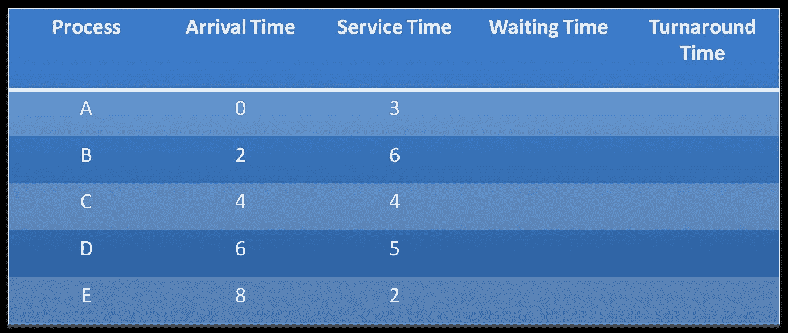

首先到达的进程首先开始执行。

在这里，过程 B 在 2ms 到达。已经执行的流程，即流程 A 需要 1 毫秒完成，而 B 需要 6 毫秒，两者之间的时间更长。因此，A 继续执行。

然后 B 开始执行。

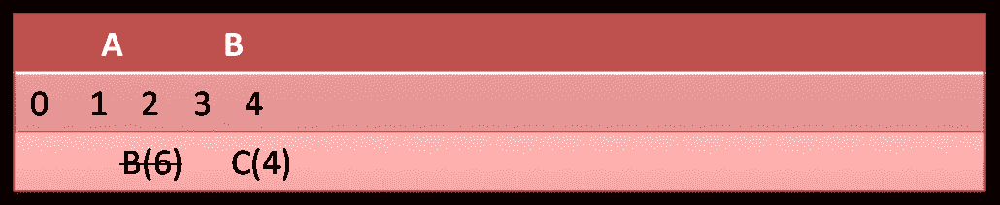

但是在 4ms 时，C 进入队列。b 需要 5 毫秒来完成其执行，而 C 需要 4 毫秒。因此，C 开始执行，B 被添加到队列中。

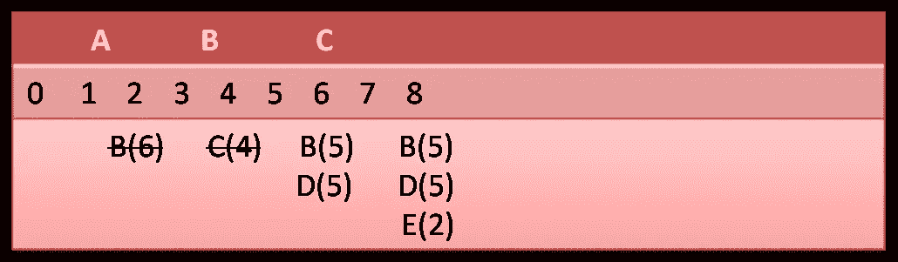

当 C 正在执行时，D 进程进入队列，但是由于 D 执行所需的时间比 C 进程长，所以进程没有被交换。

现在所有的进程要么被执行，要么在队列中。因此，现在将首先执行需要最少执行时间的进程。即过程 e

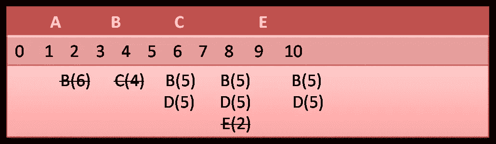

现在，队列中的进程 B 和 D 都需要 5 毫秒。所以接下来可以执行任何过程。

首先进入队列，因此，我们将首先执行。

现在，D 是唯一剩下的进程。因此，接下来将执行它。

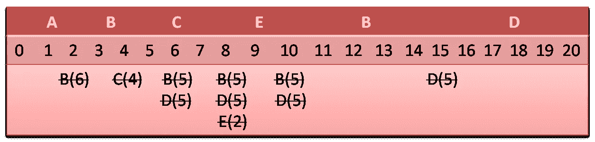

好的，现在让我们计算一下平均等待和周转时间。

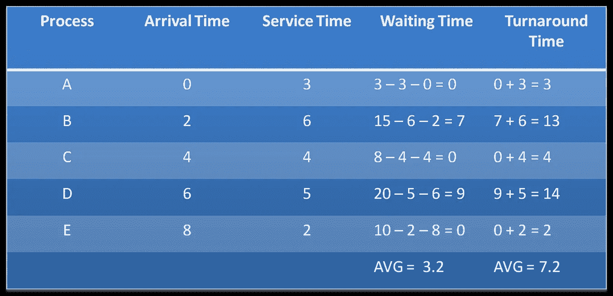

优势:

1.  改进周转时间和等待时间比抢先 SJF。
2.  对更长的过程没有偏见。

缺点:

1.  调度程序必须对处理时间有一个估计。
2.  较长进程饥饿的风险。
3.  必须记录经过的服务时间，这增加了开销。

现在让我们看看下一个调度算法。

# 循环算法:

在这种方法中，每个进程都在特定的时间间隔或时间段内执行，在该时间间隔结束后，下一个进程开始执行相同的时间。

我们举个例子。

> *考虑 4 毫秒的时间段*

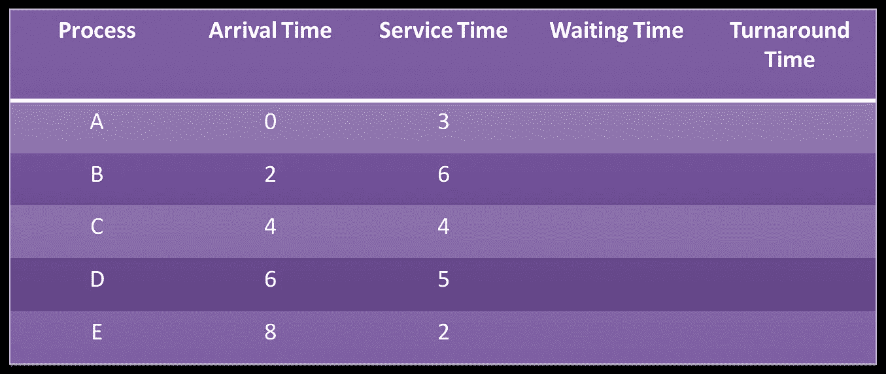

第一个到达的进程首先开始执行。

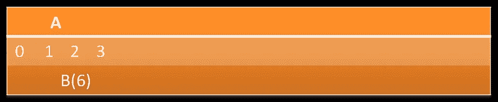

虽然时间段是 4ms，但是 A 需要 3ms，比时间段少 1ms。因此，它提前 1 毫秒完全执行。

现在由于 B 是下一个进程，它开始执行。

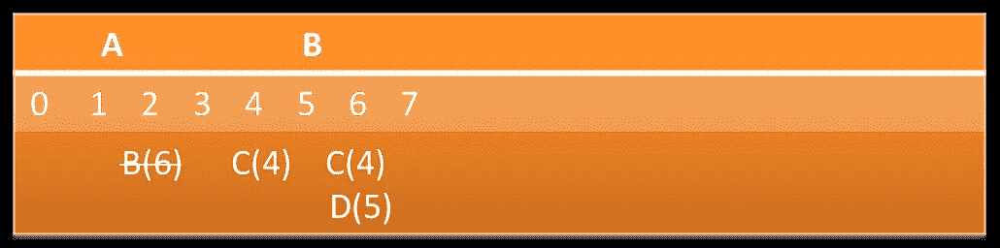

它执行 4 毫秒，然后停止执行。下一个进程，即 C 开始执行，B 被放回等待队列。

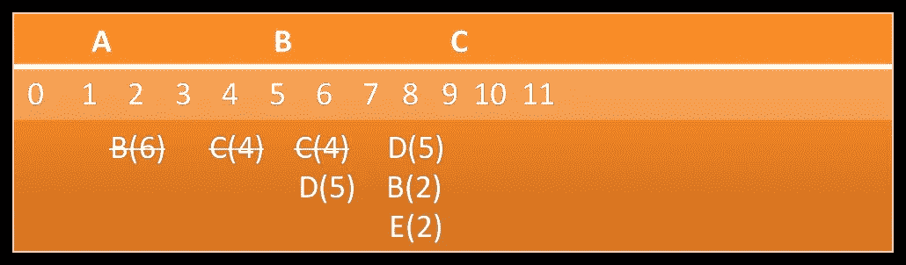

c 进程执行 4ms，执行完毕。同时，进程 E 进入队列。

接下来，进程 D 开始执行。

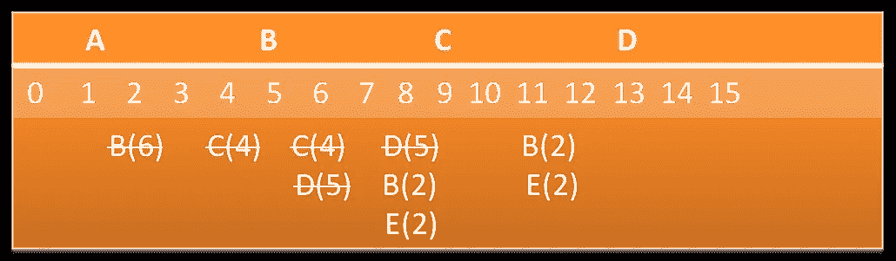

进程 D 执行了 4 毫秒，而它需要的时间是 5 毫秒。因此，它被添加回队列，下一个要执行的进程是进程 B，它将执行 2 毫秒。

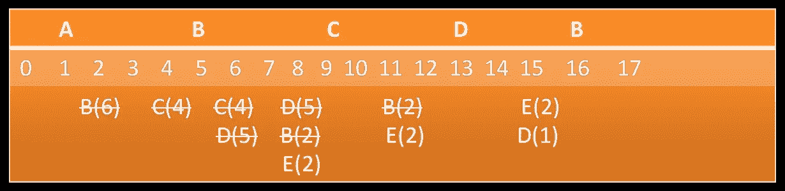

接下来，过程 E 将被执行 2 毫秒。

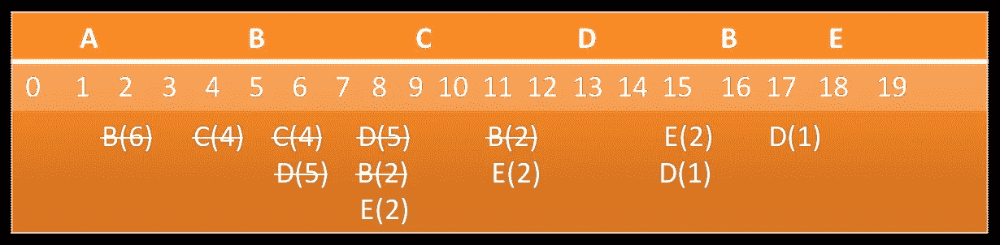

现在，队列中唯一剩下的进程是进程 d。因此，它将在接下来的 1 毫秒内执行。

这样，所有进程都使用循环法执行。

现在让我们看看平均等待时间和周转时间。

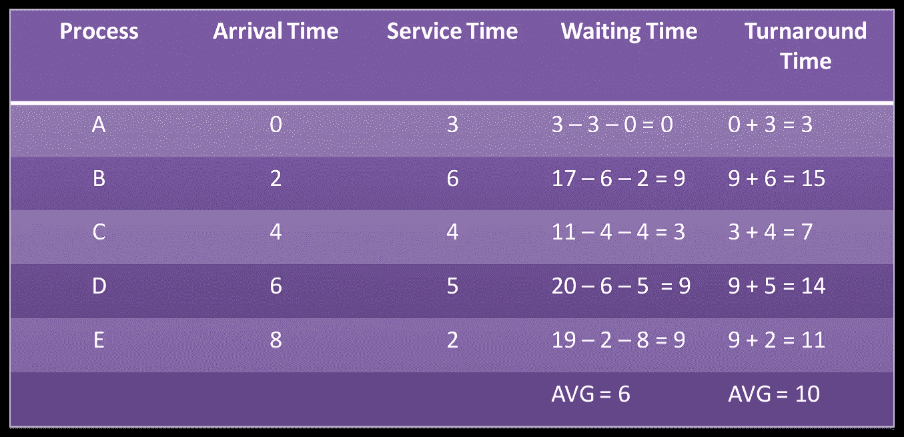

优势:

时间共享或事务处理时间的有效方法。

缺点:

1.  处理器绑定和 I/O 绑定进程的相对处理可能会导致性能下降。
2.  I/O 设备的低效使用。
3.  响应时间方差的增加。

接下来，让我们看看优先级调度算法。

# 优先级调度算法:

在该算法中，每个进程都有一个特定的优先级，并根据给定的优先级执行。

1.  **非抢占式优先级调度算法:**

在该算法中，首先完全执行最高优先级的进程，然后执行下一个最高优先级的进程。

让我们举个例子:

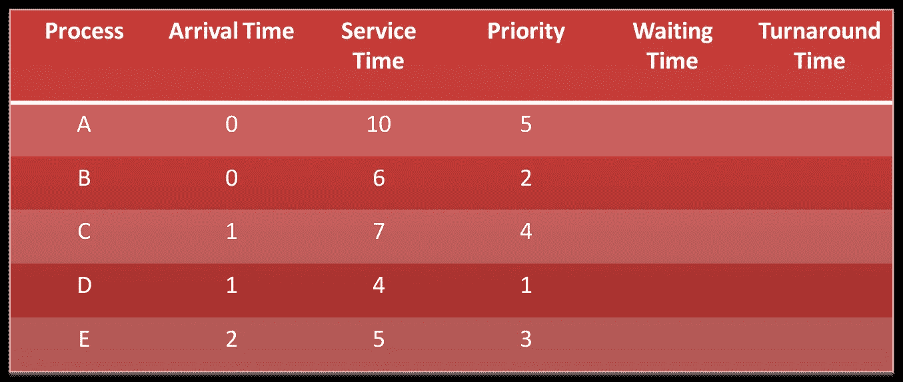

在上面的例子中，我们有 5 个流程 A、B、C、D、E

进程 A 和 B 首先进入处理器。在这两个进程中，进程 B 具有更高的优先级，因此进程 B 将首先执行。

同时，其他进程被添加到等待队列中。

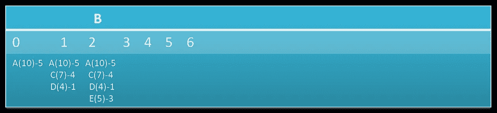

现在，在 B 完成它的执行之后，等待队列被检查。进程 D 是等待队列中优先级最高的进程。因此，接下来执行它。

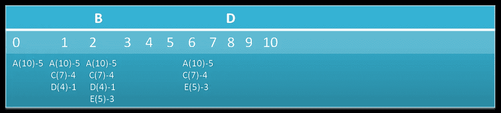

类似地，现在在队列中，进程 E 具有最高的优先级，因此被执行。

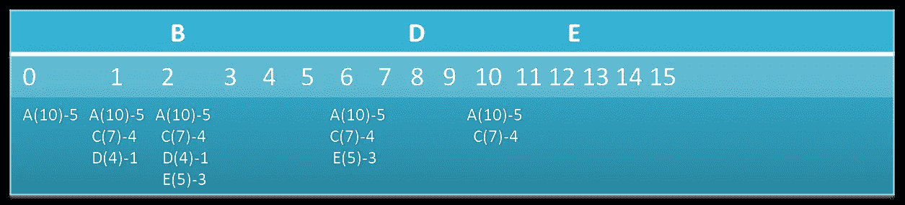

同样，考虑到优先级，进程 C 被执行…

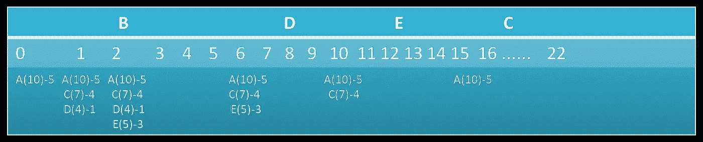

接下来是流程 a。

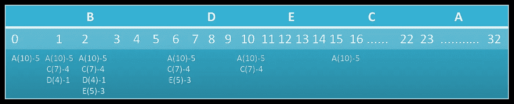

现在，让我们计算平均等待时间和周转时间。

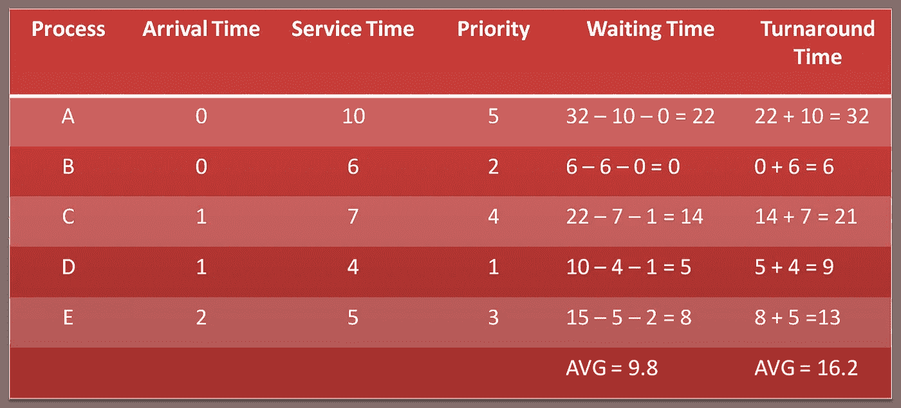

优势:

优先级较高的进程获得优先权，并被提前执行。

缺点:

具有较低优先级的进程可能遭受饥饿。

2.**抢占式调度算法:**

在这个算法中，如果一个优先级高于正在执行的进程的进程进入，处理器被抢占，该进程开始执行。

举个例子，

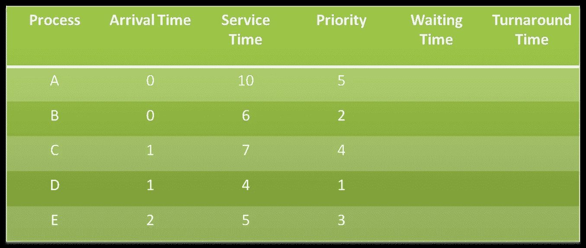

在 0 毫秒时，进程 A 和 B 进入系统。优先级最高的进程首先开始执行。

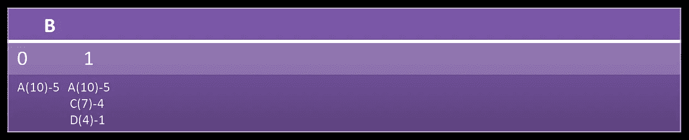

..但是当进程 D 进入处理器时，因为 D 有更高的优先级，它开始下一个执行，B 被加入队列。

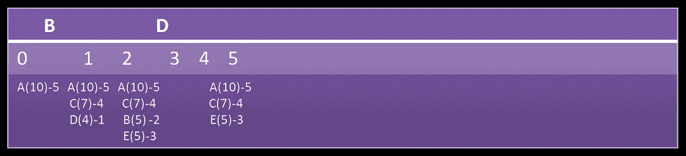

现在，在 D 完成执行之后，(D 被完全执行，因为没有其他具有更高优先级的进程插入其间)B 是具有最高优先级的进程，它开始下一个执行。

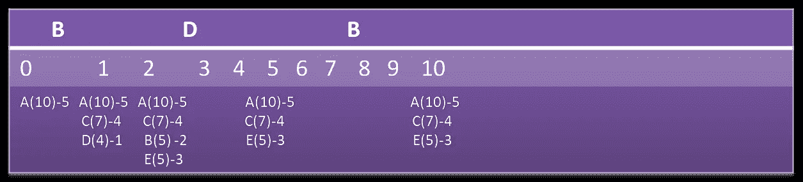

接下来，进程 E 开始执行

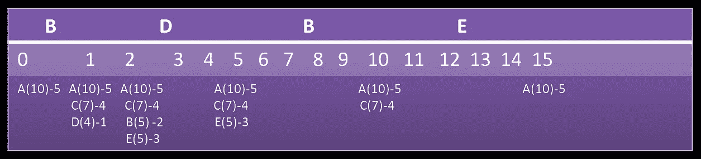

然后，进程 C 开始执行

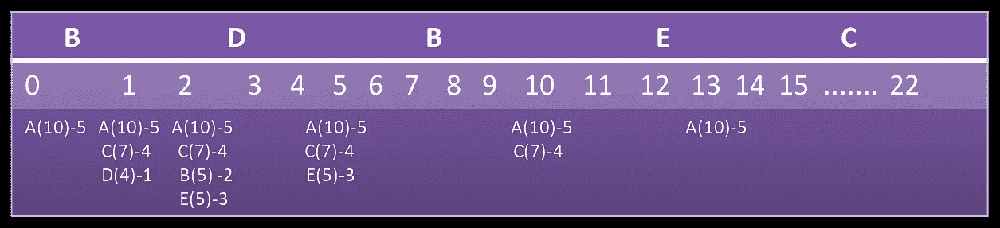

最后，进程 A 开始执行

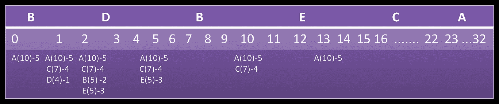

现在，让我们计算平均等待时间和周转时间

该算法的优点是具有较高优先级的进程不必等待，因此它们不会饥饿。

让我们看看下一个算法

# 最高响应率下一个算法:

在这种情况下，对于执行，我们选择具有最高响应率的流程。

> *响应率=(等待时间+服务时间)/服务时间*

让我们用一个例子来理解这一点:

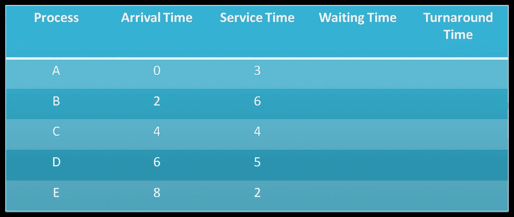

这里，进程 A 是唯一进入处理器的进程，因此它开始执行。与此同时，B 进入了队列。

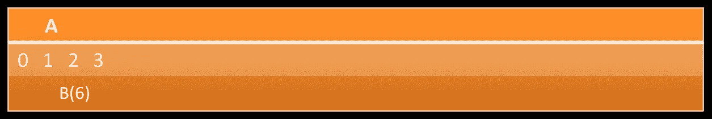

现在，由于 B 是唯一进入队列的进程，它开始执行下一个。

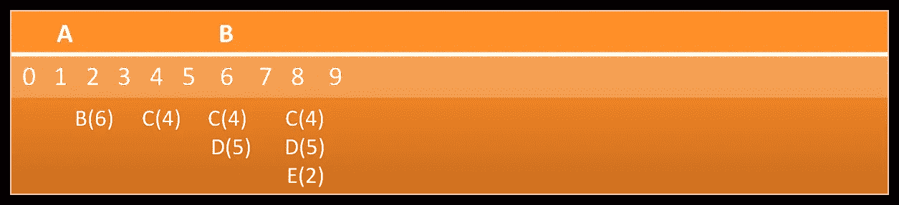

现在到了更棘手的部分。

队列中有三个进程——C、D、E。我们如何决定从中选择哪一个呢？

非常简单！我们使用前面提到的公式来计算每个人的响应率。

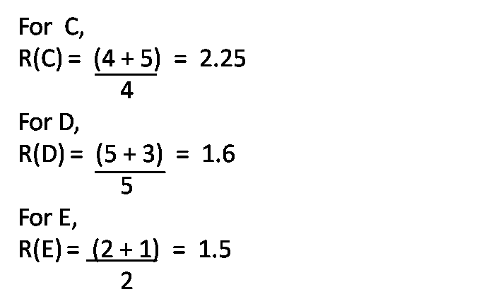

可以看到，C 的响应率最高。因此，接下来将执行它。

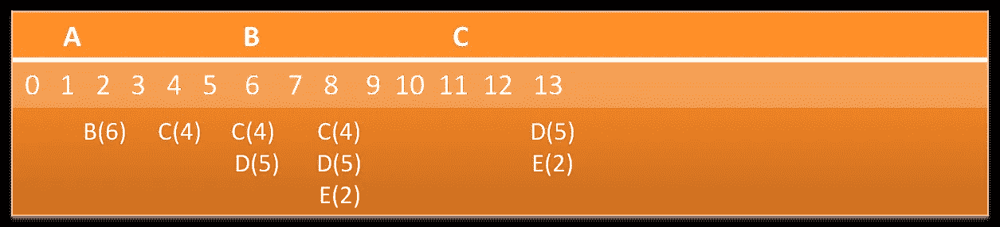

现在，我们必须在流程 D 和 e 之间做出选择。让我们计算这些流程的响应比率。

因为 E 的响应率最高，所以接下来执行它。

现在唯一剩下的进程是 d。因此，它将最终被执行。

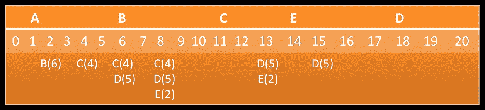

现在让我们来计算本例的平均等待时间和周转时间:

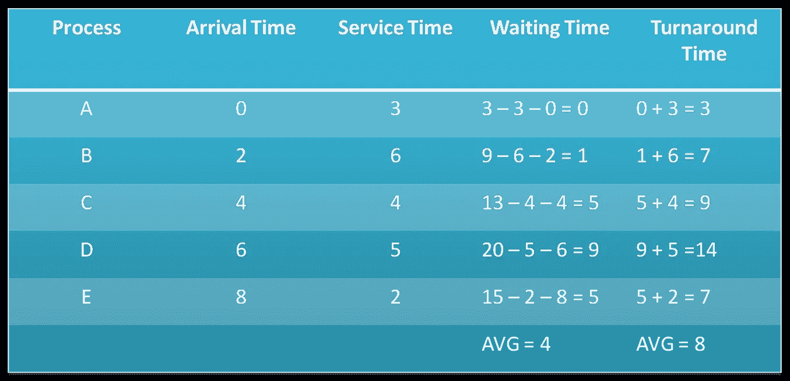

这就是使用最高响应率算法来调度进程的方式。

在这里，缺点是需要额外的计算。此外，服务时间必须是已知的，等待时间必须被跟踪。

这些是操作系统中的一些调度算法。

所有这些都可以比较，可以使用最适合我们要求的一个。

希望这对你有帮助！

祝您愉快！！