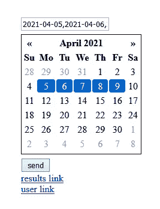
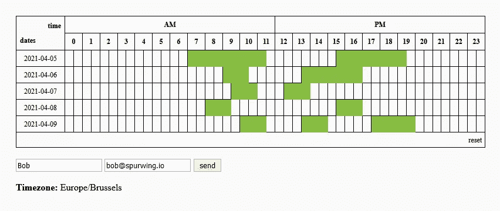

# 跨不同时区的团队调度工具

> 原文：<https://medium.com/geekculture/scheduling-tools-for-teams-across-different-time-zones-5faf32d493b6?source=collection_archive---------21----------------------->

安排约会和预约会议有时会是一场巨大的斗争。使用与我们的个人和工作日历同步的工具，预约一对一的约会相当容易。但是，如何安排有多个出席者或大型团队的会议呢？更糟糕的是，如果是跨不同时区的国际团队呢？


在这篇文章中，我将介绍和解释我们在 Spurwing 构建的一个解决方案，以方便团队可用性日历和团队调度。

# 要求

这个解决方案是用 JavaScript 和 NodeJS v12+构建的。我们使用了以下库:jQuery、Luxon 和 Express。

# 演示

现场演示链接:[https://cloud.spurwing.io/Availability/S01/](https://cloud.spurwing.io/Availability/S01/)

**主页:**



日历用于选择几个候选日期(无限制)。提交后，您将看到两个链接出现，一个是结果页面，另一个是与他人共享的提交链接。

**用户提交页面:**



在提交页面上，每个用户都可以单击单元格来表示他们在给定日期和时间的可用性。必须提供姓名和电子邮件地址才能提交答案。通过使用同一电子邮件重新提交，可以更新已提交的答案。

**结果页面:**


结果页面显示了每个用户的所有提交的严格重叠。考虑到这些重叠的区域，主持人/组织者可以在适合每个人日程表的日期和时间安排会议。

请注意，所有数据都是相对于时区的。这意味着我们可以轻松地安排和预订来自不同时区的成员的会议。每个用户的时区都被考虑在内，并被转换成一个通用的 UTC 时间戳。最终结果页面显示了与查看者所在时区相关的所有提交内容。

**即将推出:**能够使用 Spurwing 的 API 安排会议，并向所有参与者发送电子邮件邀请。

# 履行

在我们的 [Github 子库](https://github.com/Spurwingio/Availability-Solutions/tree/main/solution_01)中可以找到这个组调度解决方案的完整实现。我们存储库的根目录将包括几个更相关的解决方案。

# 后端

`server.js`脚本默认表示一个运行在端口 8000 上的 NodeJS API/REST 服务器。它有几个获取、提交和更新数据的端点。一个基于 JSON 文件的数据库用于演示目的，建议用一个生产就绪的数据库如 MongoDB 来代替它。

# 前端

`public`目录包含 HTML、JavaScript 和 CSS 文件。出于演示目的，所有自定义 JavaScript 代码都位于 HTML 文件中。JS 和 CSS 文件是 UI 调度器的外部开源资源。

我们的定制 JavaScript 代码非常简短。唯一不可避免的复杂性是由于 UI 调度库。它使用行和列作为单元格的指示器。单元格和实际日期/时间数据之间没有内在联系。该信息是隐式的，并且基于给定 24 小时周期的准确度(即精度)的行和列来计算。

## 密码

解释如何实现 row:col 到 datetime 之间的转换可能会很有趣。

在`meeting.html`内部，我们有一些定制的 JavaScript 代码，负责:捕获用户的选择，将选择数据转换成 ISO 日期时间格式，然后转换成 UTC 格式，最后将数据发送到服务器:

```
let selection = [];
const accuracy = 2; // 30 minute intervals
let dates = [...]; // date strings associated with the meeting$('#test1').scheduler({
  accuracy: accuracy,
  onSelect: (x) => convert(x, dates),
            // x contains all selected cells in the format:
            // { row1: [...cols], row2: [...cols] }
            // the row keys are just numbers starting from 1.
            // the value is an array of columns starting from 0.
});// convert row-column format into ISO/UTC date format
function convert(sel, dates) {
  selection = []; // empty previous selection (if any)
  for (const row_ in sel) {
    for (const col of sel[row_]) {
      let row = row_ - 1; // make row zero-based
      let hour = Math.floor(col/accuracy) // compute hour
      let minute = ((col / accuracy) - hour)*60; // compute minutes
      let dt = luxon.DateTime.fromISO(dates[row]); // get date and parse it
      dt.set({hour, minute}); // set hour and minutes
      selection.push(dt.toUTC().toString()) // relative to UTC datetime
    }
  }
}// on click submit -> send { selection } as data
```

类似的反向操作在`results.html`中执行，从服务器获取 UTC 日期时间，严格重叠，转换为用户检测到的时区，最后显示在只读 UI 上。

# 结论

你可以把这个软件放在你的服务器或者云提供商那里使用。但是，您可能还希望添加一个额外的安全层(例如密码)，以帮助防止用户强行使用会议 ID 来查看/收集所有用户的姓名和电子邮件。

最终，这个解决方案为我们节省了大量安排会议的时间，尤其是在跨多个时区的国际团队中。如需更多工具和资源，请访问我们的 [Github 页面](https://github.com/Spurwingio/)。