# 舒尔互补投资组合——机器学习和优化配置的统一

> 原文：<https://medium.com/geekculture/schur-complementary-portfolios-fix-hierarchical-risk-parity-28b0efa1f35f?source=collection_archive---------0----------------------->

这篇文章考虑了“现代”和“机器学习”的投资组合方法，并且我展示了它们有时是相同的。这种观点产生了新的、有原则的自上而下的分配方法，包括一种受分级风险平价启发的有前途的新方法。

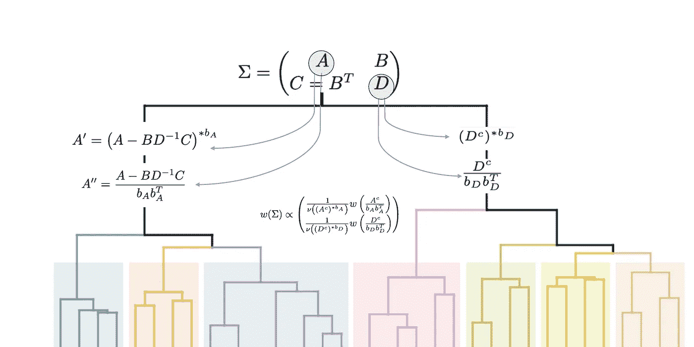

Schur complementary portfolios use **B** to alter **A** and **D** used in the recursive step

# 目标

1.  我总结一下马科斯·洛佩兹·德·普拉多在 2016 年开发的分级风险平价(HRP)。
2.  我介绍了一种新的递归分配方法，这种方法受 HRP 启发(使用重新排序),但其特点是协方差子矩阵的财务动机增强。

我为那些希望在部分连续体上进行实验的人提供了代码，这些连续体从 HRP 开始，一直延伸到优化——并证明了这种探索在机构规模上具有经济意义。

在此过程中，我提到了线性方程组的解作为最小方差投资组合的金融解释。这是为了帮助读者设计我的主题的变化。

我强调，从实用的角度来看，这根本不是自顶向下分配的复杂“修正”——只需要修改几个矩阵。

为投资组合构建提出的想法也与模型集合相关(在[优化模型投资组合](/geekculture/optimizing-a-portfolio-of-models-f1ed432d728b)中提到了这种联系)。

# 分级风险平价

在这个介绍分级风险平价(HRP)的[视频](https://www.youtube.com/watch?v=9MSPeAYBYIY)中，该方法被描述为“*应用机器学习投资组合优化的最大突破之一*”。它帮助洛佩兹·普拉多获得了年度定量分析师奖(或两项)。这个视频提供了一个比我用这种格式更好的解释，它关注的是我将省略的东西。

让我们仅仅说，在资产重新排序之后，协方差矩阵可以写成:

Block covariance matrix for assets split into two groups, usually after a seriation of some kind

我跳过了很多“资产重新排序”这个短语。那些对资产重组的特定选择感兴趣的人可以参考洛佩兹·普拉多的视频或原始论文，题为*建立跑赢样本的多元化投资组合(*[*SSRN*](https://papers.ssrn.com/sol3/papers.cfm?abstract_id=2708678)*)。*

我在重新排序的问题上很简短，因为我的贡献是正交的(可能有一半是双关语，我们会看到)，也因为有太多的方法来排列列表中的项目，以便新排序中的邻居比那些更远的邻居更像彼此。

这在统计学上被称为*系列*,历史至少可以追溯到考古学家推断岩层的顺序。在这篇文章的最后有一些参考文献，建议对这个主题进行变化，例如 Liiv 的系列调查和 Marti 等人的图形调查。

无论如何，重新排序是至关重要的，因为在自上而下的方法中，人们以有损的方式递归地定义投资组合权重 **w** :

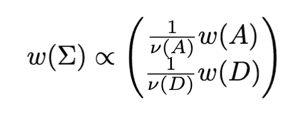

Hierarchical Portfolio Allocation using a scalar metric nu( ) for inter-group allocation

我说有损耗是因为自上而下的公式中明显缺少了一些东西:矩阵 **B** 消失了。资产的重新排序改善了信息的丢弃，但没有消除——我将回到这个问题，因为它是我提出的新方法的存在理由。

这里，分母是反分集的标量测量(不严格地说)，而 **w(A)** 和 **w(D)** 是总和为 1 的向量。换句话说，我们将决定在第一组和第二组之间分配多少投资，使用一些合适的度量标准，例如反向投资组合方差，然后在每组之间进行分配。

组间分配**1/mu(A):****1/mu(D)**可能采用一些理论上不太便于计算的子投资组合的方差(例如忽略非对角协方差条目的方差)。它不必与最终递归得出的方差相同。有变化，但我们将把它放在一边，因为在这篇笔记中，你会看到我对适应度函数 **mu()** 的选择不感兴趣，而对传递给它的矩阵参数 **A** 和 **D** 更感兴趣。

我们也可以决定 **w()** 在维度较小时终止，使用一些其他的投资组合技术，而不是永远继续拆分。

# 激励分级风险平价

一个平庸的数学观察可能会推进讨论。注意，在只有两个资产的情况下，矩阵 **A** 和 **D** 是标量，子分配 **w(A)=w(B)=[1]** 一定是平凡的。每种资产都是它自己的组，我们在两者之间分配与不适合性度量成反比的值 **nu()** ，这也是具体的，可以是相应资产的方差。

我们来对比一下优化。回想一下，如果我们寻求权重总和为 1 的最小方差多空投资组合，那么该投资组合将与协方差矩阵的倒数成比例:

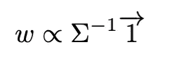

如果协方差是对角的，这仅仅是 n=2 情况的扩展。当然，它通常不是对角的，但是如果基数的改变使得它如此，我们可以在另一个基数上工作，同样，分配将几乎和 n=2 的例子一样简单。然后，自然地，我们需要转换回来，这样我们就知道分配给每个资产什么。

那是标准票价，困难也是。任何时候，只要有人试图对矩阵求逆，就有可能得到不稳定的解。全局协方差矩阵总是有噪声，并且通常是秩亏的。我所说的基础变化是一种幻想。

我个人喜欢 HRP 作为一种准对角化的描述，因为它强调了对位法:对角化本身。在比较中，我们知道对角化(或通过任何方式取矩阵的逆)有许多问题，并且我们不知道协方差矩阵到底是什么。

一个例子说明了这一点。拿走:

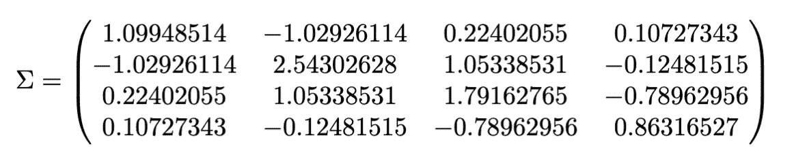

那么权重总和为 1 的最小方差多空投资组合为

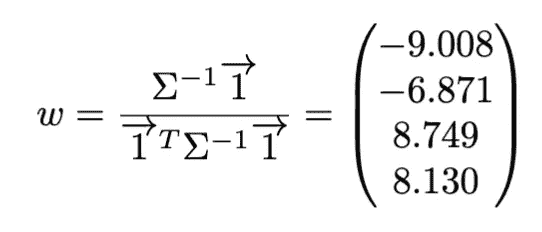

然而，如果我们对协方差估计值进行微小的修改，将非对角线条目乘以 0.97，那么如此定义的最优投资组合就会发生巨大的变化:

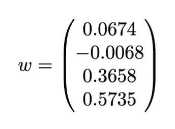

出于这个原因，没有一个认真的从业者会愿意严重依赖前一个投资组合。

诉诸自上而下的配置，如果我可以使用“诉诸”这个术语的话，并不是走出现代投资组合理论困境的唯一出路。我已经从不同的角度[这里](https://github.com/microprediction/precise/blob/main/LITERATURE.md)编辑了一份关于这个问题的论文的部分列表，通常的怀疑涉及收缩、自举、稳健估计(例如 Huber 均值)以及对天真估计的协方差或投资组合优化的其他修改。这些都不会让统计读者过分惊讶。

引人注目的是，HRP 通过自上而下的分配完全避开了这种不稳定性。在最初的论文(**)*中，作者展示了该方法将优于样本优化的证据——尽管最优投资组合非常集中。欢迎那些怀疑这种优异表现能否经受住一系列更复杂的比较的读者来看看。我保留了一长串可能与 HRP 竞争的“经理”名单，但这不是本文的重点。*

# *将 HRP 解释为基础限制*

*为了不离题，我宁愿转到 HRP 的解释及其内在动机的问题上。毫无疑问，有许多方法可以解决这个问题。但是关于序列化的话题，这里有一个可能的嵌套:*

> **“让我们试着只用非常有限的一类矩阵来对角化”**

*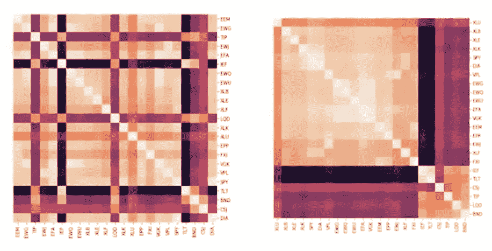*

*Quasi-diagonalization (Figure from Hudson and Thames)*

*在 HRP(后现代投资组合理论？)我们受制于改变基础的一系列方法。与通常用于缩放和旋转的矩阵集不同，我们将自己限制在零和一(然后是置换矩阵)。这种自我强加的限制会阻止我们深入探索投资组合空间的可疑区域。并且在莱多伊特和沃尔夫的原论文中有一条非常明确的信息: *Honey 我收缩了样本协方差矩阵* ( [链接](http://www.ledoit.net/honey.pdf))。*

**

*Parade de cirque with detail — Seurat (Wikipedia)*

*投资组合配置是一门艺术，从某种程度上来说，我在捍卫这种高维的点画主义——我的实验似乎为这种厚重的伪对角化带来的损失提供了一个上限，有点像你从修拉剧院退后一步。当您查看 HRP 优化的输出时，您可能也会相当满意——特别是如果您的基准是一个过度拟合的优化，比如说，五个资产得到了所有的权重。*

*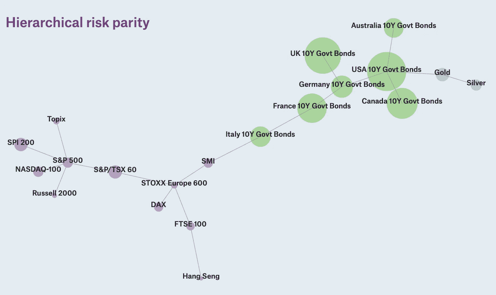*

*Don’t worry you can still have pretty plots and diverse allocation if you use Schur Complementary Portfolios instead of Hierarchical Risk Parity. Picture by Munich Re.*

*然而，根据我的框架，人们可能会合理地问，这种特定的受限对角化选择是否动机良好。我没有答案，但我可以给你看一些能给你更多艺术灵感的东西。*

# *条件协方差还是无条件协方差？*

*还有一件事值得注意，它更接近我的主题，也更容易用经济学术语来解释。*

*请注意，在 HRP 中，我们将原始协方差子矩阵 **A** 和**d**带入递归分配的下一步，我们使用——只是为了强调这一事实，它就在我们的眼皮底下——协方差数字正是全局协方差矩阵的限制(当然是在置换之后)*。这符合你的财务直觉吗？你绝对确定吗？**

*让我捅一下。假设你事先被告知你投资组合中一半股票的回报率。假设你不能改变收益已知的资产的分配，但你仍然可以自由地修改收益尚未披露的资产中的*子分配。**

*想必，这种预知会改变你的分析。特别是，你可能会试图计算那些你尚未决定相对配置的股票的*条件协方差*(比如 [so](http://finmathblog.blogspot.com/2012/12/conditioning-multivariate-normal-vector.html) )。嗯，条件协方差*是预先已知的*，这是一个自然的偶然(或者至少是它的高斯近似)。那会给你留下什么？*

# *一类新的自顶向下的投资组合技术*

*对条件协方差的最后思考可能会激发一种新的自上而下的分配方式，不是吗？*

*我的意思是它可以激励你，读者，因为对我来说太晚了——我后来才注意到。我的道路是不同的，更多的是与一般的数学不适和深夜浏览线性代数晦涩(实际上并不那么晦涩)的嗜好有关。*

*我的观点是，自上而下的分配划分步骤缺乏明确的动机(一般的评论，不仅仅是 HRP)——尽管我确实认为 HRP 是一个聪明的、重要的贡献。*

*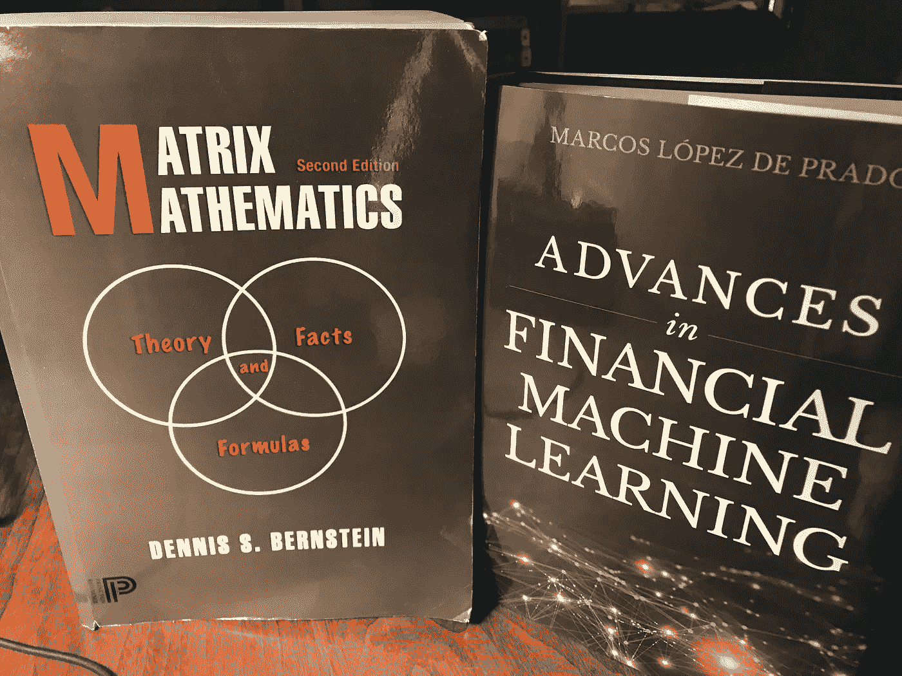*

*Desk-fellows*

*我希望打破 Lopez de Prado 和其他自上而下方案建立的模式，重新审视递归分配的默认部分，并改变传递到下一步的协方差矩阵*，我将试图说服您这样做的内在逻辑。**

*考虑这种更普遍的分治法:*

*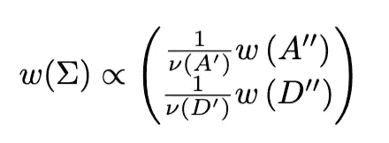*

*Hierarchical allocation when matrices A and D are augmented*

*其中，原始的 **A** 和 **D** 子协方差矩阵被换出，用于对我将要谈到的相同的**A’**、**A”**、**D’、**和**D”**进行修改。我们的想法是，我们可以从 **B** 中偷偷获取一些信息，以期改善最终结果。*

*此外，我将展示这可以让我们“*朝着优化的方向*”前进，同时仍然保持自顶向下的世界。我使用恐慌报价，因为这与在投资组合空间中移动是非常不同的，比如说 HRP 和 Markowitz 的凸组合——如果后者过度拟合，这可能不总是比 HRP 好。*

*我们转而进入方法空间，停留在自顶向下的类中。这样我们就有机会在非常高的维度中生存——就像最初的 HRP 方法一样。例如，您可能假设您有 5000 项资产，但只有 60 个月的历史数据来估计协方差矩阵。*

*因此，继续推迟激励，我假设选择 A:*

*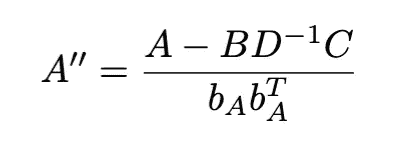**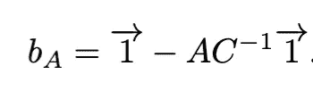*

*其中分数表示逐点除法。分子引起了我对这篇文章标题中方法名称的选择，我们认为它是 Schur 补。*

*我提醒读者，当我们以部分证据为多元正态分布的条件时，以及在矩阵的分块求逆中，会出现 Schur 补。浏览维基百科页面的一半，寻找[可逆矩阵](https://en.wikipedia.org/wiki/Invertible_matrix)，你会发现这个没有属性的等式:*

*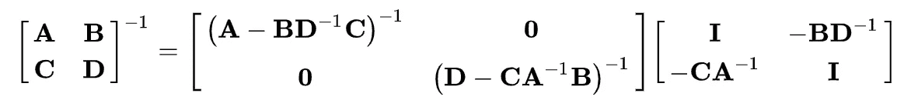*

*这种同一性将指导我们，但是为了避免这变得太抽象太快，让我举一个例子。*

# *“固定”自上而下分配的示例*

*你会注意到，我采用的策略是对最小方差投资组合的考虑，以及使用自上而下分配来重构它的尴尬。这与其他自上而下方案的动机并没有太大的不同(注意逆方差的作用),而且它不需要*而不是*坚持最小方差投资组合是最好的这一信念。*

*说完了，让我们开始*

**

*这是你能得到的最微不足道的东西。这里没有序列化帮助，在任何自上而下的二分法中，我们都有一个不愉快的分裂:*

*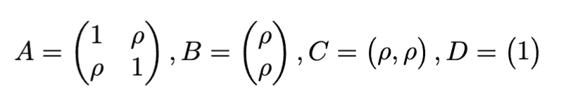*

*如果你按照这个配方做，那么不幸的是(给读者做个练习)，我们最终会得到一个不对称的投资组合 **w** 。*

*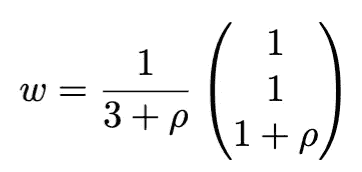*

*然而，我已经暗示了如何“修复”这个问题。依靠矩阵求逆恒等式*

*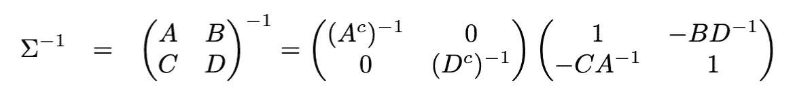*

*我在这里表示了舒尔补语，例如:*

*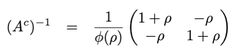**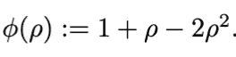*

*Schur complement inverse example*

*继续代数运算，我们能够打破对称性，并成功地将其重新组合成对称投资组合，即:*

*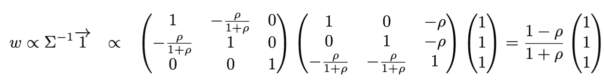*

*现在*再次*，我不是说最小方差是最好的。我是说它扮演了一个*建议的角色——就像在 HRP 中一样。*你可以在上面看到，最小方差投资组合有一个*真实的*“分割”表示，而不是像自上而下分配中那样有一个*强制想象的*。没看出来？折叠:*

*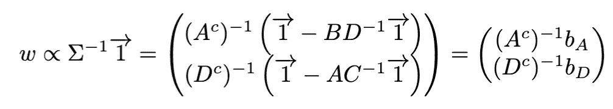*

*我希望，这能开始激发人们通过**b**s 选择**A’**s，而不仅仅是明显的**A’**=**A”**=**A**和**D’**=**D”**=**D**。尽管如此，我还需要做更多的工作来解释右边的部分，以表明您所习惯的规范的自顶向下分配模式。我们需要在财务上“读懂”右边。*

# ***线性方程组的财务解释***

*为此，一个微小的旁白。假设我们为任何协方差矩阵 Q 定义权重*

*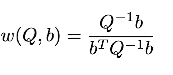*

*顺便说一下，这发现解释是最小方差投资组合，但不是我们首先考虑的。它解决了*

**

*你会注意到约束使用了 **b，**而不是一个向量。关于 **Q，**这个投资组合有一些方差 **nu(Q)** 在计算并重新排列后我们注意到:*

*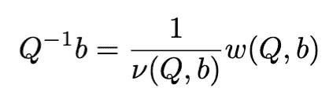*

*Financial interpretation of the solution of a linear system of equations*

*换句话说: **Qx=b** 的解可以解释为最小方差投资组合，用投资组合方差归一化。*

# *如何“解读”舒尔分级方案*

*我现在提出一个设计自上而下的投资组合分配方法的启发式方法。这个想法是使用矩阵恒等式以及线性方程组的金融解释。让我来举例说明，并在这样做的过程中得出矩阵**A’、A’、D’、**和**D’’**(其中 **A** 和 **D** 是对称的 btw) **)的建议。盯着右手边:***

*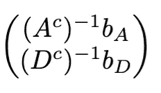*

*Minimum variance portfolio in a segregated format*

*现在在金融解释中互换。这产生了具有不同约束的最小方差投资组合，并且这可能不总是最有启发性的——在某种程度上，这取决于您的投资组合库和它们的 API。*

*我们可以走得更远一点，改变一下坐标，这样看起来我们是在以权重总和等于 1 的方式进行分配。我认为这会导致:*

*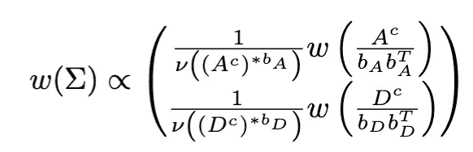*

*其中这次 **w()** 是一个权重总和为 1 的投资组合(这使得在你的脑海中很容易修改为其他东西)。还有你的 **A'** ， **A''** ， **D '，**和 **D''** 太，如你所愿。你所要做的就是遵循通常的连续-分割-分配-重复循环，但是要对你传入的参数进行修改。*

*这里有一个新的操作符来修改用于计算投资组合方差的协方差**A’**。我的批注是:*

*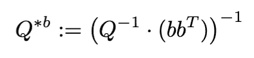*

*An operator interpreted as “pointwise multiplication in the precision domain”*

*也许读者可以为“精确域中的乘法”建议一个更好的或现有的名称。我不会给你交换图，但这是因为我们需要从一个最小方差投资组合转换到另一个——通过变量的改变。相关的观察结果如下:*

*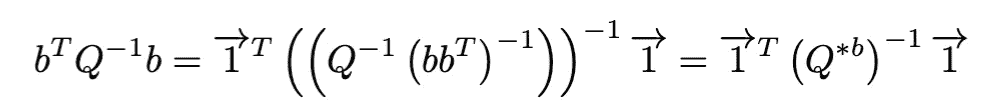*

*这就是为什么我们到达*

**

*对于递归步骤，因此是自顶向下的方案。它可以示意性地表示为:*

*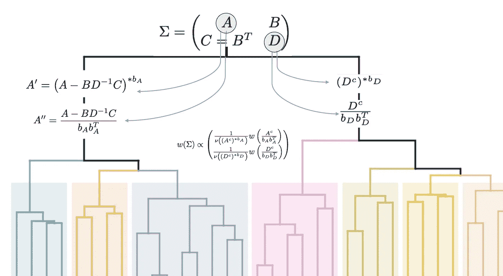*

*Schematic for covariance-augmented top-down allocation. Some information from B carries down.*

# *部分连续统*

*这时你应该说“舒利，你在开玩笑吧？”。因为如果我们恢复了最优化的解，那么我们也必须恢复它的弱点，对吗？*

*是的，绝对是，但是我们通常从不去那里。实际上，增广矩阵可以为您的**w(A″)**或**w(D″)提供问题。细节将取决于软件包做出的假设或它们执行的显式检查，例如正定性。***

*此外，我们无论如何也不想要所有的 Schur 贡献，所以我将参数插入到 **b** 和 Schur 补充中来巧妙处理这个问题，并提供部分连续体。这个想法是让你决定从 **B** 传递多少信息。所以实际的方案更像是如下:*

*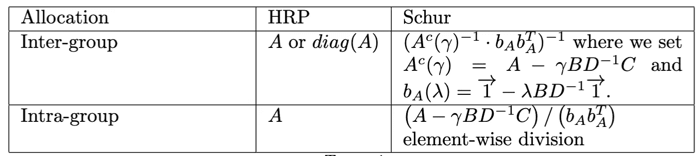*

*Schur Portfolio construction differs from other top-down allocation schemes such as Hierarchical Risk Parity (HRP) because matrices A and D are modified in the recursive step.*

*这里*

*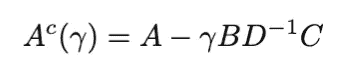*

*和*

*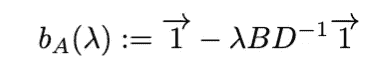*

*给我们一些灵活性，让我们“朝着优化的方向”前进，就像我之前说的那样。下表最右边的一列指出了这种遍历，但有一点要注意，就是没有到达那里。*

*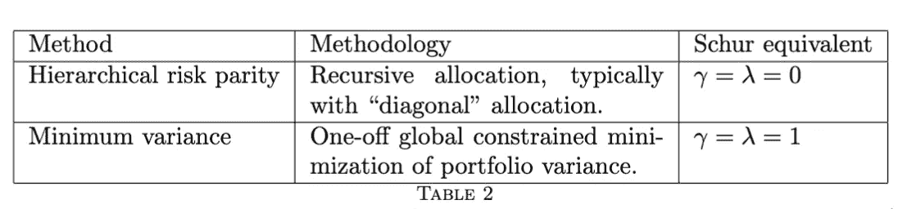*

*Extremal points on a continuum of portfolio allocation methods spanning both hierarchical (recursive) and optimization philosophies. Corresponding parameters for Schur complementary portfolios are shown that can, modulo technicalities, replicate the output. This assumes seriation has been used to reorder assets, an important ingredient in hierarchical risk parity.*

*更确切地说，我通常喜欢做的是使用增广矩阵的适用性作为后退机制来确定伽马、λ或两者的最大选择(我通常将它们等同)。所以在我的大部分代码中，对这些参数的解释只是最大允许“Schurness”的一小部分。*

# *有用吗？*

*我 schurlishly 建议我的方法比 HRP 更漂亮，因此几乎肯定会更好地工作。说真的，我真的希望读者自己决定。您也可以尝试其他想法和参数化。*

*在我看来，消除 HRP 中一些轻微的数学不优雅不仅仅是出于审美动机——至少如果你是一名机构资金管理者或大规模投资者。*

*但这将取决于你对 leaf 投资组合的选择和度量标准 **nu()，**包括所采用的任何缩水。在我自己的实验中，我专注于使用防御性但“弱”的收缩方式。在这种情况下，代替违约的舒尔增量可能有大约 5-20 个基点的好处。*

*这是一顿很少的午餐，但与其他试图通过更彻底地偏离 HRP(如直接全局优化)来对抗高维诅咒的方法相比，可能几乎是免费的。在这里，我试着不要把 HRP 宝宝和洗澡水一起倒掉。*

*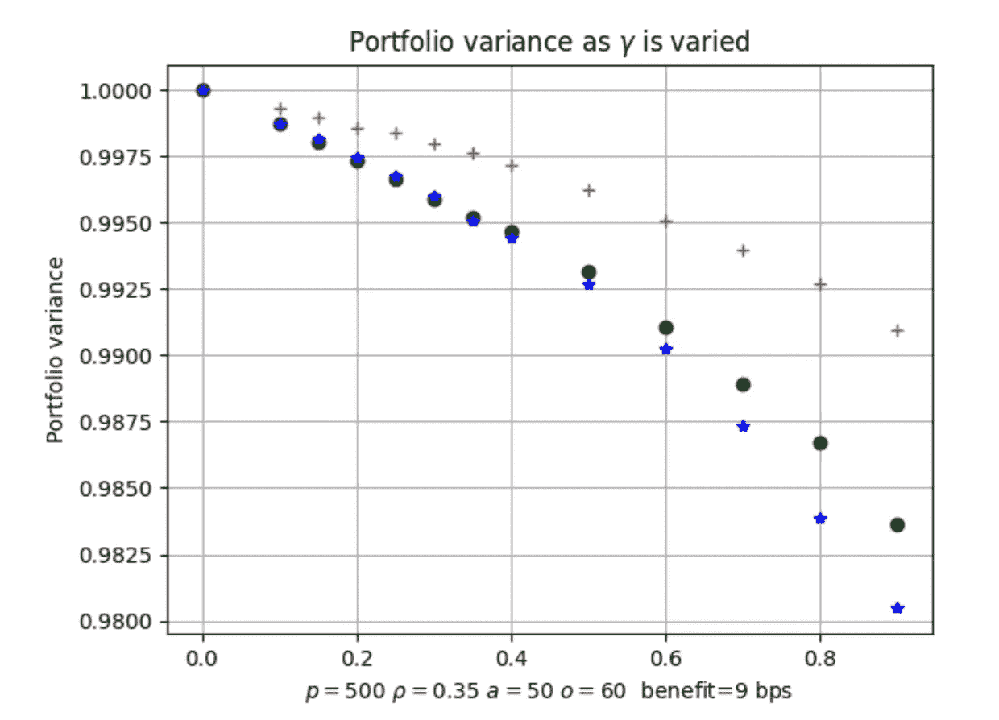*

*Three different examples of relative portfolio variance as the gamma parameter (x-axis) is varied from gamma=0 (traditional top-down allocation) to gamma=1 (using information from the Schur complement to the extent that A’ remains positive definite). Numbers are normalized by the portfolio variance obtained using a hierarchical scheme where A’=A’’=A. In this example p=500 assets are used with a true covariance matrix assumed to be the empirical covariance of a=50 samples from a symmetric model with constant off-diagonal correlation rho=0.35\. Then o=60 observations are used to estimate the covariance matrix used for top-down allocation. The approximate economic benefit is on the order of 9bps of additional return per year.*

*顺便说一句，我相信前面的讨论也清楚地表明，我的方法也是*特定的*——说“在修补机器学习传统中”听起来更好。我无论如何也不能完全理解它，它也可能被解释为动机不足——对 HRP 的同样的批评首先导致我更仔细地观察。*

# *另一个例子*

*分级风险平价并不是避免矩阵求逆的唯一特别分配方法。其他类型的自下而上的分组也在使用，所以让我们看看 Schur 如何“修正”或改进另一个例子。考虑:*

*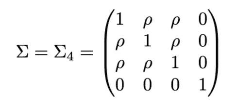*

*在哪里*

**

*而且我们其实并不关心归一化系数(和之前一样)。最小方差投资组合是*

*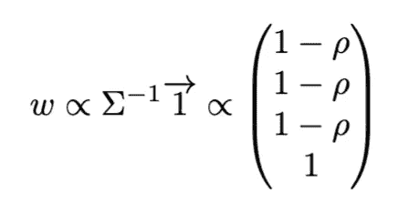*

*我选择这个例子是因为“索引”可能会失败。我指的是将前两项资产视为一项资产，将后两项视为另一项资产，然后使用组间协方差矩阵进行内部分配。这种“索引”可以被认为是一种粗糙的多尺度近似。这是应用数学的老话题了。(我在这里写了一个关于“同质化”的注释[，对于感兴趣的人来说，是为了说明更仔细的多尺度方法可以产生洞察力)。](https://www.linkedin.com/pulse/got-milk-homogenization-survival-probability-peter-cotton-phd/)*

*顺便说一下，在这个特定的资产配置例子中，大卫·迪萨特尼克的[论文](https://papers.ssrn.com/sol3/papers.cfm?abstract_id=1420862)可能对你更有帮助，该论文认为，对协方差矩阵施加限制(确保只做多的投资组合)可以提供足够的限制来击败 1/n 基准。*

*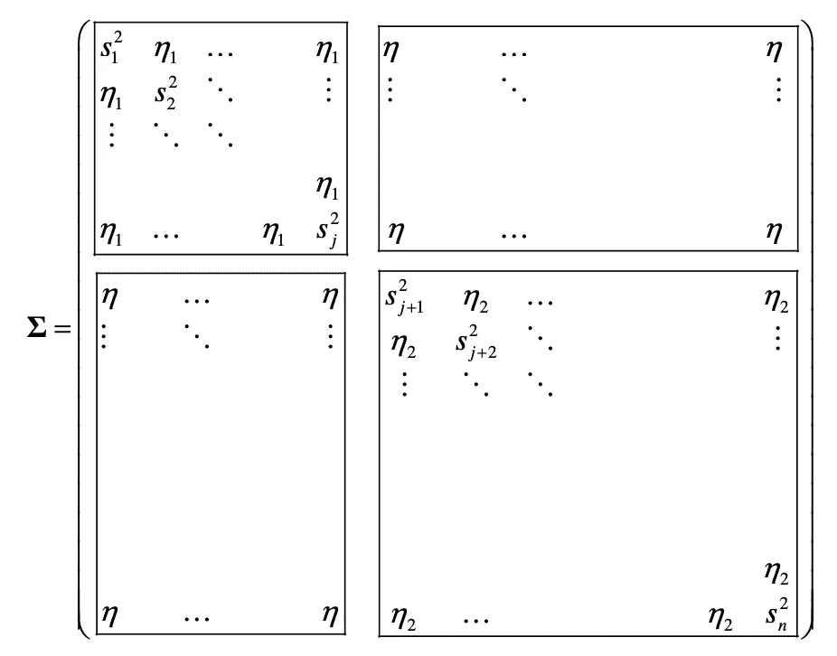*

*A prespecified block-covariance structure provided by David Disatnik. In contrast, top-down allocation using Schur complements starts with any covariance matrix — but the connection to block results is interesting.*

*然而，不是每个人都想使用协方差限制，尤其是当维数增加时。我想告诉你，舒尔方法和激励反演恒等式提供了一种不同的方式来“受到最小方差的启发”，但同时仍然对直接优化的陷阱保持警惕。*

*为了工作，我们又开始了:*

*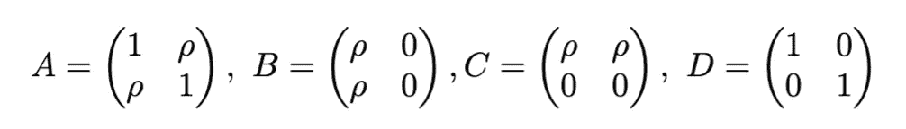*

*因此:*

*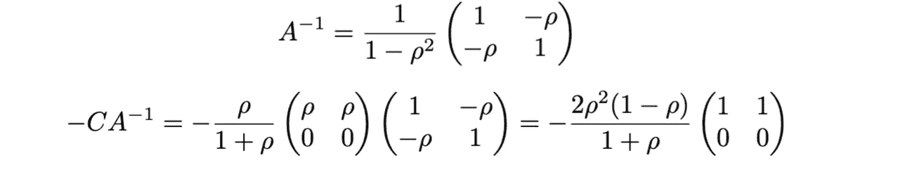*

*并且:*

*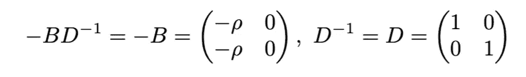**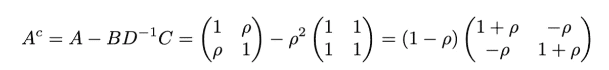**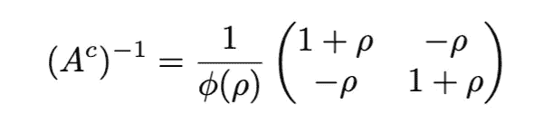*

*像以前一样，而且*

*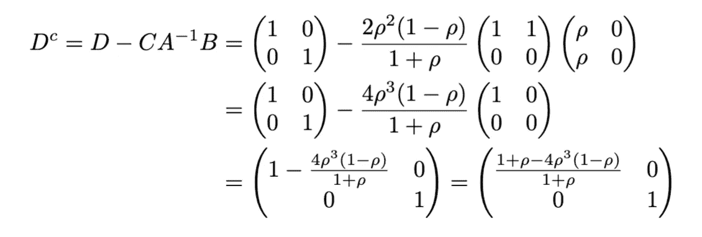*

*另一个舒尔补码。因此*

*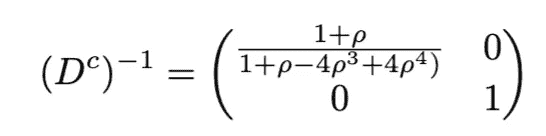*

*现在我们终于可以开始明白为什么舒尔自上而下的方法可能会减轻“索引”分配的尴尬，因为:*

*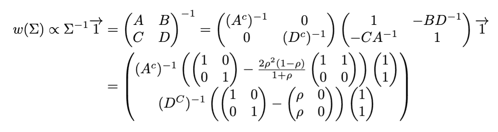*

*这是对全球投资组合的拆分，让我有机会解释一个略有不同的视角。如果我们能找到*可逆矩阵**

*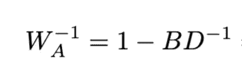*

*和*

*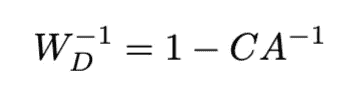*

*(你可以像我之前一样加入收缩参数)这允许我们折叠右边。*

*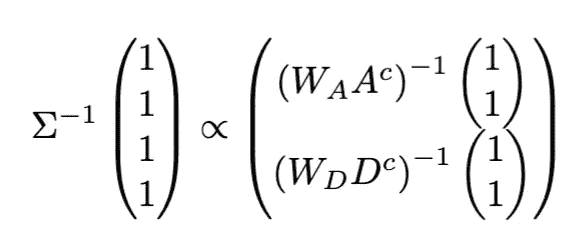*

*既然我们在本领域中已经有所实践，我们认为这是一种自上而下的分配方案，具有许多明显的普遍性。和以前一样，你可以换入换出不同的投资组合方法。顺便说一下，我们可以在这个例子中写下那些假设矩阵。他们是*

*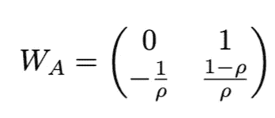*

*和*

*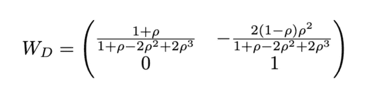*

# *螺母、螺栓和蟒蛇皮*

*玩得开心点。如果你想不加修改地尝试一下，这是相当简单的。事实上，你甚至可以用一行代码计算舒尔互补投资组合。我最近添加了一些[文档](https://microprediction.github.io/precise/managers.html)，尽管没有太多内容:*

*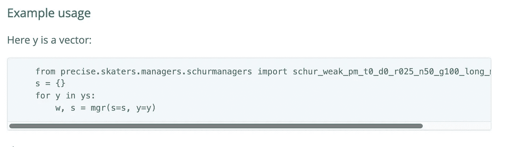*

*还要注意的是，精确的软件包还包括[协方差](https://microprediction.github.io/precise/covariance.html)预测技术，这些技术绝对可以让你进入 M6 预测竞赛的[前十分之一](https://m6competition.com/Leaderboard)(基于一个天真的频率主义者分析)。可以混搭。*

*由于我提议的改变是对 **A** 和 **D** 矩阵的修改，我们甚至可以依靠开源项目组合社区中的其他朋友来提供 Schur 项目组合的其他实现——如果我的包不是你的风格的话。*

# *参考资料和进一步阅读*

*期刊投稿规则禁止我发表论文，但如果你感兴趣，可以联系我。*

*就相关阅读而言，这里有一些非常接近主题的论文——一些直接建议对 HRP 进行修改，如选择序列化或收缩或 **nu** 或 **w** ，因此这也可以被解释为如何将我提出的一般想法付诸实践的建议。正如洛佩斯·德·普拉多的论文所提到的，SSRN 的论文是关于**。***

**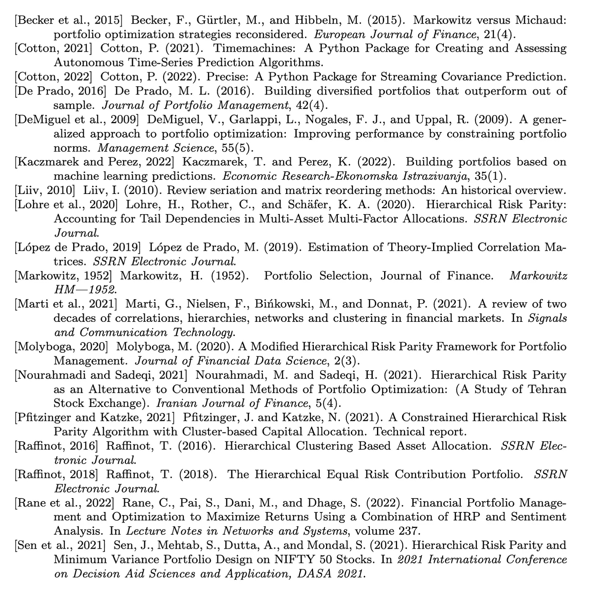**

**在我的添加列表中有*彼得·施文德纳(Peter Schwendner)、约亨·帕彭布罗克(Jochen Papenbrock)、马库斯·耶格(Markus Jaeger)和斯蒂芬·克鲁格(Stephan krügel)([链接](https://jfds.pm-research.com/content/3/4/65))使用机器学习和图论构建启发式投资组合的自适应序列风险平价和其他扩展，当然也可以用于舒尔。博客圈里还有更多，比如拉斐尔·尼古拉斯·费尔明·科塔关于 HRP 不足的[笔记](https://www.linkedin.com/pulse/shortfalls-hierarchical-risk-parity-rafael-nicolas-fermin-cota/)。***

**当然还有更广泛的文献。还有很多很多的论文涉及 HRP 试图通过不同的方式解决的问题。我会很感激对我的小[缓存](https://github.com/microprediction/precise/blob/main/LITERATURE.md)中关于稳健投资组合构建的有趣论文的请求——这些论文远非全面。**

# **关于我**

**这项工作得到了英达投资公司的支持，我从与阿德里安·班纳和费尔南多·马尔克斯的交谈中受益匪浅。这篇文章有点例外，因为我写的大多是我工作的非财务方面(T2 微预测项目)。最近，我还是一本[书](https://mitpress.mit.edu/9780262047326/microprediction/)的作者。**