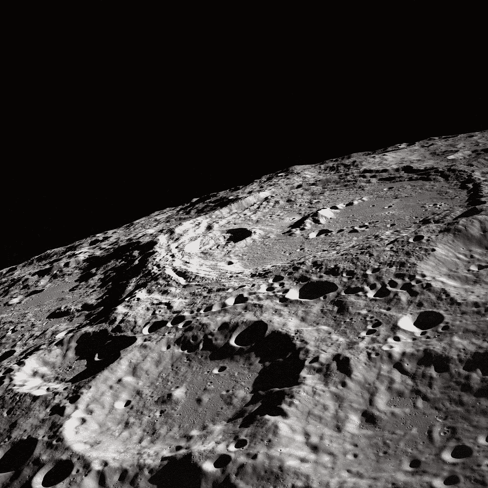

# 科学家正在月球土壤上种植植物

> 原文：<https://medium.com/geekculture/scientists-are-growing-plants-on-lunar-soil-de7fb8b88f77?source=collection_archive---------22----------------------->

## 植物第一次在月球土壤上生长。“那么，当你在月球土壤中种植植物时会发生什么，这完全超出了植物的进化经验？”

Photo by [NASA](https://unsplash.com/@nasa?utm_source=medium&utm_medium=referral) on [Unsplash](https://unsplash.com?utm_source=medium&utm_medium=referral)

> “我们想做这个实验，因为我们已经…