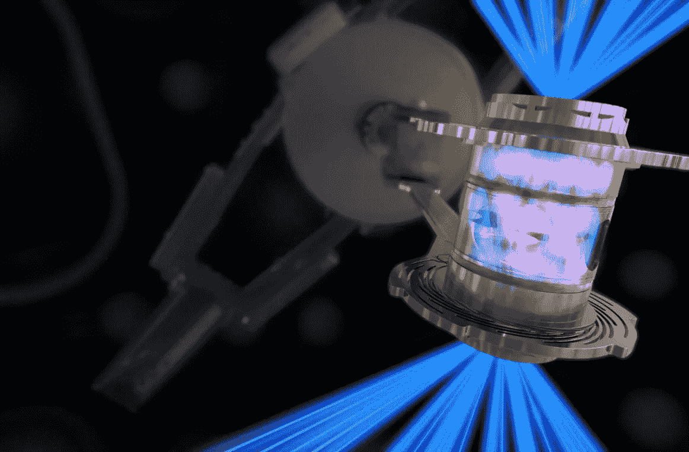

# 随着国会通过一项 8580 亿美元的国防法案，科学家们在核聚变方面取得了突破

> 原文：<https://medium.com/geekculture/scientists-make-a-breakthrough-in-nuclear-fusion-as-congress-passes-an-858-billion-defense-bill-a1cd96388d06?source=collection_archive---------2----------------------->

Image by Lawrence Livermore National Laboratory

本周，科学家和研究人员在核聚变方面取得了重大突破，这可能会解决世界能源问题。美国国会周四通过立法，授权创纪录的 8580 亿美元年度国防开支，比总统乔·拜登提议的多 450 亿美元。有新的担忧…