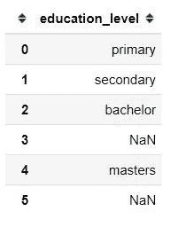
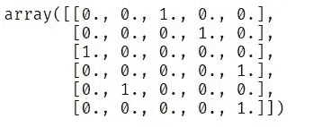
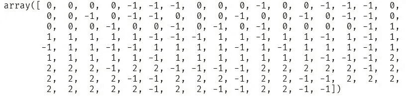

# sci kit-学习 0.24:您需要了解的 5 大新功能

> 原文：<https://medium.com/geekculture/scikit-learn-0-24-top-5-new-features-you-need-to-know-7af15d8cdeac?source=collection_archive---------8----------------------->


Scikit-learn 仍然是最受欢迎的 Python 开源免费机器学习库之一。scikit-learn 库包含许多用于机器学习和统计建模的有效工具，包括分类、回归、聚类和降维。

许多数据科学家、机器学习工程师和研究人员依靠这个库进行他们的[机器学习](https://hackernoon.com/machine-learning-as-a-service-mlaas-with-sklearn-and-algorithmia-7299fbaed584?ref=hackernoon.com)项目。我个人喜欢使用 scikit-learn 库，因为它提供了大量的灵活性，并且很容易理解它的文档和许多例子。

在这篇文章中，我很高兴与您分享 scikit 中的 5 个最佳新功能-learn 0.24。

# 安装最新版本的 Scikit-Learn 库

首先，确保您安装了最新版本(带 pip):

```
pip install --upgrade scikit-learn
```

如果您使用 conda，请使用以下命令:

```
conda install -c conda-forge scikit-learn
```

**注:**该版本支持 Python 版本 **3.6** 到 **3.9** 。

现在，让我们看看新的功能！

# 1.平均绝对百分比误差(MAPE)

scikit-learn 的新版本为回归问题引入了一种新的评估指标，称为平均绝对百分比误差(MAPE)。以前你可以用一段代码来计算 MAPE。

```
np.mean(np.abs((y_test — preds)/y_test))
```

但是现在你可以从 **sklearn.metrics** 模块调用一个名为**mean _ absolute _ percentage _ error**的函数来评估你的回归模型的性能。

**示例:**

```
from sklearn.metrics import mean_absolute_percentage_error
y_true = [3, -0.5, 2, 7]
y_pred = [2.5, 0.0, 2, 8]
print(mean_absolute_percentage_error(y_true, y_pred))
```

0.3273809523809524

**注:**记住，该函数并不表示输出为范围[0，100]内的百分比。相反，我们用范围[0，1/eps]来表示它。最佳值为 **0.0。**

# 2.OneHotEncoder 支持缺失值

[OneHotEncoder](https://hackernoon.com/what-is-one-hot-encoding-why-and-when-do-you-have-to-use-it-e3c6186d008f?ref=hackernoon.com) 现在可以处理数据集中出现的缺失值。它将缺失值视为一个类别。让我们在下面的例子中更多地了解它是如何工作的。

首先导入重要的包。

```
import pandas as pd 
import numpy as np
from sklearn.preprocessing import OneHotEncoder
```

创建一个包含缺失值的分类要素的简单数据框。

```
# intialise data of lists.
data = {'education_level':['primary', 'secondary', 'bachelor', np.nan,'masters',np.nan]}

# Create DataFrame
df = pd.DataFrame(data)

# Print the output.
print(df)
```



如您所见，在我们的**教育水平**列中，我们缺少了两个值。

创建 OneHotEncoder 的实例。

```
enc = OneHotEncoder()
```

然后拟合和转换我们的数据。

```
enc.fit_transform(df).toarray()
```



我们的 education_level 列已经被转换，所有缺失的值都被视为一个新的类别(检查上面数组的最后一列)。

# 3.一种新的特征选择方法

**SequentialFeatureSelector**是 scikit-learn 中一种新的特征选择方法。它可以是向前选择，也可以是向后选择。

**(一)前进选择**

它迭代地找到最佳新特征，然后将其添加到所选特征集中。这意味着我们从零个特征开始，然后找到一个使估计量的交叉验证分数最大化的特征。所选特征被添加到集合中，并且重复该过程，直到我们达到所选特征的期望数量。

**(b)反向选择**

第二次选择遵循相同的想法，但方向不同。这里，我们从所有特征开始，然后从集合中删除一个特征，直到我们达到所选特征的期望数量。

**例子**

导入重要的包。

```
from sklearn.feature_selection import SequentialFeatureSelector
from sklearn.neighbors import KNeighborsClassifier
from sklearn.datasets import load_iris
```

加载虹膜数据集及其特征名称。

```
X, y = load_iris(return_X_y=True, as_frame=True)
feature_names = X.columns
```

创建估计器的实例。

```
knn = KNeighborsClassifier(n_neighbors=3)
```

创建 SequentialFeatureSelector 的实例，设置要选择的特征数量为 **2** ，设置方向为“**向后**”。

```
sfs = SequentialFeatureSelector(knn, n_features_to_select=2,direction='backward')
```

最后学习要选择的特性。

```
sfs.fit(X,y)
```

显示选定的功能。

```
print("Features selected by backward sequential selection: "
      f"{feature_names[sfs.get_support()].tolist()}")
```

通过反向顺序选择选择的特征:['花瓣长度(cm)'，'花瓣宽度(cm)']

这种新的特征选择方法的唯一缺点是，它可能比你已经知道的其他方法(SelectFromModel & RFE)慢，因为它使用交叉验证来评估模型。

# 4.超参数调谐的新方法

谈到超参数调优，Scikit-learn 的 GridSearchCV 和 RandomizedSearchCv 一直是许多数据科学家的首选。但在新版本中，我们有两个新的超参数调整类，称为**halvinggridsearccv**和 **HalvingRandomSearchCV** 。

HalvingGridSearchCV 和 HalvingRandomSearchCV 使用一种称为**连续减半**的新方法来寻找最佳超参数。连续减半就像所有超参数组合之间的竞争或比赛。

**连续减半是如何工作的？**

在第一次迭代中，他们在一个观察子集(训练数据)上训练超参数的组合。然后在下一次迭代中，仅选择在第一次迭代中具有良好性能的超参数组合，并且它们将在大量观察中被训练以竞争。

因此，在每次迭代中重复这个选择过程，直到在最终迭代中选择出超参数的最佳组合。

注意:这些课程仍然是实验性的:

**例如:**

导入重要的包。

```
from sklearn.datasets import make_classification
from sklearn.ensemble import RandomForestClassifier
from sklearn.experimental import enable_halving_search_cv  
from sklearn.model_selection import HalvingRandomSearchCV
from scipy.stats import randint
```

由于这些新类仍然是实验性的，为了使用它们，我们显式地导入了**enable _ halving _ search _ cv**:

使用 make_classification 方法创建分类数据集。

```
X, y = make_classification(n_samples=1000)
```

创建估计器的实例。这里我们使用随机森林分类器。

```
clf = RandomForestClassifier(n_estimators=20)
```

为调整创建参数分布。

```
param_dist = {"max_depth": [3, None],
              "max_features": randint(1, 11),
              "min_samples_split": randint(2, 11),
              "bootstrap": [True, False],
              "criterion": ["gini", "entropy"]}
```

然后我们用 RandomForestClassifier 作为估计器和参数分布列表实例化 HalvingGridSearchCV 类。

```
rsh = HalvingRandomSearchCV(
    estimator=clf,
    param_distributions=param_dist,
    cv = 5,
    factor=2,
    min_resources = 20)
```

HalvingRandomSearchCV 中有两个重要的参数你需要知道。

(a) **因子** —这决定了为每个后续迭代选择的超参数组合的比例。例如， ***因子=3*** 表示只选择三分之一的候选进行下一次迭代。

(b) **min_resources** 是在第一次迭代中为每个超参数组合分配的资源量(观察值的数量)。

最后，我们可以用数据集来拟合我们创建的搜索对象。

```
rsh.fit(X,y)
```

训练后，我们可以看到不同的输出，如:-

(a)迭代次数。

```
print(rsh.n_iterations_ )
```

6

(b)在每次迭代中评估的候选参数的数量。

```
print(rsh.n_candidates_ )
```

**【50，25，13，7，4，2】**

(c)每次迭代使用的资源数量。

```
print(rsh.n_resources_)
```

**【20，40，80，160，320，640】**

(d)对拒绝数据给出最佳结果的参数设置。

```
print(rsh.best_params_)
```

**{'bootstrap': False，
'criterion': 'entropy '，
'max_depth': None，
'max_features': 5，
'min_samples_split': 2}**

# 5.新的半监督学习自训练元估计器

Scikit-learn 0.24 为半监督学习引入了一个新的自我训练实现，称为**自我训练分类器**。SelfTrainingClassifier 可以与任何可以返回每个类的概率估计值的监督分类器一起使用。

这意味着任何监督分类器都可以作为半监督分类器，允许它从数据集中的未标记观察值中学习。

**注意:**目标列中未标记的值必须为-1。

让我们在下面的例子中更多地了解它是如何工作的。

导入重要的包

```
import numpy as np
from sklearn import datasets
from sklearn.semi_supervised import SelfTrainingClassifier
from sklearn.svm import SVC
```

在这个例子中，我们将使用 iris 数据集和超级向量机算法作为监督分类器(它可以实现 **fit** 和 **predict_proba** )。

然后，我们加载数据集，并随机选择一些未标记的观察值。

```
rng = np.random.RandomState(42)
iris = datasets.load_iris()
random_unlabeled_points = rng.rand(iris.target.shape[0]) < 0.3
iris.target[random_unlabeled_points] = -1
```

如您所见，目标列中未标记的值为-1。



创建监督估计器的实例。

```
svc = SVC(probability=True, gamma="auto")
```

创建一个自训练元估计器的实例，并添加 svc 作为 base_estimator。

```
self_training_model = SelfTrainingClassifier(base_estimator=svc)
```

最后，我们可以在具有一些未标记观察值的虹膜数据集上训练自训练模型。

```
self_training_model.fit(iris.data, iris.target)
```

自我训练分类器(base_estimator=SVC(gamma='auto '，probability=True))

# 关于 Scikit 的最终想法-学习 0.24

正如我所说的，scikit-learn 仍然是最受欢迎的开源机器学习库之一，所有的[特性](https://towardsdatascience.com/14-lesser-known-impressive-features-of-scikit-learn-library-e7ea36f1149a?ref=hackernoon.com)都可供您进行端到端的机器学习项目。您还可以在您的机器学习项目中实现本文中介绍的令人印象深刻的新功能。

你可以在 scikit-learn 0.24 [这里](https://scikit-learn.org/stable/auto_examples/release_highlights/plot_release_highlights_0_24_0.html?ref=hackernoon.com)找到发布的其他功能的亮点。

恭喜👏👏，你已经做到这篇文章的结尾了！我希望你学到了一些新的东西，对你的下一个机器学习或数据科学项目有所帮助。

如果你学到了新的东西或者喜欢阅读这篇文章，请分享给其他人看。在那之前，下期帖子再见！

你也可以在推特上找到我 [@Davis_McDavid。](https://twitter.com/Davis_McDavid?ref=hackernoon.com)

***最后一件事:*** *在下面的链接里多看看类似这样的文章。*

[](https://towardsdatascience.com/improve-ml-model-performance-by-combining-categorical-features-a23efbb6a215) [## 通过组合分类特征提高 ML 模型性能

### 提高机器学习模型性能的简单技巧。

towardsdatascience.com](https://towardsdatascience.com/improve-ml-model-performance-by-combining-categorical-features-a23efbb6a215) [](/geekculture/machine-learning-tutorial-feature-engineering-and-feature-selection-for-beginners-dd15b9d354) [## 机器学习教程—面向初学者的特征工程和特征选择

### 他们说数据是新的石油，但我们并不直接使用石油的来源。它必须经过处理和清洗…

medium.com](/geekculture/machine-learning-tutorial-feature-engineering-and-feature-selection-for-beginners-dd15b9d354) [](https://medium.datadriveninvestor.com/how-to-transform-machine-learning-models-into-native-code-with-zero-dependencies-597d01684a9f) [## 如何将机器学习模型转换成零依赖的本机代码

### 将训练好的 ML 模型转换成你选择的编程语言。

medium.datadriveninvestor.com](https://medium.datadriveninvestor.com/how-to-transform-machine-learning-models-into-native-code-with-zero-dependencies-597d01684a9f)