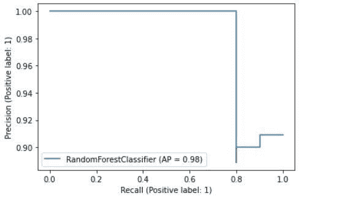
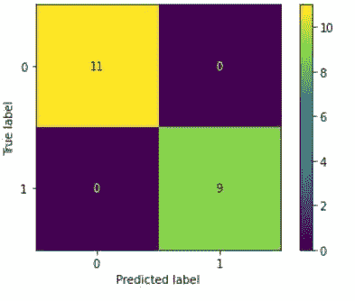

# scikit Learn 1.0:Python 机器学习库中的新特性

> 原文：<https://medium.com/geekculture/scikit-learn-1-0-new-features-in-python-machine-learning-library-d6ffea7b88dc?source=collection_archive---------11----------------------->


Scikit-learn 是最受数据科学家和机器学习实践者欢迎的开源免费 python 机器学习库。scikit-learn 库包含许多用于机器学习和统计建模的有效工具，包括分类、回归、聚类和降维。

在本文中，我很高兴与您分享新版本 scikit-learn (1.0)中的 5 大新特性。

# 目录

1.  安装 sci kit-learn 1.0 版
2.  新的灵活绘图 API
3.  功能名称支持
4.  皮尔逊相关系数
5.  OneHot 编码器改进
6.  基于直方图的梯度推进模型现在是稳定的

# 安装 sci kit-learn 1.0 版

首先，确保您安装了最新版本(带 pip):

```
pip install --upgrade scikit-learn
```

如果您正在使用 conda，请使用以下命令:

```
conda install -c conda-forge scikit-learn
```

注意:scikit-learn 1 . 0 . 0 版本需要 python 3.7+，NumPy 1.14.6+和 scipy 1.1.0+。可选的最小依赖是 matplotlib 2.2.2+

现在，让我们看看新的功能！

# 1.新的灵活绘图 API

Scikit-learn 1.0 引入了新的灵活绘图 API，如 metrics。PrecisionRecallDisplay，指标。DetCurveDisplay 和 inspection . partial dependency display

这个绘图 API 带有两个类方法:

**(一)from_estimator()**

这个类方法允许你在拟合模型的同时绘制结果。

让我们看一个使用 PrecisionRecallDisplay 可视化精度和召回的例子。

```
import matplotlib.pyplot as plt
from sklearn.datasets import make_classification
from sklearn.metrics import PrecisionRecallDisplay
from sklearn.model_selection import train_test_split
from sklearn.ensemble import RandomForestClassifier

X, y = make_classification(random_state=42)
X_train, X_test, y_train, y_test = train_test_split(X, y,test_size=0.2)

classifier= RandomForestClassifier(random_state=42)
classifier.fit(X_train, y_train)

disp_confusion = PrecisionRecallDisplay.from_estimator(classifier,
                                                       X_test,
                                                       y_test) 

plt.show()
```



**(乙)from _ predictions()**

在这个类方法中，您可以传递预测结果并获得您的绘图。

让我们看一个使用 ConfusionMatrixDisplay 可视化混淆矩阵的例子。

```
import matplotlib.pyplot as plt
from sklearn.datasets import make_classification
from sklearn.metrics import confusion_matrix, ConfusionMatrixDisplay
from sklearn.model_selection import train_test_split
from sklearn.ensemble import RandomForestClassifier

X, y = make_classification(random_state=42)
X_train, X_test, y_train, y_test = train_test_split(X, y,test_size=0.2)

classifier= RandomForestClassifier(random_state=42)
classifier.fit(X_train, y_train)

predictions = classifier.predict(X_test)

disp_confusion = ConfusionMatrixDisplay.from_predictions(predictions,
                                                       y_test,
                               display_labels=classifier.classes_) 

plt.show()
```



# 2.功能名称支持(熊猫数据框架)

在新版 scikit-learn 中，当使用转换器或估算器时，您可以跟踪 pandas 数据框架的列名。

当您将数据帧传递给估算器并调用 fit 方法时，估算器会将特征名称存储在 **feature_names_in_** 属性中。

```
from sklearn.preprocessing import StandardScaler
import pandas as pd

X = pd.DataFrame([[1, 2, 3], [4, 5, 6]], columns=["age", "days", "duration"])
scalar = StandardScaler().fit(X)

print(scalar.feature_names_in_)
```

数组(['年龄'，'天数'，'持续时间']，dtype =对象)

**注意:**仅当数据帧中的列名都是字符串时，才启用特征名支持。

# 3.皮尔逊相关系数

这是[特征选择](https://hackernoon.com/automatic-feature-selection-in-python-an-essential-guide-uv3e37mk?ref=hackernoon.com)中的一个新特征，可以测量每个特征和回归任务目标之间的线性关系。它也被称为皮尔逊氏 r。

每个回归变量和目标之间的交叉相关性计算如下

**((X[:，i] — mean(X[:，I])*(y—mean _ y))/(STD(X[:，I))* STD(y))。**

**注:**其中 X 是数据集的特征，y 是目标变量。

以下示例显示了如何计算每个要素和目标的皮尔逊 r。

```
from sklearn.datasets import fetch_california_housing
from sklearn.feature_selection import r_regression 

X, y = fetch_california_housing(return_X_y=True)

print(X.shape)

p = r_regression(X,y) 

print(p)
```

(20640, 8)

[ 0.68807521 0.10562341 0.15194829 -0.04670051 -0.02464968 -0.02373741 -0.14416028 -0.04596662]

# 4.OneHot 编码器改进

scikit-learn 1.0 中的 OneHot 编码器可以接受以前从未见过的值。您只需要在实例化转换器时将一个名为 handle_unknown 的参数设置为‘ignore’(handle _ unknown =‘ignore’)。

当您转换未知类别的数据时，此功能的编码列将全部为零值。

在下面的例子中，当我们转换给定的数据时，我们传递一个未知的类别。

```
from sklearn.preprocessing import OneHotEncoder

enc = OneHotEncoder(handle_unknown='ignore')

X = [['secondary'], ['primary'], ['primary']]

enc.fit(X)

transformed = enc.transform([['degree'], ['primary'],['secondary']]).toarray()

print(transformed)
```

[[0.0.】
【1。0.]
【0。1.]]

**注意:**在逆变换中，未知类别将被标记为无。

# 5.基于直方图的梯度推进模型现在是稳定的

scikit-learn 0.24 早期版本中引入的两种监督学习算法(HistGradientBoostingRegressor 和 HistGradientBoostingClassifier)不再是实验性的，您可以简单地将其导入并用作:

```
from sklearn.ensemble import HistGradientBoostingClassifier, HistGradientBoostingRegressor
```

scikit-learn 1.0.0 中有更多我在本文中没有提到的新特性。你可以在这里找到 scikit-learn 1.0.0 [中发布的其他特性的亮点。](https://scikit-learn.org/dev/whats_new/v1.0.html?ref=hackernoon.com#version-1-0-0)

恭喜你，你已经完成了这篇文章的结尾！我希望你学到了一些新的东西，对你的下一个机器学习项目有所帮助。

如果你学到了新的东西或者喜欢阅读这篇文章，请分享给其他人看。在那之前，下一篇文章再见！。

也可以在 Twitter [@Davis_McDavid](https://twitter.com/Davis_McDavid?ref=hackernoon.com) 上找我。

*最后一件事:在以下链接中阅读更多类似的文章*

[](https://towardsdatascience.com/how-to-use-streamlit-and-python-to-build-a-data-science-app-d74b0d28ca8) [## 如何使用 Streamlit 和 Python 构建数据科学应用程序

### 用几行代码部署您的数据科学解决方案

towardsdatascience.com](https://towardsdatascience.com/how-to-use-streamlit-and-python-to-build-a-data-science-app-d74b0d28ca8) [](https://python.plainenglish.io/6-essential-tips-to-solve-data-science-projects-17d8e45f02c4) [## 解决数据科学项目的 6 个基本技巧

### 学习技术技巧，提高数据科学项目的工作效率。

python .平原英语. io](https://python.plainenglish.io/6-essential-tips-to-solve-data-science-projects-17d8e45f02c4) [](https://python.plainenglish.io/how-to-use-google-trends-api-with-python-d00837349369) [## 如何在 Python 中使用 Google Trends API

### 谷歌趋势网站提供了基于各种标准的谷歌搜索不同搜索结果的分析…

python .平原英语. io](https://python.plainenglish.io/how-to-use-google-trends-api-with-python-d00837349369) 

*本文首发* [*此处*](https://hackernoon.com/scikit-learn-10-new-features-in-python-machine-learning-library) *。*