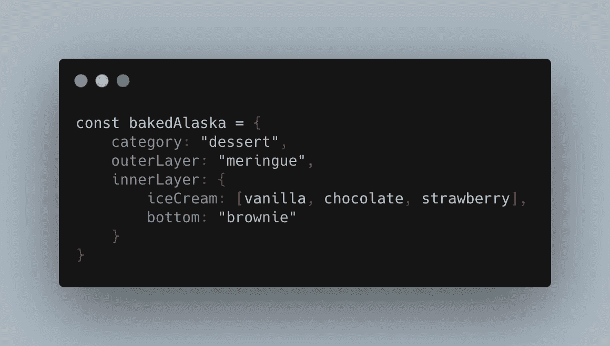
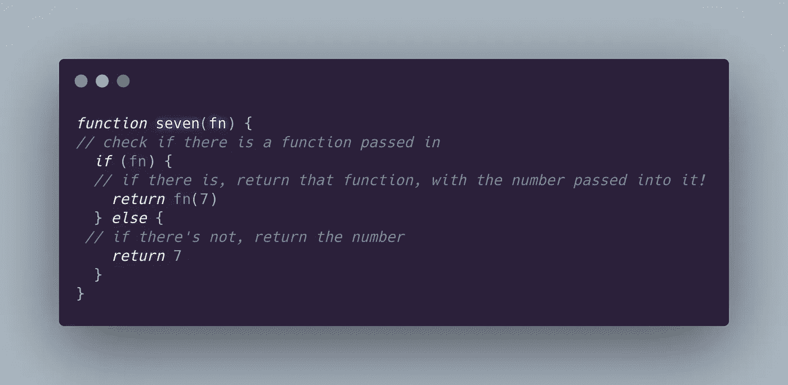
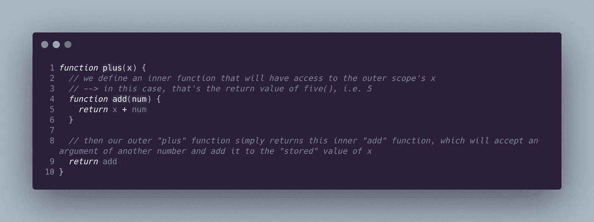

# Javascript 中的作用域和闭包

> 原文：<https://medium.com/geekculture/scope-and-closure-in-javascript-fb0ee359848f?source=collection_archive---------18----------------------->

## …以及如何解决 Codewars 上的“函数计算”

啊，范围和闭包:两个最受欢迎的技术面试问题，让所有年龄段的开发人员都犯了错！

## 我们来谈谈范围。这是什么？

范围是*访问*。这是最简单的思考方式。作为开发人员，它允许您将对某些变量的访问限制在特定的上下文中。它有两个好处:

*   安全性——不能从指定范围之外访问的变量不会在以后被意外更改
*   命名——允许你在不同的作用域中使用相同的变量名(如果你在同一个函数的不同的`for`循环中使用了`let i = 0`,你会知道这很有帮助🙋‍♀️)

作用域经常在函数的上下文中讨论，但是我发现首先在嵌套对象的上下文中考虑它是有帮助的(无论如何函数都是 JS 对象……)

以下是一个具有多个层的对象的示例:



Is anyone surprised I’m using a food example? Didn’t think so.

这里我们有被广泛低估的烤阿拉斯加，它有几层。如果我想知道蛋白酥皮下面是什么冰淇淋，我不能只写`bakedAlaska.iceCream`——我会得到`undefined`。我将不得不写`bakedAlaska.innerLayer.iceCream`来得到冰淇淋的数组。那是因为花括号有自己的作用域。所以`iceCream`数组没有定义在`bakedAlaska`的直接作用域内。在`innerLayer`范围内定义的。

# 范围的类型

**全局范围—** 这是在任何函数或花括号之外的*。如果一个变量是在全局范围内定义的，那么它可以在你的代码中的任何地方使用(包括函数、对象等等)。)由于上面中[所列的原因，不鼓励在全局范围内声明变量。](#1068)*

**局部范围—** 当变量只能在特定的上下文中访问时(比如函数，或者在花括号中)

*   **函数作用域—** 一种局部作用域。在函数内部声明的变量不能在函数外部访问。

```
function sayMyName(){
   let myName = "Julia"
   console.log(myName) // "Julia"
}console.log(myName) // undefined
```

*   **块作用域—** 一种局部作用域，是函数作用域的子集。花括号内声明的变量在花括号外是不可访问的(就像上面的函数一样。)

# 你答应过要谈论结束…

我照做了。下面是 [MDN 的定义](https://developer.mozilla.org/en-US/docs/Web/JavaScript/Closures)，然后我们来解包:

> 一个**闭包**是一个函数的组合，该函数被捆绑在一起(被封闭)并引用其周围的状态(即**词法环境**)。换句话说，闭包允许您从内部函数访问外部函数的范围。在 JavaScript 中，闭包是在每次创建函数时创建的。

"换句话说，闭包让你可以从内部函数访问外部函数的作用域."让我们用一个与上面类似的例子来看看这一点:


正如您所看到的，即使外部函数在第 14 行被调用，并且基本上已经“来了又走了”，内部的`greet`函数仍然可以访问变量`myName`，无论它何时被调用。让我们用一个不那么做作的例子来说明这一点。

# 利用闭包解决“函数计算”问题

我在成为程序员的一两个月前遇到了这个问题。当我试图想出一个解决方案时，我的大脑融化了，这个问题在我的脑海里滞留了几个月。最近，在重新审视了封闭这个主题后，我意识到这正是我所缺少的部分。

这些指令用于创建函数，当以下面的示例方式调用时，这些函数将返回正确的答案。

例如`seven(plus(five())); *// must return 12*
four(times(nine())); *// must return 36*`

**以下是一些附加规定**:

*   从 0(“零”)到 9(“九”)的每个数字都必须有一个函数
*   以下每个数学运算都必须有一个函数:加、减、乘、除(Ruby 和 Python 中的`divided_by`
*   每个计算恰好由一个运算和两个数字组成
*   最外面的函数代表左操作数，最里面的函数代表右操作数
*   除法应该是整数除法。比如这个应该返回`2`，而不是`2.666666...`:

我的第一个想法是，我必须从内向外工作，因为每个函数在完成执行之前都必须等待它接收到的函数进行解析。([如果没有意义，请查看我在 call stacks 上的帖子！](/swlh/javascript-call-stacks-an-introduction-f99da59e1e38))

考虑到这一点，我开始思考数字函数。我的想法是，数字函数可以在外部，像这样接受一个操作函数作为参数:`seven(some operator function here)`，或者它可以在内部，不接受任何东西，但返回一个数字:`seven(times(five()))`的`five()`。所以这正是我所做的:



每个数字函数必须能够接受一个函数作为参数，因为一个运算符函数可能会在内部被调用，就像下面的例子:`seven(*plus(five())*)` *。*如果你熟悉三元表达式，你也可以这样写函数:

```
function seven(fn) {return fn ? fn(7) : 7}
```

我对操作函数使用了类似的逻辑。他们需要能够接受一个数字函数作为参数`plus*(five())*`。我之前被难住的部分是那些操作函数如何访问外部号码和内部号码。

这就是闭包的魅力所在。



我将重复上面片段的注释中写的逻辑。

*   我们做的第一件事是接受一个论点(x)。在本例中，这是`five()`的返回值，即 5。
*   然后我们定义一个内部函数，它使用 x 的值，并接受一个数字参数。因为内部函数在定义的时候可以访问外部函数的作用域，所以即使在外部函数消失很久以后，它也可以使用 x 的值。离合器即将关闭。
*   然后外部函数返回一个对内部函数的引用。

现在我们已经有了`seven(plus(five()))`表达式的所有部分，让我们遍历每一步，用解析后的返回值替换每个函数。

1.  `seven(plus(five()))`挨骂。
2.  最里面的函数`five()`首先被求值。基于我们在之前从[开始的条件语句，我们看到这将只返回数字 5。](#8404)
3.  现在我们搬出去`plus(5)`。基于我们的[代码片段](#6a1c)，我们看到 x 被赋值为 5，我们的内部函数`add`将访问该值，并返回对`add`函数的引用。
4.  然后我们转移到`seven(add)`。基于与之前的[相同的函数，我们看到这次确实传入了一个函数。所以返回值是调用的函数`add` *，传入数字 7。*](#8404)
5.  最后，`add`使用外部作用域中记忆的值 5 和传入的值 7 执行，返回值为 12。🤯

我的一位导师提到，描绘结束的一个好方法是想象你的内部功能可以访问“背包里”的一些变量，我认为这是一个非常迷人和有益的思考方式。所以我们将以这个(希望令人难忘的)迷因结束。


我很乐意连接！在 [LinkedIn](https://www.linkedin.com/in/jzolotarev/) 、 [Twitter](https://twitter.com/JZolo) 和 [GitHub](https://github.com/jzolo22) 上找到我。

## 有用的资源:

[](/swlh/javascript-call-stacks-an-introduction-f99da59e1e38) [## JavaScript 调用堆栈—简介

### 如果你在软件世界，你应该听说过栈。有人要 Stackoverflow 吗？如果你一直想知道那是什么…

medium.com](/swlh/javascript-call-stacks-an-introduction-f99da59e1e38) [](https://www.w3schools.com/js/js_scope.asp) [## JavaScript 范围

### 组织良好，易于理解的网站建设教程，有很多如何使用 HTML，CSS，JavaScript 的例子…

www.w3schools.com](https://www.w3schools.com/js/js_scope.asp) [](https://developer.mozilla.org/en-US/docs/Web/JavaScript/Closures) [## 关闭

### 闭包是捆绑在一起(封闭的)的函数与对其周围状态的引用的组合

developer.mozilla.org](https://developer.mozilla.org/en-US/docs/Web/JavaScript/Closures)