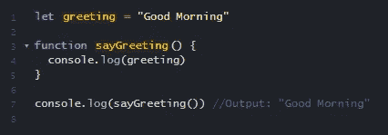
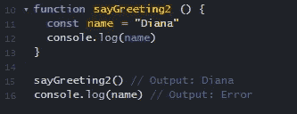
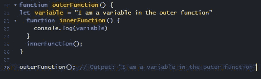

# 重新解释作用域和闭包:第 1 部分

> 原文：<https://medium.com/geekculture/scopes-closures-re-explained-part-1-aea4d5fe5e8?source=collection_archive---------22----------------------->

我学习 JavaScript 已经整整 4 个月了。如果你在 4 个月前要求我解释作用域和闭包，我会尴尬的跑开。这是一个我害怕的话题，而且我只是表面上理解它。即使从熨斗学校的软件工程项目毕业后，这个话题仍然在我的技术面试中困扰着我。我认为这是理所当然的，没有意识到这个概念是多么重要和根本。所以在这里，我要把事情弄清楚，重新介绍作用域和闭包。

# 再说范围！

范围只是指变量、函数和其他表达式的可见性和可访问性。范围内的任何内容都必须是可访问的，这意味着它可以被引用。任何不在范围内的都不能引用。

你可以从字面上理解它。当你在望远镜里看的时候，你的视力会因为镜头而受到限制。你看到的任何东西都在范围之内。你看不到的任何东西都在范围之外。

JavaScript 有两种作用域:**全局作用域**和**局部作用域。**

# 全球范围

任何 JavaScript 文件中只有一个全局范围。它存在于所有函数或花括号`{}`之外。任何写在全局范围内的变量都被认为是一个**全局变量。**这些变量可以在程序的任何地方访问和使用。

Example of a Global Variable

在上面的例子中，全局范围包含变量`greeting`。即使它是在函数外部声明的，它仍然能够访问变量并显示它。

(**注意:**记住创建全局变量时要小心，因为这会导致与局部变量的名称冲突！)

# 本地范围

局部作用域是由函数和代码块创建的。与全局变量不同，局部范围内的变量只能在程序的某些部分使用。这些变量被称为**局部变量**。

局部作用域有两种类型:**功能作用域**和**块作用域。**

## **功能范围**

您可以在函数内部创建变量。这些局部变量只能在函数内部访问，而不能在函数外部访问。

Example of a Local Variable

## **封锁范围**

块范围指的是在代码块中定义的变量`{}`。这些变量在块外不可用。

# 快速切线:Var vs Let

## 定义变量

在 ES6 之前，我们使用`var`来声明非常数值。`var`可以在全局或函数级范围内声明。这些变量可以重新声明，其值可以在相同的范围内更改。如果不小心的话，这可能会在代码中产生很多问题。

## 让

`let`是作为 ES6 的一部分推出的。我们可以使用`let`在全局或块级范围内声明变量。`let`可以更新，但不能重新申报。因此，使用`let`的变量不能在一个作用域内声明多次，这意味着它不会引起冲突。

# 范围嵌套

JavaScript 允许您将函数嵌套在其他函数中。正如你在上面看到的，内部函数能够访问外部函数中的变量并`console.log()`它。所以重要的是要记住，在外部作用域中定义的变量可以在内部作用域中使用。

在下一部分中，我将介绍闭包。这些概念将继续存在，我们可以更深入地探索闭包！

## 资源

*   [MDN —范围](https://developer.mozilla.org/en-US/docs/Glossary/Scope)
*   [作用域和闭包(JavaScript)](https://learning-notes.mistermicheels.com/javascript/scope-closures/)