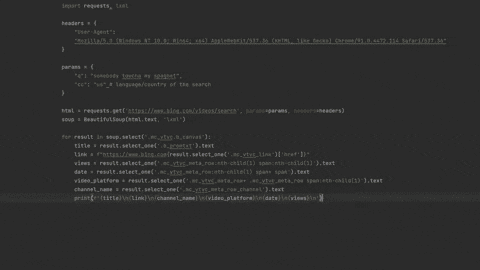
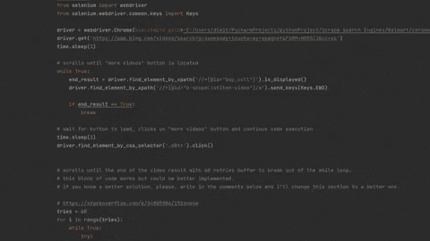

# 用 Python 抓取 Bing 视频

> 原文：<https://medium.com/geekculture/scrape-bing-videos-with-python-81844acfaedf?source=collection_archive---------20----------------------->


内容:[简介](#187b)，[导入](#9bc2)，[什么会被刮去](#54cb)，[流程](#9c5f)，[代码](#5fc3)，[提取所有视频](#13e3)，[链接](#1ddc)， [outro](#5a41) 。

# 介绍

这篇博文是由 [Rosalex A](https://dev.to/silanoa/comment/1gael) 请求的，是 Bing 网页抓取系列的后续。在这里，您将看到如何使用 Python 通过`beautifulsoup`、`requests`、`lxml`和`selenium`库抓取视频结果。

您将看到两种方法:

*   用`beautifulsoup`收集多达 10 个视频结果。
*   使用`selenium`滚动到搜索结果的末尾，抓取所有视频结果。

*注意:这篇博文假设你熟悉* `*beautifulsoup*` *、* `*requests*` *和* `*selenium*` *库，并且对* `*CSS*` *选择器有基本的经验。*

# 进口

```
from bs4 import BeautifulSoup
import requests, lxml
from selenium import webdriver
```

# 会刮什么


# 过程

为容器、标题、视频 URL、观看次数、频道名称、平台、发布日期选择`CSS`选择器。 [*CSS 选择器参考*](https://www.w3schools.com/cssref/css_selectors.asp) *。*


# 密码



# 提取所有视频

要提取所有视频，我们需要向下滚动页面，然后在按钮出现时单击它，并再次向下滚动到视频结果的末尾。

要使用`Selenium`向下滚动，您可以使用`.send_keys()`方法。

```
driver.find_element_by_xpath('xpath').send_keys(Keys.KEYBOARD_KEY) 
# in our case .send_keys(Keys.END) to scroll to the bottom of the page
```

你也可以像我在 [YouTube 搜索](https://dev.to/dimitryzub/scrape-youtube-search-with-python-part-1-j12) web 抓取系列中所做的那样，通过调用 DOM 来执行脚本，但是在这种情况下它对我不起作用，或者说我做错了什么。

```
driver . execute_script ( "var scrollingElement = (document.scrollingElement || document.body);scrollingElement.scrollTop = scrollingElement.scrollHeight;" ) # https://stackoverflow.com/a/57076690/15164646 (contains several references)
```

然后，嗒嗒。要点击你只有一个选择:`.click()`方法。

```
driver.find_element_by_css_selector('.selector').click()
```

**提取所有视频结果的完整代码**



*GIF 被加速了 1550%*

# 链接

[前 10 个结果的 GitHub 要点](https://gist.github.com/dimitryzub/de0088ca1354d9f5f43a366198fd9a26)**[所有视频结果的 GitHub 要点](https://gist.github.com/dimitryzub/b83db5c1a7f4ff94ac4b9ee9931bd790)**

# **结尾部分**

**虽然不是最快的解决方案，但它提供了滚动直到不再显示结果的能力。其他步骤可能是向该代码添加`async`功能。**

**如果你发现有些东西不能正常工作，或者如果你想看看如何用 Python/Ruby 来解决一些我还没有写到的问题，请给我写封邮件。**

****

***原载于 2021 年 4 月 25 日*[*https://dev . to*](https://dev.to/dimitryzub/scrape-bing-videos-with-python-5hjd)*。***