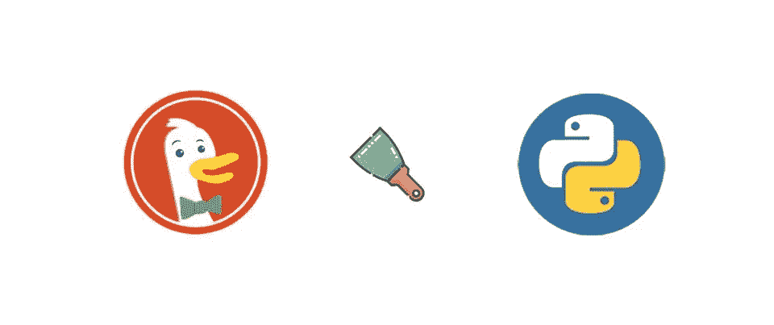
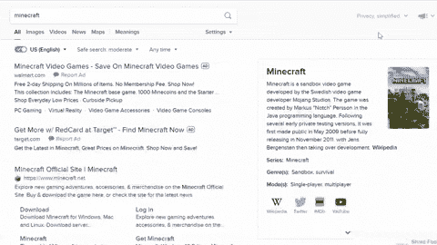

# 用 Python 刮 DuckDuckGo 广告结果

> 原文：<https://medium.com/geekculture/scrape-duckduckgo-ad-results-with-python-f2aad94aa50d?source=collection_archive---------7----------------------->



内容:[简介](#4e31)，[进口](#75cc)，[什么会刮](#7b3f)，[流程](#43cd)，[代码](#33a7)，链接。

# 介绍

这篇博文是 DuckDuckGo 网页抓取系列的延续。在这里，您将看到如何使用 Python 和`selenium`库来抓取广告结果。将显示替代的 API 解决方案。

# 进口

```
from selenium import webdriver
```

# 会刮什么


# 过程

选择**标题、链接、片段、源、站点链接**。



我所做的基本上是在标题、链接、片段、源和站点链接的附加选择器之前应用`.results--ads`选择器，以获得最准确的选择器。

CSS 选择器[参考](https://www.w3schools.com/cssref/css_selectors.asp)。

# 密码

# 使用 [DuckDuckGo 广告结果 API](https://serpapi.com/duckduckgo-ads)

SerpApi 是一个付费的 Api，有一个免费的计划。

不同之处在于速度更快，你不需要用`selenium`渲染页面，你会得到一个直接结构化的`JSON`字符串。

# 链接

[GitHub Gist](https://gist.github.com/dimitryzub/ae459c73001e62b6e8248844e2679939)**[duck duck go 广告结果 API](https://serpapi.com/duckduckgo-ads)**

**你的，**

**- D**

***原载于 2021 年 8 月 11 日 https://serpapi.com**[*。*](https://serpapi.com/blog/scrape-duckduckgo-ad-results-with-python/)***