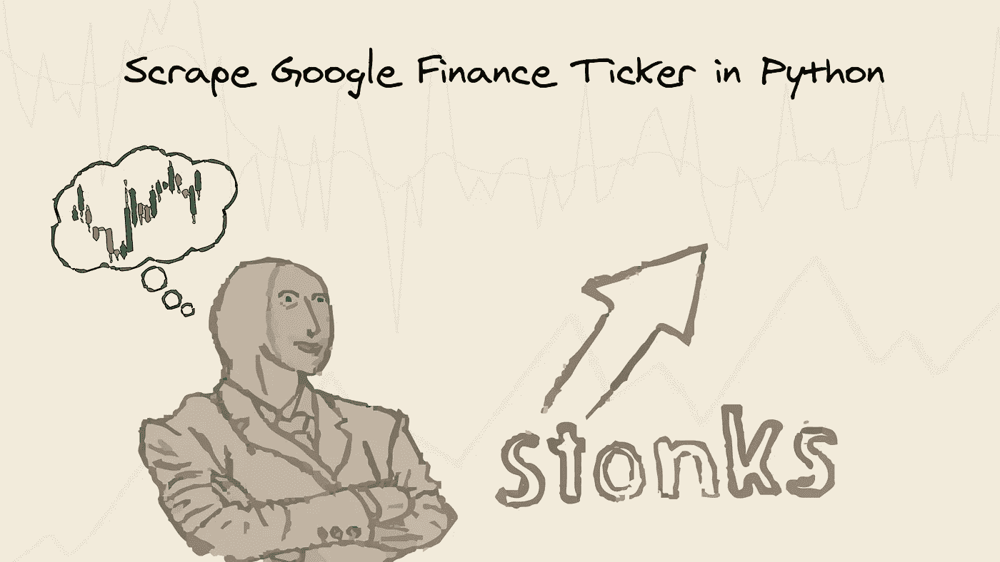
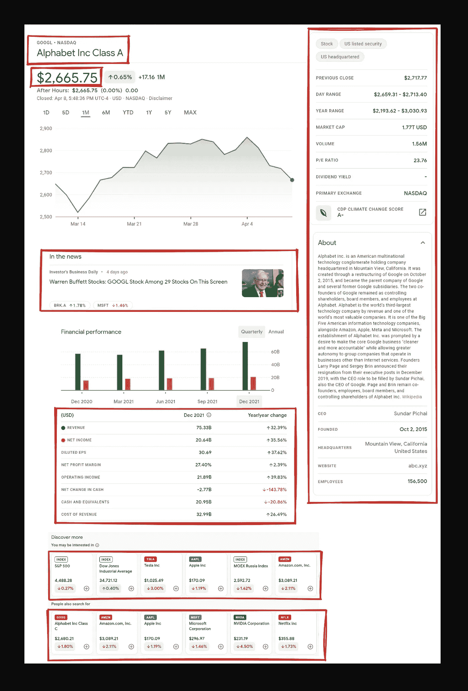
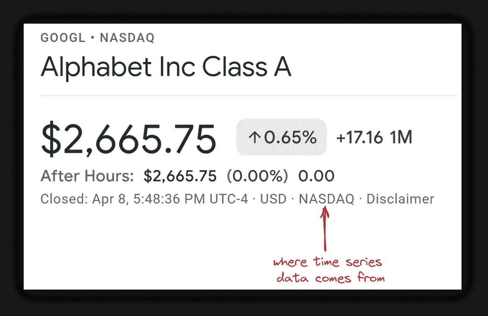
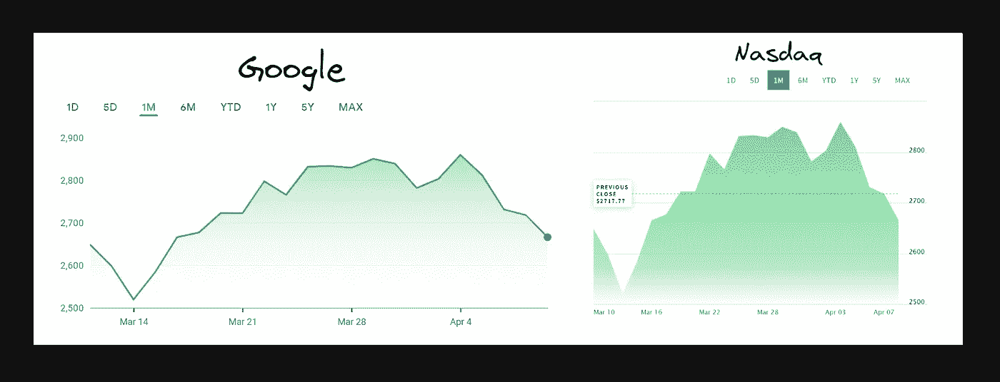
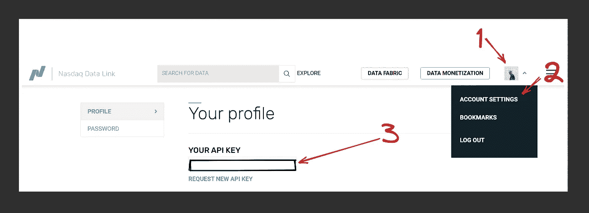

# 用 Python 抓取 Google 金融股票报价数据

> 原文：<https://medium.com/geekculture/scrape-google-finance-ticker-quote-data-in-python-decddf20130d?source=collection_archive---------9----------------------->



*   [会刮什么](#edc4)
*   [先决条件](#bf60)
*   [抓取谷歌财经股票报价数据](#775f)
*   [提取跑马灯数据的说明](#d39b)
*   [收集多个谷歌金融报价](#85f0)
*   [提取谷歌财经图表时序数据](#fa37)
*   [抓取谷歌财经时序数据](#d172)
*   [时序提取代码说明](#30f9)
*   [纳斯达克利率限制](#4891)
*   [其他纳斯达克 API 资源](#c1bc)
*   [链接](#94ce)
*   [Outro](#30d0)

# 会刮什么



# 先决条件

**CSS 选择器基础知识抓取**

CSS 选择器声明样式应用于标记的哪一部分，从而允许从匹配的标签和属性中提取数据。

如果你还没有使用 CSS 选择器，我有一篇专门的博客文章
关于[如何在抓取网页时使用 CSS 选择器](https://serpapi.com/blog/web-scraping-with-css-selectors-using-python/)，它涵盖了什么是 CSS 选择器，利弊，以及为什么从抓取网页的角度来看它们很重要。

**独立的虚拟环境**

简而言之，它创建了一组独立的已安装库，包括不同的 Python 版本，这些版本可以在同一系统中共存，从而防止库或 Python 版本冲突。

如果你以前没有使用过虚拟环境，看看我的博客文章
中专门的 [Python 虚拟环境教程使用 Virtualenv 和 poems](https://serpapi.com/blog/python-virtual-environments-using-virtualenv-and-poetry/)来熟悉一下。

📌注意:这不是这篇博文的严格要求。

**安装库**:

```
pip install requests parsel
```

**降低被屏蔽的几率**

请求有可能被阻止。看看[中的
如何降低抓取网页时被屏蔽的几率](https://serpapi.com/blog/how-to-reduce-chance-of-being-blocked-while-web/)，有 11 种方法可以绕过大多数网站的屏蔽。

# 抓取谷歌金融股票报价数据

# 关于提取跑马灯数据的说明

导入库:

```
import requests, json, re
from parsel import Selector
from itertools import zip_longest
```

*   请求向网站发出请求。
*   将提取的数据转换成 json 对象。
*   re 通过正则表达式提取部分数据。
*   解析 HTML/XML 文档中的数据。类似于 BeautifulSoup。
*   zip_longest 并行迭代多个 iterables。更多信息请见下文。

定义一个函数:

```
def scrape_google_finance(ticker: str): # ticker should be a string
    # further code...scrape_google_finance(ticker="GOOGL:NASDAQ")
```

创建请求头和 URL 参数:

```
# https://docs.python-requests.org/en/master/user/quickstart/#passing-parameters-in-urls
params = {
    "hl": "en" # language
}# https://docs.python-requests.org/en/master/user/quickstart/#custom-headers
# https://www.whatismybrowser.com/detect/what-is-my-user-agent
headers = {
    "User-Agent": "Mozilla/5.0 (Windows NT 10.0; Win64; x64) AppleWebKit/537.36 (KHTML, like Gecko) Chrome/100.0.4896.60 Safari/537.36",
}
```

*   [params](https://docs.python-requests.org/en/master/user/quickstart/#passing-parameters-in-urls) 向请求传递 URL 参数的一种更漂亮的方式。
*   [用户代理](https://developer.mozilla.org/en-US/docs/Glossary/User_agent)将来自浏览器的“真实”用户请求传递给[请求头](https://docs.python-requests.org/en/master/user/quickstart/#custom-headers)。[检查你的用户代理](https://www.whatismybrowser.com/detect/what-is-my-user-agent)。

传递请求参数和请求头，发出请求并将响应传递给`parsel`:

```
html = requests.get(f"https://www.google.com/finance/quote/{ticker}", params=params, headers=headers, timeout=30)
selector = Selector(text=html.text)
```

*   f " https://www . Google . com/finance/quote/{ticker} "是一个 [f 字符串](https://docs.python.org/3/tutorial/inputoutput.html#fancier-output-formatting)，其中{ ticker }将被替换为实际的股票代码字符串，例如" GOOGL:NASDAQ "。
*   [time out = 30](https://docs.python-requests.org/en/master/user/quickstart/#timeouts)30 秒后停止等待响应。
*   选择器(text = html . text ), parsel 将在其中处理响应中传递的 HTML。

创建一个空的字典结构，其中将填入所有数据:

```
# where all extracted data will be temporarily located
ticker_data = {
    "ticker_data": {},
    "about_panel": {},
    "news": {"items": []},
    "finance_perfomance": {"table": []}, 
    "people_also_search_for": {"items": []},
    "interested_in": {"items": []}
}
```

提取当前价格、报价和标题数据:

```
# current price, quote, title extraction
ticker_data["ticker_data"]["current_price"] = selector.css(".AHmHk .fxKbKc::text").get()
ticker_data["ticker_data"]["quote"] = selector.css(".PdOqHc::text").get().replace(" • ",":")
ticker_data["ticker_data"]["title"] = selector.css(".zzDege::text").get()
```

*   ticker _ data["ticker_data"]["current_price"]访问[" ticker _ data "]键，创建一个新键[" current _ price "]，并将其分配给 parsel 将提取的任何值。新的["quote"]和["title"]关键字也是如此。
*   * text 是一个 [parsel 自己的伪元素支持](https://github.com/scrapy/parsel/blob/90397dcd0b2c1cbb91e44f65c50f9e11628ba028/parsel/csstranslator.py#L48-L51) [，它将把每个 CSS 查询翻译成 XPath](https://github.com/scrapy/parsel/blob/90397dcd0b2c1cbb91e44f65c50f9e11628ba028/parsel/selector.py#L351-L363) 。在这种情况下::text 将变成/text()。
*   get() [获取实际数据](https://github.com/scrapy/parsel/blob/90397dcd0b2c1cbb91e44f65c50f9e11628ba028/parsel/selector.py#L197-L204)。
*   替换("，":)[推陈出新](https://docs.python.org/3/library/stdtypes.html#str.replace)。

提取右面板数据:

```
about_panel_keys = selector.css(".gyFHrc .mfs7Fc::text").getall()
about_panel_values = selector.css(".gyFHrc .P6K39c").xpath("normalize-space()").getall()for key, value in zip_longest(about_panel_keys, about_panel_values):
    key_value = key.lower().replace(" ", "_")
    ticker_data["about_panel"][key_value] = value
```

*   getall() [获取所有比赛列表](https://github.com/scrapy/parsel/blob/90397dcd0b2c1cbb91e44f65c50f9e11628ba028/parsel/selector.py#L180-L185)。
*   xpath("normalize-space()") [也获取空白文本节点](https://github.com/scrapy/parsel/issues/62#issuecomment-1042309376)。默认情况下，空白文本节点将被跳过，导致不完整的输出。
*   lower() [将所有字符串字符小写](https://docs.python.org/3/library/stdtypes.html#str.lower)。
*   zip_longest() [来组合多个迭代器](https://docs.python.org/3/library/itertools.html#itertools.zip_longest)。 [zip()](https://docs.python.org/3/library/functions.html#zip) 和 zip_longest()的区别在于，zip()在最短的迭代器处结束，而 [zip_longest()迭代到最长迭代器的长度](https://stackoverflow.com/questions/59119751/zip-and-zip-longest)。
*   [key _ value]将使用它自己的提取值动态地将一个键添加到字典中。

从右侧面板提取描述和扩展数据:

```
# description "about" and  extensions extraction
ticker_data["about_panel"]["description"] = selector.css(".bLLb2d::text").get()
ticker_data["about_panel"]["extensions"] = selector.css(".w2tnNd::text").getall()
```

提取新闻结果:

```
# news extarction
if selector.css(".yY3Lee").get():
    for index, news in enumerate(selector.css(".yY3Lee"), start=1):
        ticker_data["news"]["items"].append({
            "position": index,
            "title": news.css(".Yfwt5::text").get(),
            "link": news.css(".z4rs2b a::attr(href)").get(),
            "source": news.css(".sfyJob::text").get(),
            "published": news.css(".Adak::text").get(),
            "thumbnail": news.css("img.Z4idke::attr(src)").get()
        })
else: 
    ticker_data["news"]["error"] = f"No news result from a {ticker}."
```

*   if selector.css(".yY3Lee ")。get()检查新闻结果是否存在。无需检查<element>是否不是无。</element>
*   [enumerate()](https://docs.python.org/3/library/functions.html#enumerate) [给 iterable 添加一个计数器并返回](https://www.programiz.com/python-programming/methods/built-in/enumerate)。
*   start=1 将从 1 开始计数，而不是从默认值 0 开始计数。
*   ticker_data[“新闻”]。将({})添加到[将](https://docs.python.org/3/tutorial/datastructures.html)提取的数据作为字典添加到列表中。
*   * attr(src)也是 parsel 伪元素支持，用于从节点获取 src 属性。相当于 XPath /@src。
*   ticker_data["news"]["error"]创建一个新的" error "键，并在错误发生时显示一条消息。

提取财务绩效表数据:

```
# finance perfomance table
# checks if finance table exists
if selector.css(".slpEwd .roXhBd").get():
    fin_perf_col_2 = selector.css(".PFjsMe+ .yNnsfe::text").get()           # e.g. Dec 2021
    fin_perf_col_3 = selector.css(".PFjsMe~ .yNnsfe+ .yNnsfe::text").get()  # e.g. Year/year change

    for fin_perf in selector.css(".slpEwd .roXhBd"):
        if fin_perf.css(".J9Jhg::text , .jU4VAc::text").get():

            """
            if fin_perf.css().get() statement is needed, otherwise first dict key and sub dict values would be None:

            "finance_perfomance": {
            "table": [
                {
                "null": {
                    "Dec 2021": null,
                    "Year/year change": null
                }
            }
            """             

            perf_key = fin_perf.css(".J9Jhg::text , .jU4VAc::text").get()   # e.g. Revenue, Net Income, Operating Income..
            perf_value_col_1 = fin_perf.css(".QXDnM::text").get()           # 60.3B, 26.40%..   
            perf_value_col_2 = fin_perf.css(".gEUVJe .JwB6zf::text").get()  # 2.39%, -21.22%..

            ticker_data["finance_perfomance"]["table"].append({
                perf_key: {
                    fin_perf_col_2: perf_value_col_1, # dynamically add key and value from the second (2) column
                    fin_perf_col_3: perf_value_col_2  # dynamically add key and value from the third (3) column
                }
            })
else:
    ticker_data["finance_perfomance"]["error"] = f"No 'finence perfomance table' for {ticker}."
```

提取你可能得到的`"interested in"` / `"people also search for"`结果:

```
# "you may be interested in" results
    if selector.css(".HDXgAf .tOzDHb").get():
        for index, other_interests in enumerate(selector.css(".HDXgAf .tOzDHb"), start=1):
            ticker_data["interested_in"]["items"].append(discover_more_tickers(index, other_interests))
    else:
        ticker_data["interested_in"]["error"] = f"No 'you may be interested in` results for {ticker}"

    # "people also search for" results
    if selector.css(".HDXgAf+ div .tOzDHb").get():
        for index, other_tickers in enumerate(selector.css(".HDXgAf+ div .tOzDHb"), start=1):
            ticker_data["people_also_search_for"]["items"].append(discover_more_tickers(index, other_tickers))
    else:
        ticker_data["people_also_search_for"]["error"] = f"No 'people_also_search_for` in results for {ticker}"# ....def discover_more_tickers(index: int, other_data: str):
    """
    if price_change_formatted will start complaining,
    check beforehand for None values with try/except or if statement and set it to 0.

    however, re.search(r"\d{1}%|\d{1,10}\.\d{1,2}%" should get the job done.
    """
    return {
            "position": index,
            "ticker": other_data.css(".COaKTb::text").get(),
            "ticker_link": f'https://www.google.com/finance{other_data.attrib["href"].replace("./", "/")}',
            "title": other_data.css(".RwFyvf::text").get(),
            "price": other_data.css(".YMlKec::text").get(),
            "price_change": other_data.css("[jsname=Fe7oBc]::attr(aria-label)").get(),
            # https://regex101.com/r/BOFBlt/1
            # Up by 100.99% -> 100.99%
            "price_change_formatted": re.search(r"\d{1}%|\d{1,10}\.\d{1,2}%", other_data.css("[jsname=Fe7oBc]::attr(aria-label)").get()).group()
        }
```

*   discover_more_tickers()创建的函数用于将两个相同的代码合并成一个函数。这样，只需要在一个地方修改代码。
*   [attrib["属性名"]](https://github.com/scrapy/parsel/blob/90397dcd0b2c1cbb91e44f65c50f9e11628ba028/parsel/selector.py#L209-L215) 获取节点属性。
*   [jsname=Fe7oBc]是一个 [CSS 选择器，用于选择具有指定属性和值](https://www.w3schools.com/cssref/sel_attribute_value.asp)的元素，例如[attribute=value]。
*   re.search()匹配部分字符串，只获取数字和%值。和 group()通过正则表达式返回匹配的字符串。

返回并打印数据:

```
# def scrape_google_finance(ticker: str):
    # ticker_data = {
    #     "ticker_data": {},
    #     "about_panel": {},
    #     "news": {"items": []},
    #     "finance_perfomance": {"table": []}, 
    #     "people_also_search_for": {"items": []},
    #     "interested_in": {"items": []}
    # } # extraction code... return ticker_dataprint(json.dumps(data_1, indent=2, ensure_ascii=False))
```

全输出:

# 刮多个谷歌金融报价

```
for ticker in ["DAX:INDEXDB", "GOOGL:NASDAQ", "MSFT:NASDAQ"]:
    data = scrape_google_finance(ticker=ticker)
    print(json.dumps(data["ticker_data"], indent=2, ensure_ascii=False))
```

产出:

```
{
  "current_price": "14,178.23",
  "quote": "DAX:Index",
  "title": "DAX PERFORMANCE-INDEX"
}
{
  "current_price": "$2,665.75",
  "quote": "GOOGL:NASDAQ",
  "title": "Alphabet Inc Class A"
}
{
  "current_price": "$296.97",
  "quote": "MSFT:NASDAQ",
  "title": "Microsoft Corporation"
}
```

# 提取谷歌财务图表时间序列数据

抓取时间序列数据并不是一个特别好的主意，所以最好使用专用的 API 来完成这项工作。

如何找到 Google 用哪个 API 来构建时间序列图表？



我们可以通过简单地用引号 `[GOOGL](https://www.nasdaq.com/market-activity/stocks/googl)`检查 [Nasdaq 图表来确认 Google 正在使用 NASDAQ API 获取时间序列数据:](https://www.nasdaq.com/market-activity/stocks/googl)



在这种情况下，我使用了支持 [Python](https://docs.data.nasdaq.com/docs/python-installation) 、 [R](https://docs.data.nasdaq.com/docs/r-installation) 和 [Excel](https://docs.data.nasdaq.com/docs/excel-installation) 的[纳斯达克数据链接 API](https://docs.data.nasdaq.com/) 。我相信其他平台也提供 Python 集成。

我假设你已经安装了一个`nasdaq-data-link`包，但是如果没有的话，你可以这样做。如果您设置了 Python 的默认版本:

```
# WSL
$ pip install nasdaq-data-link
```

如果您没有设置 Python 的默认版本:

```
# WSL
$ python3.9 -m pip install nasdaq-data-link # change python to your version: python3.X
```

在`[data.nasdaq.com/account/profile](https://data.nasdaq.com/account/profile)`获取您的 API 密钥:



创建一个`.env`文件来存储您的 API 密钥:

```
touch .nasdaq_api_key # change the file name to yours # paste API key inside the created file
```

# 抓取谷歌金融时间序列数据

# 时序提取代码解释

*   nasdakdatalink . read _ key(filename =。nasdaq_api_key") [来读取你的 api 密钥](https://github.com/Nasdaq/data-link-python#alternative-api-key-file-location)。
*   ".纳斯达克 _api_key”是你的[。带有秘密 API 密钥的环境变量](https://en.wikipedia.org/wiki/Environment_variable#Design)。所有的秘密变量(如果我错了，请纠正我)都以一个.符号开始展示。
*   nasdaqdatalink。ApiConfig.api_key 来测试您的 api 是否被 nasdaq-data-link 包识别。示例输出:2adA_avd12CXauv_1zxs
*   nasdaqdatalink.get()获取[时序数据，即数据集结构](https://github.com/Nasdaq/data-link-python#retrieving-data)。

输出一个`[pandas](https://pandas.pydata.org/docs/index.html)` `[DataFrame](https://pandas.pydata.org/docs/reference/api/pandas.DataFrame.html)` [对象](https://pandas.pydata.org/docs/reference/api/pandas.DataFrame.html):

```
Open     High      Low    Close      Volume  Ex-Dividend  Split Ratio    Adj. Open    Adj. High     Adj. Low   Adj. Close  Adj. Volume
Date                                                                                                                                                  
2004-08-31   102.320   103.71   102.16   102.37   4917800.0          0.0          1.0    51.318415    52.015567    51.238167    51.343492    4917800.0
2004-09-30   129.899   132.30   129.00   129.60  13758000.0          0.0          1.0    65.150614    66.354831    64.699722    65.000651   13758000.0
2004-10-31   198.870   199.95   190.60   190.64  42282600.0          0.0          1.0    99.742897   100.284569    95.595093    95.615155   42282600.0
2004-11-30   180.700   183.00   180.25   181.98  15384600.0          0.0          1.0    90.629765    91.783326    90.404069    91.271747   15384600.0
2004-12-31   199.230   199.88   192.56   192.79  15321600.0          0.0          1.0    99.923454   100.249460    96.578127    96.693484   15321600.0
...              ...      ...      ...      ...         ...          ...          ...          ...          ...          ...          ...          ...
2017-11-30  1039.940  1044.14  1030.07  1036.17   2190379.0          0.0          1.0  1039.940000  1044.140000  1030.070000  1036.170000    2190379.0
2017-12-31  1055.490  1058.05  1052.70  1053.40   1156357.0          0.0          1.0  1055.490000  1058.050000  1052.700000  1053.400000    1156357.0
2018-01-31  1183.810  1186.32  1172.10  1182.22   1643877.0          0.0          1.0  1183.810000  1186.320000  1172.100000  1182.220000    1643877.0
2018-02-28  1122.000  1127.65  1103.00  1103.92   2431023.0          0.0          1.0  1122.000000  1127.650000  1103.000000  1103.920000    2431023.0
2018-03-31  1063.900  1064.54   997.62  1006.94   2940957.0          0.0          1.0  1063.900000  1064.540000   997.620000  1006.940000    2940957.0[164 rows x 12 columns]
```

如你所见，没有关于 2019-2022 年的数据。是因为我用的是[免费版，适合实验探索，纳斯达克说](https://docs.data.nasdaq.com/docs/getting-started#free-and-premium-data)。

# 纳斯达克利率限制

经过身份验证的用户每 10 秒钟最多可以打 300 个电话，每 10 分钟最多可以打 2000 个电话，每天最多可以打 50000 个电话。高级数据用户每 10 分钟最多可拨打 5000 次电话，每天最多可拨打 720000 次电话。

# 其他纳斯达克 API 资源

*   [时序参数](https://docs.data.nasdaq.com/docs/parameters-2)通过向请求添加额外的参数来定制(操作)您的时序数据集。[时间序列数据的转换](https://docs.data.nasdaq.com/docs/parameters-2#transformations)。
*   [使用 curl 编写请求](https://docs.data.nasdaq.com/docs/quick-start-examples-1)使用 curl 轻松发出请求。
*   [可用的保存格式](https://blog.data.nasdaq.com/getting-started-with-the-nasdaq-data-link-api)以 CSV、XML、JSON 格式保存数据。
*   [数据格式](https://github.com/Nasdaq/data-link-python/blob/main/FOR_DEVELOPERS.md#data-formats)将数据转换成可用的格式。
*   [批量下载](https://github.com/Nasdaq/data-link-python/blob/main/FOR_ANALYSTS.md#download-entire-database-bulk-download)一次调用即可下载数据库中的所有数据。
*   [可用方法的详细指南](https://github.com/Nasdaq/data-link-python/blob/main/FOR_DEVELOPERS.md#detailed-method-guide---nasdaq-data-linkpython)更详细地了解如何使用 data-link-python 包。
*   [GitHub 上的 data-link-python](https://github.com/Nasdaq/data-link-python)阅读完整文档。
*   GitHub 上的 quandl-python 看看 data-link-python 在幕后使用的是什么。你可以在这里找到更多的文档。

# 链接

*   [在线 IDE 中的代码](https://replit.com/@DimitryZub1/Scrape-Google-Finance-Ticker-Quote-in-Python#main.py)
*   [GitHub 库](https://github.com/dimitryzub/google-finance-py/tree/main)

# 结尾部分

如果你有任何要分享的东西，任何问题，建议，或一些不能正常工作的事情，请通过 Twitter 联系我们，地址是 [@dimitryzub](https://twitter.com/DimitryZub) 或 [@serp_api](https://twitter.com/serp_api) 。

你的，
德米特里，还有塞尔帕皮团队的其他人。

在推特[上加入 SerpApi](https://twitter.com/serp_api)|[YouTube](https://www.youtube.com/channel/UCUgIHlYBOD3yA3yDIRhg_mg)

添加一个[特征请求](https://github.com/serpapi/SerpApi/issues/)💫还是一个 [Bug](https://github.com/serpapi/SerpApi/issues/) 🐞