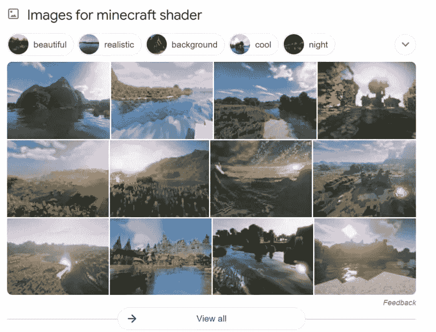
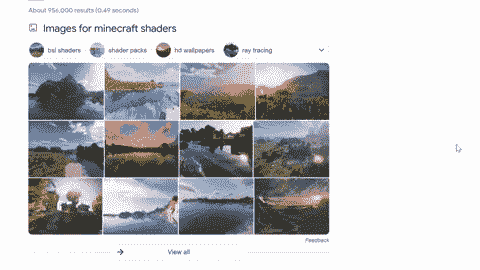
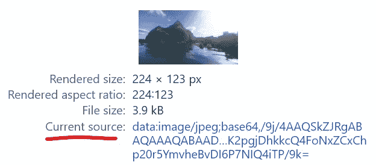
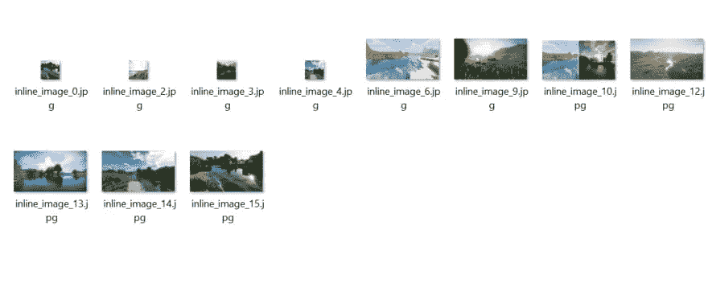
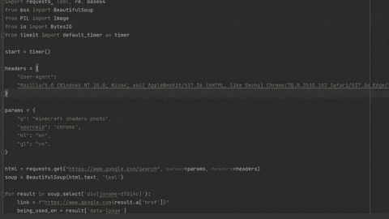

# 用 Python 抓取谷歌内嵌图片

> 原文：<https://medium.com/geekculture/scrape-google-inline-images-with-python-85837af2fe17?source=collection_archive---------6----------------------->


内容:[简介](#9ad2)、[进口](#7618)、[什么会报废](#a829)、[流程](#df82)、[编码](#5bef)、[环节](#8835)、[输出](#a3c0)。

# 介绍

这篇博文是谷歌网络抓取系列的延续。在这里，您将看到如何使用 Python 通过`beautifulsoup`、`requests`、`lxml`、`re`、`base64`、`BytesIO`、`PIL`库来抓取内联图像。将显示替代的 API 解决方案。

*注意:这篇博文假设你熟悉* `*beautifulsoup*` *、* `*requests*` *库，并对正则表达式有基本的了解。*

# 进口

```
import requests, lxml, re, base64
from bs4 import BeautifulSoup 
from io import BytesIO # for decoding base64 image
from PIL import Image # for saving decoded image
from serpapi import GoogleSearch # alternative API solution
```

# 会刮什么



# 过程

选择容器、链接和照片的使用位置。



**提取缩略图**
提取缩略图，我们需要看``标签带`id` `dimg_XX` ( *XX -某号*)。

如果你打开源代码(Ctrl + U)并试图找到`dimg_36` ( *或其他数字，取决于 HTML 代码*)你会看到有 **2** 出现，其中一个会在`<script>`标签的某个地方，这就是我们需要的。

为了提取缩略图，我们需要使用`regex`从`<script>`标签中获取它们，因为如果您解析来自`src`属性的数据，您将得到这样的输出:`data:image/gif;base64,R0lGODlhAQABAIAAAP///////yH5BAEKAAEALAAAAAABAAEAAAICTAEAOw==`这是一个编码的图片。



*关于这个话题的更多信息可以在* [*开发者 Mozilla*](https://developer.mozilla.org/en-US/docs/Web/HTTP/Basics_of_HTTP/Data_URIs) 上找到

正则表达式非常简单:

```
s='data:image/jpeg;base64,(.*?)';
```

正则表达式解释:

1.  寻找`s='data:image/jpeg;base64,`
2.  创建一个抓取组`(.*?)`，它将抓取所有东西，并以`';`符号结束。
3.  将只提取捕获组，而不提取其他部分。

*截图说明正则表达式捕捉到了什么，你可以在这里找到*[](https://regex101.com/r/L3IZXe/4/)*:*

*之后，可以使用`PIL`模块保存解码后的 base64 字符串。更多信息请见 [StackOverFlow 回答](https://stackoverflow.com/a/6966225/15164646)。*

# *密码*

*后台保存的图像:*

**

*GIF 来说明输出:*

**

# *使用[谷歌内嵌图像 API](https://serpapi.com/google-inline-images)*

*SerpApi 是一个付费 Api，可以免费试用 5000 次搜索。*

*最大的区别在于，您不必为了获得合适的图像大小而去计算从哪里解析某些元素，因为这已经为最终用户完成了。除此之外，如果您的脚本请求被阻塞，就不需要维护解析器或寻找方法。*

# *链接*

*[在线 IDE 中的代码](https://replit.com/@DimitryZub1/Scrape-Google-Inline-Images-python#bs4_result.py)**[Google Inline Images API](https://serpapi.com/google-inline-images)***

# ***结尾部分***

***如果你发现有些东西不能正常工作，或者如果你想看看如何用 Python/Ruby 来解决一些我还没有写到的问题，请给我写封邮件。***

***你的，
— D***

****原载于 2021 年 8 月 9 日 https://serpapi.com**的* [*。*](https://serpapi.com/blog/scrape-google-inline-images-with-python/)***