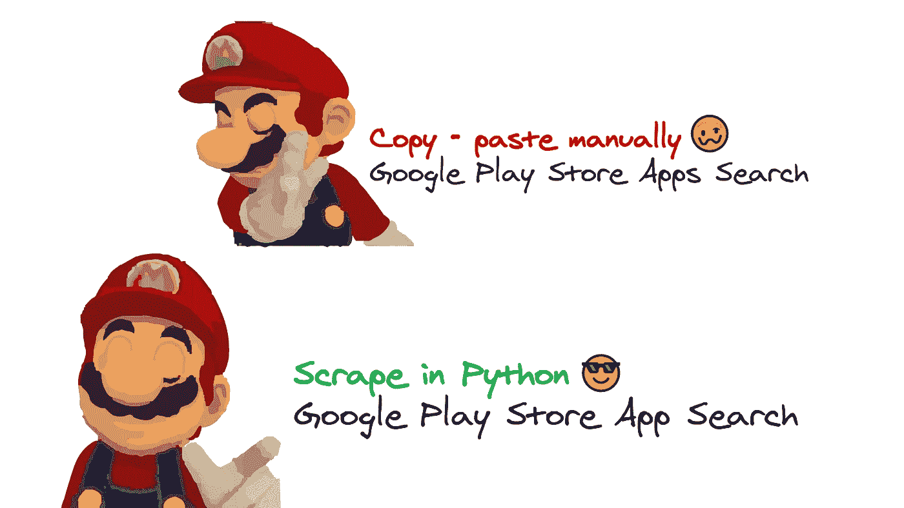
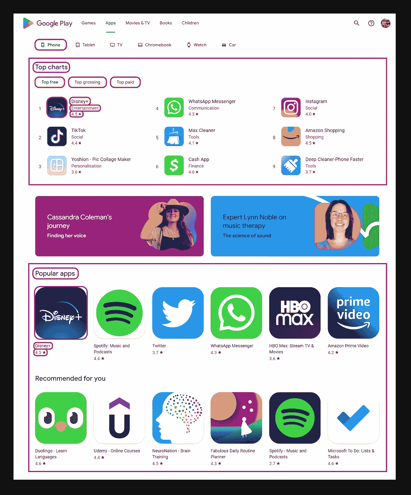
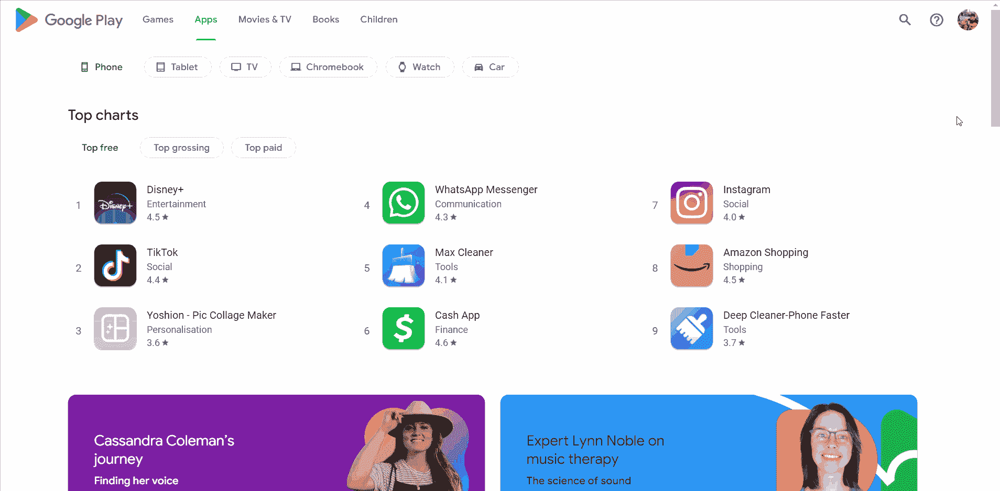

# 用 Python 抓取 Google Play 搜索应用

> 原文：<https://medium.com/geekculture/scrape-google-play-search-apps-in-python-6fe2ebe0382c?source=collection_archive---------2----------------------->



## 关于用 Python 抓取谷歌 Play 商店应用程序搜索结果的分步教程。

*   [会刮什么](#1bfb)
*   [完整代码](#74d2)
*   [准备](#042f)
*   [代码解释](#aa3a)
*   [使用 Google Play 应用商店 API](#85c2)
*   [链接](#d98a)

# 会刮什么



📌注意:Google Play 对登录和未登录用户给出不同的结果。

# 完整代码

如果你不需要解释，看看在线 IDE 中的[完整代码示例。](https://replit.com/@chukhraiartur/blog-google-play-apps#main.py)

```
import time, json
from selenium import webdriver
from selenium.webdriver.chrome.service import Service
from webdriver_manager.chrome import ChromeDriverManager
from selenium.webdriver.common.by import By
from selenium.webdriver.support.wait import WebDriverWait
from selenium.webdriver.support import expected_conditions as EC
from parsel import Selector google_play_apps = {
    'Top charts': {
        'Top free': [],
        'Top grossing': [],
        'Top paid': []
    },
}
def scroll_page(url):
    service = Service(ChromeDriverManager().install())
    options = webdriver.ChromeOptions()
    options.add_argument("--headless")
    options.add_argument("--lang=en")
    options.add_argument("user-agent=Mozilla/5.0 (Windows NT 10.0; Win64; x64) AppleWebKit/537.36 (KHTML, like Gecko) Chrome/104.0.0.0 Safari/537.36")
    options.add_argument("--no-sandbox")
    driver = webdriver.Chrome(service=service, options=options)
    driver.get(url)
    while True:
        try:
            driver.execute_script("document.querySelector('.snByac').click();")
            WebDriverWait(driver, 10000).until(EC.visibility_of_element_located((By.TAG_NAME, 'body')))
            break
        except:
            driver.execute_script("window.scrollTo(0, document.body.scrollHeight);")
            WebDriverWait(driver, 10000).until(EC.visibility_of_element_located((By.TAG_NAME, 'body')))
    scrape_top_charts(driver=driver, chart='Top free', button_selector='#ct\|apps_topselling_free .ypTNYd')
    scrape_top_charts(driver=driver, chart='Top grossing', button_selector='#ct\|apps_topgrossing .ypTNYd')
    scrape_top_charts(driver=driver, chart='Top paid', button_selector='#ct\|apps_topselling_paid .ypTNYd')

    selector = Selector(driver.page_source)
    driver.quit()
    return selector

def scrape_top_charts(driver, chart, button_selector):
    button = driver.find_element(By.CSS_SELECTOR, button_selector)
    driver.execute_script("arguments[0].click();", button)
    time.sleep(2)
    selector = Selector(driver.page_source)
    for result in selector.css('.itIJzb'):
        title = result.css('.OnEJge::text').get()
        link = 'https://play.google.com' + result.css('::attr(href)').get()
        category = result.css('.ubGTjb .sT93pb.w2kbF:not(.K4Wkre)::text').get()
        rating = float(result.css('.CKzsaf .w2kbF::text').get())
        thumbnail = result.css('.stzEZd::attr(srcset)').get().replace(' 2x', '')
        google_play_apps['Top charts'][chart].append({
            'title': title,
            'link': link,
            'category': category,
            'rating': rating,
            'thumbnail': thumbnail,
        })
def scrape_all_sections(selector):	
    for section in selector.css('section'):
        section_title = section.css('.kcen6d span::text').get()
        google_play_apps[section_title] = []
        for app in section.css('.UVEnyf'):
            title = app.css('.Epkrse::text').get()
            link = 'https://play.google.com' + app.css('.Si6A0c::attr(href)').get()
            rating = app.css('.LrNMN::text').get()
            rating = float(rating) if rating else rating
            thumbnail = app.css('.Q8CSx::attr(srcset)').get().replace(' 2x', '')
            google_play_apps[section_title].append({
                'title': title,
                'link': link,
                'rating': rating,
                'thumbnail': thumbnail,
            })

    print(json.dumps(google_play_apps, indent=2, ensure_ascii=False))

def scrape_google_play_apps():
    params = {
        'device': 'phone',  
        'hl': 'en_GB',		# language 
        'gl': 'US',			# country of the search
    }
    URL = f"https://play.google.com/store/apps?device={params['device']}&hl={params['hl']}&gl={params['gl']}"
    result = scroll_page(URL)
    scrape_all_sections(result)
if __name__ == "__main__":
    scrape_google_play_apps()
```

# 准备

**安装库**:

```
pip install parsel selenium webdriver webdriver_manager
```

**降低被阻挡的几率**

确保使用[请求头](https://docs.python-requests.org/en/master/user/quickstart/#custom-headers) `[user-agent](https://developer.mozilla.org/en-US/docs/Glossary/User_agent)`作为“真正的”用户访问。因为默认的`requests` `user-agent`是`[python-requests](https://github.com/psf/requests/blob/589c4547338b592b1fb77c65663d8aa6fbb7e38b/requests/utils.py#L808-L814)`，网站知道这很可能是一个发送请求的脚本。[查查你的](https://www.whatismybrowser.com/detect/what-is-my-user-agent/) `[user-agent](https://www.whatismybrowser.com/detect/what-is-my-user-agent/)`。

有一个[如何在抓取博客帖子](https://serpapi.com/blog/how-to-reduce-chance-of-being-blocked-while-web/)时减少被屏蔽的机会，可以让你熟悉基本的和更高级的方法。

# 代码解释

导入库:

```
import time, json
from selenium import webdriver
from selenium.webdriver.chrome.service import Service
from webdriver_manager.chrome import ChromeDriverManager
from selenium.webdriver.common.by import By
from selenium.webdriver.support.wait import WebDriverWait
from selenium.webdriver.support import expected_conditions as EC
from parsel import Selector
```

*   `[time](https://docs.python.org/3/library/time.html)`在 Python 中处理时间。
*   `[json](https://docs.python.org/3/library/json.html)`将提取的数据转换成 JSON 对象。
*   使用 Selenium 服务器在本地或远程机器上像用户一样本地驱动浏览器。
*   `[Service](https://www.selenium.dev/selenium/docs/api/py/webdriver_chrome/selenium.webdriver.chrome.service.html)`管理 ChromeDriver 的启动和停止。`[By](https://www.selenium.dev/selenium/docs/api/py/webdriver/selenium.webdriver.common.by.html)`对支持的定位器策略集(由。ID，由。TAG_NAME，By。XPATH 等)。
*   `[WebDriverWait](https://www.selenium.dev/selenium/docs/api/py/webdriver_support/selenium.webdriver.support.wait.html#selenium.webdriver.support.wait.WebDriverWait)`只在需要的时候等待。
*   `[expected_conditions](https://www.selenium.dev/selenium/docs/api/py/webdriver_support/selenium.webdriver.support.wait.html#selenium.webdriver.support.wait.WebDriverWait)`包含一组与 WebDriverWait 一起使用的预定义条件。
*   `[Selector](https://parsel.readthedocs.io/en/latest/)`完全支持 [XPath](https://en.wikipedia.org/wiki/XPath) 和 CSS 选择器的 XML/HTML 解析器。

定义字典结构:

```
google_play_apps = {
    'Top charts': {
        'Top free': [],
        'Top grossing': [],
        'Top paid': []
    },
}
```

# 顶级代码环境

在函数开始时，定义了用于生成`URL`的参数。如果您想向 URL 传递其他参数，可以使用`params`字典。这些参数会影响输出结果:

```
params = {
    'device': 'phone',  
    'hl': 'en_GB',		# language 
    'gl': 'US',			# country of the search
}
```

接下来，URL 被传递给`scroll_page(URL)`函数来滚动页面并获取所有数据。该函数返回的结果被传递给`scrape_all_categories(result)`函数以提取必要的数据。这些功能的解释将在下面相应的标题中。

这段代码使用了普遍接受的使用`[__name__ == "__main__"](https://docs.python.org/3/library/__main__.html#)`构造的规则:

```
def scrape_google_play_apps():
    params = {
        'device': 'phone',  
        'hl': 'en_GB',		# language 
        'gl': 'US',			# country of the search
    }
    URL = f"https://play.google.com/store/apps?device={params['device']}&hl={params['hl']}&gl={params['gl']}"
    result = scroll_page(URL)
    scrape_all_sections(result)
if __name__ == "__main__":
    scrape_google_play_apps()
```

只有当用户运行了该文件时，才会执行该检查。如果用户将此文件导入另一个文件，则检查将不起作用。

可以看视频 [Python 教程:if**name**= = '**main**'](https://www.youtube.com/watch?v=sugvnHA7ElY&t=1s)了解更多详情。

# 滚动页面

该函数获取 URL 并返回完整的 HTML 结构。

首先，让我们了解一下分页在 Google Play Apps 页面上是如何工作的。数据不会立即加载。如果用户需要更多的数据，他们只需简单地滚动页面并下载一个小数据包。

相应地，要获得所有数据，您需要滚动到页面的末尾。但我们将面临的问题是，在最后一次滚动时，会出现*显示更多*按钮。点击它，你会得到最后一条数据。页面滚动演示如下所示:



在这种情况下，使用`[selenium](https://www.selenium.dev/documentation/webdriver/)` [库](https://www.selenium.dev/documentation/webdriver/)，它允许您在浏览器中模拟用户动作。要让`selenium`工作，需要使用`[ChromeDriver](https://chromedriver.chromium.org/downloads)`，可以手动下载，也可以使用代码下载。

在我们的例子中，使用第二种方法。要控制`ChromeDriver`的启动和停止，你需要使用`[Service](https://www.selenium.dev/selenium/docs/api/py/webdriver_chrome/selenium.webdriver.chrome.service.html)`，它会在引擎盖下安装浏览器二进制文件:

```
service = Service(ChromeDriverManager().install())
```

您还应该添加`options`才能正常工作:

```
options = webdriver.ChromeOptions()
options.add_argument('--headless')
options.add_argument('--lang=en')
options.add_argument('user-agent=Mozilla/5.0 (Windows NT 10.0; Win64; x64) AppleWebKit/537.36 (KHTML, like Gecko) Chrome/104.0.0.0 Safari/537.36')
options.add_argument('--no-sandbox')
```

*   `--headless`以无头模式运行 Chrome。
*   `--lang=en`将浏览器语言设置为英语。
*   `user-agent`作为来自浏览器的“真实”用户请求，将其传递给[请求头](https://docs.python-requests.org/en/master/user/quickstart/#custom-headers)。[检查你的](https://www.whatismybrowser.com/detect/what-is-my-user-agent)是什么`[user-agent](https://www.whatismybrowser.com/detect/what-is-my-user-agent)`。
*   `--no-sandbox`让 chromedriver 在不同机器上正常工作。

现在我们可以启动`[webdriver](https://www.selenium.dev/documentation/webdriver/)`并将 url 传递给`[get()](https://selenium-python.readthedocs.io/api.html#selenium.webdriver.remote.webdriver.WebDriver.get)` [方法](https://selenium-python.readthedocs.io/api.html#selenium.webdriver.remote.webdriver.WebDriver.get)。

```
driver = webdriver.Chrome(service=service, options=options)
driver.get(url)
```

页面滚动算法是如何工作的？在循环的每次迭代中，程序都会寻找按钮选择器。

如果按钮存在，那么程序就点击它并加载数据，然后循环结束。否则，页面向下滚动并加载数据。

滚动页面和点击按钮是通过将 JavaScript 代码粘贴到`[execute_script()](https://selenium-python.readthedocs.io/api.html#selenium.webdriver.remote.webdriver.WebDriver.execute_script)`方法中完成的。

```
while True:
    try:
        driver.execute_script("document.querySelector('.snByac').click();")
        WebDriverWait(driver, 10000).until(EC.visibility_of_element_located((By.TAG_NAME, 'body')))
        break
    except:
        driver.execute_script("window.scrollTo(0, document.body.scrollHeight);")
        WebDriverWait(driver, 10000).until(EC.visibility_of_element_located((By.TAG_NAME, 'body')))
```

有时很难计算加载一个页面需要多长时间，这完全取决于互联网的速度、计算机的能力和其他因素。

下面描述的方法比使用以秒为单位的延迟好得多，因为等待正好发生在页面完全加载的时刻:

```
WebDriverWait(driver, 10000).until(EC.visibility_of_element_located((By.TAG_NAME, 'body')))
```

📌注意:在这种情况下，我们给 10 秒的时间来加载页面，如果它加载得更早，等待就会结束。

加载完所有数据后，您需要将它们传递给`scrape_top_charts`函数。该功能将在下面的相关章节中描述。在我们停止驱动程序之前提取数据是很重要的。

```
scrape_top_charts(driver=driver, chart='Top free', button_selector='#ct\|apps_topselling_free .ypTNYd')
scrape_top_charts(driver=driver, chart='Top grossing', button_selector='#ct\|apps_topgrossing .ypTNYd')
scrape_top_charts(driver=driver, chart='Top paid', button_selector='#ct\|apps_topselling_paid .ypTNYd')
```

现在我们需要使用来自`[Parsel](https://parsel.readthedocs.io/en/latest/)`的包来处理 HTML，在这个包中，我们通过`HTML`结构来传递滚动页面后收到的所有数据。这是在下一个函数中成功检索数据所必需的。所有操作完成后，停止驱动程序:

```
selector = Selector(driver.page_source)
driver.quit()
```

该函数如下所示:

```
def scroll_page(url):
    service = Service(ChromeDriverManager().install())
    options = webdriver.ChromeOptions()
    options.add_argument("--headless")
    options.add_argument("--lang=en")
    options.add_argument("user-agent=Mozilla/5.0 (Windows NT 10.0; Win64; x64) AppleWebKit/537.36 (KHTML, like Gecko) Chrome/104.0.0.0 Safari/537.36")
    options.add_argument("--no-sandbox")
    driver = webdriver.Chrome(service=service, options=options)
    driver.get(url)
    while True:
        try:
            driver.execute_script("document.querySelector('.snByac').click();")
            WebDriverWait(driver, 10000).until(EC.visibility_of_element_located((By.TAG_NAME, 'body')))
            break
        except:
            driver.execute_script("window.scrollTo(0, document.body.scrollHeight);")
            WebDriverWait(driver, 10000).until(EC.visibility_of_element_located((By.TAG_NAME, 'body')))
    scrape_top_charts(driver=driver, chart='Top free', button_selector='#ct\|apps_topselling_free .ypTNYd')
    scrape_top_charts(driver=driver, chart='Top grossing', button_selector='#ct\|apps_topgrossing .ypTNYd')
    scrape_top_charts(driver=driver, chart='Top paid', button_selector='#ct\|apps_topselling_paid .ypTNYd')

    selector = Selector(driver.page_source)
    driver.quit()
    return selector
```

# 勉强名列前茅

该函数有 3 个参数:

*   `driver` -完整的 HTML 结构。
*   `chart` -从中检索数据的图表。
*   `button_selector` -按钮的选择器转到相应的图表。

在 GIF 上，我展示了排行榜是如何工作的:


通过按下相应的按钮来加载相应的数据。点击按钮并创建对象以检索数据的过程与我们之前在`scroll_page`函数中所做的相同:

```
button = driver.find_element(By.CSS_SELECTOR, button_selector)
driver.execute_script("arguments[0].click();", button)
time.sleep(2)
selector = Selector(driver.page_source)
```

要提取必要的数据，您需要找到它们所在的选择器。在我们的例子中，这是包含所有应用程序的`.itIJzb`选择器。您需要在循环中迭代每个应用程序:

```
for result in selector.css('.itIJzb'):
    # data extraction will be here
```

对于每个 app，提取`title`、`link`、`category`、`rating`、`thumbnail`等数据。您需要找到匹配的选择器并获取文本或属性值。

我想额外指出的是，`thumbnail`是从`srcset`属性中检索出来的，它的质量更好:

```
title = result.css('.OnEJge::text').get()
link = 'https://play.google.com' + result.css('::attr(href)').get()
category = result.css('.ubGTjb .sT93pb.w2kbF:not(.K4Wkre)::text').get()
rating = float(result.css('.CKzsaf .w2kbF::text').get())
thumbnail = result.css('.stzEZd::attr(srcset)').get().replace(' 2x', '')
```

提取数据后，通过键将它们添加到`google_play_apps`字典中。关键是`сhart`参数的值:

```
google_play_apps['Top charts'][chart].append({
    'title': title,
    'link': link,
    'category': category,
    'rating': rating,
    'thumbnail': thumbnail,
})
```

抓取排行榜的完整函数如下所示:

```
def scrape_top_charts(driver, chart, button_selector):
    button = driver.find_element(By.CSS_SELECTOR, button_selector)
    driver.execute_script("arguments[0].click();", button)
    time.sleep(2)
    selector = Selector(driver.page_source)
    for result in selector.css('.itIJzb'):
        title = result.css('.OnEJge::text').get()
        link = 'https://play.google.com' + result.css('::attr(href)').get()
        category = result.css('.ubGTjb .sT93pb.w2kbF:not(.K4Wkre)::text').get()
        rating = float(result.css('.CKzsaf .w2kbF::text').get())
        thumbnail = result.css('.stzEZd::attr(srcset)').get().replace(' 2x', '')
        google_play_apps['Top charts'][chart].append({
            'title': title,
            'link': link,
            'category': category,
            'rating': rating,
            'thumbnail': thumbnail,
        })
```

*   `[css()](https://parsel.readthedocs.io/en/latest/usage.html#using-selectors)`通过传递的选择器来访问元素。
*   `[::text](https://github.com/scrapy/parsel/blob/90397dcd0b2c1cbb91e44f65c50f9e11628ba028/parsel/csstranslator.py#L48-L51)` [或](https://github.com/scrapy/parsel/blob/90397dcd0b2c1cbb91e44f65c50f9e11628ba028/parsel/csstranslator.py#L48-L51) `[::attr(<attribute>)](https://github.com/scrapy/parsel/blob/90397dcd0b2c1cbb91e44f65c50f9e11628ba028/parsel/csstranslator.py#L48-L51)`从节点中提取文本或属性数据。
*   `[get()](https://parsel.readthedocs.io/en/latest/usage.html#usage)`实际提取文本数据。
*   `[float()](https://docs.python.org/3/library/functions.html#float)`从字符串值生成浮点数。
*   `[replace()](https://docs.python.org/3/library/stdtypes.html#str.replace)`用没有额外元素的新子字符串替换所有出现的旧子字符串。

在`scroll_page`函数中，我们调用此函数 3 次，以从*最高免费*、*最高票房*和*最高付费*部分中检索数据。

# 刮去所有部分

该函数采用完整的 HTML 结构，并以 JSON 格式打印所有结果。

要从所有部分检索数据，您需要找到该部分的`section`选择器。您需要迭代循环中的每个部分:

```
for section in selector.css('section'):
    # data extraction will be here
```

有必要提取`section_title`并使其成为`google_play_apps`字典中的一个键，稍后将添加每个应用程序的提取数据列表:

```
section_title = section.css('.kcen6d span::text').get()
google_play_apps[section_title] = []
```

每个部分都有一定数量的应用程序，它们也需要使用`.UVEnyf`选择器在另一个循环中迭代:

```
for app in section.css('.UVEnyf'):
    # data extraction will be here
```

对于分段应用程序，没有`categories`这样的参数。其他选择器也检索数据。

还有就是`rating`提取略有不同。事实是，对于一些游戏，评级是不显示的。在这种情况下，使用一个[三元表达式](https://docs.python.org/3/reference/expressions.html#conditional-expressions)，它提取数据的数值，如果有的话:

```
title = app.css('.Epkrse::text').get()
link = 'https://play.google.com' + app.css('.Si6A0c::attr(href)').get()
rating = app.css('.LrNMN::text').get()
rating = float(rating) if rating else rating
thumbnail = app.css('.Q8CSx::attr(srcset)').get().replace(' 2x', '')
```

抓取所有类别的完整函数如下所示:

```
def scrape_all_sections(selector):	
    for section in selector.css('section'):
        section_title = section.css('.kcen6d span::text').get()
        google_play_apps[section_title] = []
        for app in section.css('.UVEnyf'):
            title = app.css('.Epkrse::text').get()
            link = 'https://play.google.com' + app.css('.Si6A0c::attr(href)').get()
            rating = app.css('.LrNMN::text').get()
            rating = float(rating) if rating else rating
            thumbnail = app.css('.Q8CSx::attr(srcset)').get().replace(' 2x', '')
            google_play_apps[section_title].append({
                'title': title,
                'link': link,
                'rating': rating,
                'thumbnail': thumbnail,
            })

    print(json.dumps(google_play_apps, indent=2, ensure_ascii=False))
```

输出:

```
{
  "Top charts": {
    "Top free": [
      {
        "title": "Disney+",
        "link": "https://play.google.com/store/apps/details?id=com.disney.disneyplus",
        "category": "Entertainment",
        "rating": 4.5,
        "thumbnail": "https://play-lh.googleusercontent.com/xoGGYH2LgLibLDBoxMg-ZE16b-RNfITw_OgXBWRAPin2FZY4FGB9QKBYApR-0rSCkQ=s128-rw"
      },
      ... other apps
    ],
    "Top grossing": [
      {
        "title": "Google One",
        "link": "https://play.google.com/store/apps/details?id=com.google.android.apps.subscriptions.red",
        "category": "Productivity",
        "rating": 4.3,
        "thumbnail": "https://play-lh.googleusercontent.com/DGAleS46qOedNzJGsB3e29QLpL6Qi6EwIDze95nBvxMAMGEmbE6KOW__2haEkHVDs4Y=s128-rw"
      },
      ... other apps
    ],
    "Top paid": [
      {
        "title": "Muscle Trigger Point Anatomy",
        "link": "https://play.google.com/store/apps/details?id=com.real.bodywork.muscle.trigger.points",
        "category": "Medical",
        "rating": 4.6,
        "thumbnail": "https://play-lh.googleusercontent.com/dX8bDLm4Aq0vF131uvjJO83EghJ9fIPIEfgLdcXwUXF7iZnpxkR53uy94H9FHocJRQ=s128-rw"
      },
      ... other apps
    ]
  },
  "Popular apps": [
    {
      "title": "WhatsApp Messenger",
      "link": "https://play.google.com/store/apps/details?id=com.whatsapp",
      "rating": 4.3,
      "thumbnail": "https://play-lh.googleusercontent.com/bYtqbOcTYOlgc6gqZ2rwb8lptHuwlNE75zYJu6Bn076-hTmvd96HH-6v7S0YUAAJXoJN=s512-rw"
    },
    ... other apps
  ],
  ... other sections
  "Book a getaway": [
    {
      "title": "Hotels.com: Book Hotels & More",
      "link": "https://play.google.com/store/apps/details?id=com.hcom.android",
      "rating": 4.4,
      "thumbnail": "https://play-lh.googleusercontent.com/onuxspmiR0fJZRWXZCToyBPht5yZE55drqWqoWWDj9YwJvKpg2AY4lt1LdymRYkRlh0=s512-rw"
    },
    ... other apps
  ]
}
```

# 从 SerpApi 使用 Google Play 应用商店 API

这一部分将展示 DIY 解决方案和我们的解决方案之间的比较。

主要区别在于这是一种更快的方法。 [Google Play 应用商店 API](https://serpapi.com/google-play-apps) 将绕过搜索引擎的拦截，你不必从头开始创建解析器并维护它。

首先，我们需要安装`[google-search-results](https://pypi.org/project/google-search-results/)`:

```
pip install google-search-results
```

导入工作所需的库:

```
from serpapi import GoogleSearch
import os, json
```

接下来，我们编写一个搜索查询和发出请求所需的参数:

```
params = {
    # https://docs.python.org/3/library/os.html#os.getenv
    'api_key': os.getenv('API_KEY'),    # your serpapi api
    'engine': 'google_play',			# SerpApi search engine
    'store': 'apps'						# Google Play Apps
}
```

然后我们创建一个`search`对象，从 SerpApi 后端获取数据。在`result_dict`字典中，我们从 JSON 获得数据:

```
search = GoogleSearch(params)
result_dict = search.get_dict()
```

数据检索非常简单，我们只需打开`'organic_results'`键:

```
google_play_apps = result_dict['organic_results']
```

要集成的示例代码:

```
from serpapi import GoogleSearch
import os, json
params = {
    # https://docs.python.org/3/library/os.html#os.getenv
    'api_key': os.getenv('API_KEY'),    # your serpapi api
    'engine': 'google_play',			# SerpApi search engine
    'store': 'apps'						# Google Play Apps
}
search = GoogleSearch(params)           # where data extraction happens on the SerpApi backend
result_dict = search.get_dict()         # JSON -> Python dict
google_play_apps = result_dict['organic_results']
print(json.dumps(google_play_apps, indent=2, ensure_ascii=False))
```

输出:

```
[
  {
    "title": "Popular apps",
    "items": [
      {
        "title": "WhatsApp Messenger",
        "link": "https://play.google.com/store/apps/details?id=com.whatsapp",
        "product_id": "com.whatsapp",
        "serpapi_link": "https://serpapi.com/search.json?engine=google_play_product&gl=us&hl=en&product_id=com.whatsapp&store=apps",
        "rating": 4.3,
        "thumbnail": "https://play-lh.googleusercontent.com/bYtqbOcTYOlgc6gqZ2rwb8lptHuwlNE75zYJu6Bn076-hTmvd96HH-6v7S0YUAAJXoJN=s256"
      },
      ... other items
      {
        "title": "Zoom - One Platform to Connect",
        "link": "https://play.google.com/store/apps/details?id=us.zoom.videomeetings",
        "product_id": "us.zoom.videomeetings",
        "serpapi_link": "https://serpapi.com/search.json?engine=google_play_product&gl=us&hl=en&product_id=us.zoom.videomeetings&store=apps",
        "rating": 4.3,
        "thumbnail": "https://play-lh.googleusercontent.com/yZsmiNjmji3ZoOuLthoVvptLB9cZ0vCmitcky4OUXNcEFV3IEQkrBD2uu5kuWRF5_ERA=s256"
      }
    ]
  },
  ... other sections
  {
    "title": "Communication",
    "items": [
      {
        "title": "Google Voice",
        "link": "https://play.google.com/store/apps/details?id=com.google.android.apps.googlevoice",
        "product_id": "com.google.android.apps.googlevoice",
        "serpapi_link": "https://serpapi.com/search.json?engine=google_play_product&gl=us&hl=en&product_id=com.google.android.apps.googlevoice&store=apps",
        "rating": 4.4,
        "thumbnail": "https://play-lh.googleusercontent.com/Gf8ufuFbtfXO5Y6JuZjnG0iIpZh21zNTqZ5aiAXO8mA38mvXzY-1s27FWbGlp51paQ=s256"
      },
      ... other items
      {
        "title": "Email - Fast & Secure Mail",
        "link": "https://play.google.com/store/apps/details?id=com.easilydo.mail",
        "product_id": "com.easilydo.mail",
        "serpapi_link": "https://serpapi.com/search.json?engine=google_play_product&gl=us&hl=en&product_id=com.easilydo.mail&store=apps",
        "rating": 4.6,
        "thumbnail": "https://play-lh.googleusercontent.com/WvlTOWc59NcVtCfnxMjNZIG2mRHrjMNadTU7dnN2oA3UwT6tz70KodnLOwiimwc49Obx=s256"
      }
    ]
  }
]
```

# 链接

*   [在线 IDE 中的代码](https://replit.com/@chukhraiartur/blog-google-play-apps#main.py)
*   [Google Play 应用商店 API](https://serpapi.com/google-play-apps)

加入我们的推特[推特](https://twitter.com/serp_api) | [YouTube](https://www.youtube.com/channel/UCUgIHlYBOD3yA3yDIRhg_mg)

添加一个[特征请求](https://github.com/serpapi/public-roadmap/issues)💫还是一只[虫](https://github.com/serpapi/public-roadmap/issues)🐞