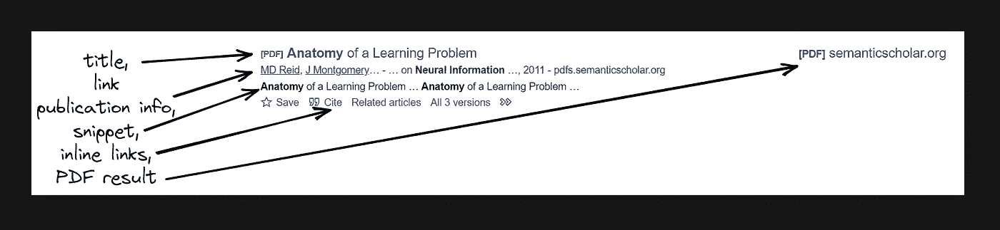

# 用 Python 在一个特定的会议上收集谷歌学术的论文

> 原文：<https://medium.com/geekculture/scrape-google-scholar-papers-within-a-particular-conference-in-python-1eef3318dc16?source=collection_archive---------12----------------------->


# 会刮什么



# 先决条件

**CSS 选择器基础知识抓取**

CSS 选择器声明样式应用于标记的哪一部分，从而允许从匹配的标签和属性中提取数据。

如果你没有使用过 CSS 选择器，我有一篇专门的博文是关于[如何在抓取网页时使用 CSS 选择器](https://serpapi.com/blog/web-scraping-with-css-selectors-using-python/)的，它涵盖了什么是 CSS 选择器，优点和缺点，以及为什么从抓取网页的角度来看它们很重要，并展示了抓取网页时使用 CSS 选择器的最常见的方法。

**单独的虚拟环境，如果它将是一个项目**

简而言之，它创建了一组独立的已安装库，包括不同的 Python 版本，这些版本可以在同一系统中共存，从而防止库或 Python 版本冲突。

如果你以前没有使用过虚拟环境，可以看看我的博客文章《使用 Virtualenv 和 poeties》中专门的 [Python 虚拟环境教程来熟悉一下。](https://serpapi.com/blog/python-virtual-environments-using-virtualenv-and-poetry/)

📌注意:这不是这篇博文的严格要求。

**安装库:**

```
pip install requests parsel google-search-results
```

**减少被封的几率**

请求有可能被阻止。看看[如何降低抓取网页时被屏蔽的几率](https://serpapi.com/blog/how-to-reduce-chance-of-being-blocked-while-web/)，有 11 种方法可以绕过大多数网站的屏蔽。

# 过滤的工作原理

要过滤结果，您需要使用 source: operator，它将搜索结果限制在名称中包含“NIPS”的源发布的文档中。

该操作符可与 or 操作符一起使用，即*源:NIPS 或源:“神经信息”*。因此，搜索查询将变成:

```
search terms source:NIPS OR source:"Neural Information"
```

# 完整代码

# 代码解释

添加一个接受`str`的`list`或`str`的函数，如果它是一个`list`则转换它:

```
def check_sources(source: list or str):
    if isinstance(source, str):
        return source 
    elif isinstance(source, list):
        return " OR ".join([f'source:{item}' for item in source])
```

定义一个解析函数:

```
def scrape_conference_publications(query: str, source: list[str]):
    # further code...
```

*   `query: str` —告诉 Python`query`参数应该是`string`。
*   `source: list or str` —告诉 Python`source`参数应该是`list`或`string`。

检查源是否可用，并转换收到的源参数:

```
if source:
    # iterates via list comprehension over recieved list of sources (strings)
    # and joins() them with " OR "
    sources = " OR ".join([f'source:{item}' for item in source]) 

# becomes: source:NIPS OR source:Neural Information, which can be used in a search query
```

创建 URL 参数、用户代理并将它们传递给请求:

```
# [https://docs.python-requests.org/en/master/user/quickstart/#passing-parameters-in-urls](https://docs.python-requests.org/en/master/user/quickstart/#passing-parameters-in-urls)
params = {
    "q": f'{query.lower()} {sources}',  # search query
    "hl": "en",                         # language of the search
    "gl": "us"                          # country of the search
}# [https://docs.python-requests.org/en/master/user/quickstart/#custom-headers](https://docs.python-requests.org/en/master/user/quickstart/#custom-headers)
headers = {
    "User-Agent": "Mozilla/5.0 (Windows NT 10.0; Win64; x64) AppleWebKit/537.36 (KHTML, like Gecko) Chrome/100.0.4896.127 Safari/537.36"
}html = requests.get("https://scholar.google.com/scholar", params=params, headers=headers, timeout=30)
selector = Selector(html.text)
```

*   [超时](https://docs.python-requests.org/en/master/user/quickstart/#timeouts) —告诉请求在 30 秒后停止等待响应。
*   选择器—是一个解析数据的 HTML/XML 处理器。喜欢 [BeautifulSoup()](https://www.crummy.com/software/BeautifulSoup/bs4/doc/) 。
*   [用户代理](https://developer.mozilla.org/en-US/docs/Glossary/User_agent)——用于充当“真实”的用户访问。默认请求用户代理是一个 python-requests 所以网站知道它是一个发送请求的脚本，可能会阻止它。[检查你的用户代理](https://www.whatismybrowser.com/detect/what-is-my-user-agent)。

创建一个临时列表来存储数据，并迭代有机结果:

```
publications = []

for result in selector.css(".gs_r.gs_scl"):
    title = result.css(".gs_rt").xpath("normalize-space()").get()
    link = result.css(".gs_rt a::attr(href)").get()
    result_id = result.attrib["data-cid"]
    snippet = result.css(".gs_rs::text").get()
    publication_info = result.css(".gs_a").xpath("normalize-space()").get()
    cite_by_link = f'https://scholar.google.com/scholar{result.css(".gs_or_btn.gs_nph+ a::attr(href)").get()}'
    all_versions_link = f'https://scholar.google.com/scholar{result.css("a~ a+ .gs_nph::attr(href)").get()}'
    related_articles_link = f'https://scholar.google.com/scholar{result.css("a:nth-child(4)::attr(href)").get()}'
    pdf_file_title = result.css(".gs_or_ggsm a").xpath("normalize-space()").get()
    pdf_file_link = result.css(".gs_or_ggsm a::attr(href)").get()
```

*   css( <selector>) — [从给定的 css 选择器](https://github.com/scrapy/parsel/blob/90397dcd0b2c1cbb91e44f65c50f9e11628ba028/parsel/selector.py#L351-L362)中提取数据。在后台，parsel 使用 cssselect 将每个 CSS 查询转换为 XPath 查询。</selector>
*   XPath(" normalize-space()")-[获取空白文本节点](https://github.com/scrapy/parsel/issues/62#issuecomment-1042309376)。默认情况下，空白文本节点将被跳过，导致不完整的输出。
*   * text/::attr()是一个 [parsel 伪元素，用于从 HTML 节点中提取文本或属性](https://github.com/scrapy/parsel/blob/90397dcd0b2c1cbb91e44f65c50f9e11628ba028/parsel/csstranslator.py#L48-L51)数据。
*   get() —获取实际数据。

将结果作为字典附加到临时列表，返回或打印提取的数据:

```
publications.append({
        "result_id": result_id,
        "title": title,
        "link": link,
        "snippet": snippet,
        "publication_info": publication_info,
        "cite_by_link": cite_by_link,
        "all_versions_link": all_versions_link,
        "related_articles_link": related_articles_link,
        "pdf": {
            "title": pdf_file_title,
            "link": pdf_file_link
        }
    })

# return publicationsprint(json.dumps(publications, indent=2, ensure_ascii=False)) scrape_conference_publications(query="anatomy", source=["NIPS", "Neural Information"])
```

产出:

```
[
  {
    "result_id": "hjgaRkq_oOEJ",
    "title": "Differential representation of arm movement direction in relation to cortical anatomy and function",
    "link": "https://iopscience.iop.org/article/10.1088/1741-2560/6/1/016006/meta",
    "snippet": "… ",
    "publication_info": "T Ball, A Schulze-Bonhage, A Aertsen… - Journal of neural …, 2009 - iopscience.iop.org",
    "cite_by_link": "https://scholar.google.com/scholar/scholar?cites=16258204980532099206&as_sdt=2005&sciodt=0,5&hl=en",
    "all_versions_link": "https://scholar.google.com/scholar/scholar?cluster=16258204980532099206&hl=en&as_sdt=0,5",
    "related_articles_link": "https://scholar.google.com/scholar/scholar?q=related:hjgaRkq_oOEJ:scholar.google.com/&scioq=anatomy+source:NIPS+OR+source:Neural+Information&hl=en&as_sdt=0,5",
    "pdf": {
      "title": "[PDF] psu.edu",
      "link": "http://citeseerx.ist.psu.edu/viewdoc/download?doi=10.1.1.324.1523&rep=rep1&type=pdf"
    }
  }, ... other results
]
```

# 学者有机结果 API

或者，您可以使用 SerpApi 的[谷歌学术有机结果 API](https://serpapi.com/google-scholar-organic-results) 来实现。

最大的区别是，你不需要从头开始创建一个解析器，维护它，弄清楚如何扩展它，最重要的是，如何绕过谷歌的封锁，从而弄清楚如何设置代理和验证码解决方案。

```
# pip install google-search-results

import os, json
from serpapi import GoogleSearch
from urllib.parse import urlsplit, parse_qsl

params = {
    # https://docs.python.org/3/library/os.html#os.getenv
    "api_key": os.getenv("API_KEY"), # your serpapi API key
    "engine": "google_scholar",      # search engine
    "q": "AI source:NIPS",           # search query
    "hl": "en",                      # language
    # "as_ylo": "2017",              # from 2017
    # "as_yhi": "2021",              # to 2021
    "start": "0"                     # first page
    }

search = GoogleSearch(params)

publications = []

publications_is_present = True
while publications_is_present:
    results = search.get_dict()

    print(f"Currently extracting page #{results.get('serpapi_pagination', {}).get('current')}..")

    for result in results["organic_results"]:
        position = result["position"]
        title = result["title"]
        publication_info_summary = result["publication_info"]["summary"]
        result_id = result["result_id"]
        link = result.get("link")
        result_type = result.get("type")
        snippet = result.get("snippet")

        publications.append({
            "page_number": results.get("serpapi_pagination", {}).get("current"),
            "position": position + 1,
            "result_type": result_type,
            "title": title,
            "link": link,
            "result_id": result_id,
            "publication_info_summary": publication_info_summary,
            "snippet": snippet,
            })

    if "next" in results.get("serpapi_pagination", {}):
        # splits URL in parts as a dict and passes it to a GoogleSearch() class.
        search.params_dict.update(dict(parse_qsl(urlsplit(results["serpapi_pagination"]["next"]).query)))
    else:
        papers_is_present = False

print(json.dumps(organic_results_data, indent=2, ensure_ascii=False))
```

# 链接

*   【the onlie IDE 中的代码
*   塞尔帕皮谷歌学术有机产品 API

加入我们的[推特](https://twitter.com/serp_api) | [YouTube](https://www.youtube.com/channel/UCUgIHlYBOD3yA3yDIRhg_mg)

添加一个[特征请求](https://github.com/serpapi/public-roadmap/issues)💫还是一个 [Bug](https://github.com/serpapi/public-roadmap/issues) 🐞