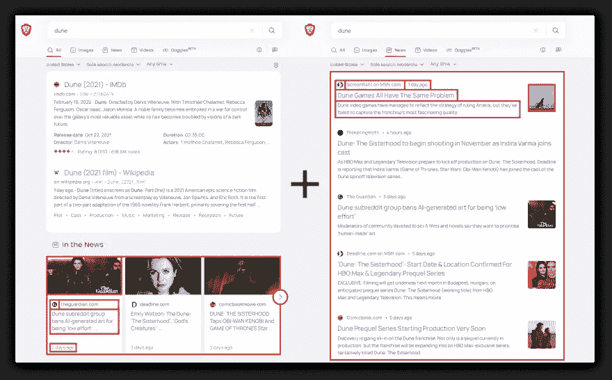
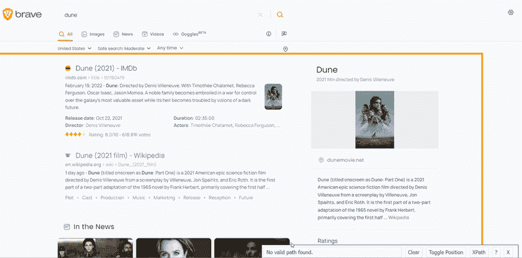
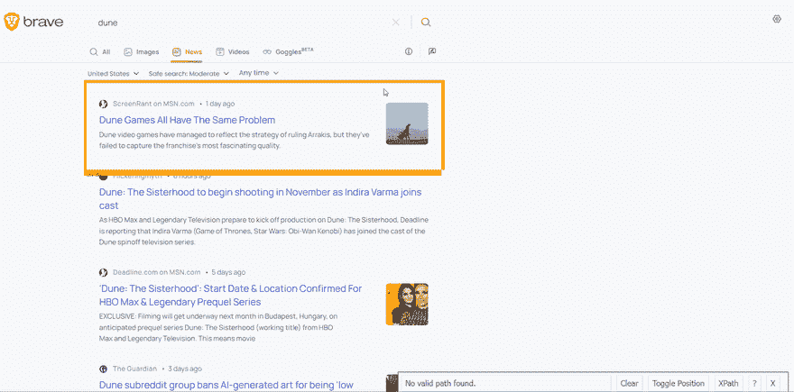

# 用 Python 从勇敢搜索中抓取有机新闻

> 原文：<https://medium.com/geekculture/scrape-organic-news-from-brave-search-with-python-5eae4d8584d9?source=collection_archive---------27----------------------->


*   [简介](#4d2d)
*   [会刮什么](#0d8c)
*   [什么是勇敢的搜索](#e351)
*   [完整代码](#96a0)
*   [准备](#3c4f)
*   [代码解释](#6bad)
*   [刮掉有机新闻](#0c4d)
*   [刮掉标签新闻](#3812)
*   [链接](#1e28)

# 介绍

目前，我们还没有一个支持从 Brave Search 中提取数据的 API。

这篇博文向你展示了在我们发布合适的 API 的时候，你如何用下面提供的 DIY 解决方案来做这件事。

该解决方案可用于个人用途，因为它不包括我们为付费[生产和以上计划](https://serpapi.com/pricing)提供的[合法美国盾](https://serpapi.com/#features)，并且有其局限性，例如需要绕过验证码。

你可以查看我们的公共路线图来跟踪这个 API 的进展:[【新 API】勇敢搜索](https://github.com/serpapi/public-roadmap/issues/323)

# 会刮什么



📌注意:有时候有机搜索结果可能没有新闻。这篇博文从有机结果和新闻标签中获取新闻。

# 什么是勇敢的搜索

之前的勇者博文之前描述过[什么是勇者搜索](https://serpapi.com/blog/scrape-brave-search-organic-results-with-python/)。为了避免内容重复，这篇博文中没有提到这些信息。

# 完整代码

如果不需要解释，可以看看在线 IDE 中的[完整代码示例。](https://replit.com/@chukhraiartur/blog-brave-search-organic-news#main.py)

```
from bs4 import BeautifulSoup
import requests, lxml, json# https://docs.python-requests.org/en/master/user/quickstart/#passing-parameters-in-urls
params = {
    'q': 'dune',            # query
    'source': 'web',        # source
    'tf': 'at'              # publish time (by default any time)
}# https://docs.python-requests.org/en/master/user/quickstart/#custom-headers
headers = {
    'User-Agent': 'Mozilla/5.0 (Windows NT 10.0; Win64; x64) AppleWebKit/537.36 (KHTML, like Gecko) Chrome/103.0.0.0 Safari/537.36'
} def scrape_organic_news():
    html = requests.get('https://search.brave.com/search', headers=headers, params=params)
    soup = BeautifulSoup(html.text, 'lxml') brave_organic_news = [] for result in soup.select('#news-carousel .card'):
        title = result.select_one('.title').get_text().strip()
        link = result.get('href')
        time_published = result.select_one('.card-footer__timestamp').get_text().strip()
        source = result.select_one('.anchor').get_text().strip()
        favicon = result.select_one('.favicon').get('src')
        thumbnail = result.select_one('.img-bg').get('style').split(', ')[0].replace("background-image: url('", "").replace("')", "") brave_organic_news.append({
            'title': title,
            'link': link,
            'time_published': time_published,
            'source': source,
            'favicon': favicon,
            'thumbnail': thumbnail
        }) print(json.dumps(brave_organic_news, indent=2, ensure_ascii=False)) def scrape_tab_news():
    del params['source']
    html = requests.get('https://search.brave.com/news', headers=headers, params=params)
    soup = BeautifulSoup(html.text, 'lxml') brave_tab_news = [] for result in soup.select('.snippet'):
        title = result.select_one('.snippet-title').get_text()
        link = result.select_one('.result-header').get('href')
        snippet = result.select_one('.snippet-description').get_text().strip()
        time_published = result.select_one('.ml-5+ .text-gray').get_text()
        source = result.select_one('.netloc').get_text()
        favicon = result.select_one('.favicon').get('src')
        thumbnail = result.select_one('.thumb')
        thumbnail = thumbnail.get('src') if thumbnail else None brave_tab_news.append({
            'title': title,
            'link': link,
            'snippet': snippet,
            'time_published': time_published,
            'source': source,
            'favicon': favicon,
            'thumbnail': thumbnail
        }) print(json.dumps(brave_tab_news, indent=2, ensure_ascii=False)) if __name__ == "__main__":
    # scrape_organic_news()
    scrape_tab_news()
```

# 准备

**安装库**:

```
pip install requests lxml beautifulsoup4
```

**CSS 选择器基础知识抓取**

CSS 选择器声明样式应用于标记的哪一部分，从而允许从匹配的标签和属性中提取数据。

如果你还没有使用 CSS 选择器，我有一篇关于如何在抓取网页时使用 CSS 选择器的博文，它涵盖了什么是 CSS 选择器，利弊，以及为什么从抓取网页的角度来看它们很重要。

**降低被阻挡的几率**

确保使用[请求头](https://docs.python-requests.org/en/master/user/quickstart/#custom-headers) `[user-agent](https://developer.mozilla.org/en-US/docs/Glossary/User_agent)`作为“真正的”用户访问。因为默认的`requests` `user-agent`是`[python-requests](https://github.com/psf/requests/blob/589c4547338b592b1fb77c65663d8aa6fbb7e38b/requests/utils.py#L808-L814)`，网站知道这很可能是一个发送请求的脚本。[检查你的](https://www.whatismybrowser.com/detect/what-is-my-user-agent/) `[user-agent](https://www.whatismybrowser.com/detect/what-is-my-user-agent/)`。

有一个[如何在抓取博客文章时减少被屏蔽的机会](https://serpapi.com/blog/how-to-reduce-chance-of-being-blocked-while-web/)可以让你熟悉基本的和更高级的方法。

# 代码解释

导入库:

```
from bs4 import BeautifulSoup
import requests, lxml, json
```

*   `[BeautifulSoup](https://www.crummy.com/software/BeautifulSoup/bs4/doc/)`从网页中抓取信息。它位于 HTML 或 XML 解析器之上，为迭代、搜索和修改解析树提供了 Pythonic 习惯用法。
*   `[requests](https://requests.readthedocs.io/en/latest/user/quickstart/)`向网站发出请求。
*   `[lxml](https://lxml.de/)`快速处理 XML/HTML 文档。
*   `[json](https://docs.python.org/3/library/json.html)`将提取的数据转换成 JSON 对象。

创建 URL 参数和请求标头:

```
# https://docs.python-requests.org/en/master/user/quickstart/#passing-parameters-in-urls
params = {
    'q': 'dune',            # query
    'source': 'web',        # source
    'tf': 'at'              # publish time (by default any time)
}# https://docs.python-requests.org/en/master/user/quickstart/#custom-headers
headers = {
    'User-Agent': 'Mozilla/5.0 (Windows NT 10.0; Win64; x64) AppleWebKit/537.36 (KHTML, like Gecko) Chrome/103.0.0.0 Safari/537.36'
}
```

*   向请求传递 URL 参数的一种更好的方式。
*   `[user-agent](https://developer.mozilla.org/en-US/docs/Glossary/User_agent)`作为来自浏览器的“真实”用户请求，将其传递给[请求头](https://docs.python-requests.org/en/master/user/quickstart/#custom-headers)。[默认](https://github.com/psf/requests/blob/589c4547338b592b1fb77c65663d8aa6fbb7e38b/requests/utils.py#L808-L814) `[requests](https://github.com/psf/requests/blob/589c4547338b592b1fb77c65663d8aa6fbb7e38b/requests/utils.py#L808-L814)` [用户代理是一个](https://github.com/psf/requests/blob/589c4547338b592b1fb77c65663d8aa6fbb7e38b/requests/utils.py#L808-L814) `[python-reqeusts](https://github.com/psf/requests/blob/589c4547338b592b1fb77c65663d8aa6fbb7e38b/requests/utils.py#L808-L814)`，因此网站可能会认为它是一个机器人或脚本，并阻止对网站的请求。[检查你的](https://www.whatismybrowser.com/detect/what-is-my-user-agent)是什么`[user-agent](https://www.whatismybrowser.com/detect/what-is-my-user-agent)`。

# 刮掉有机新闻

这个函数抓取`[https://search.brave.com/search](https://search.brave.com/search)` URL 的所有有机新闻数据，并以 JSON 格式输出所有结果。

您需要发出一个请求，传递创建的请求参数和头部。该请求将 HTML 返回给 BeautifulSoup:

```
html = requests.get('https://search.brave.com/search', headers=headers, params=params)
soup = BeautifulSoup(html.text, 'lxml')
```

*   `[timeout=30](https://docs.python-requests.org/en/master/user/quickstart/#timeouts)`30 秒后停止等待响应。
*   `BeautifulSoup()`返回的 HTML 数据将由`bs4`处理。

创建`brave_organic_news`列表来存储所有新闻:

```
brave_organic_news = []
```

要提取必要的数据，您需要找到它们所在的选择器。在我们的例子中，这是包含所有有机新闻的`#news-carousel .card`选择器。您需要在循环中迭代每条新闻:

```
for result in soup.select('#news-carousel .card'):
    # data extraction will be here
```

要提取数据，您需要找到匹配的选择器。 [SelectorGadget](https://serpapi.com/blog/web-scraping-with-css-selectors-using-python/#css_gadget) 用于抓取 CSS 选择器。我想演示一下选择器选择过程是如何工作的:



找到选择器后，我们需要获得相应的文本或属性值:

```
title = result.select_one('.title').get_text().strip()
link = result.get('href')
time_published = result.select_one('.card-footer__timestamp').get_text().strip()
source = result.select_one('.anchor').get_text().strip()
favicon = result.select_one('.favicon').get('src')
thumbnail = result.select_one('.img-bg').get('style').split(', ')[0].replace("background-image: url('", "").replace("')", "")
```

*   `[select_one()](https://beautiful-soup-4.readthedocs.io/en/latest/#css-selectors)` [/](https://beautiful-soup-4.readthedocs.io/en/latest/#css-selectors) `[select()](https://beautiful-soup-4.readthedocs.io/en/latest/#css-selectors)`对解析后的文档运行 CSS 选择器，返回所有匹配的元素。
*   `[get_text()](https://beautiful-soup-4.readthedocs.io/en/latest/#get-text)`从节点获取文本数据。
*   `[get(<attribute>)](https://beautiful-soup-4.readthedocs.io/en/latest/#attributes)`从节点获取属性数据。
*   `[strip()](https://docs.python.org/3/library/stdtypes.html#str.strip)`返回删除了前导字符和尾随字符的字符串的副本。
*   `[replace()](https://docs.python.org/3/library/stdtypes.html#str.replace)`用没有额外元素的新子串替换所有出现的旧子串。
*   `[split()](https://docs.python.org/3/library/stdtypes.html#str.split)`返回字符串中的单词列表，用分隔符字符串分隔字符串。

从项目中检索数据后，该数据被追加到`brave_organic_news`列表中:

```
brave_organic_news.append({
    'title': title,
    'link': link,
    'time_published': time_published,
    'source': source,
    'favicon': favicon,
    'thumbnail': thumbnail
})
```

收集有机新闻的完整函数如下所示:

```
def scrape_organic_news():
    html = requests.get('https://search.brave.com/search', headers=headers, params=params)
    soup = BeautifulSoup(html.text, 'lxml') brave_organic_news = [] for result in soup.select('#news-carousel .card'):
        title = result.select_one('.title').get_text().strip()
        link = result.get('href')
        time_published = result.select_one('.card-footer__timestamp').get_text().strip()
        source = result.select_one('.anchor').get_text().strip()
        favicon = result.select_one('.favicon').get('src')
        thumbnail = result.select_one('.img-bg').get('style').split(', ')[0].replace("background-image: url('", "").replace("')", "") brave_organic_news.append({
            'title': title,
            'link': link,
            'time_published': time_published,
            'source': source,
            'favicon': favicon,
            'thumbnail': thumbnail
        }) print(json.dumps(brave_organic_news, indent=2, ensure_ascii=False))
```

输出:

```
[
  {
    "title": "Dune subreddit group bans AI-generated art for being ‘low effort’ ...",
    "link": "https://www.theguardian.com/film/2022/oct/16/dune-subreddit-group-bans-ai-generated-art-for-being-low-effort",
    "time_published": "2 days ago",
    "source": "theguardian.com",
    "favicon": "https://imgs.search.brave.com/9NJ5RrmLraV8oAt2-ItS_A5rM7MNWTBcXog1rbJwni0/rs:fit:32:32:1/g:ce/aHR0cDovL2Zhdmlj/b25zLnNlYXJjaC5i/cmF2ZS5jb20vaWNv/bnMvNGRmYTNkMTZl/NmJhYTQwYmQ4NDRj/MzQ4NDZkNGQ0YTgy/ZWRlZDM4YWVkMzM4/NmM0Y2Y2NTgyMTQ5/NzQxOTExYy93d3cu/dGhlZ3VhcmRpYW4u/Y29tLw",
    "thumbnail": "https://imgs.search.brave.com/PO4d1ks7aUaIUG07Aty1tXis_sdCsr9ZUJ-IXB5Hr7U/rs:fit:200:200:1/g:ce/aHR0cHM6Ly9pLmd1/aW0uY28udWsvaW1n/L21lZGlhL2EzOTQy/NWM5N2M0MzlmY2Vi/Yzc3NTFlYzUzMDQ0/MmJmYWFjOWNlZGYv/Njk3XzBfMjk1OF8x/Nzc3L21hc3Rlci8y/OTU4LmpwZz93aWR0/aD0xMjAwJmhlaWdo/dD02MzAmcXVhbGl0/eT04NSZhdXRvPWZv/cm1hdCZmaXQ9Y3Jv/cCZvdmVybGF5LWFs/aWduPWJvdHRvbSUy/Q2xlZnQmb3Zlcmxh/eS13aWR0aD0xMDBw/Jm92ZXJsYXktYmFz/ZTY0PUwybHRaeTl6/ZEdGMGFXTXZiM1ps/Y214aGVYTXZkR2N0/WkdWbVlYVnNkQzV3/Ym1jJmVuYWJsZT11/cHNjYWxlJnM9NTVi/NDY1MzM1ZDcyNWNh/YzAxNDg2Nzk2NTNm/ZGJlMzg"
  },
  {
    "title": "Emily Watson: The Dune: ‘The Sisterhood’, ‘God’s Creatures’ ...",
    "link": "https://deadline.com/2022/10/emily-watson-the-dune-the-sisterhood-and-gods-creatures-star-says-she-loves-being-in-front-of-the-camera-because-it-gives-her-a-level-of-trust-1235145603/",
    "time_published": "3 days ago",
    "source": "deadline.com",
    "favicon": "https://imgs.search.brave.com/hbAJswXoM5V6EWHa7svVfcuTtKDvVN3HaccvtoCfhVo/rs:fit:32:32:1/g:ce/aHR0cDovL2Zhdmlj/b25zLnNlYXJjaC5i/cmF2ZS5jb20vaWNv/bnMvMjk2OWMwMWU5/ZDU0MGJjMDdkZjY1/NTJmZmU3OGEzMDU5/Y2U2MWQ2ODE5Njdj/NTEwYzA2MGY5ODYy/N2NlNTkzYS9kZWFk/bGluZS5jb20v",
    "thumbnail": "https://imgs.search.brave.com/-vqS2wBthAQPSJiCpxSHW_IcG2CFsVw-MWbUykIOIZQ/rs:fit:200:200:1/g:ce/aHR0cHM6Ly9kZWFk/bGluZS5jb20vd3At/Y29udGVudC91cGxv/YWRzLzIwMjIvMTAv/ZW1pbHkuanBnP3c9/MTAyNA"
  },
  {
    "title": "DUNE: THE SISTERHOOD Taps OBI-WAN KENOBI And GAME OF THRONES Star ...",
    "link": "https://comicbookmovie.com/sci-fi/dune/dune-the-sisterhood-taps-obi-wan-kenobi-and-game-of-thrones-star-indira-varma-for-lead-role-a197335",
    "time_published": "2 days ago",
    "source": "comicbookmovie.com",
    "favicon": "https://imgs.search.brave.com/ZqE9eQ5BIk1l3ZH7MOTWEPqScYt79E7VyJ5D46uRTeA/rs:fit:32:32:1/g:ce/aHR0cDovL2Zhdmlj/b25zLnNlYXJjaC5i/cmF2ZS5jb20vaWNv/bnMvYzNlOWQ3NGE2/MzQwYWExZjRhMDEx/Njk1NGE5OTlkYzhj/NjZmZmEwNjVlYmY1/ODM1MzIyMWZjNWQy/M2FjM2JlNi9jb21p/Y2Jvb2ttb3ZpZS5j/b20v",
    "thumbnail": "https://imgs.search.brave.com/-wstGGJXxONeT0Ig7TNrqFw1DLK5kIWLdm9V-_Ne4lU/rs:fit:200:200:1/g:ce/aHR0cHM6Ly9jb21p/Y2Jvb2ttb3ZpZS5j/b20vaW1hZ2VzL2Fy/dGljbGVzL2Jhbm5l/cnMvMTk3MzM1Lmpw/ZWc"
  },
  ... other news
]
```

# 抓取标签新闻

这个函数抓取`[https://search.brave.com/news](https://search.brave.com/news)` URL 的所有选项卡新闻数据，并以 JSON 格式输出所有结果。

您需要发出一个请求，传递创建的请求头和不带`'source'`参数的参数。该请求将 HTML 返回给 BeautifulSoup:

```
del params['source']
html = requests.get('https://search.brave.com/news', headers=headers, params=params)
soup = BeautifulSoup(html.text, 'lxml')
```

创建`brave_tab_news`列表来存储所有新闻:

```
brave_tab_news = []
```

要从页面中的所有新闻中检索数据，您需要找到条目的`.snippet`选择器。您需要迭代循环中的每一项:

```
for result in soup.select('.snippet'):
    # data extraction will be here
```

在这个页面上，匹配的选择器是不同的。所以这个函数也使用了 [SelectorGadget](https://serpapi.com/blog/web-scraping-with-css-selectors-using-python/#css_gadget) 来抓取 CSS 选择器。我想演示一下选择器选择过程是如何工作的:



在这个函数中提取数据的区别在于，在这里你可以得到一个`snippet`:

```
title = result.select_one('.snippet-title').get_text()
link = result.select_one('.result-header').get('href')
snippet = result.select_one('.snippet-description').get_text().strip()
time_published = result.select_one('.ml-5+ .text-gray').get_text()
source = result.select_one('.netloc').get_text()
favicon = result.select_one('.favicon').get('src')
thumbnail = result.select_one('.thumb')
thumbnail = thumbnail.get('src') if thumbnail else None
```

📌注意:当提取`thumbnail`时，使用一个[三元表达式](https://docs.python.org/3/reference/expressions.html#conditional-expressions)来处理这些数据的值，如果有的话。

从项目中检索数据后，它被附加到`brave_tab_news`列表中:

```
brave_tab_news.append({
    'title': title,
    'link': link,
    'snippet': snippet,
    'time_published': time_published,
    'source': source,
    'favicon': favicon,
    'thumbnail': thumbnail
})
```

抓取标签新闻的完整函数如下所示:

```
def scrape_tab_news():
    del params['source']
    html = requests.get('https://search.brave.com/news', headers=headers, params=params)
    soup = BeautifulSoup(html.text, 'lxml') brave_tab_news = [] for result in soup.select('.snippet'):
        title = result.select_one('.snippet-title').get_text()
        link = result.select_one('.result-header').get('href')
        snippet = result.select_one('.snippet-description').get_text().strip()
        time_published = result.select_one('.ml-5+ .text-gray').get_text()
        source = result.select_one('.netloc').get_text()
        favicon = result.select_one('.favicon').get('src')
        thumbnail = result.select_one('.thumb')
        thumbnail = thumbnail.get('src') if thumbnail else None brave_tab_news.append({
            'title': title,
            'link': link,
            'snippet': snippet,
            'time_published': time_published,
            'source': source,
            'favicon': favicon,
            'thumbnail': thumbnail
        }) print(json.dumps(brave_tab_news, indent=2, ensure_ascii=False))
```

输出:

```
[
  {
    "title": "Dune Games All Have The Same Problem",
    "link": "https://www.msn.com/en-us/entertainment/gaming/dune-games-all-have-the-same-problem/ar-AA1364qI",
    "snippet": "Dune video games have managed to reflect the strategy of ruling Arrakis, but they've failed to capture the franchise’s most fascinating quality.",
    "time_published": "1 day ago",
    "source": "ScreenRant on MSN.com",
    "favicon": "https://imgs.search.brave.com/-8C0opPjysKHAWE2H2sJ4d6TC-jhlh7zWo326qw_QK4/rs:fit:32:32:1/g:ce/aHR0cDovL2Zhdmlj/b25zLnNlYXJjaC5i/cmF2ZS5jb20vaWNv/bnMvNGJmODdhNGJk/YmYxY2RkMDU4YzNl/ZjY3OTUyMmNmMzlm/YjYyMmM4MDJlYmQ5/Yzg4ZjY2MzJiZDg4/MWEzYThkNi93d3cu/bXNuLmNvbS8",
    "thumbnail": "https://imgs.search.brave.com/JqEcp16LXMD8UqcFusDHrpixgLnI5EBQURQ9b02ox4U/rs:fit:1335:225:1/g:ce/aHR0cHM6Ly93d3cu/YmluZy5jb20vdGg_/aWQ9T1ZGVC4waktv/VGVKV21DY2VtNUhU/anJyb3NDJnBpZD1O/ZXdz"
  },
  {
    "title": "Dune: The Sisterhood to begin shooting in November as Indira Varma joins cast",
    "link": "https://www.flickeringmyth.com/2022/10/dune-the-sisterhood-to-begin-shooting-in-november-as-indira-varma-joins-cast/",
    "snippet": "As HBO Max and Legendary Television prepare to kick off production on Dune: The Sisterhood, Deadline is reporting that Indira Varma (Game of Thrones, Star Wars: Obi-Wan Kenobi) has joined the cast of the Dune spinoff television series.",
    "time_published": "4 hours ago",
    "source": "Flickeringmyth",
    "favicon": "https://imgs.search.brave.com/syftwTbOGwbuYrlw8LiSFZpqkyNYOzcn2zYsu9tP7g4/rs:fit:32:32:1/g:ce/aHR0cDovL2Zhdmlj/b25zLnNlYXJjaC5i/cmF2ZS5jb20vaWNv/bnMvNzQzMTViMjdk/ZWUxNTc3MWY3N2Vi/ZDEwZWI1ODgzOTIy/YzMzYjE5ZGYxODdi/YTUzYzZlZTFkOWM1/M2RlNWI3Yi93d3cu/ZmxpY2tlcmluZ215/dGguY29tLw",
    "thumbnail": null
  },
  {
    "title": "Dune subreddit group bans AI-generated art for being ‘low effort’",
    "link": "https://www.theguardian.com/film/2022/oct/16/dune-subreddit-group-bans-ai-generated-art-for-being-low-effort?amp;amp;amp",
    "snippet": "Moderators of community devoted to sci-fi films and novels say they want to prioritise ‘human-made’ art",
    "time_published": "3 days ago",
    "source": "The Guardian",
    "favicon": "https://imgs.search.brave.com/9NJ5RrmLraV8oAt2-ItS_A5rM7MNWTBcXog1rbJwni0/rs:fit:32:32:1/g:ce/aHR0cDovL2Zhdmlj/b25zLnNlYXJjaC5i/cmF2ZS5jb20vaWNv/bnMvNGRmYTNkMTZl/NmJhYTQwYmQ4NDRj/MzQ4NDZkNGQ0YTgy/ZWRlZDM4YWVkMzM4/NmM0Y2Y2NTgyMTQ5/NzQxOTExYy93d3cu/dGhlZ3VhcmRpYW4u/Y29tLw",
    "thumbnail": "https://imgs.search.brave.com/To--PX2Q-ovIhZzDlN07Go1mLvlaZmj7p6Nb3x-4dZU/rs:fit:1335:225:1/g:ce/aHR0cHM6Ly93d3cu/YmluZy5jb20vdGg_/aWQ9T1ZGVC5ZVUVJ/VzhYc1hxdDZmLTlR/OFl6S1NpJnBpZD1O/ZXdz"
  },
  ... other news
]
```

# 链接

*   [在线 IDE 中的代码](https://replit.com/@chukhraiartur/blog-brave-search-organic-news#main.py)
*   [减少抓取网页时被堵塞的几率](https://dev.to/dimitryzub/how-to-reduce-chance-being-blocked-while-web-scraping-search-engines-1o46)

加入我们在推特上的讨论

添加一个[特征请求](https://github.com/serpapi/public-roadmap/issues)💫还是一个 [Bug](https://github.com/serpapi/public-roadmap/issues) 🐞

*原载于 2021 年 10 月 27 日 https://serpapi.com**的* [*。*](https://serpapi.com/blog/scrape-organic-news-from-brave-search-with-python/)