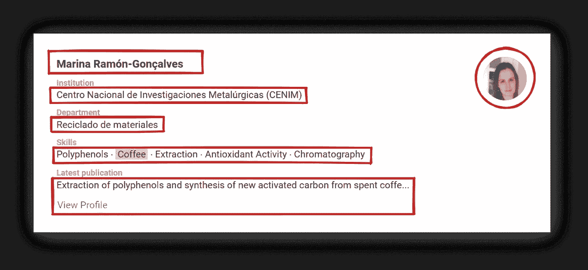

# Scrape ResearchGate 所有作者，研究人员在 Python

> 原文：<https://medium.com/geekculture/scrape-researchgate-all-authors-researchers-in-python-63c4d9e3a104?source=collection_archive---------16----------------------->

# 会刮什么



# 先决条件

**CSS 选择器基础知识抓取**

如果你没有使用过 CSS 选择器，我有一篇专门的博文是关于[如何在抓取网页时使用 CSS 选择器](https://serpapi.com/blog/web-scraping-with-css-selectors-using-python/)的，它涵盖了什么是 CSS 选择器，优点和缺点，以及为什么从抓取网页的角度来看它们很重要，并展示了抓取网页时使用 CSS 选择器的最常见的方法。

**独立的虚拟环境**

如果你以前没有使用过虚拟环境，可以看看我的博客文章《使用 Virtualenv 和 poeties》中专门的 [Python 虚拟环境教程来熟悉一下。](https://serpapi.com/blog/python-virtual-environments-using-virtualenv-and-poetry/)

**降低被屏蔽的几率**

请求有可能被阻止。看看[如何降低抓取网页时被屏蔽的几率](https://serpapi.com/blog/how-to-reduce-chance-of-being-blocked-while-web/)，有 11 种方法可以绕过大多数网站的屏蔽。

📌注意:如果您将在没有代理的情况下使用这个代码片段，请求将在很短的时间内被阻塞。用代理抓取大量数据是一条路要走。

**安装库**:

```
pip install parsel playwright
```

# 完整代码

```
from parsel import Selector
from playwright.sync_api import sync_playwright
import json def scrape_researchgate_profile(query: str):
    with sync_playwright() as p: browser = p.chromium.launch(headless=True, slow_mo=50)
        page = browser.new_page(user_agent="Mozilla/5.0 (Windows NT 10.0; Win64; x64) AppleWebKit/537.36 (KHTML, like Gecko) Chrome/101.0.4951.64 Safari/537.36") authors = []
        page_num = 1 while True:
            page.goto(f"https://www.researchgate.net/search/researcher?q={query}&page={page_num}")
            selector = Selector(text=page.content()) for author in selector.css(".nova-legacy-c-card__body--spacing-inherit"):
                name = author.css(".nova-legacy-v-person-item__title a::text").get()
                thumbnail = author.css(".nova-legacy-v-person-item__image img::attr(src)").get()
                profile_page = f'https://www.researchgate.net/{author.css("a.nova-legacy-c-button::attr(href)").get()}'
                institution = author.css(".nova-legacy-v-person-item__stack-item:nth-child(3) span::text").get()
                department = author.css(".nova-legacy-v-person-item__stack-item:nth-child(4) span").xpath("normalize-space()").get()
                skills = author.css(".nova-legacy-v-person-item__stack-item:nth-child(5) span").xpath("normalize-space()").getall()
                last_publication = author.css(".nova-legacy-v-person-item__info-section-list-item .nova-legacy-e-link--theme-bare::text").get()
                last_publication_link = f'https://www.researchgate.net{author.css(".nova-legacy-v-person-item__info-section-list-item .nova-legacy-e-link--theme-bare::attr(href)").get()}' authors.append({
                    "name": name,
                    "profile_page": profile_page,
                    "institution": institution,
                    "department": department,
                    "thumbnail": thumbnail,
                    "last_publication": {
                        "title": last_publication,
                        "link": last_publication_link
                    },
                    "skills": skills,
                })

            print(f"Extracting Page: {page_num}") # checks if next page arrow key is greyed out `attr(rel)` (inactive) -> breaks out of the loop
            if selector.css(".nova-legacy-c-button-group__item:nth-child(9) a::attr(rel)").get():
                break
            else:
                # paginate to the next page
                page_num += 1 print(json.dumps(authors, indent=2, ensure_ascii=False)) browser.close()

scrape_researchgate_profile(query="coffee")
```

# 代码解释

导入库:

```
from parsel import Selector
from playwright.sync_api import sync_playwright
import json
```

*   `[parsel](https://parsel.readthedocs.io/)`解析 HTML/XML 文档。支持 XPath。
*   `[playwright](https://playwright.dev/python/docs/intro#first-script)`用浏览器实例渲染页面。
*   `json`将 Python 字典转换成 JSON 字符串。

定义一个函数，用[上下文管理器](https://book.pythontips.com/en/latest/context_managers.html)打开一个`playwright`:

```
def scrape_researchgate_profile(query: str):
    with sync_playwright() as p:
        # ...
```

*   `query: str`告诉 Python`query`应该是一个`str`。

午餐一个浏览器实例，打开`new_page`并传递`user-agent`:

```
browser = p.chromium.launch(headless=True, slow_mo=50)
page = browser.new_page(user_agent="Mozilla/5.0 (Windows NT 10.0; Win64; x64) AppleWebKit/537.36 (KHTML, like Gecko) Chrome/101.0.4951.64 Safari/537.36")
```

*   `[p.chromium.launch()](https://github.com/microsoft/playwright-python/blob/3b7968fb2ea4238a89447b3c7766f9f1f9c9c0e3/playwright/sync_api/_generated.py#L11423)`启动 Chromium 浏览器实例。
*   `[headless](https://github.com/microsoft/playwright-python/blob/3b7968fb2ea4238a89447b3c7766f9f1f9c9c0e3/playwright/sync_api/_generated.py#L11500-L11504)`明确告诉`playwright`以无头模式运行，即使它是一个默认值。
*   `[slow_mo](https://github.com/microsoft/playwright-python/blob/3b7968fb2ea4238a89447b3c7766f9f1f9c9c0e3/playwright/sync_api/_generated.py#L11514-L11515)`告诉`playwright`放慢执行速度。
*   `[browser.new_page()](https://playwright.dev/python/docs/api/class-browser#browser-new-page)`打开新的一页。
*   `user_agent`用于扮演真实用户从浏览器发出请求。如果不使用，将默认为`playwright`值，即`None`。[检查你的用户代理是什么](https://www.whatismybrowser.com/detect/what-is-my-user-agent/)。

添加一个临时列表，设置一个 while 循环，并打开一个新的 URL:

```
authors = []while True:
    page.goto(f"https://www.researchgate.net/search/researcher?q={query}&page={page_num}")
    selector = Selector(text=page.content())
    # ...
```

*   `goto()`使用传递的查询和页面参数向特定 URL 发出请求。
*   `Selector()`用`page.content()`传递返回的 HTML 数据并进行处理。

迭代每个页面上的作者结果，提取数据并将`append`保存到临时的`list`:

```
for author in selector.css(".nova-legacy-c-card__body--spacing-inherit"):
    name = author.css(".nova-legacy-v-person-item__title a::text").get()
    thumbnail = author.css(".nova-legacy-v-person-item__image img::attr(src)").get()
    profile_page = f'https://www.researchgate.net/{author.css("a.nova-legacy-c-button::attr(href)").get()}'
    institution = author.css(".nova-legacy-v-person-item__stack-item:nth-child(3) span::text").get()
    department = author.css(".nova-legacy-v-person-item__stack-item:nth-child(4) span").xpath("normalize-space()").get()
    skills = author.css(".nova-legacy-v-person-item__stack-item:nth-child(5) span").xpath("normalize-space()").getall()
    last_publication = author.css(".nova-legacy-v-person-item__info-section-list-item .nova-legacy-e-link--theme-bare::text").get()
    last_publication_link = f'https://www.researchgate.net{author.css(".nova-legacy-v-person-item__info-section-list-item .nova-legacy-e-link--theme-bare::attr(href)").get()}' authors.append({
        "name": name,
        "profile_page": profile_page,
        "institution": institution,
        "department": department,
        "thumbnail": thumbnail,
        "last_publication": {
            "title": last_publication,
            "link": last_publication_link
        },
        "skills": skills,
    })
```

*   `css()` [从传递的 CSS 选择器中解析数据](https://github.com/scrapy/parsel/blob/90397dcd0b2c1cbb91e44f65c50f9e11628ba028/parsel/selector.py#L351-L362)。使用 `[csselect](https://github.com/scrapy/parsel/blob/90397dcd0b2c1cbb91e44f65c50f9e11628ba028/parsel/selector.py#L357-L358)` [包](https://github.com/scrapy/parsel/blob/90397dcd0b2c1cbb91e44f65c50f9e11628ba028/parsel/selector.py#L357-L358)将每个 [CSS 查询转换成 XPath。](https://github.com/scrapy/parsel/blob/90397dcd0b2c1cbb91e44f65c50f9e11628ba028/parsel/selector.py#L357-L358)
*   `::text` / `::attr(attribute)` [从节点中提取文本或属性数据](https://github.com/scrapy/parsel/blob/90397dcd0b2c1cbb91e44f65c50f9e11628ba028/parsel/csstranslator.py#L48-L51)。
*   `get()`/`getall()`/[从匹配的节点](https://github.com/scrapy/parsel/blob/90397dcd0b2c1cbb91e44f65c50f9e11628ba028/parsel/selector.py#L197-L204)获取实际数据，或者[从节点](https://github.com/scrapy/parsel/blob/90397dcd0b2c1cbb91e44f65c50f9e11628ba028/parsel/selector.py#L447-L451)获取匹配数据的/`[list](https://github.com/scrapy/parsel/blob/90397dcd0b2c1cbb91e44f65c50f9e11628ba028/parsel/selector.py#L447-L451)`[。](https://github.com/scrapy/parsel/blob/90397dcd0b2c1cbb91e44f65c50f9e11628ba028/parsel/selector.py#L447-L451)
*   `xpath("normalize-space()")`解析空白文本节点。默认情况下，XPath 会跳过空白文本节点。

检查下一页是否存在并分页:

```
# checks if the next page arrow key is greyed out `attr(rel)` (inactive) -> breaks out of the loop
if selector.css(".nova-legacy-c-button-group__item:nth-child(9) a::attr(rel)").get():
    break
else:
    page_num += 1
```

打印提取的数据，以及`close`浏览器实例:

```
print(json.dumps(authors, indent=2, ensure_ascii=False))browser.close()# call the function
scrape_researchgate_profile(query="coffee")
```

JSON 输出的一部分:

```
[
  {
    "name": "Marina Ramón-Gonçalves", # first profile
    "profile_page": "https://www.researchgate.net/profile/Marina-Ramon-Goncalves?_sg=VbWMth8Ia1hDG-6tFnNUWm4c8t6xlBHy2Ac-2PdZeBK6CS3nym5PM5OeoSzha90f2B6hpuoyBMwm24U",
    "institution": "Centro Nacional de Investigaciones Metalúrgicas (CENIM)",
    "department": "Reciclado de materiales",
    "thumbnail": "https://i1.rgstatic.net/ii/profile.image/845010970898442-1578477723875_Q64/Marina-Ramon-Goncalves.jpg",
    "last_publication": {
      "title": "Extraction of polyphenols and synthesis of new activated carbon from spent coffe...",
      "link": "https://www.researchgate.netpublication/337577823_Extraction_of_polyphenols_and_synthesis_of_new_activated_carbon_from_spent_coffee_grounds?_sg=2y4OuZz32W46AWcUGmwYbW05QFj3zkS1QR_MVxvKwqJG-abFPLF6cIuaJAO_Mn5juJZWkfEgdBwnA5Q"
    },
    "skills": [
      "Polyphenols",
      "Coffee",
      "Extraction",
      "Antioxidant Activity",
      "Chromatography"
    ]
  }, ... other profiles
  {
    "name": "Kingsten Okka", # last profile
    "profile_page": "https://www.researchgate.net/profile/Kingsten-Okka?_sg=l1w_rzLrAUCRFtoo3Nh2-ZDAaG2t0NX5IHiSV5TF2eOsDdlP8oSuHnGglAm5tU6OFME9wgfyAd-Rnhs",
    "institution": "University of Southern Queensland ",
    "department": "School of Agricultural, Computational and Environmental Sciences",
    "thumbnail": "https://i1.rgstatic.net/ii/profile.image/584138105032704-1516280785714_Q64/Kingsten-Okka.jpg",
    "last_publication": {
      "title": null,
      "link": "https://www.researchgate.netNone"
    },
    "skills": [
      "Agricultural Entomology",
      "Coffee"
    ]
  }
]
```

# 链接

*   [GitHub 要诀](https://gist.github.com/dimitryzub/4bce8fdb02629c47e7c8011668349589)

加入我们在推特上的讨论

添加一个[特征请求](https://github.com/serpapi/public-roadmap/issues)💫还是一个 [Bug](https://github.com/serpapi/public-roadmap/issues) 🐞