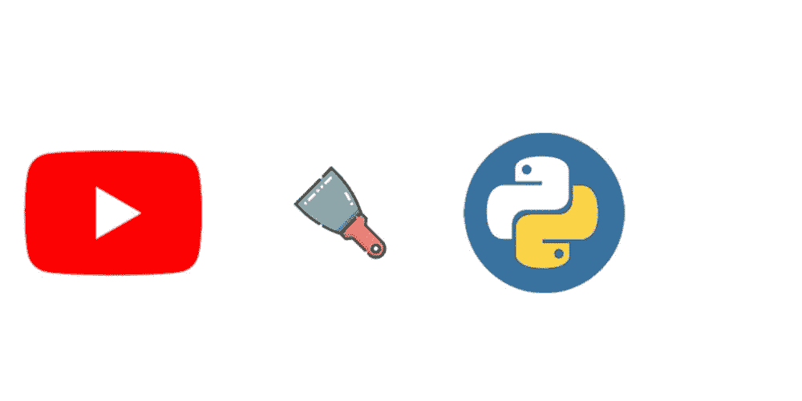
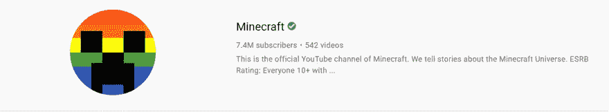

# 用 Python 抓取 YouTube 搜索(第 1 部分)

> 原文：<https://medium.com/geekculture/scrape-youtube-search-with-python-part-1-7521a0f40315?source=collection_archive---------11----------------------->



内容:[简介](#8f9b)，[导入](#3eec)，[视频搜索](#dc4e)， [fuckit 模块](#b9cf)，[广告](#7c3d)，[频道结果](#5d08)，[链接](#790c)， [outro](#de4c) 。

# 介绍

这篇博文将展示如何抓取 YouTube 有机搜索、广告和频道结果。

**每个部分都有一个屏幕截图，显示正在刮削的部分。**

我决定使用不是最快的解决方案`Selenium`,但是我想把所有东西都放到搜索结果页面的底部，这可以通过直接调用 DOM 来实现，如下所示:

# 进口

```
from selenium import webdriver
from serpapi import GoogleSearch
import json, time # this two could be skipped (prettier output/time buffer)
```

# 视频搜索结果


# [Fuckit 模块](https://github.com/ajalt/fuckitpy)

如果你不喜欢太多的`try/except`块或者你说:“ [*某些代码有错误？去他妈的。*](https://github.com/ajalt/fuckitpy#the-python-error-steamroller) "，然后您可以使用 [fuckit](https://github.com/ajalt/fuckitpy#as-a-context-manager) 模块中的上下文管理器继续运行，跳过导致错误的语句:

# 使用 [YouTube 视频结果 API](https://serpapi.com/youtube-video-results)

# 广告结果


# 使用 [YouTube 广告结果 API](https://serpapi.com/youtube-ad-results)

# 渠道结果



# 使用 [YouTube 频道结果 API](https://serpapi.com/youtube-channel-results)

# 链接

[在线 IDE 中的代码](https://replit.com/@DimitryZub1/Scrape-YouTube-Search-organic-ads-channel-results#main.py)
[YouTube 搜索引擎结果 API](https://serpapi.com/youtube-search-api)

# 结尾部分

你也可以通过使用`requests-html`库抓取 YouTube，你仍然需要通过调用`[html.render()](https://docs.python-requests.org/projects/requests-html/en/latest/#javascript-support)`来渲染页面，我没有测试它比`selenium`快多少。

`Selenium`也可以在 Firefox 中运行[无头](https://www.selenium.dev/documentation/en/driver_idiosyncrasies/driver_specific_capabilities/#firefox)模式。如果第一个解决方案不适合你，看看 StackOverflow 的 [this](https://stackoverflow.com/a/55834112/15164646) 或 [this](https://stackoverflow.com/a/53967684/15164646) 答案。Firefox webdriver [下载](https://github.com/mozilla/geckodriver/releases/)。

或者如果你在 Chrome 上使用`selenium`，你可以像[这样做](https://stackoverflow.com/a/46929945/15164646)。Chrome webdriver [下载](https://github.com/ajalt/fuckitpy)。

如果你想知道如何用 SerpApi 做一些特别的东西或项目，请给我写个消息。

*原载于 2021 年 6 月 20 日*[*https://dev . to*](https://dev.to/dimitryzub/scrape-youtube-search-with-python-part-1-j12)*。*