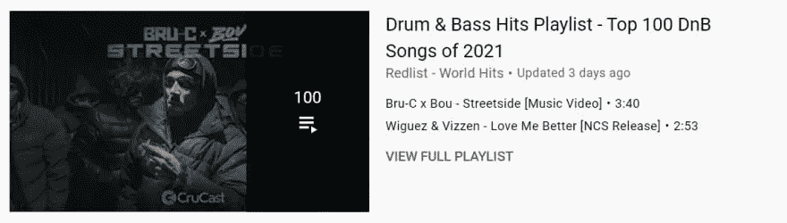

# 用 Python 抓取 YouTube 搜索(第 2 部分)

> 原文：<https://medium.com/geekculture/scrape-youtube-search-with-python-part-2-285699904bd5?source=collection_archive---------70----------------------->

内容:[简介](#1249)，[播放列表](#d600)，[电影](#5f05)，[分类结果](#3ed0)，[链接](#7200)，[结尾](#b0f0)。

# 介绍

这篇博文是上一篇[博文](https://dev.to/dimitryzub/scrape-youtube-search-with-python-part-1-j12)的续篇，在那篇博文中，我们搜集了视频搜索、广告和频道结果。这篇博文将包含如何从 YouTube 搜索结果中抓取播放列表、电影和类别的信息。

每个部分将包括一个屏幕截图，显示什么将被废弃。

# 播放列表

# 使用 [YouTube 播放列表结果 API](https://serpapi.com/youtube-playlist-results)

# 电影

## 使用 [YouTube 电影结果 API](https://serpapi.com/youtube-movie-results)

# 种类

# 使用 [YouTube 类别结果 API](https://serpapi.com/youtube-category-results)

# 链接

[在线 IDE](https://replit.com/@DimitryZub1/Scrape-YouTube-search-playlist-movie-category#main.py) 中的代码(*注:有时 replit 在使用* `*selenium*` *时会抛出错误，即使在 replit 内部添加了几个运行参数之后。如果发生这种情况，请在本地运行代码。*)

[YouTube 搜索引擎结果 API](https://serpapi.com/youtube-search-api)

# 结尾部分

如果你想看如何用 SerpApi 刮一些具体的东西或做一个项目，请给我留言。或者，如果你觉得这很难阅读/理解，请告诉我！

*原载于 2021 年 6 月 21 日*[*https://dev . to*](https://dev.to/dimitryzub/scrape-youtube-search-with-python-part-2-29jc)*。*