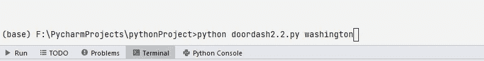
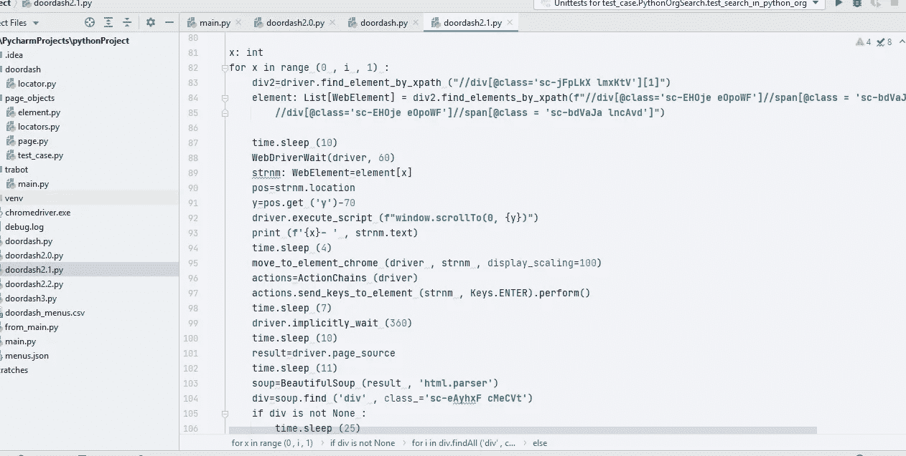

# 刮一个动态网站，硒第二部分

> 原文：<https://medium.com/geekculture/scraping-a-dynamic-website-selenium-part-ii-1f30a4b59285?source=collection_archive---------23----------------------->

在第一部中，我用一种不同的方法为餐馆的菜单搜集了 doordash.com。这是我的第二种方法。

> **第一次进场总结**

抓取器导航到 URL(doordash.com)，点击一个食品项目(这打开了纽约食品商店的页面)，点击每个商店，抓取菜单，返回商店的页面，重复这个循环，直到它抓取了 10，000-10，050 个菜单。如果需要，可以点击下一页按钮。

> **第二部**

# 第二种方法(这一种)

这一次，我希望能够在终端中输入一个带有脚本名称的手动搜索字符串。为此，我不想打开脚本进行编辑。当它到达目标时，它给出完成的消息，将数据保存为 CSV，并停止脚本。

以下是我的解决方案:

1-导入特定的库/模块

```
# importing required libraries
import ctypes
import time
from typing import List
import pandas as pd
from bs4 import BeautifulSoup
from selenium.webdriver import Chrome , ActionChains
from selenium.webdriver.common.keys import Keys
from selenium.webdriver.remote.webelement import WebElement
from selenium.webdriver.support.wait import WebDriverWait
from selenium.webdriver.chrome.options import Options
from selenium_move_cursor.MouseActions import move_to_element_chromeimport sys
```

2-在无头浏览器中打开 URL

```
# The URLurl = **'https://www.doordash.com/en-US'**# defining driver and adding the “ — headless” argument
opts = Options()
opts.add_argument(**'— headless'**)
driver = Chrome(**'chromedriver'**)
# open the URL
driver.maximize_window()
driver.get(url)
driver.implicitly_wait(220)time.sleep(5)
```

3-聚焦当前窗口

```
# to focus the current window
driver.switch_to.window(driver.window_handles[0])time.sleep(10)
```

4-下面的代码为食品店的位置设置默认的搜索字符串

```
# to focus the current window
driver.switch_to.window(driver.window_handles[0])time.sleep(10)
```

5-下面的代码允许我们搜索手动位置的食品店。

```
# (Manual Search String, sys.argv will interact with the terminal, 2nd argument will is
# the search string of location
if len(sys.argv) >= 2:
    search_query = sys.argv[1]
    print(search_query)
```

在终端中，我们将在 python 脚本的名称之后写入这个位置名称(例如，纽约、华盛顿)。



open the script with terminal

6-在搜索输入中输入位置名称

```
# send location to search element
driver.find_element_by_css_selector(**"input[class='sc-eZXMBi ghseVd']"**).send_keys(search_query)
time.sleep(3)
# click on search button
driver.find_element_by_css_selector(**"button[class='sc-Ehqfj dtSIZX']"**).click()
driver.implicitly_wait(120)
```

7-定义存储名称和价格的列表

```
# lists
names = []
prices = []
```

8-获取页面上商店的数量。这次只有一个包含所有商店的页面。

```
time.sleep(5)
stores=driver.find_element_by_xpath (**"//div[@class='sc-kRCAcj exCpGm']**\
 **//div[@class='sc-zDqdV iEhWpB']//span[@class='sc-bdVaJa hQDtnE']"**)
number=stores.text
```

正文中给出了商店的数量。所以，我们将从文本中提取数字。



```
strNo=[int (s) for s in number.split () if s.isdigit ()]
for i in strNo :
    i=i
print(i)
```

现在，循环开始了。

```
x: int
for x in range (0 , i , 1) :
```

这里，“I”是从字符串中提取的商店的数量。

9-在页面上搜索商店(其余代码在上面的“for 循环”下运行)

```
div2=driver.find_element_by_xpath (**"//div[@class='sc-jFpLkX lmxKtV'][1]"**)
element: List[WebElement] = div2.find_elements_by_xpath(**f"//div[@class='sc-EHOje eOpoWF']**\
 **//span[@class = 'sc-bdVaJa bTYYIJ']|//div[@class='sc-EHOje eOpoWF']**\
 **//span[@class = 'sc-bdVaJa lncAvd']"**)
```

10-在“for 循环”的每次迭代中，逐一点击每个商店，然后点击打开它

```
time.sleep (10)
WebDriverWait(driver, 60)
strnm: WebElement=element[x]
pos=strnm.location
y=pos.get (**'y'**)-70
driver.execute_script (**f"window.scrollTo(0,** {y}**)"**)
print (**f'**{x}**- '** , strnm.text)
time.sleep (4)
move_to_element_chrome (driver , strnm , display_scaling=100)
actions=ActionChains (driver)
actions.send_keys_to_element (strnm , Keys.ENTER).perform()
time.sleep (7)
driver.implicitly_wait (360)
time.sleep (10)
```

11-点击每个商店后，在 BeautifulSoup 中设置页面源，并抓取菜单

```
result=driver.page_source
time.sleep (11)
soup=BeautifulSoup (result , **'html.parser'**)
div=soup.find (**'div'** , class_=**'sc-eAyhxF cMeCVt'**)
if div is not None :
    time.sleep (25)
    for i in div.findAll (**'div'** , class_=**"sc-bscRGj hsYyqR"**) :
        pros=i.find (**'span'** , class_=**"sc-bdVaJa gImhEG"**)
        print (**'writing ('** , pros.text , **') to disk'**)
        names.append (pros.text)
        rates=i.find (**'span'** , class_=**"sc-bdVaJa eEdxFA"**)
        # if there is no price for the food, append 'N/A' in the list of 'prices'
        if rates is not None :
            print (**'price: '** , rates.text)
            rate=rates.text
        else :
            print (**'N/A'**)
            rate=**'N/A'** prices.append (rate)
        length: int=len (names)
```

(在 [Part-I](/swlh/scraping-a-dynamic-web-page-its-selenium-da161999c975) 中，我已经解释了这几行。)

12-如果达到抓取目标，将结果保存为 CSV，给出完成消息，并退出。

```
# if menu record reaches the target, exit the script target completion message box
            if length>150 :
                # save to dataframe
                df=pd.DataFrame ({**'Name'** : names , **'Price'** : prices}) # export as csv file
                df.to_csv (**'doordash_menus.csv'**)
                driver.close ()
                ctypes.windll.user32.MessageBoxW (0 ,
                                                  **f'Congratulations! We have successfully** \
 **scraped** {length} **menus.'** ,
                                                  **'Project Completion'** , 1)
                break
                sys.exit()
            else :
                continue
        driver.back ()
        continue
    else :
        driver.back ()
        continue
# Project Succeeded
```

{按顺序进行。}

在下一个方法中，我想在没有 BeautifulSoup 的情况下使用它，并保存一个 JSON 输出。

快乐编码。