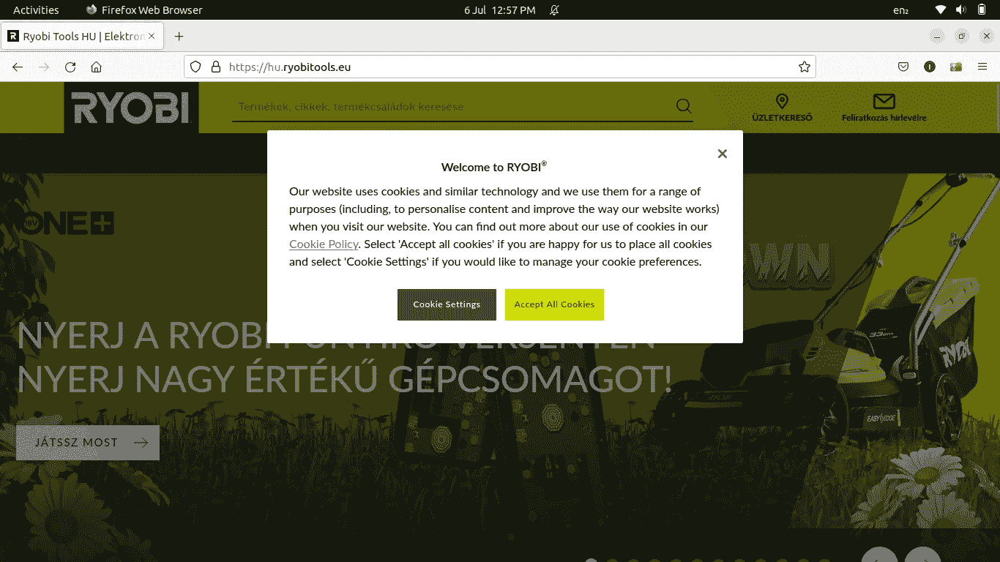
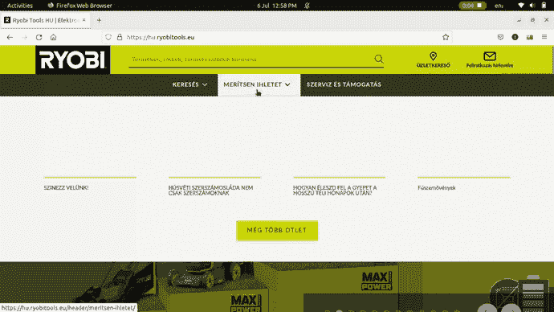

# 刮一个动态网站，硒第五部分

> 原文：<https://medium.com/geekculture/scraping-a-dynamic-website-selenium-part-v-50fd5fc386cb?source=collection_archive---------11----------------------->

随着时间的推移，开发人员已经成长到足以克服网站中 Java 脚本的挑战。但是，这是一个目的。由于开发者已经学习和开发了很多关于抓取网站的知识，网站开发者也开发了新的策略来对付抓取工具。

这次我的挑战是摧毁一个匈牙利网站。虽然语言不是一个大的挑战，但网站本身却是一个从其中删除数据的挑战。这是我刮的网站。

[](https://hu.ryobitools.eu/) [## ryobi Tools HU | elektro mos kézisserszámok，ONE+，kertigépek，36V

### 费代兹·费尔 a one+HP gépcsaláDJát . a ryobi 18v-OS 纳吉·teljesítményűgépcsaládja fejlett technologiával，TBB…

hu.ryobitools.eu](https://hu.ryobitools.eu/) 

## 我的目标是什么？这里的挑战是什么？我是如何应对的？

**目标:**

我的目标是从网站上，从几乎所有的菜单上获取产品的详细信息和图片。

**挑战:**

1-接受 cookies 警告



image showing cookies handler for https://hu.ryobitools.eu

2-菜单的交互行为，也就是说，要获得所有菜单选项的列表，我必须单击主菜单选项，然后单击子菜单，然后子子菜单等等。所有主菜单选项都要重复这一步骤。



hu.ryobitool.eu interactive menu

3- Session expiration:为了删除产品的信息，我首先收集所有产品的链接，然后为每个产品的链接删除它的信息。但是，由于大量的链接和缓慢的网络，会话通常会在一些迭代/链接后过期。

**解决方案:**

1-cookie 警告:这很容易处理。在下面的代码行中，只需找到 cookie 警告，然后接受它们。

```
def open_url(self, url) -> None:        
    # self.driver = Chrome()                
    time.sleep(0.2)
    self.driver.get(url) self.driver.maximize_window()        
    time.sleep(.1)         
    try:            
        Alert(self.driver).dismiss()        
    except:            
        ...         
    # cookie handler       
    try:            
        self.driver.find_element(By.ID, 'onetrust-accept-btn-handler').click()           
        time.sleep(random.choice(self.sleeps))
    except:
        ... return self.driver.current_url
```

2-交互式菜单:为了解决这个问题，我实现了不同的功能。在 While 循环中。下面是详细的解决方案。

```
class Ryobi(Support):        
    def __init__(self) -> None:
        super().__init__()
        self.ryo_ini = 0
        self.cat_ini = 1
        self.sub_cat_ini = 10
        self.sub_sub_cat_ini = 0
        self.cat_len = 0
        self.sub_cat_len = 0
        self.sub_sub_cat_len = 0
        self.link_counter = 0
```

这个网站的 scraper 是我的支持类的一个实例，我曾经创建它来抓取网站的支持链接，我没有做太多的修改。

这个构造函数包含一些定义，是我的脚本的基础。

```
self.cat_ini => index counter for main categories
self.sub_cat_ini => index counter for sub-categories
self.sub_sub_cat_ini => index counter for sub-sub-categories
self.cat_len => total length counter for main categories
self.sub_cat_len => total length counter for sub-categories
self.sub_sub_cat_len => total length counter for sub-sub-categories
self.link_counter => counter for links
```

这就是这些变量的重要性。

**self.cat_ini** 初始设置为 1，即从找到的类别的第二个索引开始。因为第一个索引是一些不相关的链接。它将保持不变，直到它的所有子类别和子子类别的产品链接都被删除。当主类别的所有子类别和子子类别都被刮到时，它将增加 1。这将增加到主要类别的总长度。

**self.sub_cat_ini，**子类别的索引计数器将保持不变，直到其所有子子类别的产品链接都被删除。当所有的子子类别都被清除后，该索引器将被重置为“0”。

**self.sub_sub_cat_ini，**子子类别的索引器，在保持其父子类和主类索引计数器的情况下只增加 1。

**self.cat_len** 是主要类别的总数。这是增加 **self.cat_ini 的极限。**当 this main index 等于 main categories 的计数时，循环将中断，流程将结束。

**self.sub_cat_len** 是主类别的子类别总数。当 **self.sub_cat_ini** 等于 **self.sub_cat_len** 时，将 **self.cat_ini** 加 1。

```
if self.sub_cat_ini == self.sub_cat_len:
    self.sub_cat_ini = 0
    self.sub_cat_len = 0
    self.cat_ini += 1
```

**self.sub_sub_cat_len** 为主类别的子类别的子子类别总数。 **self.cat_ini** 和 **self.sub_cat_ini** 保持不变，直到 **self.sub_sub_cat_ini** 等于 **self.sub_sub_cat_len** 。

```
if self.sub_cat_ini == self.sub_cat_len:
    self.sub_cat_ini = 0
    self.sub_cat_len = 0
    self.cat_ini += 1
```

下面是完整的伪代码实现。

```
while True:
    get main categories
    if self.cat_len ==0:
        self.cat_len = length(main categories)
    categories[self.cat_ini].click() # click on the particular main category
    get sub-categories
    if self.sub_cat_len == 0:
        self.sub_cat_len = length(sub_categories)
    sub_cats[self.sub_cat_ini].click() # click open a sub-category

    # try to find sub-sub-categories of a sub-category
    sub_sub_cats = []
    try:
        sub_sub_cats = self.driver.find_elements(By.CLASS_NAME, 'CategoryDropdownstyles__Link-kkzqgd-9')
    except:
        ... if length(sub_sub_cats)>0 and self.sub_sub_cat_len == 0:
        self.sub_sub_cat_len = length(sub_sub_cats)
    if length(sub_sub_cats)>0:
        sub_sub_cats[self.sub_sub_cat_ini].click()
        print(f'now on sub sub category: {self.sub_sub_cat_ini}')
        self.sub_sub_cat_ini += 1 products = get_products from the current link, that is either from sub-categories or from sub-sub-categoriesi = 1
    for link in products:
        if self.link_counter>0:
            print(f'saving record number: {i}, in the dataset for the link: ', link)                    
            ryo = os.path.join(cur_dir, f'scraped_data/hu.ryobytools.eu-sample.xlsx')
            get_details_of_the_product(link, ryo, which='ryobi')
            i+=1 if self.sub_sub_cat_ini == self.sub_sub_cat_len:
        self.sub_sub_cat_ini = 0
        self.sub_sub_cat_len = 0
        self.sub_cat_ini += 1 if self.sub_cat_ini == self.sub_cat_len:
        self.sub_cat_ini = 0
        self.sub_cat_len = 0
        self.cat_ini += 1 if self.cat_ini == self.cat_len:
        break
```

3-第三个问题在下面的代码片段中处理:

```
try:
    self.driver.get(url)
except:
    self.driver.start_session({})
    self.driver.maximize_window()
    time.sleep(0.2)
    self.driver.get(url)
```

所以，就这样我得到了解决办法。[这里的](https://github.com/Irfan-Ahmad-byte/hungarian_scraping_proj)是指向包含我的解决方案的我的存储库的链接。我为这个项目使用了不同的解决方案。该库还包含通过 docker 使用 selenium hub 的设置，这是我的优先事项。它还包括独立 selenium 的设置。

如果你是新来的，你可以查看这个系列的[第一部分](/swlh/scraping-a-dynamic-web-page-its-selenium-da161999c975?source=your_stories_page-------------------------------------)、[第二部分](/geekculture/scraping-a-dynamic-website-selenium-part-ii-1f30a4b59285?source=your_stories_page-------------------------------------)、[第三部分](/geekculture/scraping-a-dynamic-website-selenium-part-iii-7138d2a3131?source=your_stories_page-------------------------------------)和[第四部分](/geekculture/scraping-dynamic-websites-through-remote-webdrivers-selenium-part-iv-424b6a9cc02d?source=your_stories_page-------------------------------------)。

接下来我将在这个系列中发表一篇文章

> 刮个动态网站，但不是硒。