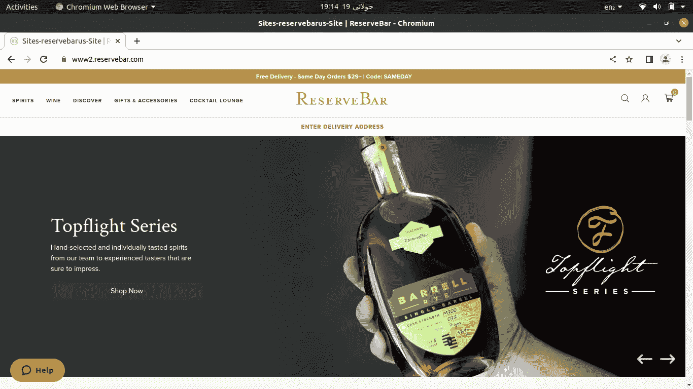
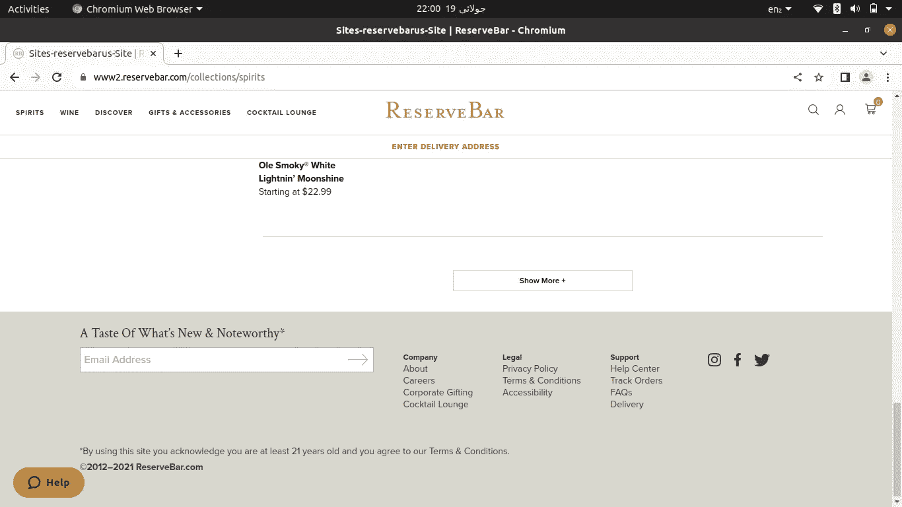

# 抓取动态网站，没有硒，第一部分

> 原文：<https://medium.com/geekculture/scraping-a-dynamic-website-without-selenium-part-i-c1fec0d302bd?source=collection_archive---------1----------------------->

我们，网页抓取者，知道使用 Selenium 抓取动态网站。但是，经过一些经验和探索，我们发现硒并不总是必要的。

这很容易理解。毕竟，所有的网站都使用一些 API 或网页挂钩。用户通过 GET、POST 或任何此类请求与网站进行交互。作为网页抓取者，我们只想从网站上获取数据。并且，网站从/向一些数据库加载/发送数据。为了使用/呈现这些数据，网站使用 API。我们只需要找到这些请求，模仿它们并保存数据。

几天前，我尝试了同样的方法。我必须从 [Reservebar](https://www2.reservebar.com/) 收集产品数据。但是挑战在于我必须为一个特定的地点收集所有的东西。

在主页上，我们可以看到标题中的类别和标题下方的“输入送货地址”字段。



www2.reservebar.com home page

因此，我们有 4 个类别，精神到礼物和配件。要查找特定位置的产品，我们必须单击位置字段并输入地址，然后它会显示一个地址列表，我们必须单击一个地址来填写字段，然后单击“保存”。这保存了位置，我们能够获得该位置的产品。这样做可以向产品添加一个标签，显示产品在该位置是否可用。



www2.reservebar.com category page showing show more button

当我们打开一个类别时，它不会显示所有的产品，而是显示它的一些产品和一个“显示更多”按钮。要获得更多的产品，我们必须点击这个按钮，直到我们得到所有的产品。

当然，这可以用硒很容易地做到。

但是，我没有硒。

# 无硒溶液

以下是我在没有硒的情况下是如何做到的。

对于我们的目的来说，在标题中获得四个类别的所有产品就足够了。所以，我刚刚创建了一个包含四个类别的列表。

```
collections = ['spirits', 'wine', 'discover', 'gifts-accessories']
```

对于每个类别的 URL，我只是将名称附加到我们的主链接上

```
https://www2.reservebar.com/collections/{category}
```

这将搜索每个链接，而不是单击主页上的每个链接。

使用开发工具，我能够找到点击“显示更多”按钮时触发的请求。所以，我复制了那个请求及其标题和 cookies。饼干帮助确定了位置。

## 使用请求

所以，这里是我如何点击“显示更多”按钮，而不是真正打开浏览器。让我把整个剧本分成几部分。

1-以下代码行包含请求的 cookies

```
import requestsfrom bs4 
import BeautifulSoup as bs
import pandas as pdroot_url = "https://www2.reservebar.com" # products' addresses will be appended to this root URLpayload={} # an empty data payload # headers for our requestheaders = {  'authority': 'www2.reservebar.com',  'accept': 'text/html,application/xhtml+xml,application/xml;q=0.9,image/avif,image/webp,image/apng,*/*;q=0.8,application/signed-exchange;v=b3;q=0.9',  'accept-language': 'en-US,en;q=0.9',  'cache-control': 'max-age=0',  'sec-ch-ua': '"Chromium";v="103", ".Not/A)Brand";v="99"',  'sec-ch-ua-mobile': '?0',  'sec-ch-ua-platform': '"Linux"',  'sec-fetch-dest': 'document',  'sec-fetch-mode': 'navigate',  'sec-fetch-site': 'none',  'sec-fetch-user': '?1',  'upgrade-insecure-requests': '1',  'user-agent': 'Mozilla/5.0 (X11; Linux x86_64) AppleWebKit/537.36 (KHTML, like Gecko) Chrome/103.0.5060.53 Safari/537.36',  'Cookie': '__cq_dnt=1; dw_dnt=1; dwanonymous_a40f731d0711af5eb64499a73962349d=acufdphn0DuqzTqpqehaZp0DTc; dwsid=__EYAfXIo7BoEcYW1pQyOh0NcUmbp9wkncr3rR5ZPH6TknOGh6nHxPMEspRdXYKdgSkuZdsQqkrhWpEOf8P0NA==; sid=P67PVuk3mQcAmmYLM16Xkt1Sph6HWOaT9UE'}
```

这些标题中的 Cookies 起到了设置位置的作用。

2-下面给出的这些行是用于存储数据的列表

```
# list of categories
collections = ['spirits', 'wine', 'discover', 'gifts-accessories'] # list to store products' links
products_links = []
```

3-下面的所有行都在 for 循环中

```
# for each category in the categories' list
for cat in collections: # set its URL
    cat_url = f"https://www2.reservebar.com/collections/{cat}"
    # send a GET request to the URL
    cat_res = requests.request("GET", cat_url, headers=headers, data=payload)
    # find the total number of results/products in that category
    soup = bs(cat_res.text, 'html.parser')
    more_results = soup.find('span', class_='results-span').get_text().strip().split(' ')[0].split(',')
    results = int(''.join(more_results)) # print the total number of products in that category
    print(f"link: {cat_url}", " results: ",results)
```

首先，我使用下面的代码行一次性获得所有产品。

```
show_more_link = f"https://www2.reservebar.com/on/demandware.store/Sites-reservebarus-Site/default/Search-UpdateGrid?cgid={cat}&start={start}&sz={size}&selectedUrl=https%3A%2F%2Fwww2.reservebar.com%2Fon%2Fdemandware.store%2FSites-reservebarus-Site%2Fdefault%2FSearch-UpdateGrid%3Fcgid%3D{cat}%{results}start%3D{1}%{results}sz%3D{results}"
```

但它仍然无法加载全部源代码。所以我把这个请求分成几部分发送，也就是说，我没有一次加载所有的产品，而是加载了比实际脚本更多的产品。我加载了 100 个产品，直到所有产品都加载完毕。为此，我在父“for loop”中使用了嵌套的“while loop”。

以下几行在主“For 循环”中

```
 # counter for the number of product to start from, to load from the API
    start = 1
    # number of products to load in a single request
    size = 100 # the while loop
    while True: # if start position becomes equal to greater than the total number of products, break the while loop and move forward to next category
        if start>=results:
            break
        # the request to show more products, with variable paramaters indicated inside curly brackets
        show_more_link = f"https://www2.reservebar.com/on/demandware.store/Sites-reservebarus-Site/default/Search-UpdateGrid?cgid={cat}&start={start}&sz={size}&selectedUrl=https%3A%2F%2Fwww2.reservebar.com%2Fon%2Fdemandware.store%2FSites-reservebarus-Site%2Fdefault%2FSearch-UpdateGrid%3Fcgid%3D{cat}%{size}start%3D{start}%{size}sz%3D{size}"        # send the GET request to load more products
        response = requests.request("GET", show_more_link, headers=headers, data=payload) # from the response get all the products found which do not have a tag indicating not available at the location
        soup = bs(response.text, 'html.parser')
        all_products = soup.find_all('div', class_="product-tile")

        for prod in all_products:
            if "Not available in IL" in prod.get_text():
                ...
            else:
                a = prod.find('a')
                products_links.append(root_url+a['href'])
                # print(a['href']) # increment start number by 1
        start += 100
     print("number of products' links: ", len(products_links))
```

“for 循环”和“产品”链接抓取到此结束。

用这种方法，我收集了几乎所有类别的产品，然后将它们保存在一个. CSV 文件中，以供记录和以后使用。

下面是这个应用程序的完整代码。

script to perform click events and to scrap reservebar products without using selenium, by Irfan Ahmad

后来，我没有时间检查更多的请求。所以我只是用 Selenium 删除了每个产品的位置信息。因为这些链接使用了一些不同类型的请求和组合。这就是为什么为了节省我的时间，我只是实现了我已经知道的东西。

# 结论

我们可以监控网站对来自开发者工具的一些事件的请求，并可以将它们复制到以获取数据，而不是使用 Selenium 进行点击或其他此类基于请求的事件。但是，它并不总是适用的。

学习永无止境，所以我会继续学习，尝试和分享。

如果你是新来的，我也写过关于用 selenium Part-1，Part-II，Part-III，Part-IV 和 Part-V 刮动态网站的文章。