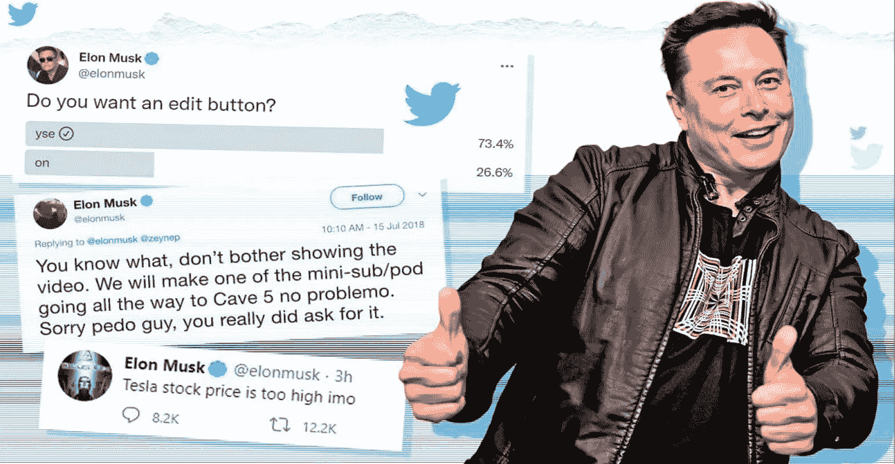

# 抓取和评估埃隆的马斯克推文

> 原文：<https://medium.com/geekculture/scraping-and-evaluating-elons-musk-tweets-e2c7bb94b75e?source=collection_archive---------14----------------------->

## 你如何为你的 NLP 项目获取数据？

Image by Itamar Abramovich

**简介**

万维网的数据海洋每年都呈指数级增长。但最大的贡献者是所谓的“非结构化数据”。它包括自然文本、图像、视频、文档以及不适合预定义数据模型的所有其他内容，它是…