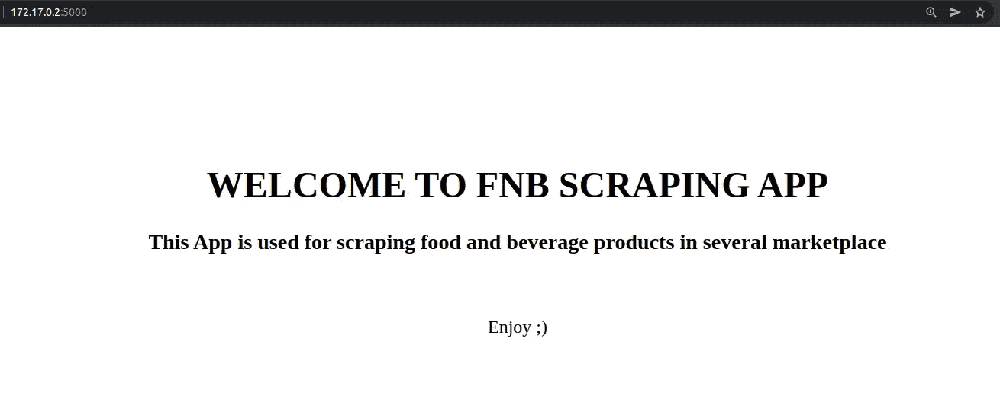

# FnB Marketplace 的抓取应用程序开发

> 原文：<https://medium.com/geekculture/scraping-application-development-for-fnb-marketplace-fa86769de96a?source=collection_archive---------17----------------------->

> 使用抓取应用程序获得大量市场产品，节省金钱和时间

本文旨在为那些想用它来抓取数据的人分享抓取应用程序的开发。文章的内容包括:

*   场景:解释已经开发了哪些功能，以及如何使用它来获得产品
*   技术:解释这个应用程序的一些过程，包括代码

**场景**

对于(a)想要进一步开发此应用程序的人或(b)仅使用此应用程序获取数据产品的人，有两种情况。

a.对于那些想进一步开发这款应用的人来说，有几个特性需要提前了解，包括:

1.  抓取数据:该应用程序尚未在网站或其他平台上部署，因此只能在 docker 上运行，并且只能在两个印度尼西亚市场上抓取食品和饮料产品；
2.  测试用例:包括抓取产品网址、原始数据、转换产品数据、下载图片等几个测试用例；
3.  清理目录:该功能旨在删除所有原始数据，避免重复文件和重新抓取时的错误；
4.  上传到云存储:已经刮下来的数据可以用你要调整的设置上传到你的云存储，上传包括网址、商品详情、图片；
5.  每日自动报废:要运行此功能，您必须访问或拥有您想要自动报废的产品的 url 列表，目前此功能无法正常工作。

b.另一方面，人们不能轻易使用这款应用程序，因为它仍处于开发阶段，但该应用程序已经可以用于抓取产品细节和图像。向任何了解应用程序开发的人寻求帮助，用一些命令运行这个应用程序。

以下是在本地部署应用程序的步骤:

1.  下载代码(源代码链接在下面)
2.  安装[对接器](https://docs.docker.com/engine/install/)
3.  用一个命令构建一个 docker 镜像，你可以把它复制到你的终端上(确保你和源代码在同一个目录下)`sudo docker build -t simple-fnb-scraping`
4.  用命令`sudo docker run simple-fnb-scraping`运行 docker 镜像
5.  打开浏览器，通过 ip 地址访问应用程序(这取决于您的本地 ip)
6.  可以抓取的数据包括产品细节和图片
7.  要收集产品详细信息，请在浏览器中运行(您的本地 ip)/(市场位置名称)/(经销店名称)，并等待一分钟，直到数据下载完毕
8.  要抓取产品图像，请在浏览器中运行(您的本地 ip)/(市场位置名称)_images/(经销店名称)，并等待一分钟，直到数据下载完毕

the dashboard of the app (172.17.0.2:5000 is example of local ip that can be used to access this app)

**技术**

对于想进一步开发这个应用程序的人来说，应该知道一些技术信息

*   应用程序的模式从以下过程开始:从 marketplace 的 outlet 获取产品 URL，根据 URL 获取产品详细信息，将数据转换为所需的 csv 文件，以及下载产品图像
*   我们使用 [selenium](https://selenium-python.readthedocs.io/) 来获取这些产品 URL，我们将市场的出口链接放在代码中，然后结果用于抓取产品细节

*   检查引用网站上的数据的 xpath 类是否工作，xpath 应该根据市场网站进行更新
*   我们使用 [scrapy 网络抓取框架](https://scrapy.org/)来抓取产品细节，在这里指定你想要抓取的产品细节

*   如果您想转换产品细节，比如添加其他列、删除不必要的文本或者转换成所需的 csv 文件，下面是代码示例

*   我们使用 [python 请求模块](https://pypi.org/project/requests/)下载图片，代码包括删除旧的图片，然后以 zip 格式下载

*   要在一个出口获得所有产品并同时运行所有的抓取过程，您需要一个包含所有产品的代码

*   或者，如果你想一个接一个地测试这个过程，下面是这样的代码示例

*   关于这个抓取 app 的完整代码，包括上传到云存储、日常自动抓取等其他过程，你可以在[源代码](https://github.com/rahmantaufik27/automate_scraping)中查看，它更完整的包括文档和你必须设置的目录树
*   如果您想要添加另一个市场，抓取模式和代码必须适应与网站数据相关的模式

感谢并关注我的其他有趣的文章，如网络抓取，机器学习等。

**其他刮痧篇**

 [## 使用 Python Selenium 进行 Web 抓取和登录

### 当网站必须首先登录时，使用 BeautifulSoup 或 Scrapy 有问题吗？

medium.coms](/analytics-vidhya/web-scraping-using-selenium-79a2fcc77215)  [## 从谷歌抓取新闻

### 如何使用 web 抓取方法从 google 中提取信息

medium.com](/analytics-vidhya/google-scraping-using-beautifulsoup-d53746ef5a32)