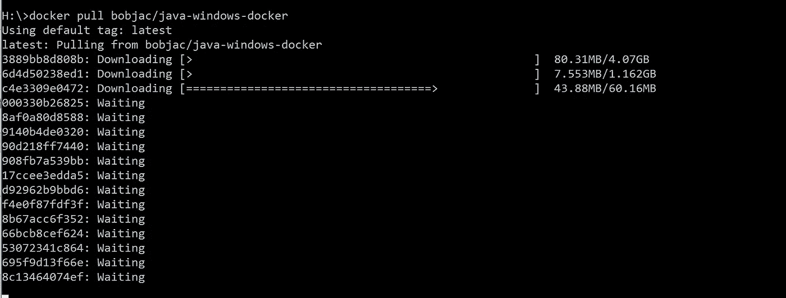

# 通过远程 web 驱动程序抓取动态网站，Selenium 第四部分

> 原文：<https://medium.com/geekculture/scraping-dynamic-websites-through-remote-webdrivers-selenium-part-iv-424b6a9cc02d?source=collection_archive---------11----------------------->

在前三部分中，我在本地使用 selenium 进行网页抓取。这次我将使用一个“远程 web 驱动程序”来删除一些数据。

## 为什么是远程 WebDriver？

有时我们需要在一些 CLI 服务器上运行 scraper 脚本。所以，selenium 的 webdrivers 在那里无法工作。在这种情况下，我们可以使用远程 webdriver，一个托管在其他地方的 webdriver。我们只需要通过 docker 访问它。

## 我们开始吧

所有的选择器和脚本都是一样的。唯一的变化是网络驱动的位置。让我们看看使用远程驱动程序的脚本。

该脚本包含一个方法为“open_support”的“scraper”类。“open_support”接受两个参数，一个“scraper”类的对象和一个平台名称。然后，该方法将查找名称中指定的平台的支持 URL。

## 这里有什么新鲜事？

在搜索本地 selenium 时，我们这样定义驱动程序。

```
from selenium import webdriver
from selenium.webdriver import Chrome, ChromeOptions, Remote, FirefoxOptions
```

在当前脚本中，我们在构造函数方法(__init__ method)中这样定义了‘driver’；

```
self.driver = Remote( command_executor=’http://localhost:4444/wd/hub’, options=options )
```

我们对远程抓取网页所做的唯一改变是定义了“驱动程序”。

在“Remote”中，参数“command_executor”指的是托管“selenium”的**“容器”**的 URL 或地址。

> 集装箱！！！
> 
> 简而言之，容器就像一台可能在地球上任何地方的个人电脑。它是一台没有任何硬件需要关心的 PC。更多关于集装箱，可能是后者。

我们已经完成了脚本编写。现在我们需要一个容器，我们将通过' command_executor '来访问它。

## 让我们为远程 web 驱动程序准备容器

1-首先我们需要安装著名的容器提供商 Docker。关于“如何在 Ubuntu 20.04 中安装 docker”的教程可以在[这里](https://www.digitalocean.com/community/tutorials/how-to-install-and-use-docker-on-ubuntu-20-04)找到。
2 拉硒铬合金容器

```
docker pull selenium/standalone-chrome
```

在拉容器图像时，终端显示关于被拉图像的一些细节。它还显示一个“标签”,显示图像的版本，如果没有指定，通常是最新版本。



image pulling a docker image

上图是拉一些 docker 图片。在其第二行中

```
Using default tag: latest
```

将标签显示为“最新”。
对于我们的“selenium”项目，我们将该标签称为“flag”。
3-使用以下命令启动 docker 服务

```
sudo service docker start
```

4-使用以下命令启动容器映像

```
docker run -d -p 4444:4444 --shm-size="2g" selenium/standalone-chrome:latest
```

您可以将“最新”替换为图像的**标志**。
关于硒容器的详细说明可以在[这里](https://github.com/SeleniumHQ/docker-selenium)找到。

## 让我们运行铲运机

```
> python scraper.py
```

6-当刮刀完成时，最好停止容器。你可以先停止集装箱，然后码头服务

```
docker container ls
```

从输出中复制容器 id，然后键入以下内容并按 enter 键。

```
docker stop container-id 
```

用刚才复制的 id 替换 container-id。

```
sudo service docker stop # stop docker service
```

或者直接停止 docker 服务。

```
sudo service docker stop
```

今天到此为止。我们使用远程网络驱动程序来抓取网站。

如果你还没有阅读，那么你可能会喜欢阅读刮一个动态网站，硒[第一部分](/swlh/scraping-a-dynamic-web-page-its-selenium-da161999c975?source=user_profile---------6-------------------------------)，[第二部分](/geekculture/scraping-a-dynamic-website-selenium-part-ii-1f30a4b59285?source=user_profile---------4-------------------------------)和[第三部分](/geekculture/scraping-a-dynamic-website-selenium-part-iii-7138d2a3131?source=user_profile---------3-------------------------------)。

刮的开心！