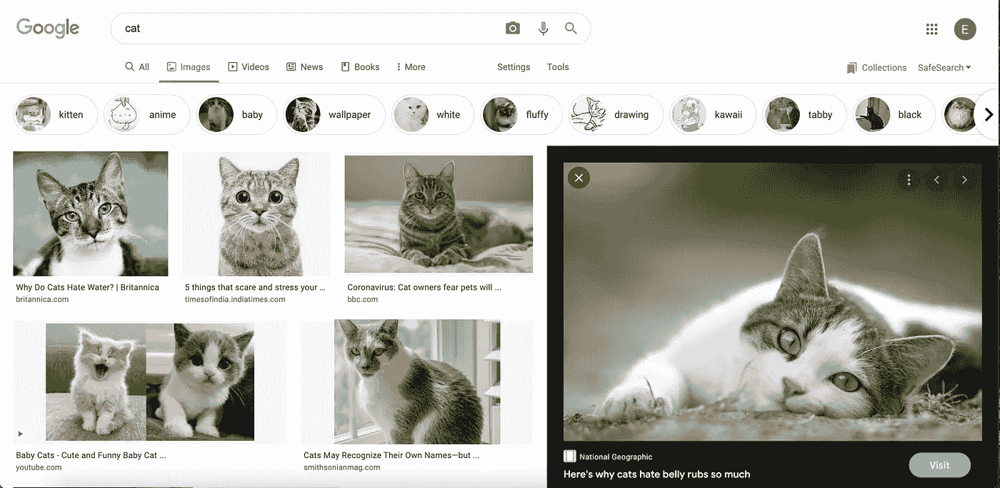
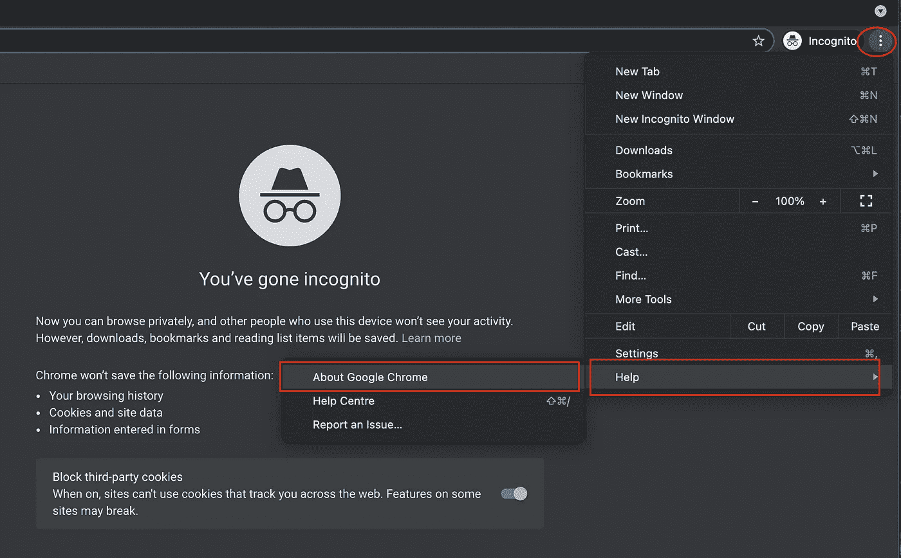
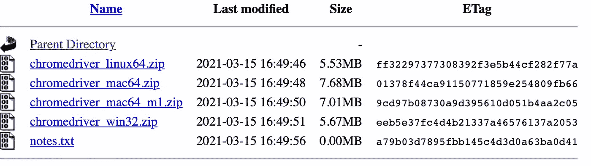
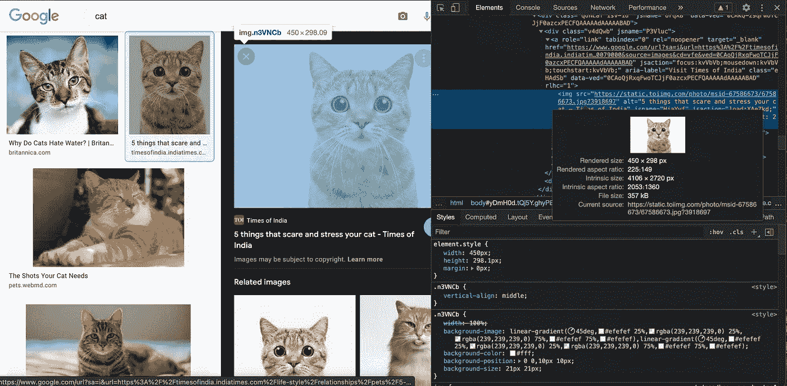
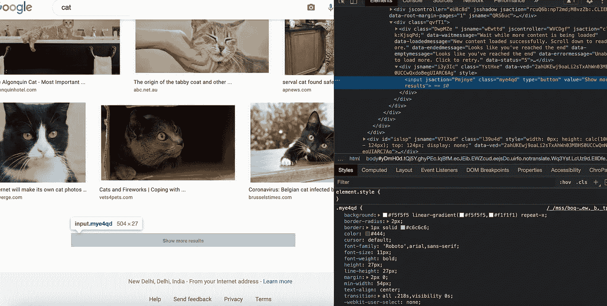

# 使用硒刮图像

> 原文：<https://medium.com/geekculture/scraping-images-using-selenium-f35fab26b122?source=collection_archive---------10----------------------->

我是如何在几秒钟内从谷歌 Chrome 上抓取图片的！

在这个小而简单的用例中，我们探索如何使用 Selenium 从 Google Chrome 中为用户搜索的任何关键字(或一组关键字)删除图像。

# 目标

*   我们的程序应该从用户那里获取任何关键字(例如:“猫”)，以及所需的图像数量，并在 Chrome 浏览器上从 Google Images 中删除那么多图像。
*   图像必须存储在一个文件夹中，以搜索术语命名，并应适当编号，以便于访问和解释。

# 程序流程

1.  首先，我们的程序应该接受一个**搜索词**和要抓取的图像数量。
2.  该程序应该检查一个与搜索词同名的**文件夹**是否已经存在。如果没有，那么它应该**创建一个**。
3.  然后，我们的程序应该为这个特定的搜索词打开 **Google Images** 页面。
4.  然后，它应该点击每个图像，并提取其网址，可用于抓取和保存图像后。它应该提取尽可能多的指定网址。
5.  如果网页没有那么多图片，应该点击“**加载更多**按钮进入下一页
6.  一旦创建了 URL 列表，该程序应该点击每个 URL，下载图像并保存在创建的文件夹中。

# 先决条件

## 铬驱动程序

由于我们在 Google Chrome 上使用 Selenium，我们需要安装适合我们系统的 Chrome 驱动程序。

*   首先，确保你的机器上安装了 Chrome
*   检查你的谷歌浏览器版本——点击顶部的三个点，点击帮助，然后“关于谷歌浏览器”

Check your Chrome Version

*   现在你应该看到你的版本了。在制作这个项目时，我的 Chrome 版本是 91.0.4472.114(官方版本)(arm64)
*   现在转到[这个](https://chromedriver.storage.googleapis.com/index.html)链接，点击与您的版本最接近的版本。从给定的选项中，选择适合您机器的选项。例如，如果您使用的是带有 M1 芯片的 MacBook Pro，请选择该版本的驱动程序。

Choose the one that matches your machine

*   下载驱动程序，并将其保存在保存项目的同一个文件中

# 获取图像 URL

## 制作谷歌图片页面的 URL

为了获取图片的 URL，我们的程序应该转到 Google Images 页面来查找搜索到的条目。“猫”这个词的谷歌图片页面的链接是[https://www.google.com/search?safe=off&site =&TBM = isch&source = HP&q = cat&OQ = cat&GS _ l = img](https://www.google.com/search?safe=off&site=&tbm=isch&source=hp&q=cat&oq=cat&gs_l=img)

注意，如果我们将 URL 中的单词“猫”替换为任何其他单词，比如“狗”，我们会得到狗的 Google 图片页面。所以我们可以做一个通用的 URL[https://www.google.com/search?safe=off&site =&TBM = isch&source = HP&q = {q}&OQ = { q }&GS _ l = img](https://www.google.com/search?safe=off&site=&tbm=isch&source=hp&q={q}&oq={q}&gs_l=img)
并用我们的搜索词代替{ q }。

## 谷歌图片无限滚动

谷歌图片可以无限滚动到某一点。因此，当我们搜索任何术语时，它会显示一些结果，向下滚动时，它会自动加载，无需我们点击任何按钮

Image Source: [@addyosmani](https://addyosmani.com/blog/infinite-scroll-without-layout-shifts/)

我们需要确保每次加载页面时，它都位于网页的末尾。

Function for infinite Scrolling

现在，我们编写一个打开网页并找到图片的程序。我们使用图像将在 **img** 标签下并且每个图像有 CSS 选择器 **Q4LuWd** 的事实来识别图像

Getting the URLs

这个函数不断地将图像标签添加到列表中。然后点击图像，寻找带有 **n3VNCb 的标签。**一旦找到，就保存图片来源。这样做，直到找到所需数量的图像。

## 加载更多

如果我们需要比第一个网页上更多的图片，我们的程序将不得不点击**“搜索更多结果”**按钮。我们已经在程序中添加了这一点，以防图像数量不符合要求。

一旦找到了所有的 URL，它们就被存储在 set 中，并返回那个 set。

# 抓取并保存图像

我们现在创建一个函数，它获取一个包含图像的 URL，并将其保存到指定的文件夹中:

*   它接受文件夹名、图像 URL 和图像编号
*   它下载图像并将其存储在文件夹中，它还使用图像编号来命名图像。

Getting the image

# 让这一切走到一起

现在，我们创建一个调用上述函数的函数，并为我们的图像创建文件夹。

*   首先，它检查以搜索词作为名称的文件夹是否已经存在。如果没有，它就会创建一个。
*   然后它调用 **fetch_image_urls** 函数来获取图像 URL
*   最后，它使用 **persist_image** 函数将图像保存在创建的文件夹中。

Calling the Functions

我们走吧！我们已经成功地使用 Selenium 从 Google Chrome 中删除了图片！这些图像现在可以用于您的任何项目！

*你可以在我的 GitHub 上查看完整的代码:*

 [## eshitagole/网页抓取

### 这个项目利用 Selenium 从 Google Chrome 上删除图像——为了执行这个项目，一个合适的 Chrome…

github.com](https://github.com/eshitagoel/Web-Scraping/tree/main/Image%20Scraper)