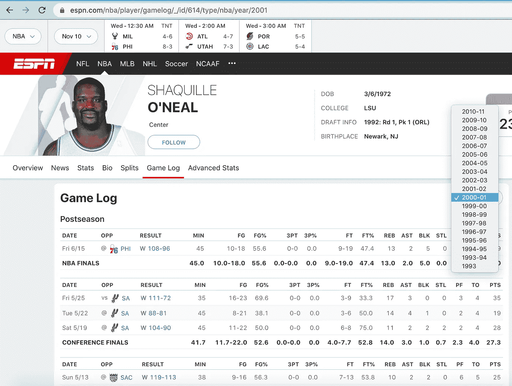
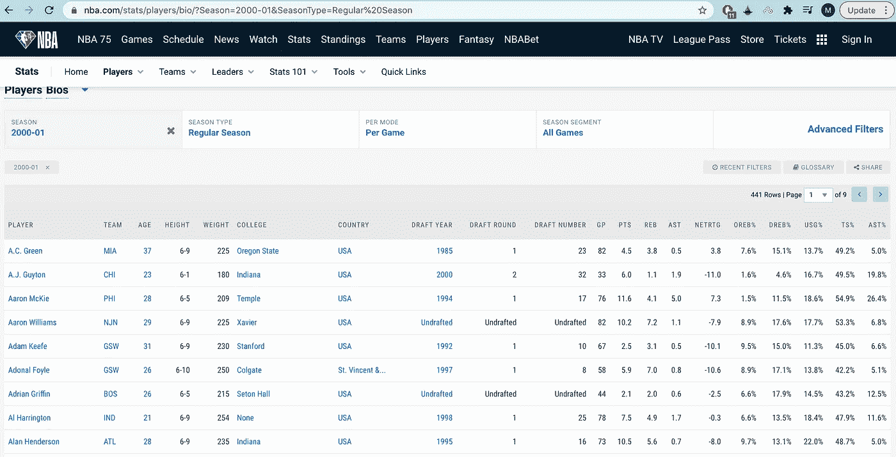
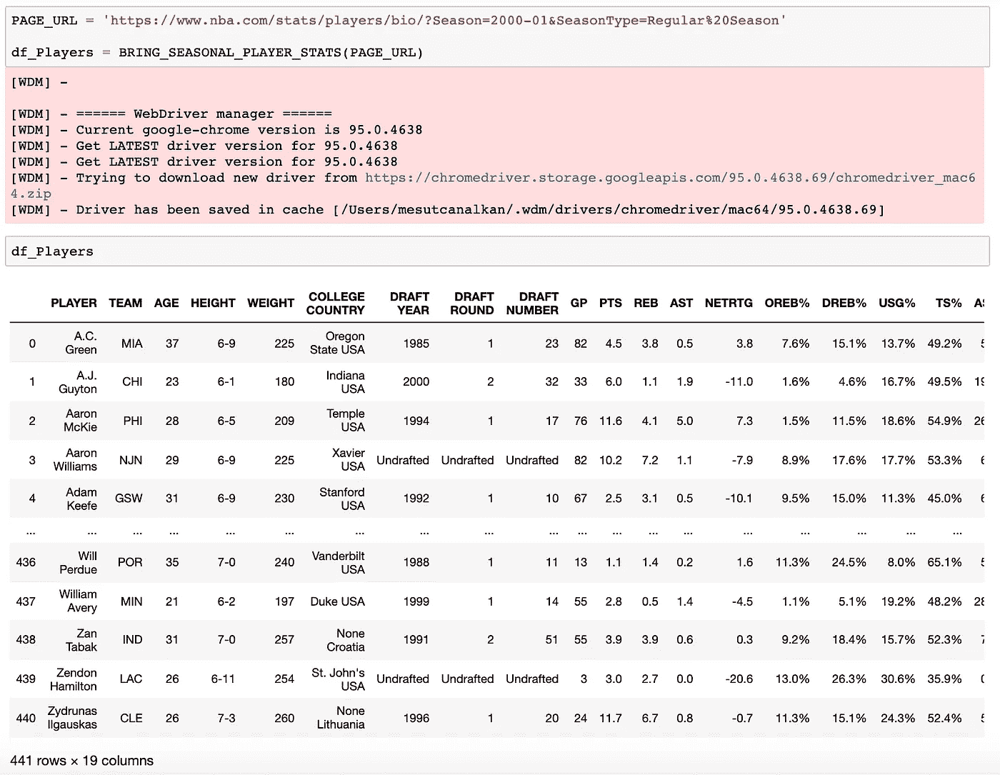
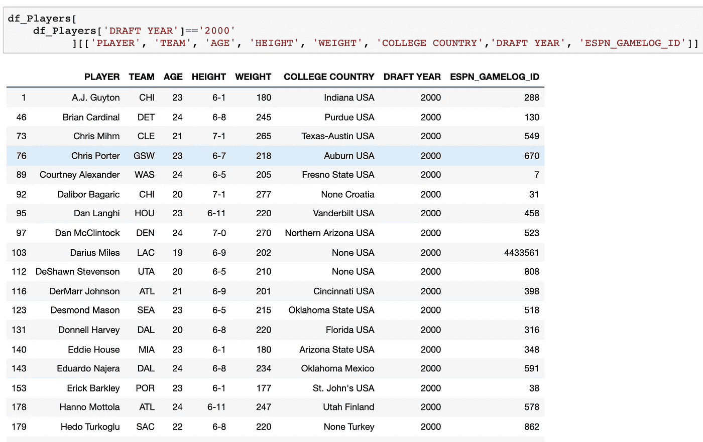
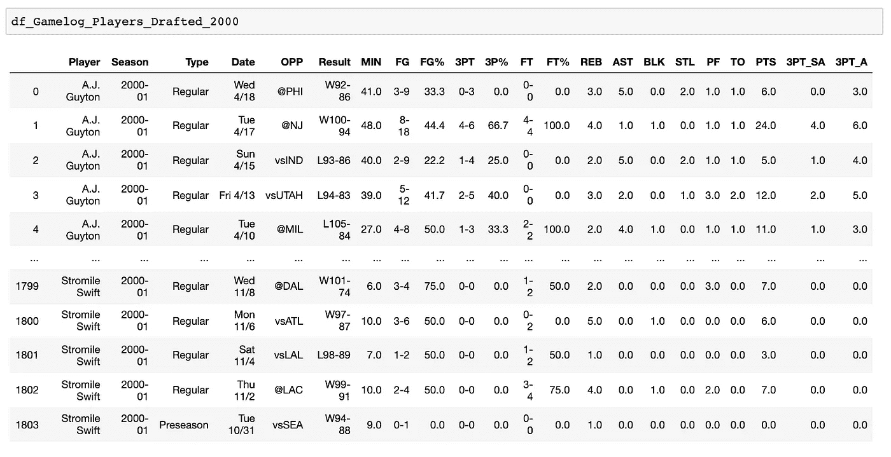

# 从 NBA 和 ESPN 网站抓取玩家游戏日志

> 原文：<https://medium.com/geekculture/scraping-player-game-logs-from-nba-and-espn-websites-18512eb9980?source=collection_archive---------6----------------------->

## 硒，要求，美丽的 Soup 和熊猫

电影“金钱球”向观众展示了采用统计分析可以提高运动队的表现。然而，它几乎没有提到乔纳·希尔的角色是如何收集所有这些数据的，或者普通的体育爱好者是否可以在不订阅付费服务的情况下做同样的事情。

在本帖中，我们将看到一个体育爱好者如何使用 python 上的一些 web 抓取工具来获取公开可用的体育数据，以便进行更广泛的分析。

**我们要克服的主要障碍是**我们必须一起整理两个数据源(【nba.com】T2 和【espn.com】T4)，以获得更完整的视图和自动化流程。

# 内容

[**挑战一:**](#b8e4)

[**挑战#2:**](#c762)

[**刮伪代码**](#a5ed)

[**导入库**](#f735)

[**第一步——游览 NBA.com**](#1d54)

[**第二步——在 ESPN 数据库中搜索球员 id**](#38cc)

[**第三步——访问 ESPN.com 获取游戏日志**](#0b62)

[**结论**](#cdd7)

# **挑战#1:**

如下图截图所示，通过在特定结构(球员的 ESPN 数据库 id +年份)上发送 url 请求，我们可以通过那个球员的比赛统计得到季后赛，常规赛，季前赛的比赛。在这个例子中，可以看到沙奎尔·奥尼尔在 ESPN 服务器上的球员 ID 是 614。

Player Gamelog Example

如果我们想知道蒂姆·邓肯的 ESPN ID 是什么，我们可以谷歌一下下面的关键词，得到他的 ID，这要感谢谷歌给了我们第一个最相关的搜索结果。

Tim Duncan’s ESPN Player ID is 215, bottom left corner of the picture

# 挑战 2:

尽管所有的 NBA 明星球员都是世界闻名的，但联盟中仍有许多球员的名气相对较小，比如当球队明星扣篮或投进 3 分时，他们会在板凳上挥舞毛巾。如果我们还想得到他们的游戏日志呢？

幸运的是，nba.com 可以给我们一份完整的球员名单，按照他们的名字排序，包括他们的简历和关键数据，如下图所示。

nba.com player bios screenshot, 50 Rows out of 441, page 1 of 9

# 刮除伪代码

步骤 1(与硒)-访问 nba.com 为一个特定的季节得到球员的 bios (A 到 Z)，

第二步(带请求+ BeautifulSoup)- Google“球员姓名 nba espn gamelog”并从第一个 Google 结果中获取每个球员的 espn 球员 ID，

第三步(用熊猫 Read _ html)**——访问 https://www.espn.com/nba/player/gamelog/_/id/+球员的 espn 数据库 id +我们感兴趣的年份，在 ESPN 上逐场比赛统计读取 HTML 表格。**

# **导入库**

# **第一步——游览 NBA.com**

**我们定义了一个从 nba.com 获取播放器 bios 表的函数。为此，我们需要 selenium 模块。因为我们需要点击页面上的一些按钮(接受 cookies 或选择所有结果而不是第一页),并且 html 结果是动态的，这需要等待一段时间才能获得更新后的页面结果。**

**我们设法拿到了播放器的 bios。**

****

# **第二步——在谷歌上搜索 ESPN 数据库中的球员 id**

**用下面的 for 循环，我们将谷歌那个赛季每个球员的 ESPN id。**

**下面的截图显示了一些在 2000 年被选中的球员，他们的 bios 和 ESPN _ 游戏日志 _ID。**

****

**我们去拿他们的游戏日志。**

# **第三步——参观 ESPN.com 获取游戏日志**

**我们定义了一个函数，使用 pandas 的 read_html 方法从 espn.com 获取玩家游戏日志表。**

**我们选择了 2000 年被选中的球员，并通过 2000 / 2001 赛季的比赛统计来搜索他们的比赛。**

****瞧！****

****

# **结论**

**在这篇文章中，我们从不同的网站搜集了公开的体育数据，以获得每个球员更详细的信息。如果我们只依靠 nba.com，我们不会得到 NBA 2000 名新秀每场比赛的上场时间统计。如果我们只依靠 espn.com，我们不会得到 2000 年选秀的 NBA 球员的完整名单。通过将不同的抓取模块放在一起，我们从动态和静态 html 结果中获得数据。**

**尽管体育分析服务需要付费订阅，但普通体育爱好者仍有希望在线获取数据。**免费！****