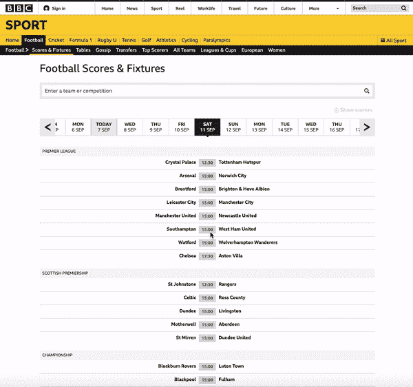
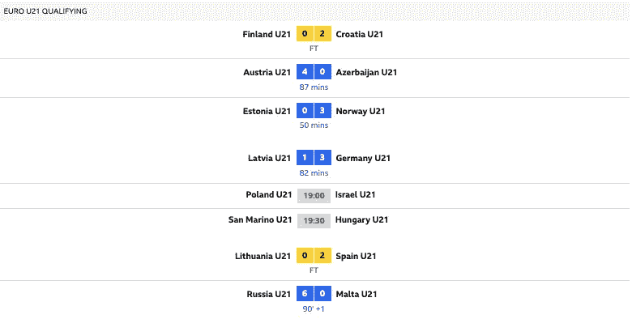
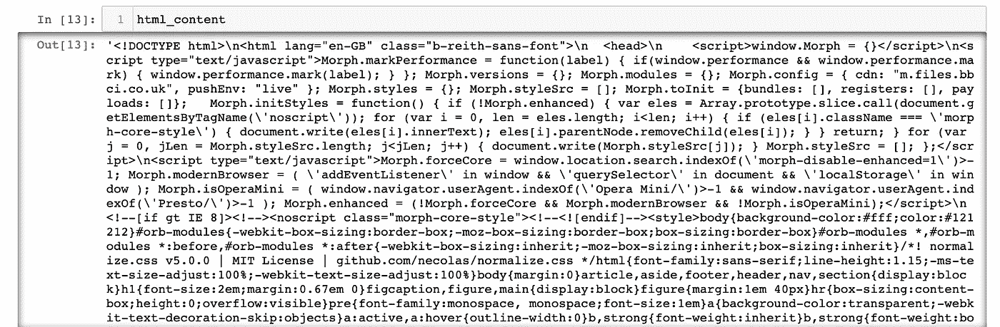
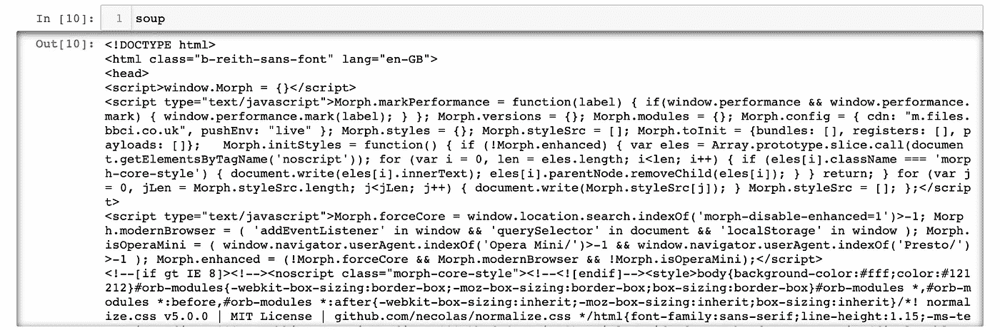
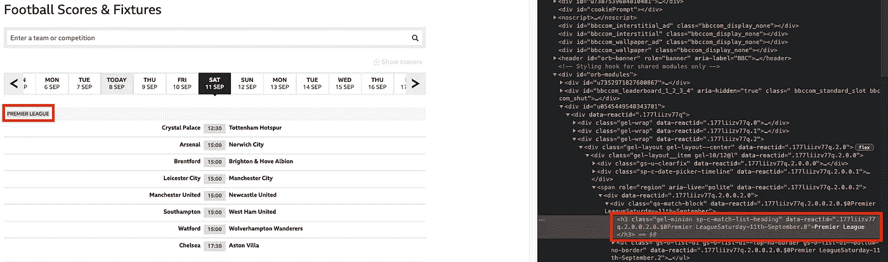
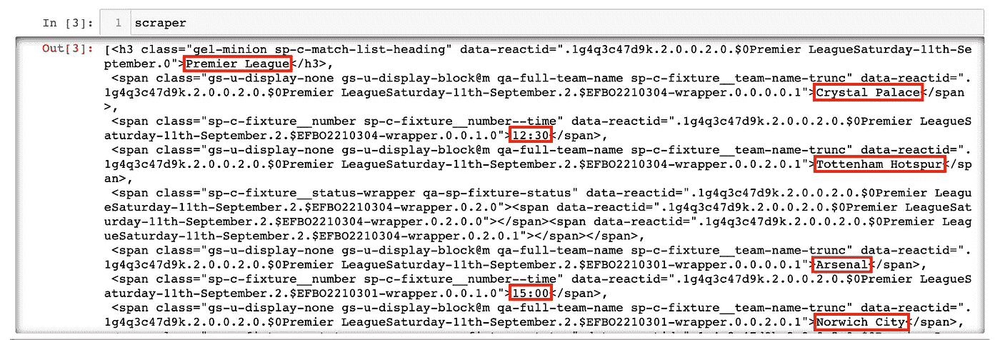
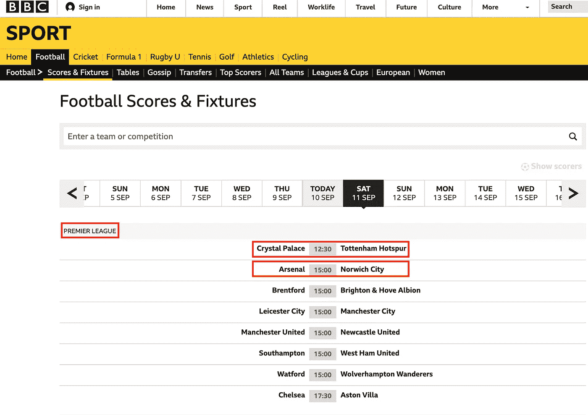
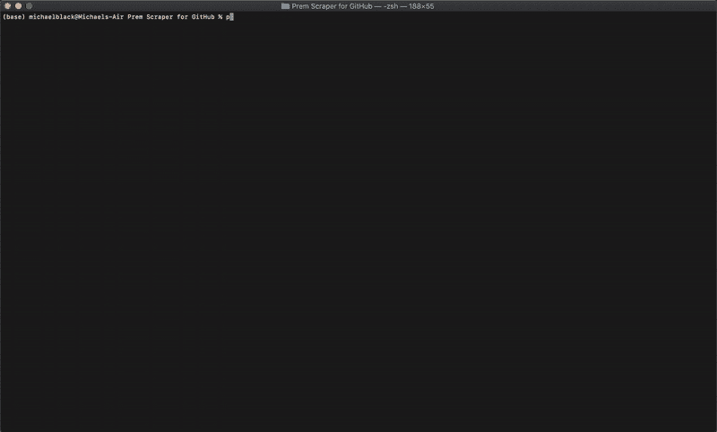

# 用漂亮的汤和蟒蛇刮 S̶o̶c̶c̶e̶r̶足球赛

> 原文：<https://medium.com/geekculture/scraping-s%CC%B6o%CC%B6c%CC%B6c%CC%B6e%CC%B6r%CC%B6-football-fixtures-with-beautiful-soup-and-python-81f47f5098d3?source=collection_archive---------2----------------------->

从终端直接查看任何一天任何联赛的比赛和实况比分。

Photo by [Thomas Serer](https://unsplash.com/@jesusance?utm_source=medium&utm_medium=referral) on [Unsplash](https://unsplash.com?utm_source=medium&utm_medium=referral)

如果你像我一样，你热爱足球。而且我说的不是脚不用，球不是球的版本；我说的是*足球*——世界上最受欢迎的运动，如果没有别的，也是这两项运动中更恰当的名字。

如果你像我一样热爱足球，我们可能会感受到类似的沮丧，这种沮丧来自于作为一个美丽游戏的粉丝:**当你是一个责任重大、记忆力差的普通人时，跟上五大国内联赛+欧洲冠军联赛的日程和结果是一件耗时且具有挑战性的事情**。

最近，在谷歌上搜索“西甲联赛”，然后是“英超联赛”，然后是“意甲联赛”等等。第一千次，我意识到有些事情需要改变。

> 我想要的是一种方法，只查看我关心的联赛的比赛，在任何一天，用最少的努力，直接从我的终端。

我决定利用 Python 和美丽的汤的力量，全力以赴。

> 我将只展示这篇文章的 web 抓取代码。我将在文章底部添加一个到我的 GitHub 库的链接，这样您就可以完整地查看程序的其余部分，并下载它供您个人使用。

## 第一步:寻找网站

从网上搜集信息的第一步是找到一个有你要找的信息的网站。这并不总是像看起来那么简单，你会遇到的网站类型和它们被抓取的容易程度有一些关键的不同。

*   [**静态网站**在网络浏览器中的显示与存储时完全一样。网页包含用 HTML 编码的固定内容，对网站的每个浏览者都是一样的。](https://www.hughesandco.ca/blog/the-difference-between-dynamic-and-static-websites#:~:text=In%20general%2C%20dynamic%20means%20capable,method%20they%20use%20to%20display.)
*   [**另一方面，动态网站**包含的信息会根据网站的查看者、一天中的时间、时区以及查看者所在国家的母语等因素而变化。动态网站是互动的。](https://www.hughesandco.ca/blog/the-difference-between-dynamic-and-static-websites#:~:text=In%20general%2C%20dynamic%20means%20capable,method%20they%20use%20to%20display.)

简而言之，静态网站更容易抓取。如文章标题所述，我用美汤做刮痧；BS 适用于静态网页，但不适用于动态网页。

经过一番搜索和比较，我选定的地点是 bbc.com/sport/football/scores-fixtures:

Scores and fixtures for Saturday, September 11, 2021

该页面简单而全面，包含了我的项目所需的所有信息。该页面对于游戏的实况和成品只有轻微的变化，如下所示:

Live scores and finished games on the webpage

我无法点击球队名称或比赛来收集更多信息，这告诉我该页面不是交互式的。此外，虽然我是从美国访问这个页面，但比赛时间仍然以英国夏令时(英国时区)显示。如上所述，这两种情况都表明网页是静态的。

既然有了地盘，就该刮了。

## 步骤 2:导入包并连接到网站

Scraping matchups for Saturday, September 11, 2021

我可以调用 *html_content:*

这将网页中的所有 HTML 内容作为一个长字符串返回。下面，我通过 BeautifulSoup 运行变量:

这会产生以下内容:

这将 *html_content* 转换成了一个漂亮的 Soup 对象 *soup* ，它将内容表示为一个嵌套的数据结构。我现在可以轻松地在对象中搜索 HTML 标签和特定数据，如步骤 4 所示。

## 步骤 3:检查页面

页面检查本质上只是定位您需要的信息的 HTML 标识符。考虑我的项目，我需要以下标识符:

*   联盟名称
*   主队和客场队名称
*   游戏时间
*   主客场比分
*   游戏时间(对于现场游戏)和“完整时间”(对于完整游戏)

要检查其中任何一项，只需在页面上突出显示它们，右键单击，然后选择“inspect”。对“英超联赛”(联赛名称)执行此操作将产生以下结果:

Inspecting ‘Premier League’ on the webpage

我看到这个页面上的联盟名有 **h3** (header)标签和**class = " gel-minion sp-c-match-list-heading "**。你需要知道这两者！

对所有需要检查的信息重复此步骤。

## 第四步:soup.find_all()

这一步非常简单:将上面的所有标签和类合并到两个单独的列表中，并使用 find_all()函数在 *soup* 变量中搜索它们。

我在“英超”之后检查的 7 个项目都有 HTML *span* 标签。

*   列表“tags”包含了我检查过的物品的所有标签。在这种情况下，我只有 *h3* 和*跨度。*
*   列表“classes”包含我检查的 HTML 中的 8 个类字符串。

我们告诉 *scraper* 通过查看所有 *h3* 元素和所有 *span* 元素来检查变量 *soup* 。

我们可以称 scraper 为:

Scraping Premier League fixtures (09/11/2021)

让我们将*刮刀*中的前七个元素与网页进行比较:

仍然有大量的数据清理、组织和格式化工作要做，但是现在，我们已经成功地在网站上找到了我们需要的一切。

## 第五步+: Python！

正如我在上面提到的，从这里开始就是 Python 了。与其展示我用来构建程序其余部分的所有代码，[我在这里链接我的 GitHub 库](https://github.com/wmblack23/Live-Soccer-Scraper)。请随意查看— **和** **如果你是一个足球迷，下载该程序并在你自己的电脑上使用！**

## 最终产品

Web scraping program for fixtures on Saturday, September 11, 2021

你现在知道了静态和动态网站的基本知识，如何检查一个网页，和美丽的汤！这个简单的介绍应该足以让你舒服地使用 Python 和 Beautiful Soup 来为你自己的个人项目搜集 web。

我希望这能对你有所帮助。

迈克尔·布莱克