# 使用 Python 进行 Web 抓取的简明指南

> 原文：<https://medium.com/geekculture/scrappy-guide-to-web-scraping-with-python-475385364381?source=collection_archive---------31----------------------->

对实用网络抓取的现实审视


在我们开始之前，让我声明一下，几个月前我自己学会了网络抓取。这是一个漫长而艰巨的过程，但从那以后，我用 Python 为不同的网站构建了多个抓取器。因此，如果你是一个初学者，不要担心，我会指导你通过每一步的方式，如果你已经有经验的网页抓取，请随时给我建设性的反馈！本教程的主要目的是教育那些认真学习网页抓取的读者，并让你真实地了解网页抓取的过程，而不是大多数教程所描述的那样。

## **警告！**

本教程不适合那些不愿意花时间学习网络抓取的人。这并不像其他教程描述的那样简单。当然，其他教程确实讲述了用漂亮的汤刮东西的基本知识，但是相信我，要把这个过程自动化成有用的东西，你需要耐心和技巧来让你越过终点线。坚持读完这篇教程，我保证你会带着一些收获离开。

与其他教程告诉你的相反，你不能用非常基础的 Python 知识来刮 web，或者仅仅知道如何导入漂亮的汤库并从中调用方法。

## 现实的先决条件:

1.  Python IDE(必须)
2.  熟悉嵌套循环、函数、导入和使用外部库(必须)
3.  对 HTML 页面结构的基本理解(必须)
4.  对异常处理的基本了解(可选)

我知道你可能会想，“我不可能为了从某个网站上搜集数据而不得不学这么多！”或者“其他教程承诺我只要导入美汤，调用一些我不需要了解的方法就可以刮网！”很抱歉打破你的幻想，但这并不容易，相信我…我不得不付出惨痛的代价。

我不希望打击任何人，但如果你试图学习网络抓取没有这些先决条件，我已经说过，但你可能会遇到问题，每一步的方式，并最终花费更多的时间偏离比如果你装备自己的技能，然后再尝试网络抓取。

现在我已经澄清了这个问题，如果你仍然和我在这一点上，我将假设你致力于学习实用的网页抓取，你将能够跟随本教程的技术部分。我们开始吧！

## **攻击计划**

*   导入和测试您的工具
*   检查你的目标网站
*   为单次迭代配置您的 scraper 函数
*   将循环/条件语句/异常处理集成到你的 scraper 中
*   导出您的数据以供将来使用

# 步骤 1:导入和测试您的工具

继续启动您选择的 Python IDE 吧！我的是 SPYDER，因为它有很多用于数据可视化的内置工具。打开 IDE 后，用下面的代码导入下面的库

```
import pandas as pd
from bs4 import BeautifulSoup
from urllib.request import Request, urlopen, HTTPError
```

Pandas 用于操作/格式化/处理我们的数据，BeautifulSoup 用于从 HTML 和 XML 文件中提取数据，Request 将真正帮助我们创建对网页的 HTTP 请求。

如果您还没有安装这些库，请在继续之前安装并运行导入语句以确保一切正常。

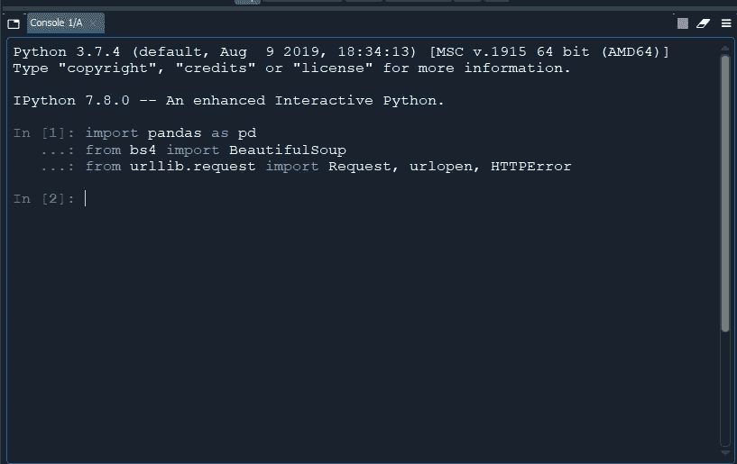

如果这些库成功导入，您的控制台/终端应该是这样的。

接下来，让我们做一个简单的测试，以确保一切正常。我们将简单地访问您的目标网站，并将其标题拉出来。

首先，我们将创建一个名为“url”的变量，用于存储目标网站的 URL 字符串。(对于本教程的其余部分，我下面的 URL 将是我的目标网站，如果您想了解我所做的一切，欢迎您使用它，否则，您应该根据您的目标网站来尝试更改您的代码)

```
url = "[https://sgmagazine.com/restaurants/browse](https://sgmagazine.com/restaurants/browse)"
```

接下来，我们可以使用下面的代码创建一个访问点，从中提取我们需要的所有数据。

```
hdr = {'User-Agent': 'Mozilla/5.0'}
req = Request(url,headers=hdr)
soup = BeautifulSoup(urlopen(req))
```

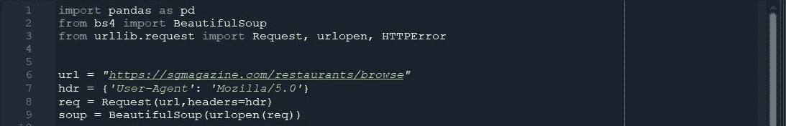

如果您一直小心地跟随，这就是您在 IDE 中的当前状态。要确认到目前为止您的代码已经成功运行，请突出显示第 6–9 行并运行 F9，并检查没有出现错误消息。

现在，终于要开始拉一些基础数据了！我们可以从打印网页标题这样简单的事情开始。

```
title = soup.title
print(title)
print(title.text)
```

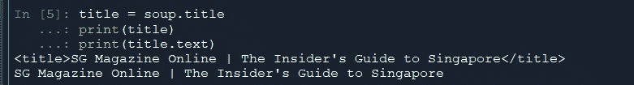

希望你能在你的控制台/终端上看到类似上图的东西。

## 注意

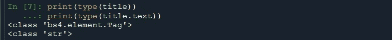

BeautifulSoup 方法不以字符串的形式返回值，而是以 HTML 元素的形式返回值，类型为“bs4.element.Tag”。这意味着我们必须将这些返回值转换成可读的数据。参考上面的代码块，“title”不是一个字符串类型，而是一个“bs4.element.Tag”对象类型，它有一个属性“text ”,为我们转换为字符串类型。你总是可以使用 print 语句来检查你的变量的类型，以确保你不会意外地在非字符串变量上使用字符串方法。

# 第二步:检查你的目标网站

现在是大多数教程没有涉及的部分，我以前没有这方面的经验，理解美丽的汤是如何工作的，并检查网页的 HTML 结构和布局。

## a.美味的汤

如果你喜欢阅读文档，我强烈建议你通读他们全面的文档。但是本质上，我们将要使用的主要方法是 *find 和 find_all。*这些方法的不同之处仅在于， *find* 返回第一个符合搜索条件的结果，而 *find_all* 扫描整个文档并返回所有匹配结果。还有许多其他的搜索方法，如*find _ parents/find _ next _ siblings*等，但是我们可以在更熟悉基本方法时使用这些方法。根据文档，find 方法签名如下:

```
find(name, attrs, recursive, string, **kwargs)
```

我们将只关心“名称”和“属性”参数。我们将传递一个像“div”这样的 HTML 标记作为“name”参数的参数，它告诉 Beautiful Soup 在文档中搜索 HTML 标记“div”。如果您希望指定搜索，甚至更多，您可以在“attrs”参数下传递您希望获取的 HTML 标记的属性值，如“id”、“class”等。例如，给定这样的 HTML 数据结构:

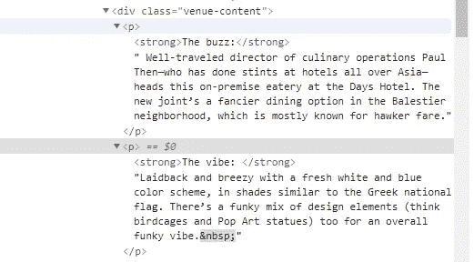

我们可以看到父容器是一个带有值为“venue-content”的“class”属性的

，在该容器中有几个

，每个包含一个**和一个文本块。因此，如果我们想要获取 div 中的所有内容，我们可以在 IDE 中使用下面的方法:**

```
soup.find('div', class_="venue-content")
```

请注意，我使用了“class_”而不是“class ”,因为“class”是 Python 中的保留关键字，它还有其他用途，因此 Beautiful Soup 使用“class_”作为它的参数。您应该得到以下内容:

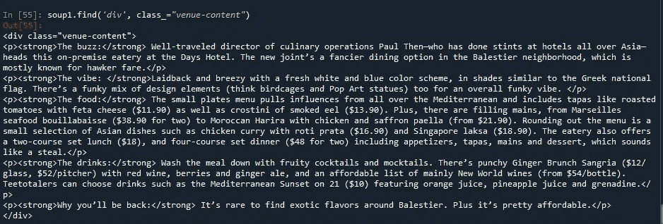

现在，假设您想要获取这个

中第一个

的内容。幸运的是，这些 find 方法返回一个“bs4.element.Tag”对象类型，相同的 *find/find_all* 方法可以应用于它们以访问它们的子标签，这意味着我们可以进行嵌套的*查找*。

```
soup.find('div', class_="venue-content").find('p')
```

因此，如果我们要调用上面显示的方法，我们将访问

中的

，并且您可以继续堆叠 *find* 来访问嵌套在多个层中的标签。

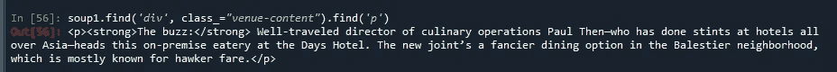

这将是前面提到的第二个函数调用的结果。

最后，如果我们想获得字符串形式的内容，我们可以使用。如前所述。因此，完整的函数调用将是

```
soup.find(‘div’, class_=”venue-content”).find(‘p’).text
```

获得

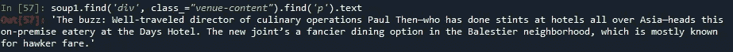

## 检查站 1

如果你仍然和我在这一点上，我为我的长篇大论道歉，但重要的是你要理解美丽的汤如何充分释放它的潜力。Beautiful Soup 的 find 方法也可以利用正则表达式来过滤标签，我不会在本教程中介绍这一点，但是这个[到堆栈溢出线程的链接](https://stackoverflow.com/questions/24748445/beautiful-soup-using-regex-to-find-tags/24748491)是了解更多信息的一个很好的起点。

## b.检查网页的 HTML 结构和布局

我基本上介绍了如何将一个 HTML 页面分解成不同的标签层，使用 Beautiful Soup，您可以搜索任意数量的标签、层和内容，只要您提供正确的搜索条件。如果您有信心，那么是时候进入实际的代码了！

# 步骤 3:为单次迭代配置 scraper 函数

现在，让我们在进行大规模抓取之前，先构建一个从单个网页中提取数据的函数。

在我们继续之前，记住 Chrome 中的开发者工具是我们最好的朋友！您可以使用命令 Ctrl + Shift + I 或 F12 打开它。请注意，我将从头到尾大量引用它。

每个网站都不一样，也就是说没有一个刮刀可以刮所有网站，一个刮刀只能专门为单个网站搭建。当你准备去刮一个网站的时候，你要问问自己，你到底在刮什么数据？HTTP 链接到其他网页？网页上显示的数据？或者页面上显示的邮件？

我的目标网站是新加坡的餐馆目录。你在下面看到的每一个字符串都是那家餐馆的标题，并且嵌入了到他们餐馆简介页面的链接。理想情况下，我的最终目标是

1.  抓取这个主页的所有链接，并存储在一个列表中
2.  对于一个餐馆的简介的每个链接，我想抓取该餐馆的所有细节，并将它们存储在一个字典中

如果你计划创建一个不同的网站，确保你清楚自己想要达到的目标。

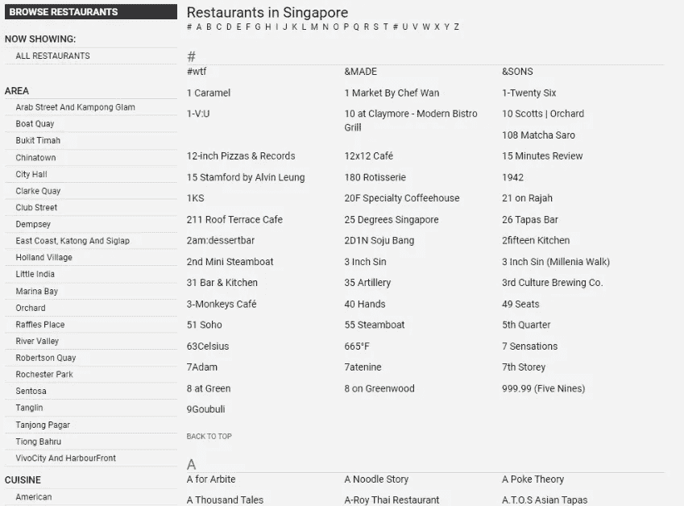

既然我们已经清楚要做什么，让我们通过使用 *find_all* 函数来验证这一点。

```
links = soup.find_all('a', href = True)
```

这一行代码做了很多事情。

1.  我们为变量“links”赋值，以便将来参考。
2.  *find_all()* 是 BeautifulSoup 提供的一个函数，它返回我们正在寻找的特定 HTML 标签的所有实例。
3.  我们在括号内提供的值*‘a’，href = True* ，是 HTML 超链接的标签。
4.  因为我们在一个页面中提供了所有的链接，所以我们返回的对象不会像以前一样是一个字符串，而是一个值数组。

```
for i in range(len(links)):
    links[i] = "[https://sgmagazine.com](https://sgmagazine.com/)" + str(links[i]['href'])
```

如前所述，Beautiful Soup 提供的函数返回的值不是典型的字符串，因此必须进行显式转换。这个 for 循环就是这么做的。通过这个循环，你现在将拥有一个给定网页中所有超链接的字符串数组。此外，由于我们丢弃的超链接在省略域的情况下不完整，我们需要将域作为字符串附加到每个超链接的前面。

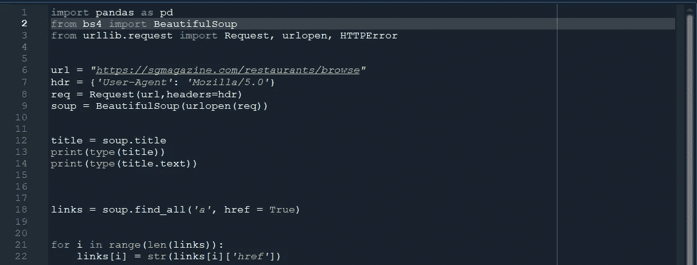

如果你跟随我的目标网站(你试图抓取的网站应该有一个包含不同项目内容的链接的目录页，并且应该是你试图从中提取所有链接的页面)，这就是到目前为止你应该拥有的。为了检查您的代码是否有效，请继续运行代码。结果应该是类似于我下面的东西。

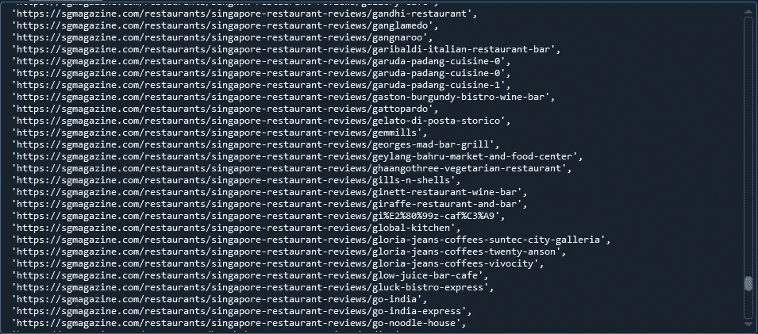

接下来，我们将构建一个从单个链接中抓取所需数据的函数。出于演示的目的，我将在数组的第 200 个索引中使用餐馆。

```
target = links[200]
```

这将我的数组中的第 201 个链接分配给一个名为“target”的变量。继续在 target 上使用 print 命令，看看您拥有的链接是否是您所期望的。

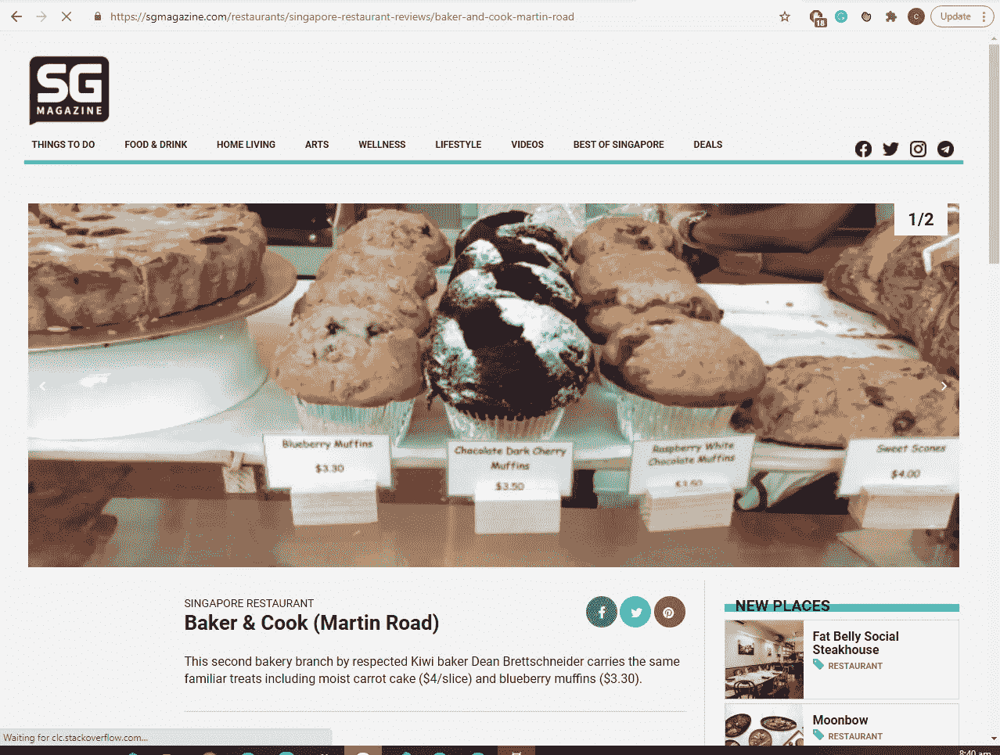

如上所示，这是我从链接数组中选择的餐馆的实际网页。在检查后，我希望收集场馆的详细信息，包括地址、电话号码、区域、美食等。

由于我们现在尝试访问主网页的子目录，这与尝试访问新网页是一样的，因此我们将不得不提出新的请求，并设置一个类似于之前的“soup”的新接入点。我们可以复制粘贴上面写的代码，做一些编辑。

```
url2 = target
hdr2 = {'User-Agent': 'Mozilla/5.0'}
req2 = Request(url2,headers=hdr2)
soup2 = BeautifulSoup(urlopen(req2))
```

为了简单起见，我通过在变量后面加一个“2”来重命名所有的变量，如图所示。确保进行所有适当的更改以避免错误。这意味着现在，新的接入点是“soup2”。

让我们使用开发者工具来检查这个网页吧！

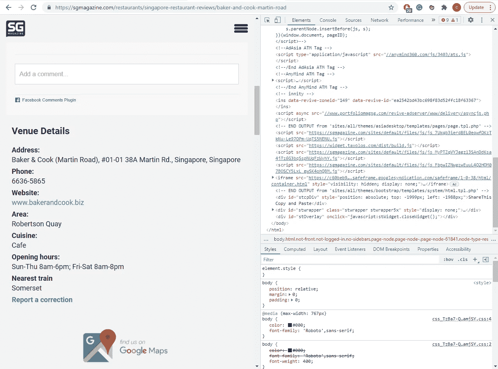

这是它应该有的样子，网页的内容在左边，开发者工具在右边。一个有用的技巧是使用元素选择器直接查看它在页面的 HTML 布局中的位置。

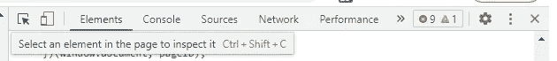

通过点击最左边的项目，您现在可以点击网页的任何部分，右边的元素选项卡将显示它的位置。

如果我点击我想要抓取的“场馆详细信息”块，我将会看到以下内容。

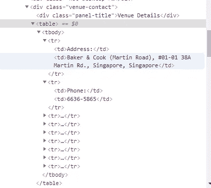

正如所料，我们现在得到了一个类别为“venue-contact”的

，它包含一个，包含多个，每个包含 2 个

|  |

现在，有几种方法可以做到这一点，

1.  堆叠*寻找每一层的*调用，并逐渐缩小你想要的内容
2.  查看您想要的特定 HTML 标签是否存在于网页的其他部分，如果不存在，那么您可以直接使用 find 方法一次，因为您知道只会返回该区域的内容。

我将在下面演示这两种方法。

```
info = list(map(lambda x: x.find_all('td'), soup2.find('div', class_="venue-contact").find('table').find_all('tr')))
```

这一行代码做了多件事:

1.  使用我们的访问点 soup2，我们调用 find('div '，class_="venue-contact ")。
2.  根据 1 的结果，我们调用 find('table ')
3.  根据 2 的结果，我们调用 find_all('tr ')
4.  由于 *find_all* 返回一个结果数组，而不是我们可以堆叠 *find* 调用的单个结果，我们必须使用 *map* 函数将下一个 *find* 调用映射到数组中的每个元素。(可以用 for 循环代替，但我这样做是为了教育和节省时间)
5.  简单地说，4 所做的就是对 3 返回的每个元素应用 find _ all(‘tr’)

我们应该得到这样的结果:

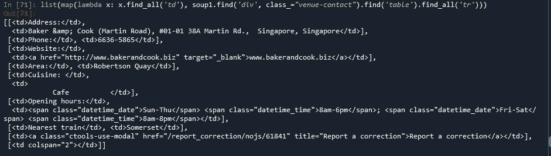

做同样事情的更干净的方法是

```
soup2.find_all('td')
```

为什么会这样？因为唯一的 HTML 标签位于这个表中，所以我们不需要担心得到不需要的数据。

注意，使用第一种方法，我们将收到一个 2D 数组，而第二种方法返回一个 1D 数组。

对于本节的其余部分，我将使用第二种方法的结果，您应该能够相应地更改您的代码。

和前面一样，数组“info”中的这些元素不是字符串，而是 HTML 标记类型。此外，请注意最后两个“td”元素是多余的，因此应该删除。因此，在数据可用之前，我们需要做一些处理。

```
info = info[:-2]
for i in range(len(info)):
    info[i] = str(info[i].get_text())
```

这两行代码将有助于解决我之前提到的两个问题。

1.  第一行代码基本上是 Python 从开始索引到结束索引获取子数组的简写语法。因此，使用“info[:-2]”相当于创建一个“info”子数组，其中我只需要从第一个元素到倒数第三个元素的元素。
2.  for 循环所做的事情与我们之前所做的类似。它使用内置函数将每个 HTML 标记元素转换为字符串类型。

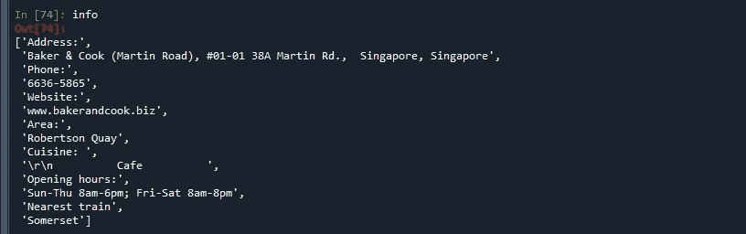

在这两行之后，您的数组现在应该看起来更加整洁和全面了，如上所示。

这个数组现在包含了单个餐馆的信息，这很好，但是如果我们想要存储 1000 个甚至 10000 个餐馆呢？这就是我们必须使用 Python 字典来帮助我们组织和构建信息的地方。

首先，看看“信息”中的数据是如何构成的。它似乎在“问题”和“回答”格式之间交替，例如，首先是“地址”，然后是餐馆的实际地址，然后是“电话”，再然后是餐馆的实际电话号码，等等。因此，当我们创建使用“键值对”的字典时，我们必须根据索引进行替换。

在输入信息之前，让我们先建立我们的字典结构！如果我们回到我的示例网页，似乎有 8 种不同类型的关于我想要的餐馆的信息，这在我的字典中转化为 8 个关键字(包括餐馆的名称)。

```
dict1 = {"Name":[],
         "Address": [],
        "Phone": [],
        "Website":[],
        "Area": [],
        "Cuisine": [],
        "Price Range": [],
        "Open since": [],
        "Opening hours": [],
        "Nearest train": []
        }
```

请注意，我的字典中有超过 8 个关键字，这是因为该网站为不同餐厅提供的详细信息数量不一致，这意味着在某些情况下，餐厅可能没有网站链接，或者有些可能没有“价格范围”。当您试图收集大量信息时，这些问题最终会导致问题，因此更安全的做法是包含所有可能的密钥，并在某个特定餐馆没有该特定信息的情况下填充一个空字符串。为了便于数据传输，字段的顺序必须与数组的顺序相同，这一点非常重要。

```
checker = ["Name",
         "Address",
        "Phone",
        "Website",
        "Area",
        "Cuisine",
        "Price Range",
        "Open since",
        "Opening hours",
        "Nearest train"]dict1["Name"].append(soup2.title.text)k = 1
x = 0
while k < len(checker):
    if (x < len(info) and checker[k] in info[x]):
        dict1[checker[k]].append(info[x+1])
        x+=2
    else:
        dict1[checker[k]].append('')
    k+=1
```

这可能是代码中最长也是最技术性的部分，但是请尽量遵循，因为这是确保一切顺利进行的一个非常重要的部分。

1.  如前所述，每个餐馆都有不同数量的字段和信息，因此为了避免错误，我们必须在尝试将其值添加到字典之前检查是否为餐馆提供了特定的字段，因此我们需要一个“checker”数组。
2.  第一个 *append* 调用是将餐馆的名称添加到餐馆名称数组中。
3.  为了简化看似复杂的 while 循环所做的事情，我们基本上是检查“checker”中的每个可能的字段，检查这个特定的餐馆是否有该字段，如果有，就将其值添加到我们的字典中，如果没有，就向我们的字典中添加一个空值以表示空值。我之前说保持字段的顺序很重要的原因是为了使这个阶段的检查能够顺利进行。

继续运行这几行代码，看看您的字典现在是什么样子！希望它和我下面看到的类似。

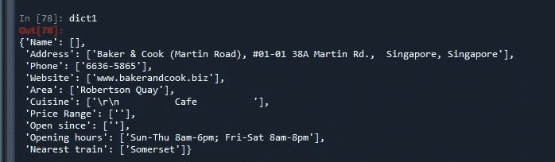

正如你所看到的，它现在组织得非常好，并且准备好接收更多的数据条目。

我们现在可以把上面所有的代码整理成一个函数，这样就很简洁了！

```
def single_link_scraper(url):
    hdr = {'User-Agent': 'Mozilla/5.0'}
    req1 = Request(url, headers=hdr)
    soup1 = BeautifulSoup(urlopen(req1))
    info = soup1.find_all('td')

    info = info[:-2]
    for i in range(len(info)):
        info[i] = str(info[i].get_text().strip())

    k = 1
    x = 0
    while k < len(checker):
        if (x < len(info) and checker[k] in info[x]):
            dict1[checker[k]].append(info[x+1])
            x+=2
        else:
            dict1[checker[k]].append('')
        k+=1
```

这就是我们函数的样子！它接受目标网页的字符串 URL，并将所有提取的数据追加到我们的字典中。请注意，字典和检查器将分别声明，因为将它们放在将被重复调用的函数中是没有意义的。

最后，为了自动化整个抓取过程，回想一下前面我们有一个目录中所有链接的列表，我们所要做的就是建立一个简单的 while/for 循环来调用我们在 links 数组中的每个链接上创建的函数。

# 步骤 5:将循环/条件语句/异常处理整合到你的 scraper 中

这是没有其他教程警告你的部分，如果你认为前面的部分是严格的，那么请系好安全带。这可能是你必须自己完成的教程中最令人沮丧和困难的部分。

当然，在参考一个网页时抓取它是很容易的，但是如果你需要自动化这个过程并重复数千次，并确保你的功能预见到你可能面临的所有可能的问题，会发生什么？某个环节断了怎么办？如果某个网页的结构不同会怎样？这些问题我自己也没有找到答案。这就是为什么这一步需要最大的技巧和耐心。在上一节中，您看到了我如何使用 checker 数组来确保为各个键填充正确的值，并且能够为不存在的字段填充空白，这是我必须自己解决的问题。没有放之四海而皆准的答案或结构，你的刮刀上的配置会因每个网站和你试图刮取的数据类型而变化，我现在能做的就是向你展示一些你可能面临的问题类型的例子，并给你一些我一路走来学到的技巧。

**谷歌是你最好的朋友**

不要害怕谷歌任何你不知道的东西！没有人对所有事情都有答案，咨询在线社区是获得可靠答案的最佳途径！

**你要失败了**

没有什么事情会顺利进行，web 抓取涉及大量的试验和错误，它对于解决代码中的小问题是必不可少的，这就是为什么 Python 是一个非常好的工具，因为你可以一次运行单行代码，而不是运行整个脚本，这意味着你可以在这个过程中进行大量的小测试。

**打印打印打印**

在大循环中使用 print 语句有助于我跟踪有问题的区域，然后我可以放大这些区域来找出问题所在。例如，如果我抓取 1000 个网页，中间某处有一个断开的链接，通过使用 print 语句记录抓取的每个成功索引，一旦遇到有问题的索引，就会引发异常，我就知道是哪个索引导致了异常。这意味着我可以为那个错误设置我的异常处理，并且知道下一次，它不会给我带来任何其他问题。

# 步骤 6:导出数据以备将来使用

```
final_data = pd.DataFrame(dict)
final_data.to_csv('//<path to folder destination>','filename.csv', index=False)
```

第一行基本上是将我们的字典转换成熊猫数据帧结构，这是一种非常有用和流行的数据结构，用于存储信息。更重要的是，通过将它转换成熊猫数据帧，我们可以利用它的功能将它导出到一个. csv 文件，这就是我们想要的！这可以在最后一行看到，这里调用了' to_csv()'函数。放在括号中的参数是您想要保存的文件路径。csv 文件，然后是您想要的文件名，最后是“index ”,可以保留为“False”。

# 结论

我希望你已经看完了这个看起来没完没了的教程，因为如果你看完了，那么你现在已经在心理上准备好了所有的问题，这些问题是其他教程没有提醒你的。开始时，这可能看起来令人沮丧或畏惧，但就像所有的技能一样，你越做越容易，你只需要相信这个过程，并且知道你投入的时间只会让你成为更好的程序员。记住教程和指南只能说明你需要什么技能，实际的实现过程还得通过自己的努力去学习。

如果您需要帮助，请随时在下面评论您的问题，或者发电子邮件到 chetwinlow@gmail.com 给我！说完，刮刮乐！