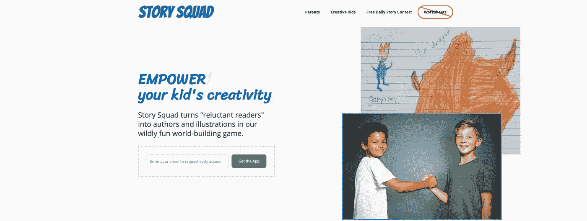
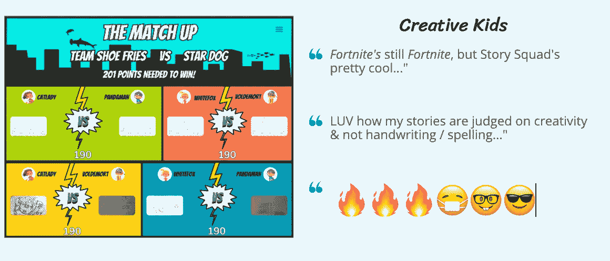
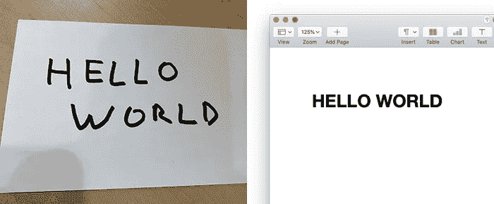
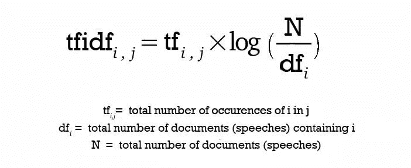
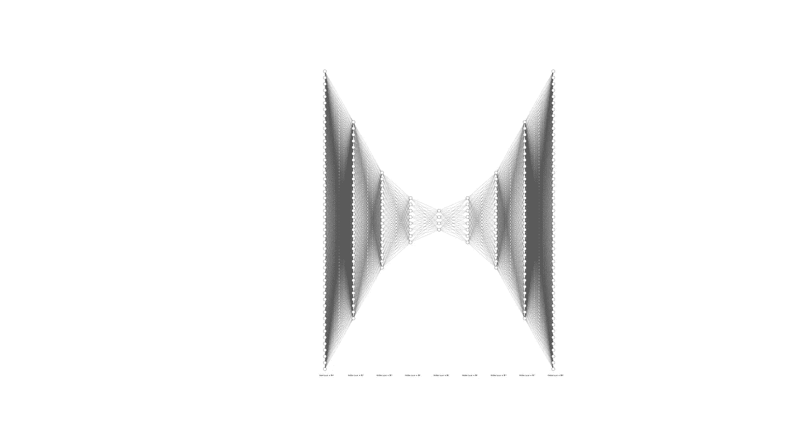
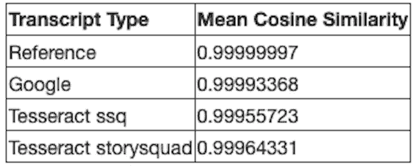
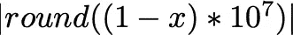
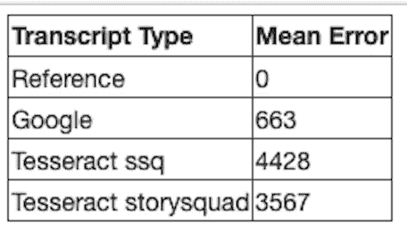
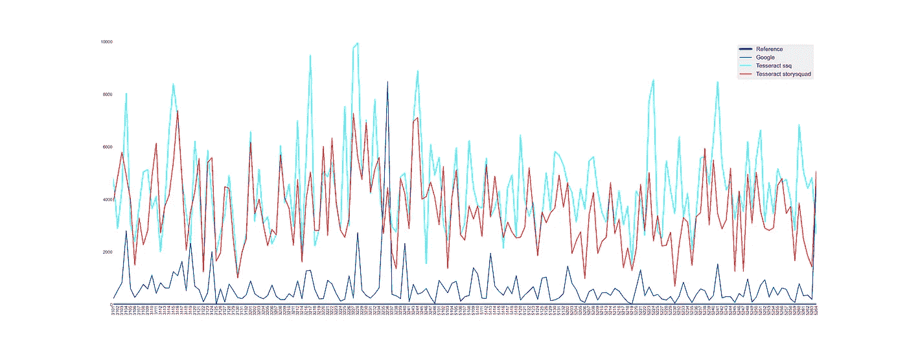

# Scribble 体育场——模拟与数字的桥梁

> 原文：<https://medium.com/geekculture/scribble-stadium-bridging-the-analog-and-digital-39865975a954?source=collection_archive---------40----------------------->

Scribble Stadium(原名为 [Story Squad](https://www.storysquad.education/) )是 [Graig Peterson](https://www.linkedin.com/in/graig-peterson-225a421b6/) 的创意，他是一名六年级教师，他想把孩子们从“完美”的数字世界拉出来，让他们回到更混乱/更有创意的纸笔模拟世界。

为此，他设计了 Scribble Stadium，这是一款网络应用程序，通过使用少量的屏幕时间，最大限度地利用创作者草草写下原创故事和图画的时间，将年轻的孩子从“不情愿的读者”变成有趣的世界构建游戏的作者和插画师。

虽然创意发生在模拟世界，但在用户将他们手工制作的故事和图画加载到应用程序后，这款游戏在数字世界发挥了它的所有荣耀。计算机视觉(CV)和光学字符识别(OCR)的工具和技术有助于弥合这两个世界之间的差距。

OCR 用于将手写故事的图像转换或“转录”为文本。

这项技术的一个商业表现是 Google Cloud Vision 的 DOCUMENT_TEXT_DETECTION API，它将图像数据作为输入，并返回转录的文本。

另一个选择是谷歌维护的开源宇宙魔方项目，最初由惠普开发。这个项目已经发展了多年，从 4.0 版本开始，提供了一个基于 LSTM 神经网络的新 OCR 引擎——为问题空间训练网络的可用数据越多，它就变得越好。

目前，Scribble Stadium 使用 Cloud Vision API 来执行转录，但计划是转移到基于 Tesseract 的转录模型。虽然成本是一个原因，但它不是移动的主要驱动力-这将是一个信念，从长远来看，Scribble Stadium 提供的儿童手写数据将有助于培训 Tesseract，并使其成为一个优秀的 OCR 平台，用于转录儿童手写故事的特定问题空间。

我们团队的任务是促进这一过渡，我们意识到这涉及到两个主要任务

*   用新数据训练宇宙魔方语言模型
*   构建工具来计算 OCR 性能指标

本博客的其余部分将重点关注 OCR 性能指标任务。

# 计算 OCR 性能指标—比较假设和参考抄本

为了确定 Tesseract 引擎何时足以取代 Google 的 Cloud Vision API，我们需要能够计算和比较 OCR 性能指标。这意味着能够测量 OCR 引擎生成的转录本(又名*假设*转录本)和人类生成的转录本(又名*参考*转录本)之间的差异。我们实现的方法包括使用 NLP 技术来计算和比较*假设*和*参考*转录本的向量。

## 抄本矢量化

对于抄本矢量化，我们使用 *TfIdf(词频逆文档频率)*方法。

假设有一个*词汇*中的 ***M 个*** 术语，每一个文档都将由一个 ***M 个*** 元素的向量来表示。

对于文档 *j* ，向量的元素 *i* 计算如下

tfidf value for term **i** in document **j**

为了确定*、词汇*中的各个术语、*和 ***dfᵢ*** 的值，我们首先用*参考*转录本拟合 *TfIdf* 模型。*

*一旦完成，就可以使用上面定义的公式计算每个文档的 *TfIdf* 向量。*

*这种矢量化方法(与所有单词包方法一样)的一个问题是，生成的向量具有非常高的维数，并且非常稀疏(许多零元素)，在 Scribble Stadium 的情况下，我们最终得到 22，296 个维度。为了解决这个问题，我们使用自动编码器降低了由 *TfIdf* 矢量器生成的矢量的维数*

## *使用自动编码器降维*

**自动编码器*是一种神经网络，其中*输入*层连接到*编码器*层，后者汇聚到*瓶颈*层。这然后连接到*解码器*层和*输出*层，它们反映了*瓶颈*的另一侧。*

**

*Input layer connected to Encoder layers of 32, 16, and 8 neurons that go through a Bottleneck layer of 4 neurons to connect to Decoder layers of 8, 16, and 32 neurons and then to the Output layer.*

**自动编码器*被训练来获取它们的输入，通过*编码器*层向下压缩到*瓶颈*层，并通过*解码器*层重建它，以匹配*输出*层的输入。*

*一旦*自动编码器*被训练完毕，通过分解*自动编码器*并仅使用*输入*、*编码器*和*瓶颈*层，构建出*降维器*—*瓶颈*层成为*降维器*的*输出*层。*

*在 Scribble Stadium 的情况下，*自动编码器*的*输入*层的大小为 22296，其中 3 个*编码器*层分别为 512 个神经元、256 个神经元和 128 个神经元，一个*瓶颈* / *输出*层为 64 个神经元。*

*在使用*参考*转录本的 *TfIdf* 向量进行训练之后，*自动编码器*被分解以创建能够将 22，296 维压缩到 64 维的*降维器*。*

## *用余弦相似度比较矢量*

*现在我们已经得到了合理大小的非稀疏向量，我们使用*余弦相似度*的概念来比较它们，其中我们主要计算向量之间角度的余弦。*

**

*值的范围在 0 和 1 之间—值为*

*   **1* 为*余弦(0)* 意味着矢量(文档)的完美对齐(匹配)*
*   **0* 为*余弦(90)* 意味着向量(文档)之间的正交性(没有关系)*

## *从余弦相似性生成误差/性能度量*

*一旦我们计算出*余弦相似度*，我们就有了一个在*【0，1】*范围内的小数部分*

**

*Mean Cosine Similarity values for the various Transcript types*

*这些数字不容易比较。*

*理想情况下，我们希望将这些小数转换成整数值，这样可以更容易地比较 OCR 性能。*

*最有效的公式是*

**

*因为在将参考转录本与其自身进行比较的情况下，这给了我们一个零误差值(或至多低个位数)。*

**

*Mean Error values for the various Transcript types*

# *OCR 性能—运行数字*

*制造了两件工具:*

*   **google _ tessera CT _ 转录本—* 用于使用 Google 或 tesseract OCR 引擎生成*假设*转录本。*
*   **ocr_performance* —用于将*假设*副本与*参考*副本进行比较，并生成每幅图像的计算误差值以及平均误差值的 CSV 文件。*

## *用参考转录进行验证*

*我们需要做的第一件事是验证所有的工具，确保当我们比较参考抄本和它们自己时，我们得到的错误值为 0。*

*那有效！*

## *要打败的人——谷歌转录*

*下一步是看看谷歌的云视觉 API 表现如何。*

*运行这个工具给我们一个 663 的错误值。*

## *具有 LSTM 模型的宇宙魔方—小型训练集*

*对宇宙魔方引擎的最初评估使用了一个 LSTM 模型(名为***【ssq】***),该模型在可用数据的一个小子集上进行训练。*

*正如所料，它的表现比谷歌差得多，错误值为 4428。*

## *具有 LSTM 模型的宇宙魔方—较大的训练集*

*然后，我们用一个 LSTM 模型(名为 ***storysquad*** )来评估 Tesseract，该模型用一个更大的可用数据子集来训练。这个模型是由一位队友创建的，她在 [this](/@saraewestds/how-to-read-messy-handwriting-computer-edition-8546c7678c01) blog post 中记录了她的工作。*

*我们期望比较小训练集的性能更好，这就是我们得到的，错误值为 3567。*

## *比较它们*

*从上面描述的各种运行中加载并绘制每幅图像的误差值给了我们这个有趣的图表。*

**

*Error-values per image for the Google, Tesseract/ssq, and Tesseract/storysquad OCR engines*

# *前进的道路*

*在这一点上，我们已经验证了工具和假设，即宇宙魔方引擎的性能将随着更多的训练数据而提高。*

*现在，整个重点转移到重复以下步骤，直到我们能够匹配/击败谷歌的 CloudVision 性能:*

*   *用更多的训练数据收集和更新宇宙魔方的 LSTM 模型*
*   *用更新的模型生成新的*假设*转录本*
*   *用新的抄本计算错误/性能数字*

*一旦达到该性能水平，就有必要划分出一个不用于训练 LSTM 模型的验证集，然后重新配置工具，只使用验证集来比较 Google 和 Tesseract OCR 引擎。*

# *感谢*

*非常感谢 [Sara E West](https://medium.com/u/d6121049f7b2?source=post_page-----39865975a954--------------------------------) 和 [Temsy Chen](https://medium.com/u/37efc3d2d7a4?source=post_page-----39865975a954--------------------------------) 帮助提高这篇文章的可读性。*