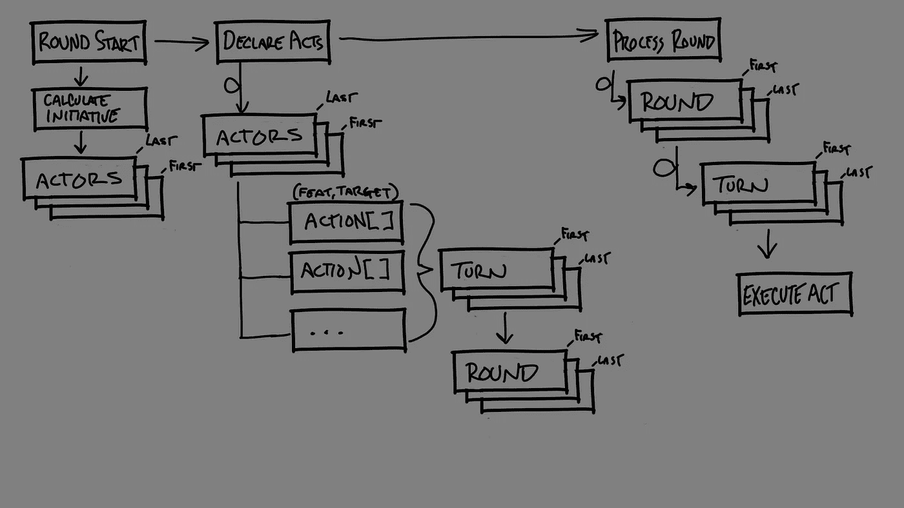
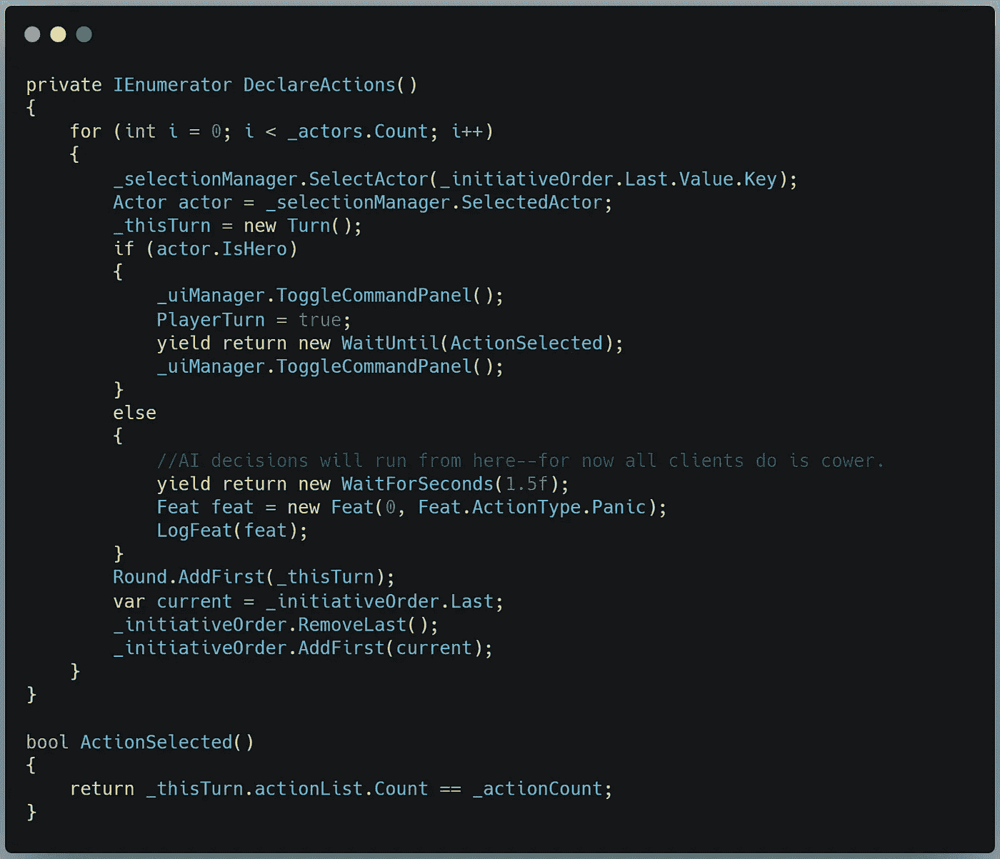
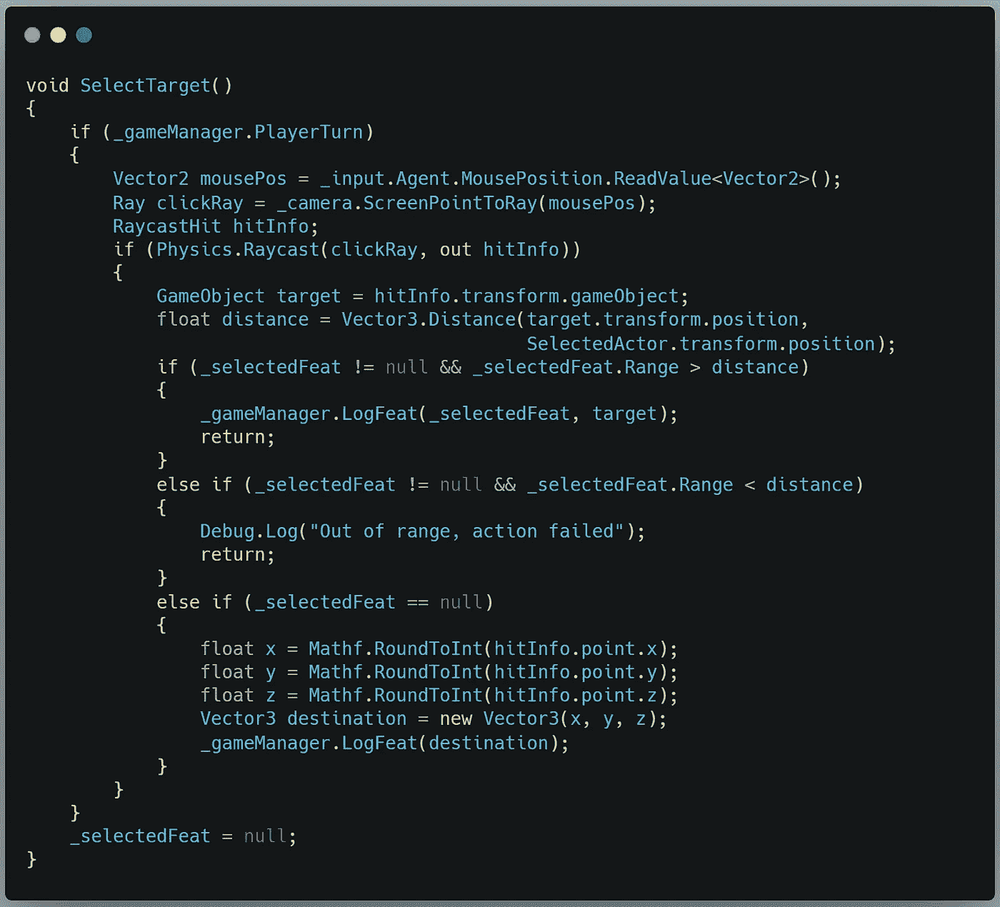
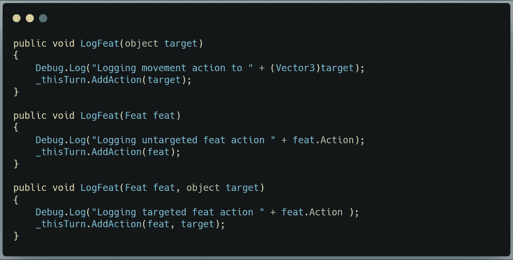
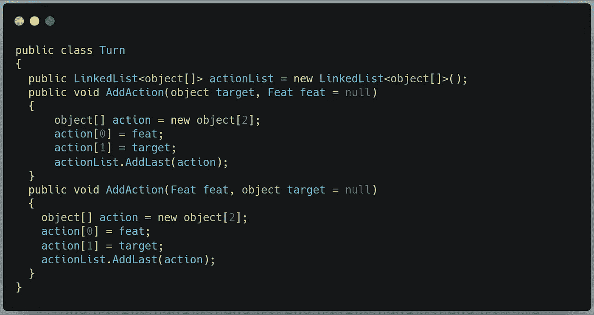

# 用 Unity 中的 C#编写回合制战术指挥系统

> 原文：<https://medium.com/geekculture/scripting-a-turn-based-tactical-command-system-b14b33000a0f?source=collection_archive---------8----------------------->

## 复杂系统的强力解决方案

Disclaimer: I know there are standards and conventions for this sort of diagram, but I didn’t need to share this idea with anyone but me when I drew it, I just needed to see how things connect so I could plan.

今天的目标是:创建一个系统来记录和重放来自多个参与者的多个命令，其中所有参与者首先以升序宣布他们的动作，然后所有动作以降序播放。

这里有一个比我在这里提出的解决方案更好的解决方案。这是使机制工作的最初的强力实现。在下一篇文章中，我们将把这一切变得更加完美。

我们要把这个分成两部分。今天的文章将集中在演员宣布他们的行动。明天我将介绍执行动作队列。

## 行动者宣布行动

我们将在[计算完主动权](/geekculture/roll-initiative-ec1343797da1)之后开始，用 DeclareActions()方法:

通过这一步，我们从一个基于场景中演员数量的 for 循环开始。我们从 SelectionManager 中收集倡议顺序中的最后一个人，并创建一个新的 Turn 类实例(如下)。然后我们检查演员是否是英雄。如果是这样，我们打开玩家命令的 UI 面板，等待直到他们的动作被选中(用一个 bool 比较玩家得到的动作数和他们排队的次数)，然后关闭面板。如果这个演员不是英雄，现在它会创造一个范围为 0 的恐慌专长并传递下去。

对于选择英雄的动作，我们有以下方法:

这是对我们之前的 SelectTarget()方法的一个小小的重构。这里它只在玩家的回合中启用，现在每个可能的结果都会导致一个 LogFeat()方法调用。

有三种覆盖，每一种都是我们的行动所允许的专长和目标的组合。每个动作都可能有一个专长和一个目标，一个专长或一个目标。你会注意到我对目标变量使用了**对象**类型。这种类型可以保存任何数据，特别是在这种情况下，要么是游戏对象目标，要么是 Vector3 运动目标。我们将接收到的数据加载到前面创建的 Turn 实例的 AddAction()方法中。

让我们来看看转弯类:

IMPORTANT: A ‘new object[2]’ is required each time AddAction is called to avoid overwriting the references in the action list.

所有动作都可能有专长和目标中的一个或两个。正如我上面提到的，我们在目标变量中有两种潜在的数据类型。这是第三个壮举。我想将所有这些存储在一个数据结构中，以便于打包，所以我将使用一个对象数组将所有三种数据保存在一个变量中。

为了获得 *action[]* 信息，我将使用两个方法，一个接受带有可选专长的目标，另一个接受带有可选目标的专长。这应该可以处理所有三种可能的组合。

现在，我终于有了一个对象，它代表了任何玩家可能完成的任何动作的所有数据，我将它添加到列表的末尾。一旦收集了所有的动作，我们就在最后恢复 DeclareActions()方法，其中 Turn 的实例被加载到 Round 列表中，我们将最后一个主动的人推到队伍的前面。

The Round list is a linked list of Turns in the Round.

这个循环遍历完场景中的所有演员后，将会有一个回合列表，每个回合都有自己的动作列表。

咻。这是最重要的部分。明天我将介绍 ProcessRound()方法，该方法将通过遍历我们生成的列表来回放我们记录的操作。谢天谢地，因为我们使用了链表，所以我们不必使用任何*来代替*或*来代替每个*循环。

直到那时！