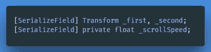
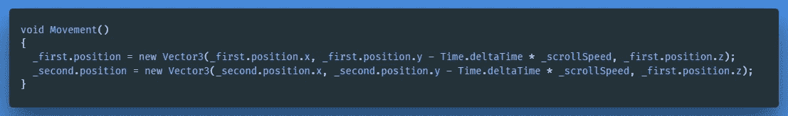
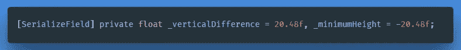
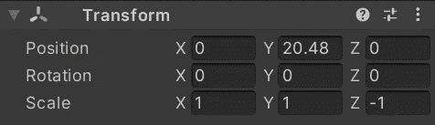
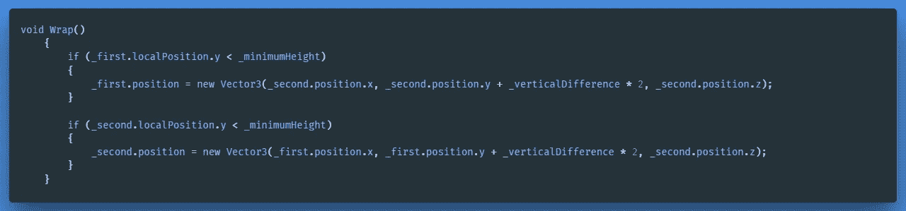
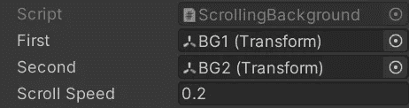
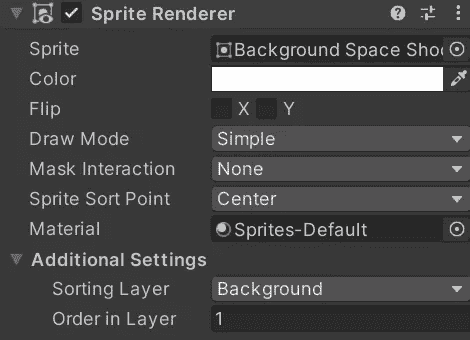
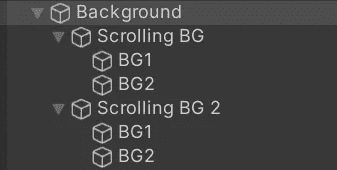
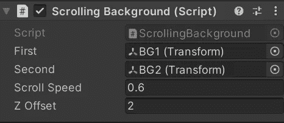
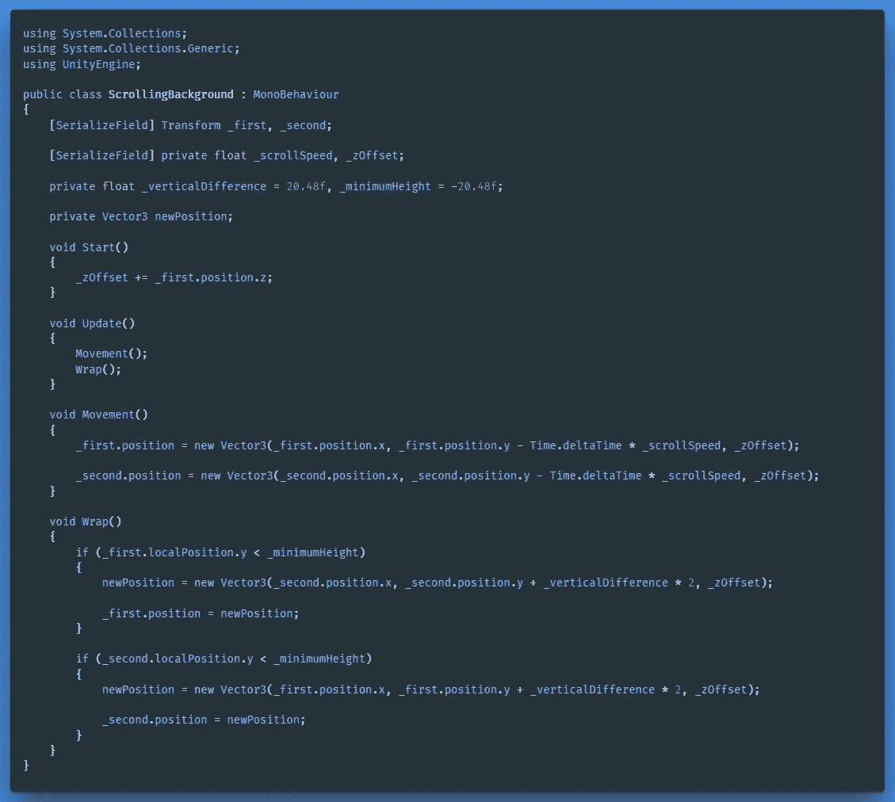

# 滚动精灵背景

> 原文：<https://medium.com/geekculture/scrolling-sprite-background-cfa82fbccc0d?source=collection_archive---------23----------------------->

**目标:**

向 Space Shooter 项目添加一个简单的无限滚动 2D 背景，作为不同级别使用的背景模板。

**解决方案:**

在这种情况下，滚动背景的逻辑将由一个脚本驱动，
我们为精灵变换添加简单的向下运动行为，并在它们达到某个垂直高度时将它们包起来。

有多种方法可以达到预期的效果，另一种常见且可能更有效的方法是使用自定义着色器。

**必需品:**

*   清空 Unity C#脚本“ScrollingBackground”。
*   可平铺的背景纹理。

**逻辑:**

首先，我们存储了两个将要使用的 sprite 变换的引用，并添加了一个浮动变量，这样我们就可以在检查器中手动调整移动速度。如果您的图像是完全可平铺的，您可以在 Z 轴上翻转它来扩展您的无缝图案。

创建一个**void*Movement()***方法，负责转换移动行为。不要忘记在 ***Update()*** 方法中初始化它。这里，我们将一个 ***新矢量 3*** 变量分配给变换位置，并更新其 Y 位置，每帧的时间为“*_ 滚动速度*”秒。

创建两个新的 float 类型变量，我们可以在其中存储一个垂直差和一个最小高度。输入取决于你的精灵大小。

您可以通过将第一个图像定位在 0，0，0 并在其上捕捉第二个图像来测量您的精灵。对我来说是 20.48 美元

然后创建一个 **void *Wrap()*** 方法，一旦变换达到一定高度，该方法将负责重新定位变换。如果 Y 轴上的变换当前位置低于' *_minimumHeight* '，我们将第一个变换的位置 Y 分配给第二个*的当前位置 Y 加上*垂直差*乘以*乘以二，反之亦然，当第二个变换达到最小高度时。

**自我提醒:**

对我们存储的变换位置的引用是从它们的变换的中心点开始计算的，所以为了在第二个变换之上将其打包，我们获取第二个当前位置. y，并将变换的总长度乘以 2。

**编辑设置:**

在 Unity 编辑器中，我们将脚本附加到一个新的游戏对象上。你正在使用的精灵应该是这个的子元素。在脚本组件中分配第一个和第二个背景。

通过使用精灵渲染器，可以指定附加设置来对层进行排序。创建一个新的排序层“*背景*”，并分配两个变换到这一层。这样，我们可以在以后添加更多元素时保持视觉空间的有序。

**添加第二层**

为了应用更多的变化，我制作了一个不同的可平铺背景，它可以显示在第一个滚动背景之上，同时具有不同的 scrollspeed 值。

在脚本中，我们必须调整一些东西，因为我们不希望背景被(重新)定位在同一个 position.z。相反，我们创建了一个新的变量，该变量将返回 position.z(默认情况下),以防分配了偏移量；position.z +偏移量。

Leave the value at 0 if you don’t want an offset.

← [上一张](/nerd-for-tech/spawn-manager-a7c0e6446b2a) | [下一张](https://gert-coppens.medium.com/from-prototype-to-work-of-art-ff35e6c8100f) →