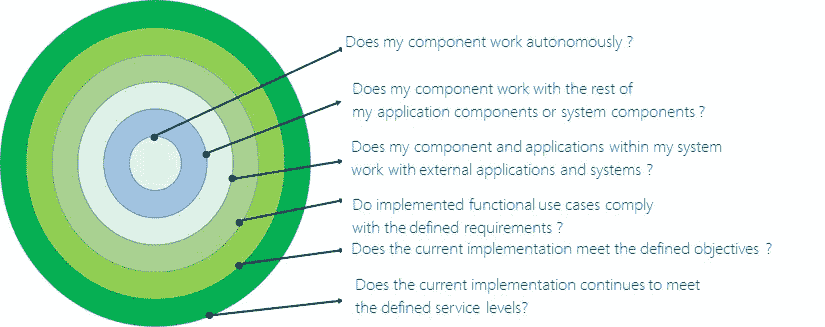
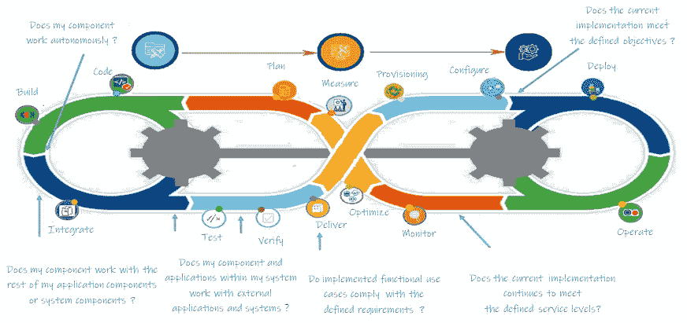
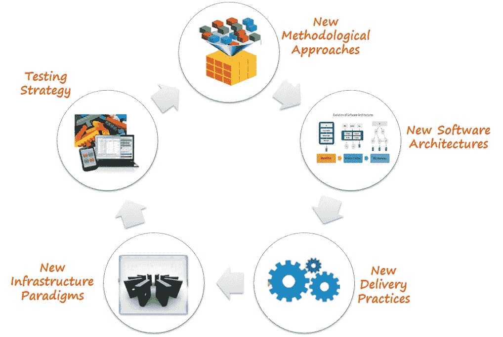

# 系统开发生命周期中的操作环境

> 原文：<https://medium.com/geekculture/sdlc-operating-environments-part-ii-fc3482c14172?source=collection_archive---------31----------------------->

***感悟*** 从 ***变化******挑战*** 在 ***旅程*** 中部署 ***工作量***

# “系统开发生命周期中的操作环境”系列的一部分

🔘 [*第一部*](https://medium.com/p/5f74d15cd5ff/edit) *:* ***场景设定。***

🔘*第二部分:* ***从“为什么”*** *(你现在正在读)开始。*

🔘 [*第三部分*](https://medium.com/p/97f84987f210/edit) *:* ***继续说“什么”***

🔘 [*第四部分*](https://medium.com/p/d74cbdc72eb3/edit) *:* ***结果。***

# 开始之前

## 放弃

本帖为个人中帖。这里表达的任何观点仅属于作者，并不反映作者曾经或现在隶属的任何公司或组织的任何观点或意见。在这里看到完整的免责声明[。](https://jhadnr68.medium.com/disclaimer-70803d581009)

# 第二部分:从“为什么”开始

# 2 |一点历史

过去，操作环境的设计有一个明确的目的— **确保最终环境**(生产环境)**始终具有所需的操作稳定性，以满足所需的 SLA**。

**并到达那里**

> 🙏❝我们被教导要相信，使用明确定义不同方、活动、任务和 deliverables❞之间分离的责任和角色的方法是合适的

🚧但是当我们在不同的阶段之间转换时，我们的工作负载也需要在不同的操作环境之间移动。当我们构建每个操作环境的目的是**可重用性和效率**时，几乎通过设计，我们**以一组强加的限制**结束，同时**沿着每个过渡和边界**移动，直到我们最终到达我们的目的地——生产环境。

> 🌪❝我们设计的工作环境有一系列清晰的物理边界，就像 SDLC❞上定义的隔离规则一样

**似乎:**

> 事实上，每个 IT 组织都必须面对流程转型，这将不可避免地推动组织结构的根本变化。传统的 IT 服务交付和组织模式以牺牲有效性为代价来实现效率。[在计算昂贵且资源稀缺的时期]最大限度地提高资产的利用率和生命周期成本是有意义的…这种资源协调方法不可避免地会导致功能孤岛。优化的基于流程的组织是横向关注结果，而不是纵向关注技能。
> 
> 高德纳公司的科琳·杨

最后，**总是让我想起梅尔文·康威**的名言:

> “任何设计系统(广义定义)的组织都将产生一个设计，其结构是该组织通信结构的副本。”
> 
> **— M .康威**

由于您的工作负载的系统结构往往是您的组织结构的反映，这可以映射到来自 SDLC 的边界，那么

> ⛐ ❝，你最终要建立每个操作环境，简单地在 possible❞的每个阶段之间进行转换

**意思是:**

> 🎀❝:很明显，我们仍然倾向于围绕角色来构建、交付和部署软件，而不是 outcomes❞

**每个操作环境都有一套非常不同的特性，从构思**和**构建**到**测试**，**发布**，**交付**，**部署**，以及**监控**。而它们之间的界限，就是强加在沟通结构上的限制！

在环境之间转移工作负载之前，**我们需要执行一组预定义的测试，以证明所需的质量以某种方式存在。**因为主要焦点是:****

> ✅ ❝确保每个版本和最终部署在进入 live❞之前都经过认证

> 以满足期望。确保无论质量和验收标准如何，都有一套稳定的条件来测试完全相同的标准
> 
> **—** [**纳尔逊·博维达**](/@nelson.boavida/)

很明显，每一个**的运作环境都应该有一个特定的目的。但是****角色**和**责任**的**分离**以及设计定义的**物理边界**给**带来了一些困难**使它们**更具适应性和进化性，导致**在建立新的或仅仅维护现有的时涉及更高的成本。

> 🔗❝，这反过来使它们变得非常复杂，无论何时 needed❞都很难更改和管理

同时，您需要**足够敏捷和灵活，使用**新的方法、工具和技术来发布和部署新版本的工作负载**。**事情变得更加复杂和难以管理，因为您还需要您的支持 SDLC 更加敏捷和灵活。

结果是:

> 🚴❝，你也需要你的助手 environments❞的敏捷和灵活

最终，你得到了一个事实:

> 🚮❝，现在是时候让这些操作环境完全过时了。❞

仅仅因为我们在所有需要的**过渡**到**生产**之间强加了**隔离的**和**物理边界**和**屏障**，唯一需要的就是一个虚拟沙箱来**验证**您的**工作负载**所需的**质量**。

⛨:许多问题有待解决，这让事情变得更糟。

① **开发者**正在寻找更多**敏捷的方式**来**构建他们的工作负载**；

② **业务**对**在任何测试之前投入**大量资金**感到厌倦，或者**价值驱动的验证**可能最终被做出，至少作为一些 MVP 的结果；**

③ **测试**仍在使用**旧的质量保证思维**；

④ **业务**需要访问**失败快速结论**；

⑤不同**版本**和**配置的数量大幅提升**；

⑥我们总是要求**稳定版本**用于**集成测试**；

⑦**维护**的**成本**其他**发布**成本**高**；

⑧用于产生**释放**的**周期**并不总是**充足**；

⑨再现**生产场景**永远是**噩梦**；

⑩调整和测试**基础设施变更**总是一个**挑战**；

⑪ **复归**困难；

⑫ **操作**和**安全测试**不知何故是**后知后觉**；

⑬测试和认证发布仍然是一个**手动**过程；

⑭ **持续监控**和**学习**仍然是**梦想**；

⑮ **产品规划**需要**系统方法**；

⛔ **让事情变得更糟的是，那里已经有很多新事物发生了变化**

① **对**理解不足**新技术范式**和**新方法论**；

②新**组织**和**交付模式**；

③新的**测试策略**；

④新软件**架构风格**；

⑤新的**基础设施范例**；

♚你开始挑战**(如此明显)**过去使用的每个操作环境的创建背后的原因**。新的问题出现了:**

**①哪些**边界**仍然**相关**？**

**②我们还能根据那些**边界**设计**新的操作环境**吗？**

**③它们**与目前使用的**和**有何不同？****

**④满足最终**验收标准**所需的**设置的临界质量是多少？****

**如果你后退一步，你会突然在**为什么**、**什么**和**如何**之间产生**一个错位**。如果您从 **WHY 开始，**将更容易映射概念上的"**候选环境**"——服务于目的的**——和相应的相关联的"**操作环境**”——您为目的**选择的**物理或虚拟实现。****

**如果你把“*为什么”映射到每个操作环境的目的上，我们可能会得到这样的东西:***

******

***Clarify possible boundaries before moving on***

***最终可以映射成这样的东西:***

******

***Align possible boundaries with common steps along a generic pipeline***

*****问题在于:*****

> ***💡❝从“如果你没有 VISION❞，为什么没有用”开始***

***因为如果你继续保持你的旧心态(为什么)，你将永远无法解决你当前的问题。你现有的**解决方案(如何)** **不再适合**你的新**目标**！是的。是真的。仔细想想**你的目标肯定变了！*****

# ***3 |我们是如何来到这里的***

***这些困难之所以出现，是因为现在的**概念上和物理上的交付和监控管道**与我们过去在**使用的**完全不同**。*****

******

***Strategic Clusters promoting the change in SDLC operating environments***

> ***许多相关学科领域的🗬 🗭 ❝新范式对实现提出了挑战。当然，这些新的实现肯定会满足新 Purposes❞***

*****我们以一个悖论而告终！*****

***因为如果仍然是**必须**确保最终**生产环境始终在线且稳定**，关注**减轻**围绕部署新版本的风险**，那么现在也是**紧急**频繁部署那些版本**，**更快**，具有更高**质量**，并且更加**安全*********

***😧因此，**生产环境**在设置和管理方面变得更加复杂，因为:***

***①我们开始使用**不同的方法和方法论**进行**软件开发**；***

***②我们开始构建新的**软件架构**；***

***③我们开始使用不同的**手术模式**；***

***④我们开始使用**不同的实践和技术**；***

***⑤而且我们还需要维持新旧之间的**婚姻；*****

> ***我们不断尝试将所有这些应用于相同的人，他们有着相同的思维模式***
> 
> *****—** [**纳尔逊·博维达**](/@nelson.boavida/)***

***😬试图同时采用很多不同的东西，但成熟度却大相径庭***

> ***⛕ ❝沿着不同的产品价值 chains❞创建完全断开的输送管道***

***这反过来又使得收养变得几乎不可能***

> ***❄ ❝一条你希望被统一的输送管道，完全自动化，永远连续和 parallelized❞***

***我们当前的问题和差距之所以存在，是因为你需要管理非常不同和复杂的生命周期。这些周期正变得**越来越反复**，同时**增加了复杂性**以确保每次发布的正确性**和最终交付**，同时在每个操作环境之间转换，直到生产。***

*****意思是:*****

> ***🚶❝当前每个作战环境的目的、性质和特征，以及在它们之间转换时强加的边界，使得它们显然不再适合新的 demands❞***

*****进而导致*****

> ***⇡ ⇣ ❝:你的软件开发生命周期活动的概念界限，你在通用交付管道中需要做什么，以及支持 it❞的操作环境的目的和性质之间存在更大的偏差***

# ***在你走之前***

***如果你想收到我未来的文章，一定要在媒体上关注我。如果你喜欢《系统开发生命周期中的操作环境》**系列**中的这篇文章，我想你也会喜欢它的其余部分。***

***你可以在这里给我买一杯咖啡来支持它。或者只是分享你的反馈。***

*****敬请期待！*****

***[***在第一部分***](https://medium.com/p/5f74d15cd5ff/edit) *中，我已经用* ***突出显示了*******中的问题来代替*******之前的问题，讨论了要使用哪些操作环境*** *以及它们需要如何发展或未来的样子。******

*******在这两部*** *中，我已经涉及了一点点***并重点介绍了一些* ***事实*******理解*** *我们是如何得到* ***这里*** *。我们应该从过去的******向* ***前进。*************

****[***在第三部分***](https://medium.com/p/97f84987f210/edit) *中，我将展示* ***如何应用框架*** *来帮助阐明* *相关的战略关注点，以便在理解建立新的操作环境所面临的挑战的同时进行进一步讨论。*****

*******最后，*** [***在第四部分***](https://medium.com/p/d74cbdc72eb3/edit) *中，我将重点介绍* ***未来的运营环境会是怎样的*** *。*****