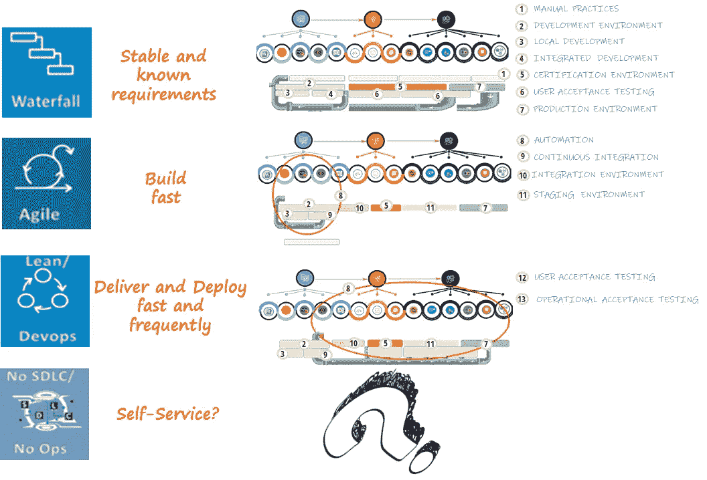
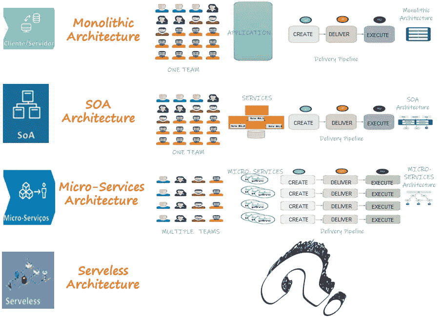
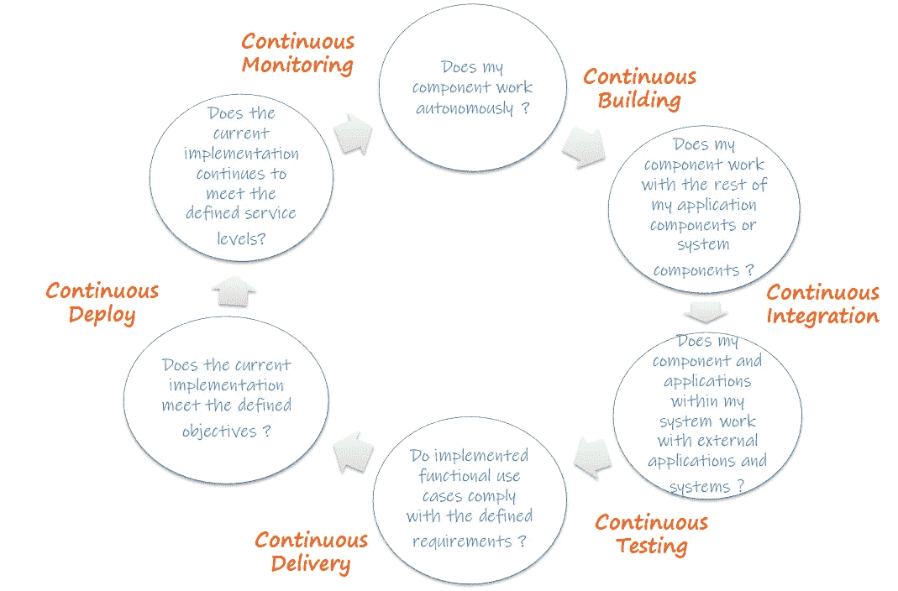
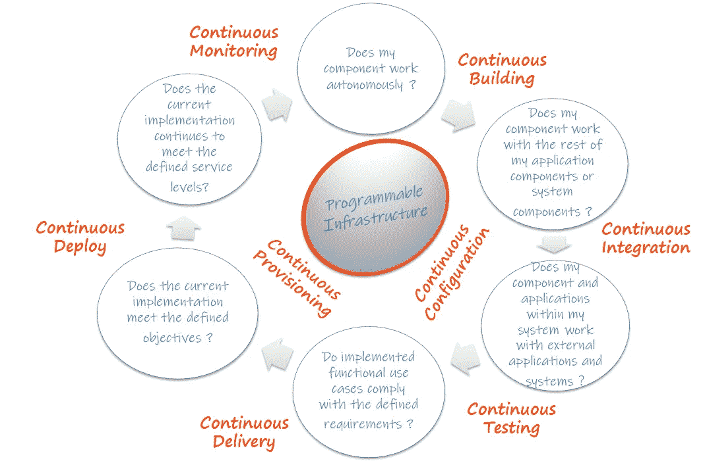
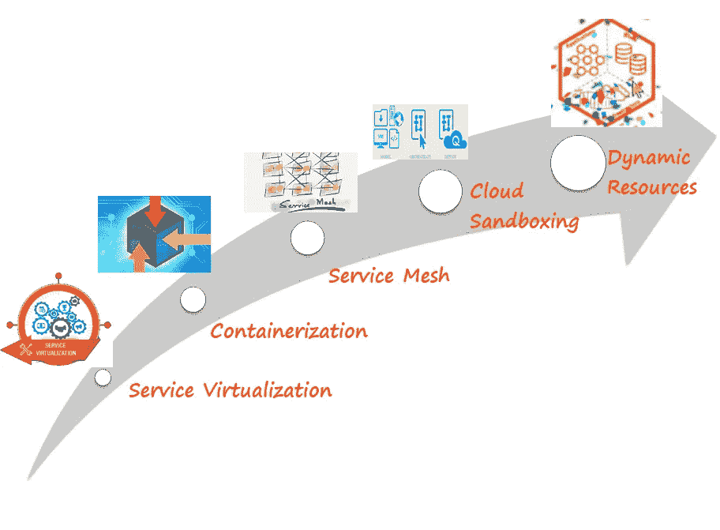
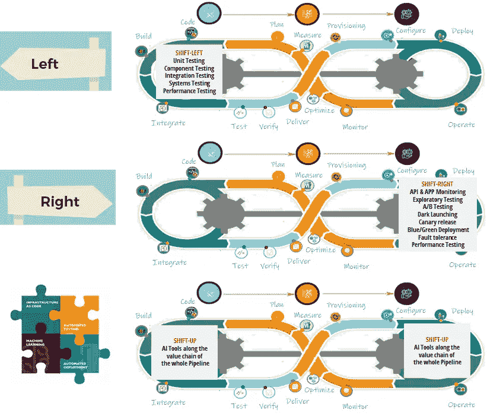

# 系统开发生命周期中的操作环境

> 原文：<https://medium.com/geekculture/sdlc-operating-environments-part-iii-97f84987f210?source=collection_archive---------45----------------------->

***感悟*** 从 ***变化******挑战*** 在 ***旅程*** 中部署 ***工作量***

# “系统开发生命周期中的操作环境”系列的一部分

🔘 [*第一部*](https://medium.com/p/5f74d15cd5ff/edit) *:* ***场景设定。***

🔘 [*第二部分*](https://medium.com/p/fc3482c14172/edit) *:* ***从“为什么”开始。***

🔘*第三部分:* ***继续前进*** *(你现在正在读)。*

🔘 [*第四部分*](https://medium.com/p/d74cbdc72eb3/edit) *:* ***结果。***

# 开始之前

## 放弃

本帖为个人中帖。这里表达的任何观点仅属于作者，并不反映作者曾经或现在隶属的任何公司或组织的任何观点或意见。在这里看到完整的免责声明[。](https://jhadnr68.medium.com/disclaimer-70803d581009)

# 第三部分:继续讨论“什么”

# 4 |救助框架

🔧那么，我们怎样才能减轻练习的难度呢？我们最终使用一个通用框架来:

①确定一般的**活动**(是什么)，这些活动现在是现代*交付和监控管道*可能成为的**组成部分；**

②确定一组被认为与管道价值链相关的 ***类型的测试*** 。如果测试是所谓的“ ***验收标准*** ”，我们需要决定使用什么标准来交付和操作服务。这种认同是至关重要的；

③验证每次测试的**目的**和每次变更的**原因之间的映射。验证管道中每一步的关系；**

④确定一组清晰的"*"概念边界，用于陈述每个**操作环境**之间的基本**差异**，并将它们映射到新的**交付实践和基础架构范例**；*

*⑤绘制未来“ ***候选环境*** 和当前“ ***运行环境*** 的差异；*

*🛴和曾**动了动**接着道:*

*①分析哪些**战略集群**正在**推动变革**；*

*②分析每个**集群**是如何**挑战**和**改变**我们当前对目的的**理解、性质、特征以及每个**操作环境**的物理或虚拟设置；***

*③我们如何看待未来的**经营环境**；*

*④如果我们想提出一个进化策略，我们如何向前推进？*

# *5 |应用框架*

*在运用该框架后，很明显，未来作战环境的目的、性质和特征**应该是更广泛的战略思考**的组成部分:*

*①为您的 SDLC 采用**新方法和范例**将允许您首先调整您的**愿景**和**界限***

**

*Map boundaries and common steps along a generic pipeline with your Candidate Environments*

*②为您的 SDLC 采用**新方法和范例**将允许您**重新定义您的产品价值链***

**

*Map each methodology to your generic Pipeline to better understand possible changes and challenges*

> *🛪 ❝然后，您将能够从一个完全分阶段的、不连续的和分段的“交付管道”转移到一个连续的和统一的“交付和监控 Pipeline❞”*

*③采用新的**软件架构**将使您能够将您的工作负载设计为一组**更精细的分布式服务，具有有限的依赖性***

**

*Map each Software Architecture type to your generic Pipeline to better understand possible changes and challenges*

> *↬ ❝然后，您将能够扩展您的连续和统一的“交付和监控管道”,具有联邦和并行化的特征，与每个测试的性质一致，成为 executed❞*

*④逐步采用**新的实践，用于持续构建和构建、持续集成、持续测试、持续交付、持续供应和配置管理(可编程基础设施)***

**

*Align your Mindset with new Practices to better understand possible changes and challenges*

> *👌❝，然后，你将能够重新定义你的思维模式对当前的边界，目的和性质，每一个你的新操作 Environments❞*

*⑤采用新的**基础架构范例**来部署您的工作负载*

**

*Align your Mindset with new Infrastructure Paradigms to better understand possible changes and challenges*

> *⚙ ❝然后，您将能够以一种动态的方式提供一组资源，针对不同的服务质量需求，并开始将您的基础设施视为一个不可变的 thing❞*

*⑥采用**新平台和运营模式**(如云)来支持您的工作负载，以便**开始以动态和自动化的方式管理您的基础设施。**您开始**将您的基础设施视为一组资源，您需要像管理任何其他资源一样管理它们**(就像您管理软件开发一样)。那些**资源变得“T7”按需可用，使得它们的执行上下文短暂***

**

*Align your Mindset with new Platforms and Operative Models to better understand possible changes and challenges*

> *👁❝然后你会得到不可变的配置、动态和虚拟的资源、虚拟化的接口(有更多的隔离级别),你将能够最终重新定义你传统的 Infrastructure❞概念*

*⑦采用**端到端测试策略作为您的“*交付和监控管道”*** 的一个组成部分，您完全重塑了您当前 QA 测试方法的愿景**，仍然以特定的测试阶段**为基础和中心。*

**

*Align your vision on QA testing as just a part of an end-to-end testing strategy*

> *𝄚𝄟 ❝:然后，你将能够把测试看作是单独的行为单元，以迭代的、增量的、持续的方式执行，但是现在完全与你的发布和交付周期的不同步调相一致，也与你的产品 Value-Chain❞的不同阶段所采用的实践相一致*

*你的**当前**和**未来**的成熟度水平和**在你的**产品价值链**中交付工作负载**的运营模式是向前看的关键。你可以以项目、服务或产品为中心，你需要将新的**管道**与你的**流程**对应起来。*

> *♟❝:你们输送管道的策略需要在某种程度上模仿未来的 SDLC❞*

*这一选择将极大地影响你如何看待你的**战略**，即**设计**和**交付**你的最终**管道**。如果你遵循这里定义的[中的一些模式，这是很简单的。](https://harness.io/ebook-pipeline-patterns/)*

1.  *如果你基于"**人**"来驱动你的决策，你假设你仍然主要依赖于手工过程。人们仍然要求批准门的规则，但是您可能非常了解这种模式。*
2.  *如果您基于“**环境**”做出决策，您会假设您的主要目标是部署到多个环境或位置。如果您正在从基于更瀑布式 SDLC 的传统管道转移，这可能是您立即做出的决定。您已经体验到，随着系统的增长，您将需要在系统组件必须穿越的所有环境之间协调转换。*
3.  *如果您基于“**测试**来驱动您的决策，您假设您的测试策略将是您的价值链中交付最终价值的核心资产。您专注于编排您的链，以搭载不同的测试方法。您知道执行每个累积测试所需的周期时间与价值链以及您提供每个环境来执行每个测试的方式之间可能存在依赖关系。*
4.  *如果您基于您的“**服务**”来驱动您的决策，您假设您的服务设计和架构是您的核心资产。当迁移到一个更加分布式的服务架构(例如，基于微服务)时，这可以被视为一个合适的选择，因为您的部署将需要一次包含多个服务。您的管道需要考虑服务编排来管理并行或顺序部署，以确保每个部署和环境的一致性。*
5.  *如果您基于“**结果**来驱动您的决策，您假设每个部署的特性必须匹配您的客户或用户的期望和价值。在这个阶段，您可能已经采用了以产品为中心和价值流管理实践，因为您需要确保您的管道在您的部署结束后还能工作。如果你有一个反馈回路来管理它，这将会有所帮助。*

*您最终将同时分析**多个变量和标准**，所有这些都有助于最终确定每个操作环境的特征。但是我相信将测试策略和实践定义为完全整合到你的“交付和监控管道”的设计中是至关重要的。*

*这一举措将允许您从传统的**交付渠道**过渡到针对您的工作负载的完整统一的**交付、监控、**和*学习* 渠道。*

> *𝅂 ❝:在生产一个新版本时，执行不同类型的测试的节奏完全符合每个变化的性质，这肯定会影响未来 Environments❞的最终性质和需求*

*最终校准和更紧密的集成将允许你完全具体化一个连续的、统一的、自动化的和并行的“交付和监控管道”的设计*

> *🔎❝:通过新管道的实施，你将能够充分理解每种运营环境的新性质和特征，完全重新定义它们在 today❞的当前目的*

# *在你走之前*

*如果你想收到我未来的文章，请务必在[媒体](https://jhadnr68.medium.com/)上关注我。如果你喜欢这个关于系统开发生命周期**系列**中的**操作环境，我想你也会喜欢它的其余部分。***

*你可以在这里给我买杯咖啡[来支持它。或者只是分享你的反馈。](https://www.buymeacoffee.com/jhadnr68)*

***敬请期待！***

*[***在第一部分***](https://medium.com/p/5f74d15cd5ff/edit) *中，我已经用* ***突出显示了*******中的问题来代替*******之前的问题，讨论了要使用哪些操作环境*** *以及它们需要如何发展或未来的样子。****

**[***在第二部***](https://medium.com/p/fc3482c14172/edit) *中，我已经涉及了一点点****的历史，并重点介绍了一些* ***的事实*******了解*** *我们是如何得到* ***这里的*我们应该从过去的****中学习*****中前进。**************

******在本部分的三个*** *中，我展示了* ***如何应用一个框架*** *来帮助阐明***相关的战略关注点，以便在理解建立新的操作环境所面临的挑战的同时进行进一步讨论。*****

*******最后，*** [***在第四部分***](https://medium.com/p/d74cbdc72eb3/edit) *中，我将重点介绍* ***未来的运营环境会是怎样的*** *。*****