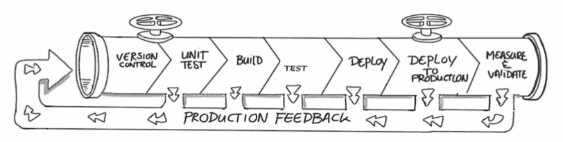

# 系统开发生命周期中的操作环境

> 原文：<https://medium.com/geekculture/sdlc-operating-environments-part-iv-d74cbdc72eb3?source=collection_archive---------52----------------------->

***感悟*** 从 ***变化******挑战*** 在 ***旅程*** 中部署 ***工作量***

# “系统开发生命周期中的操作环境”系列的一部分

🔘 [*第一部*](https://medium.com/p/5f74d15cd5ff/edit) *:* ***场景设定。***

🔘 [*第二部分*](https://medium.com/p/fc3482c14172/edit) *:* ***从“为什么”开始。***

🔘 [*第三部分*](https://medium.com/p/97f84987f210/edit) *:* ***继续说“什么”***

🔘*第四部分:* ***结果*** *(你现在正在看)。*

# 开始之前

## 放弃

本帖为个人中帖。这里表达的任何观点仅属于作者，并不反映作者曾经或现在隶属的任何公司或组织的任何观点或意见。在这里看到完整的免责声明[。](https://jhadnr68.medium.com/disclaimer-70803d581009)

# 第六部分:结果

# 6 |操作环境将会是什么样子

最后，假设您可以考虑整个过程中的三个概念性和整体性步骤— **构建、交付和执行** —我们可以用**候选环境**来映射每个步骤:

① **构建**:你可以用这个进行**局部开发，持续集成，持续构建**；

② **测试**:可以用这个来进行**验证**和**验证**每个**释放**

③ **生产**:你可以用这个来**部署**，**操作**，**监控**，**优化**你的**释放**；

**还可以看另外两个可选:**

④ **功能认证(手动)**:如果您的**最终认证依赖于手动流程**，遵循**用户验收测试(UAT)背后的概念；**

⑤ **Staging** :为了在最终部署之前**验证**和**操作化**您的**发布**，假设您无法在测试或生产环境中完成**的每个步骤，或者您**仍然决定将此作为一个手动过程；****

他们会是什么样子？那是另一个故事。我们大概会有:

① **联合环境**:多实例；

② **物理环境**:持久环境(用于编码、手工测试和生产)；

③ **虚拟环境**:临时的或短暂的(用于自动化测试，或任何其他可以从云操作模型或无服务器架构中受益的类型)

**尤:**

①采用**新的平台和基础设施范例**以及采用**服务虚拟化**等技术将允许您预测集成测试的执行和验证，以及其他一些功能和非功能测试；

②采用**连续交付和监控的实践**以及**自动返回技术**的实现将是决定性的，因为它们将允许**在生命周期的后期执行一些测试**。**这种采用将避免使用一些额外的操作环境的需要，这些操作环境具有更加可控和可预测的性质**，并且通常不提供有效最终验证所需的特征；

> 🔍❝这一愿景需要与最终实施交付和监测 Pipeline❞时采用的测试做法完全一致

如果您查看用于定义此类管道的指导原则，我们会得出以下结论:

> ㊅ ❝在未来，我们将有大量不同类型的作战环境——更多不同性质和 purpose❞的环境

因为在**数字和发布**的节奏之间有一个**直接关系**(自然取决于构建的工作负载类型)，那些**环境**将可能**更少共享(物理的、集中的和持久的)和更多联合(虚拟化的、动态的、临时的和暂时的)**；

> ㊃ ❝最终的数量(多少)，他们的性质(哪些)，他们的类型(他们将如何提供和管理)和目的(他们将用于什么)将在很大程度上取决于 above❞解释

**从这种依赖性出发，您的持续交付和监控管道的设计将最终浮出水面**

# 在你走之前

如果你想收到我未来的文章，请务必在[媒体](https://jhadnr68.medium.com/)上关注我。如果你喜欢这个关于系统开发生命周期**系列**中的**操作环境，我想你也会喜欢它的其余部分。**

你可以在这里给我买一杯咖啡来支持它。或者只是分享你的反馈。

**敬请期待！**

[***在第一部分***](https://medium.com/p/5f74d15cd5ff/edit) *中，我已经用* ***突出显示了*******中的问题来代替*******之前的问题，讨论了要使用哪些操作环境*** *以及它们需要如何发展或未来的样子。***

**[***在第二部***](https://medium.com/p/fc3482c14172/edit) *中，我已经涉及了一点儿* ***的历史*** *并重点介绍了一些* ***的事实*******理解*** *我们是如何得到******这里的*我们应该从过去的**向* ***学习*********。********

**[***在第三部分***](https://medium.com/p/97f84987f210/edit) *中，我展示了* ***如何应用一个框架*** *来帮助阐明***相关的战略关注点，以便在理解建立新的操作环境所面临的挑战的同时进行进一步讨论。****

*****最后，在这部分的四个*** *中，我已经重点介绍了* ***未来的运营环境会是什么样子*** *。***