# SEA 集团——准备成长还是走向低谷？

> 原文：<https://medium.com/geekculture/sea-group-primed-for-growth-or-road-to-the-bottom-6069c6c0eb11?source=collection_archive---------6----------------------->

SEA Group (NYSE:SE)

这篇报道引发了对 SEA Group 的深度报道，SEA Group 是东南亚在游戏、电子商务和金融服务领域发展最快的企业集团之一。在本报告中，我试图涵盖:

1.  2011 财年第三季度收益概述
2.  业务概述
3.  行业概述
4.  公司的亮点/不足
5.  财务分析
6.  估价
7.  财务模型

# **1。2011 财年第三季度收益概述**

SEA 集团宣布了 2011 财年第三季度的财务业绩，包括以下内容:

(1)2011 财年第 3 季度收入为 27 亿美元(同比增长 122%)

(Shopee 的 GMV 和收入连续 9 次增加

(3)提高对 Shopee 电子商务收入的指导(48 亿美元至 52 亿美元)

此外，首席执行官 Forrest Li 强调要扩大 Free Fire 的用户群，在多个国家(印度尼西亚、马来西亚和巴西)的 Shopee 上加入中小微企业，并在保守的基础上运营 SEA Group，以将整个业务转变为一家盈利的公司。

然而，由于过去 1-2 个交易周市场波动性增加，股票尤其是成长型股票暴跌，SEA Group 的股价回撤了 30%以上。随着这种调整的进行，但 SEA 集团的增长故事几乎没有变化，明智的做法是对该公司进行深入研究，并最终判断它是否值得投资。

在这份报告中，我们希望涵盖由 SEA Group 主导的游戏和电子商务行业，预测公司财务的增长驱动因素，并通过敏感性分析寻求对公司的粗略估值，以确定公司是否具有投资吸引力。

# 2.业务概述

SEA 集团(纽约证券交易所代码:SE)成立于 2009 年，是一家控股公司(图 1)，经营三项主要业务:

**Garena** —一家全球游戏开发商和发行商，为用户提供广受欢迎和引人入胜的移动/个人电脑在线游戏，专门针对 focus 的目标市场进行策划和个性化。Garena 还授权和发布由第三方开发的游戏(图 2)。游戏盈利主要是通过“免费增值”模式产生的；用户将充值游戏中的货币来购买游戏中的虚拟物品和季票。Garena 跟踪其来自季度付费用户(QPU)的收入增长，这些用户通常每月花费固定金额，以享受更个性化的游戏体验(图 3)。用户的获得和保留是通过电子竞技比赛来促进的——每场比赛估计会带来大约 30 万观众，平均观看 2M 时间。

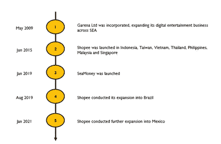

**Fig 1: SEA Group’s History**

**Fig 2 : Garena’s Portfolio**

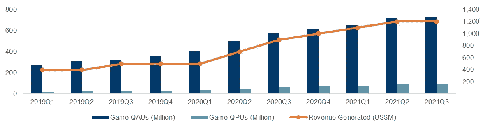

**Fig 3: Digital Entertainment Breakdown**

Shopee —面向东南亚买家和卖家之间的电子商务(更深入地关注高利润类别，如时尚、健康和美容、家居和生活以及婴儿用品)的市场平台，随后扩展到拉丁美洲等其他非洲地区。Shopee 由集成的支付、物流、履行和其他增值服务(联盟营销、直播、游戏化元素等)支持(图 4)。偶尔，Shopee 提到，它对特定商品进行直接销售，以满足买家的需求，使公司能够提供更好的产品组合。Shopee 通过 GMV 收取一定的费用

(A)交易费——向成功下单的所有网店卖家收取的费用

(b)服务费——向参与硬币返现和免费送货计划的卖家收取的费用

(c)佣金——向使用 ShopeeMall 的卖家收取的费用。

Shopee 通过营销和活动、搜索引擎优化等获得额外收入。由于缺乏粒度数据，我们将 Shopee 的收入估算为平台上 GMV 交易的混合提成率(图 5)。

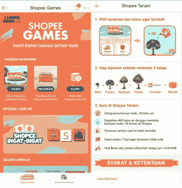

**Fig 4 : Example of Value Added Services**

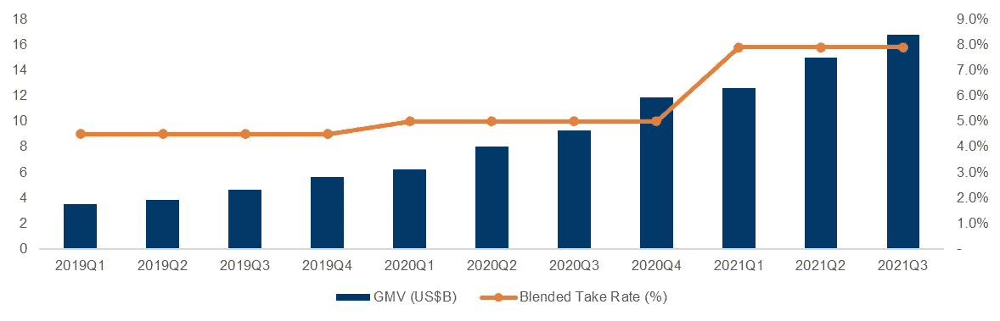

**Fig 5 : E-commerce Breakdown**

**SeaMoney** — SEA 集团推出不到两年的数字金融服务业务。SeaMoney 目前提供移动钱包服务、支付处理、信用相关的数字金融产品和其他金融服务。收入主要来自给第三方商家的佣金和借款人在消费信贷业务方面的利息(贷款和潜在的 BNPL——现在买，以后付)。SeaMoney 自然是一个战略游戏和必要的产品发布，因为 Sea Group 继续围绕 Garena 和 Shopee 创建一个粘性平台，因为内部钱包有助于提供购买商品/游戏内物品的方法，并在生态系统中保留货币价值(图 6)。

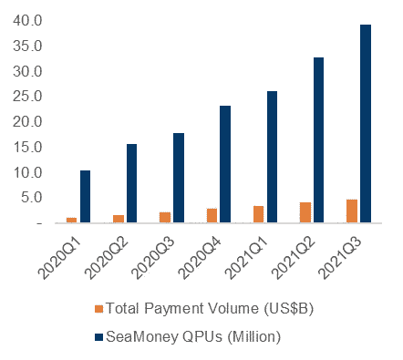

**Fig 6: SeaMoney Breakdown**

此外，由于业务的性质和对客户数据的访问以创建概况等，金融服务的提供允许将各种金融服务进一步投放到贷款、融资和支付中(图 7)。然而，由于 Sea 集团的财务报表中缺乏粒度数据，我们将把 SeaMoney 交易的收取率归入电子商务收入部分。

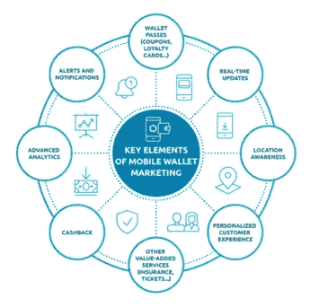

**Fig 7 : Mobile Wallet Marketing Strategy**

对每个收入流的进一步分析将根据 Sea 集团的竞争定位进行，因为报告的这一部分对公司的业务和长期跟踪的具体指标进行了高度概述。

**公司治理**

首先，SEA 集团在董事会中拥有一支强大而多元化的关键管理人员和董事队伍，特别是在游戏、技术、风险投资和运营方面。此外，董事会中的某些成员(余人·辛、克里斯·智敏)来自腾讯和 Lazada/Alibaba 等重要竞争对手，因此他们能够提供丰富的专业知识，在近期和长期内带领 SEA 集团穿越未知领域(附件 A)。

其次，SEA 集团拥有多元化的机构股东基础(T. Rowe Price、J . P Morgan、Tiger Global Management、Capital Research and Management ),股权集中度低于 10%,防止了突然抛售导致价格暴跌的可能性(图 8)。

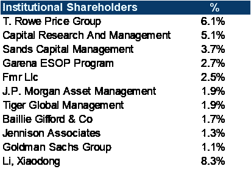

**Fig 8 : Significant Shareholders**

最后，尽管公司目前的发展轨迹和状态，Forrest Li(首席执行官)拥有公司近 9%的股份。如此高的权重和“身临其境”显示出他的内在动机更有希望将公司规模扩大到难以捉摸的 1 万亿美元估值水平。

# 3.行业概述

从宏观角度来看，电子商务和游戏行业预计将分别以 14.3%/12.6%的 CAGR 增长，到 2026 年达到 234/314 亿美元(图 9)。为了确定行业驱动因素，我们考虑了 SEA 集团在其运营格局(主要是东南亚)中的地位，以及仅适用于 SEA 集团的独特动态，该动态将描绘重点行业的长期增长。

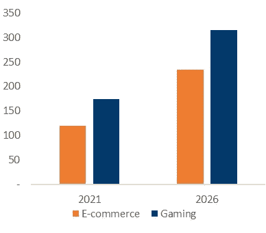

**Fig 9 : Southeast Asia Industry (US$B) (Source: Mordor, Bain, Temasek)**

**(1)** **手机普及率上升**

东南亚国家的移动渗透率超过 50%，一些稍微先进的国家在 70-80%地区达到峰值(图 10)。此外，东南亚的大多数人都表示，由于方便和负担得起，他们更喜欢拥有手机而不是笔记本电脑/电脑(东南亚的大多数消费者都可以获得负担得起的安卓手机，如 Oppo、华为、Vivo 和一加——一部智能手机的起价可以低至 150-300 美元)。因此，大多数面向客户的平台(B2C 服务)都是围绕智能手机的可访问性而构建的:电子商务、在线订购、移动支付、数字银行、移动游戏等等。

此外，东南亚国家在全球范围内的移动使用时间排名前 10 位，包括泰国(5.13 小时/天)、菲律宾(4.58 小时/天)、印度尼西亚(4.35 小时/天)、马来西亚(4.02 小时/天)、越南(3.12 小时/天)和新加坡(2.58 小时/天)。延长使用移动电话的时间对于消费者适应电子商务的使用、从移动来源接收营销材料(直播移动流媒体、社交媒体营销)以及探索计算机游戏的移动版本(例如，多人在线战斗竞技场(MOBA)从 H1Z1 等 PC 游戏过渡到 COD Mobile、Free Fire、PUBG 等移动游戏的激增)至关重要且有益。

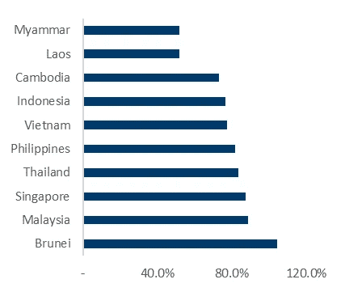

**Fig 10 : Mobile Penetration Rate (Source: Statista)**

因此，东南亚移动渗透率的提高为 SEA 集团开拓电子商务、游戏和金融服务创造了增长机会。

**(2)海洋内物流和基础设施的渐进式风险投资**

支持东南亚电子商务和分销的增长需要资本和基础设施支出。例如，如果没有物流基础设施的适当发展，对印度尼西亚和菲律宾来说，实现跨越群岛的目标仍然具有挑战性。风险投资市场已经抓住了基础设施方面的这些明显趋势，资金已经部署到战略行业领域——物流和电子商务已经在各个子领域获得了超过 50 亿美元的资金，并且后续资金在长期内保持强劲(图 11)。

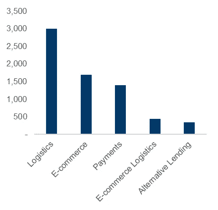

**Fig 11 : Venture Funding (US$M) (Source: Vertex Ventures)**

从更深的角度来看，我们能够确定电子商务/物流中的各个细分市场，这些细分市场将对电子商务的持续增长发挥巨大作用(图 12):

(a)第三方物流配送(Lalamove、Ninjavan、J&T 快递)——技术型初创企业根据需求提供各种商品的配送，并根据配送量进行调整。中小企业可以利用这种技术支持的物流浪潮来销售他们以前无法获得的货物(因为现有的 B2B 物流快递公司只提供最小的固定数量的包裹)

(b) 4PL 交付(Locad，Kargo)——模仿“云”物流交付服务的轻资产商业模式。这些初创企业与车队、仓库运营商和设施经理合作，最大限度地提高供应链运转和周转时间。用户可以相应地增加/减少他们的递送量，并且只为他们需要的确切服务付费。这一概念与东南亚高度相关，因为这十个国家彼此邻近，但这些国家甚至相邻的城市具有不同的季节趋势(例如，这与欧洲相反，在欧洲，整个地区的国家因圣诞节和新年而关闭，因此允许商品的需求/供应发生可预测的变化)。

**通过投资进一步改善物流空间对于电子商务的进一步发展是必要的，因为在以下方面存在困难:(1)将货物运往农村群岛，(2)管理破旧路线上的退货政策，以及(3)支持口味和偏好的动态和快速变化。**

(c)电子商务推动者(SellinAll，istorisend)——发挥中介作用，帮助实体本地人过渡到网上销售。电子商务使能因素加快了他们的牵引力/顶线增长，新冠肺炎起到了催化剂的作用，实体店老板已经认识到需要使他们的收入来源多样化。此外，卖方将能够从一个集中的平台管理多个市场。

(d)跨境贸易和履约机构(1 出口)——在这一领域开展业务的初创企业有助于促进出口合规和便利化，因为东南亚周边的跨境贸易似乎被忽视了——每个国家都有自己的规则和法规需要遵守(一般出口管制、文件)。

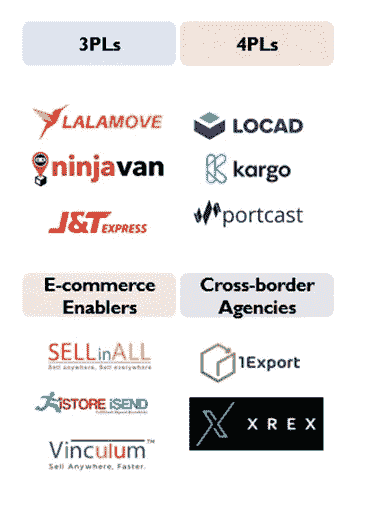

**Fig 12 : Venture Funding Landscape**

**(3)** **中等收入人口上升**

根据美国商务委员会和亚洲开发银行的数据，预计东盟经济将在未来 20-30 年内持续以 5.5%的速度增长，并在 2050 年成为第四大经济体(图 13)。由于政治气候逐渐稳定、增长机会、对东南亚国家的投资以及海外汇款回流，中产阶级预计将在 2030 年增加两倍，从 9100 万人增至 3.34 亿人。因此，我们可以预计，随着消费者在消费各种商品和服务时增加其平均订单价值，生活质量将会提高，这将转化为电子商务/游戏行业的进一步增长。假设每个国家的电子商务购买的篮子大小最终将赶上新加坡的价值，我们可以预计电子商务的商品总值(GMV)将翻两番。

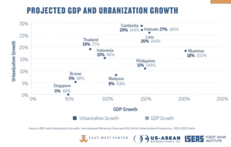

**Fig 13 : GDP vs Urbanization Growth**

**竞争定位**

我认为，Shopee 的竞争地位可能基于:

(1)移动优先的营销策略——直接在移动应用上提供端到端的在线购物体验。此外，大多数促销活动都是通过社交媒体应用程序或甚至在应用程序本身内分发的(图 14)。

**Fig 14 : Shopee’s Selling Formulae**

(2)超本地化方法——Shopee 知道东南亚的每个国家都有独特的特点和挑战，因此吸引消费者的注意力也不同(图 15)。该公司已与每个国家的当地银行和物流业务合作，以满足当地的需求。此外，广告通常包括当地有影响力的人和名人大使来宣传即将到来的销售活动。这一战略推动了 Shopee 的增长，因为 Ecomeye 调查中 60%的受访者确认他们信任名人代言人的购买决定。

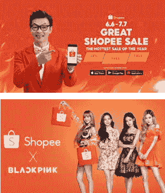

**Fig 15 : Hyper Local Marketing Strategy**

(3)独特的目标市场和客户概况——Shopee 已经开始向中小微企业拓展。虽然这些客户可能不会在平台上带来大量的 GMV 交易，因此可能不会带来像样的单位经济效益，但我认为这是 Shopee 的正确目标客户群。平均而言，微小中型企业贡献了一个国家 60%的劳动力和 40%的国内生产总值。支持中小微企业的发展将使 Shopee 巩固其在 SEA 中作为主导市场平台的地位。此外，由于该公司在 SEA 方面的相对成功，Shopee 继续在拉丁美洲扩张——其地理概况与 SEA 非常相似(需要超本地化的营销分布、不同的文化和各国的特点，微小中型企业为该国的国内生产总值做出了巨大贡献，等等)。其他市场平台的现任者，如 Lazada、拼多多、JD.com 和亚马逊，在拉丁美洲没有大的足迹，这为 SEA 巩固其市场领导者的地位提供了一个绝佳的机会。

然而，SEA 集团在类似的行业领域拥有强大的竞争对手。我们将深入分类，并尝试筛选出 SEA Group 可能有的任何亮点/亮点。

1.  **游戏**

值得注意的公司包括腾讯和 Valve(更多关于开发 PC 游戏)。尽管腾讯是 Garena 的战略投资者，但由于 Riot Games、Supercell 和 Epic Games 等其他游戏开发商直接与 Garena 在第一人称/第三人称/英雄射手 MOBAs 系列产品上竞争，因此可能会出现收入分流。为了简单起见，由于腾讯对大量游戏开发公司的投资，我将把所有这些竞争对手合并到腾讯旗下。从图 16 中，我们可以看出 MOBA 游戏市场的相对饱和，尽管 MOBA 是休闲游戏玩家中最受欢迎的游戏类型之一。

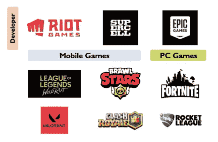

**Fig 16 : Gaming Competitive Landscape**

此外，MOBAs 已经脱离了第一人称/第三人称射击游戏的设定，转向了“动作-角色”类型的游戏。一个显著的例子是由 Timi Studios(腾讯子公司)于 2021 年 9 月发布的新动作角色 MOBA《神奇宝贝联合》。(图 17)这款手机游戏的下载量已超过 3000 万次，荣获“Google Play 最佳游戏”称号，并积累了 2600 条流媒体，播放时间超过 30 万小时(目前排名第 122 位)。一个基准比较将是它的数字已经超过了 Maplestory，一个流行的 MMORPG 游戏，有 15 年的历史。随着消费者的品味和偏好随着时间的推移而演变，人们不应该忽视游戏制作中即将出现的流派，从而决定了 Garena 当前游戏渠道的成败。

**Fig 17 : Pokemon Unite Gameplay**

2.**电子商务**

在同一细分市场和地理区域运营的著名公司包括亚马逊、Lazada、Tokopedia、Bukalapak 和 BliBli.com。尽管竞争相对激烈，Shopee 仍然是 SEA 中电子商务的市场领导者，能够在不久前击败 Lazada(图 18)。总之，我们比较了三大巨头在不同细分市场的服务，确定 Shopee 在产品差异化方面领先，但也有一些不足，如缺乏先进的包裹跟踪和产品退货时间表(图 19)。

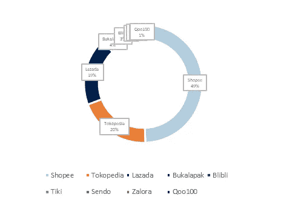

**Fig 19 : E-commerce Traffic Breakdown (Source: ASEAN Council)**

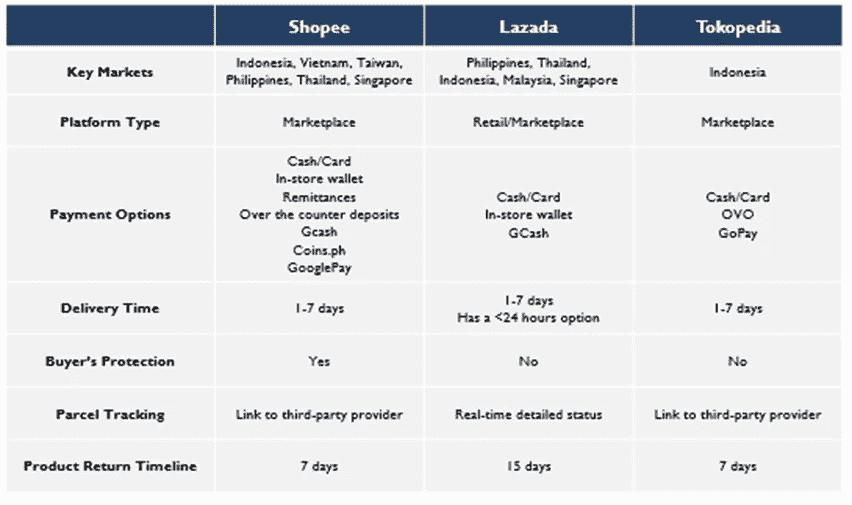

**Fig 19 : Bigwig Competitive Landscape**

另一个需要注意的关键点(在下表中没有确立)是 Shopee 中缺乏值得信赖的电子卖家。至少对新加坡来说，Lazada 是购买高端消费品的首选，而 Shopee 更受购买易腐商品的欢迎。这在很大程度上是由于网上卖家的质量，Shopee 上有更多卖家出售知名品牌的仿冒品。

# 4.高光/弱光

**亮点**

**(1)** **享受唾手可得的好处**

由于 SEA 和 LATAM 独特的经济形势，SEA 集团打破了企业追求高平均订单价值(AOV)和高利润细分市场的常规，并从追求低回报中受益。尽管从利润率较低的业务中获得收入，但 SEA Group 以更高的销量弥补了这一劣势——最终获得了比试图在发达经济体扩大收入目标更高的收入。我们可以通过以下方式找到这些唾手可得的好例子:

(a)将重点扩大到跨地理区域的中小微企业

Shopee 强调了对支持不同国家中小微企业的巨大关注。例如，Shopee 在马来西亚提供了超过 100，000 个微小中型企业的数字化服务，为每个企业提供高达 3，000 令吉的服务，这还不包括巴西和印度尼西亚等其他国家的类似服务(图 20)。我认为这是该公司的明智之举，因为中小微企业贡献了该国约 8-10%的 GDP。此外，由于强大的文化根源和大多数跨国公司无法与之竞争的可承受的价格，当地消费者对微小中型企业非常忠诚。我们可以将这些结果归因于大多数试图渗透东南亚的国际公司——越南的赛百味/肯德基/星巴克和印度尼西亚的沃尔玛/7–11——都遭遇了惨败。在东南亚进行销售是很棘手的，因为必须考虑到经济形势、跨宗教和文化信仰、地理位置传统以及生活方式。幸运的是，Shopee 已经找到了愿意的公式，并将尝试在 LATAM 中复制同样的成功，其中包含与 SEA 相同的动态。

**Fig 20 : E-commerce Campaign, Malaysia**

(b)入门级游戏，以迎合目标受众

在游戏方面，Garena 推出的 Free Fire 是一款“低质量”MOBA，迎合了发展中经济体对入门级智能手机的需求——足以运行 Free Fire 并享受游戏的 MOBA 方面。在 Garena 关注的发展中国家，这款游戏的受欢迎程度已经扶摇直上，而且这种趋势很可能会持续下去。这向我们展示了产品的市场适应性以及了解客户概况和限制的重要性。如果 Garena 坚持将 COD Mobile 推向其他国家的立场，由于运行游戏的高特定要求，接受度不会那么高；苹果和三星手机将是唯一能够运行 COD Mobile 的设备。

**(2)** **围绕生态系统建设服务**

为了包装整个生态系统，SeaMoney 的推出旨在帮助发展中国家没有银行账户和银行服务不足的人口。通过在生态系统中巩固更多的人口(Grab 是一个典型的例子，图 21)，资金周转率增加，这将提高 Sea 集团的收入。此外，内部钱包的使用还将降低支付给其他支付处理商的成本，因为大多数交易都是在内部进行的。最后，Shopee 迅速在其平台上加入了每个国家特有的主要支付提供商，如菲律宾的 Gcash 和 Coins.ph、马来西亚的 Maybank2u 等。通过创建一套适应消费者偏好和便利的服务，SEA 集团平台上的牵引力和交易量将随着时间的推移而直观地增加。

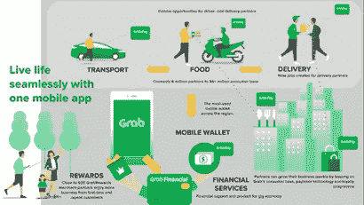

**Fig 21 : Building an Eco-system (Source: Grab)**

**(3)** **改善运营结构和股权薪酬占收入的百分比**

SEA 集团成功地控制了其运营结构，使其不至于失控，因此我们可以看到过去几个财年的利润率有所提高(图 22)。如果管理层能够有效地控制他们的支出，公司很有希望在 26/27 财年实现财务模型预测的盈利能力(将在报告中进一步讨论)。

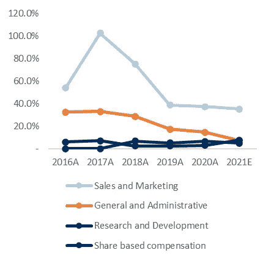

**Fig 22: OPEX as % of Revenue**

**(4)** **Shopee 接任 SEA 市场领导者**

作为一名新加坡人，在过去几年里，当我想购买各种商品时，Lazada 是一个必去的市场平台。另一方面，Shopee 是一个非常随意的 C2C 平台，我使用起来并不舒服，因为下一个立即吸引消费者的替代品是转向 Carousell。然而，Shopee 能够克服各种质疑，并已成为 SEA 集团的旗舰产品。这里有大量的催化剂，例如带有朗朗上口的歌曲/舞蹈的过度邪教式营销，讽刺的是，这种营销使其品牌在美国消费者中根深蒂固，获得在其他地方买不到的 MSME 类型的产品，无数的团购选择，以及在一定程度上购买山寨产品以满足我们“消费主义”需求的能力。最终，Shopee 的营销完全占据了这块蛋糕，帮助该公司提升了其作为 SEA 领先电子商务提供商的地位(Shopee 在 2019 年底取代 Lazada 成为电子商务市场领导者就是明证)。

**低光**

**(1)** **相对凌乱的 UI 和令人不快的 UX (Shopee)**

尽管这是一个主观的观点，但我个人并不喜欢 Shopee 的用户界面，因为它给人的感觉就像是一个信息垃圾场。首先，Shopee 在浏览产品时增加了一种广告形式，对于像我这样的消费者来说，这种形式通常会令人生厌，因为我想尽快进行“进得去出得去”的交易(因为我已经知道我打算购买什么)。第二，当你向下滚动产品时，Lazada 很好地将产品信息分段(图 23)，而 Shopee 缺乏这个特性，因此信息呈现感觉非常不结构化。通常由于这些原因，当我购买一件昂贵的产品时(我想在购买前获得更多的信息细节)，我总是更有必要首先访问 Lazada。另一方面，Shopee 更像是一个进行一次性购买的平台，价格通常很低。

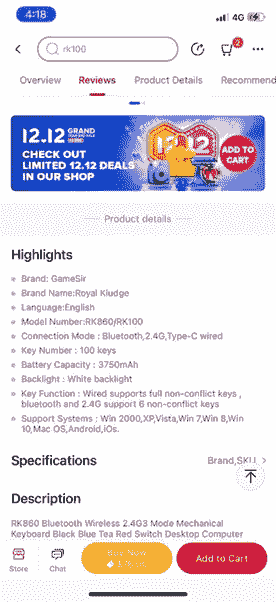

**Fig 23 : Lazada’s Information Layout**

**(2)** **【潜在 D2C 竞赛(Shopee)**

随着建立电子商务基础设施、支付机制、低价社交媒体广告平台的风险投资的增加，以及对品牌忠诚度的逐渐态度，D2C 为消费者提供了购买产品的替代渠道，甚至有可能节省成本，因为销售过程跳过了中间商(连接买方和卖方的市场平台)。各种风险投资公司一直在关注 D2C 可能成为电子商务市场的竞争对手(APAC 广告公司，Insignia Ventures——你可以通过谷歌搜索查看他们的白皮书),所以这是一个不容忽视的威胁。

**(3)** **摄取“动作”的 MOBAs (Garena)**

随着 Timi Studio 最近发布 Pokemon Unite，Garena 可能难以与游戏巨头竞争，因为每家公司都试图为消费者提供最佳的游戏体验。Supercell 还打算推出一系列游戏(Clash Quest、Clash Mini 和 Clash Heroes)，这些游戏可以将游戏玩家吸引回 Supercell 的游戏阵列中。

**(4)** **高 EV/营收估值溢价**

与经营电子商务服务的其他公司相比，SEA 集团目前的 EV/LTM 收入溢价高达 30.4 倍，几乎是平均值(7.9 倍)的 4 倍(图 24)。当我们细看竞争对手的运营统计数据时，估值差异就更加明显了——例如，JD.com 和拼多多报告的当前估值的收入增长要高得多——因此，从估值的角度来看，从更大的角度来看，SEA Group 可能不像是一项有吸引力的投资。

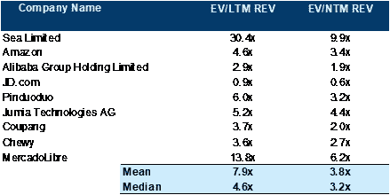

**Fig 24 : Comparable Companies**

**(3)** **难以渗透入 LATAM(主要是 Shopee)**

尽管 SEA 集团继续向拉美扩张是一个理性的战略举措，但它可能大大低估了进入拉美市场的顾虑，例如:

有限的支付方式

联邦快递在其 2020 年的报告中称，80%的家庭使用现金作为货币交易的主要形式，尽管替代支付方式的数字一直在增加。然而，采用率将在很长一段时间内保持较低水平，最终的采用将需要大量的既得时间。

(b)缺乏适当的物流基础设施

不可靠的清关、最后一英里和逆向物流仍然是 LATAM 电子商务行业最终增长的巨大障碍。面对产品安全交付的高额保险费，大多数当地消费者不愿意使用电子商务，而是继续在当地零售商那里购物

通关效率低下

在美洲市场情报公司(Americas Market Intelligence)2016 年进行的一项私人研究中，跨多个拉丁美洲国家运送的试用包裹经常导致包裹丢失或损坏。此外，世界银行进行的另一项研究也显示，一个包裹平均需要 110 个小时才能符合海关文件和边境合规要求——这很难成为跨境电子商务的支持因素(图 25)。

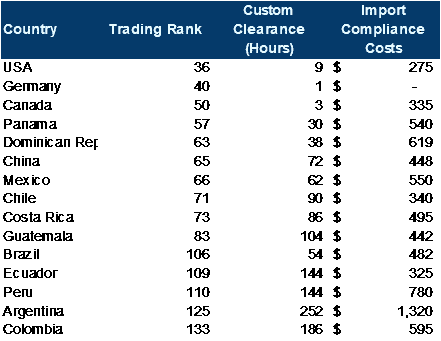

**Fig 25 : Trade Indicators (Source: Market Intelligence)**

更多的跨境挑战需要通过改善基础设施或巩固跨境贸易法规来解决，但目前的环境表明这些因素阻碍了拉美地区电子商务的潜力。

# 5.财务分析

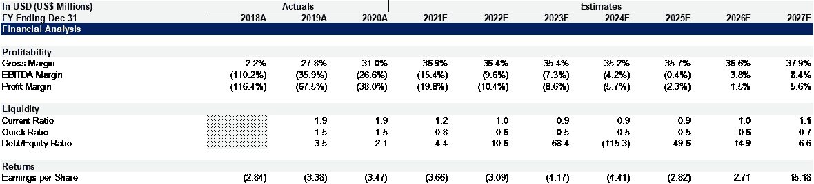

由于该公司目前无利可图，过去的估值指标如 ROA、ROE、ROIC 不适用于分析该公司。我们将预测整体收入增长和运营结构，以确定该公司是否能够找到“触发器”，将业务模式转变为盈利。

2010 财年，历史收入以 14.9%的 CAGR 增长，达到 44 亿美元，并将在 2017 财年以 10.7%的 CAGR 增长，达到 1500 亿美元(图 26)。

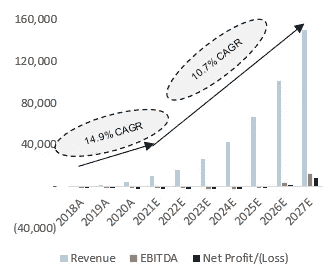

**Fig 26 : Financials (US$M)**

收入主要分为(a)数字娱乐，(b)电子商务和其他服务，以及(c)直接销售商品，其中 Shopee 持有库存并对一系列待售产品进行标记。重申一下业务概述部分(图 27)，

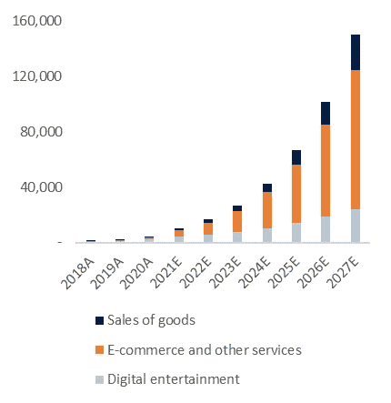

**Fig 27 : Revenue Segments (US$M)**

(a)数字娱乐收入来自 Garena 游戏套件的月付费用户总数，这些用户在消费游戏内物品时会获得一定比例的利润。

(b)电子商务收入来自 Shopee 上所有产品/服务产生的总商品总值(GMV)的混合百分比抽取率。

(c)商品销售是被购物者选择销售的各种产品的库存成本的加价。

值得注意的是，到 2027 财年，Shopee 的电子商务收入将占 SEA 集团总收入的 50%以上，这是推高股票价格和估值的唯一催化剂。我估计 GMV 的年同比增长率约为 11-15%(到 2027 财年在 GMV 达到 1.2 万亿美元)，混合提取率在 6-7%的范围内(包括 SeaMoney 交易)。另一方面，Garena 将成为 SEA 集团的摇钱树和资金来源，以将 Shopee 积极扩展到其他国家和大陆。该公司预计到 2026 财年 EBITDA 为正，并有望在 2030 财年达到稳定的利润率。此外，公司的运营结构(包括 COGS 和 OPEX)预计为每个行项目收入的百分比(图 28 和 29)。这些预测将与其他电子商务平台的运营结构保持一致。

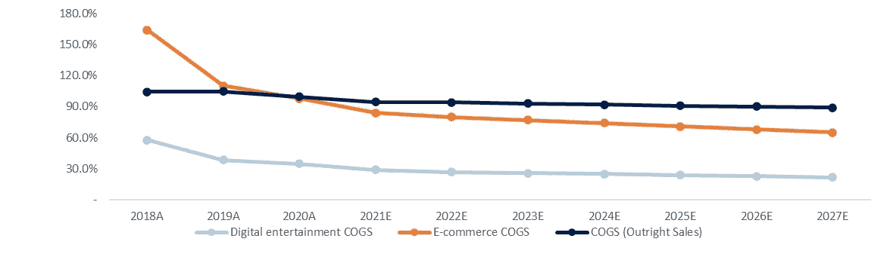

**Fig 28 : COGS Projection (% of revenue)**

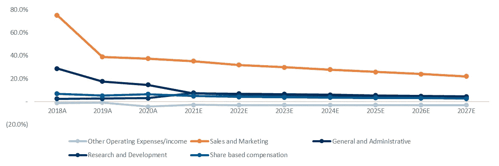

**Fig 29 : OPEX Projections (% of revenue)**

尽管在 Shopee 上进行了积极的扩张，但该公司一直在改善其利润和运营结构，我认为这些项目的改善将继续向前发展，从而反映在公司的预测中。

# 6.估价

**加权平均资本成本(WACC)**

SEA 集团的 WACC(图 30)估计为 10.5%。债务成本的计算方法是取公司持有的可转换债务的混合平均值，加上 10 年无风险利率。权益成本通过 CAPM 公式计算，反映了美国的权益风险溢价、无风险利率和 SEA 集团的 5 年 Beta。

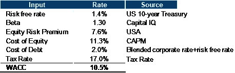

**Fig 30 : WACC Calculation**

**公允价值/股份**

使用退出倍数和永久增长法进行退出估值，我们得出每种方法的公允价值/股分别为 372.86 美元和 409 .58 美元。EV/EBITDA 与 JD.com EV/NTM EBITDA 倍数挂钩，因为两家公司在目标市场加速抢占市场份额方面具有可比性，并且面临相似的增长轨迹。永久增长上限为 5%，因为电子商务和金融科技服务目前正处于增长阶段，收入增长不会很快达到上限。因此，目前的股价似乎打了折扣，对于快速增长行业中的高增长公司而言，SEA 集团看起来是一项有吸引力的投资(图 31)。

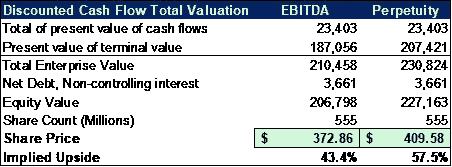

**Fig 31 : Fair value/Share Calculation**

**选项值转换**

必须说明 rsu 和期权的价值，这样我们才能获得公司的真实公允价值/份额。输入数据被合并，并使用 Black-Scholes 期权定价模型(图 32)来确定将稀释公司初始股权价值的未偿期权的价值。此外，新的股权价值将被分配给未入账的股票单位，代表公司每股的“真实”公允价值(图 33)。

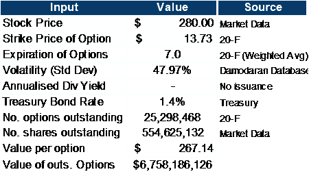

**Fig 32 : Option Value Calculation**

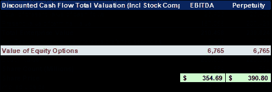

**Fig 33 : True Fair Value/Share**

考虑到稀释效应(代表 1000 万个 rsu 中超过 67 亿美元的稀释)，SEA 集团的每股真实公允价值将通过 EBITDA 倍数法定价为 354.6 美元，通过终端增长法定价为 390.8 美元。这代表了当前股价和公司每股初始公允价值的进一步下跌。

**敏感性分析**

对 SEA 集团进行敏感性分析，以衡量股票定价走向的不同可能性，这取决于所采用的方案和估值方法的类型。足球场可视化(图 34)向我们展示了 SEA 集团更多地关注“市场估值”，而不是潜在的未来增长。因此，该公司的股价从 370 美元的历史高点跌至 253 美元的近期低点。如果 SEA 集团开始恢复投资者的信心，证明他们能够达到管理层设定的增长率，那么反弹回近期高点是可以实现的。

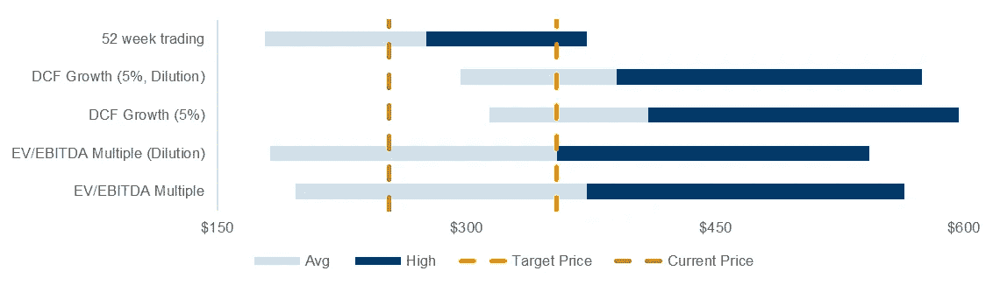

**Fig 31: Football Field Valuation**

# 7.个人观点

由于成长型股票的回撤、利率的逐渐回升以及市场波动性的增加(恐惧和波动指数一直呈上升趋势)，SEA Group 的股价在过去 1-2 周内暴跌。由于对 SEA 集团如何在 5-6 年内将收入提高到 1000 亿美元并实现 EBITDA 转正(假设保守的运营结构和健康的市场条件)的有利地位，对该公司的投资可能会带来潜在的好处。唯一令人担忧的是其相对昂贵的估值，因为其他电子商务竞争对手也报告了类似的增长比例，但估值倍数(EV/收入)较低。然而，最具可比性的公司是中国科技公司，由于中国共产党收紧规章制度，这些公司的股价面临进一步下跌。考虑到上述其他变量，SEA Group 相比之下看起来是一个不错的投资——中国电子商务/游戏公司正面临巨大的审查，相对成熟的公司如亚马逊(Amazon)拥有巨大的市值(截至 12 月 21 日早些时候为 1.8 万亿美元)，其大部分 alpha 值已反映在价格中。涵盖强劲发展中经济体的电子商务、游戏和金融服务的下一个最佳投资是 SEA Group——因此，如果投资者愿意以高估值倍数进入，这一投资决策在 190-230 美元的首次进入和较低价格下的平均美元成本中是相当合理的。

**该信息无意作为个人或实体任何投资决策的依据。此信息不构成投资建议，也不是买卖任何证券的要约或要约邀请。**