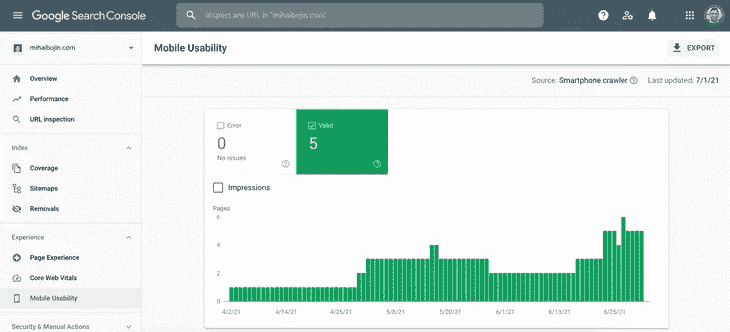

# 用 GatsbyJS 优化搜索引擎

> 原文：<https://medium.com/geekculture/search-engine-optimization-with-gatsbyjs-3a77b5442ec6?source=collection_archive---------34----------------------->

## 关于 Gatsby 中搜索引擎优化(SEO)的入门教程


“Photo by [Merakist](https://unsplash.com/@merakist?utm_source=unsplash&utm_medium=referral&utm_content=creditCopyText) on [Unsplash](https://unsplash.com/s/photos/seo?utm_source=unsplash&utm_medium=referral&utm_content=creditCopyText)”

🔔这篇文章最初发布在我的网站，[MihaiBojin.com](https://mihaibojin.com/personal-site/seo-on-gatsbyjs?utm_source=Medium&utm_medium=organic&utm_campaign=rss)。🔔

这是一篇关于用 Gatsby 优化搜索引擎的介绍性文章。

它涵盖了一些基础知识，很容易实现，但从长远来看，将有助于您的 SEO 排名。

## 谷歌搜索控制台

一个唾手可得的成果就是用谷歌的搜索控制台来验证你的域名。

花 5 分钟去做；您将获得有用的信息，例如:



## 规范链接

每个页面都应该定义一个规范的链接。这些是有用的，因为它们帮助搜索引擎，如谷歌，找出原始内容，将所有的“果汁”发送到那个页面。

考虑以下 URL:

```
- http://site.com/article
- http://www.site.com/article
- [https://site.com/article](https://site.com/article)
```

可以在多个 URL 访问相同内容。然而，谷歌不知道哪个页面包含原始内容，所以它很可能会在这些页面中的几个之间划分排名，并将大多数页面标记为重复。这是非常不可预测和不可取的。更好的方法是定义一个规范链接，帮助搜索引擎对你选择的一个 URL 进行排名。

您可以通过在站点头中包含以下标记来定义规范链接:

```
<link rel="canonical" href="https://MihaiBojin.com/"/>
```

(其中`href`是您选择用来代表您的原创内容的 URL。)

当你在其他网站上整合你的内容时，这种方法非常有效。例如，如果你在 Medium 上这样做，谷歌很可能会将其列为原创，因为该网站的整体排名较高，导致搜索引擎优化对你的域名产生不良影响。

在 Gatsby 中添加规范链接有一个简单的方法:使用[Gatsby-plugin-react-helmet-canonical-URLs](https://www.gatsbyjs.com/plugins/gatsby-plugin-react-helmet-canonical-urls/)插件。

用`npm install --save gatsby-plugin-react-helmet gatsby-plugin-react-helmet-canonical-urls`安装。

然后将以下插件添加到您的`gatsby-config.js`中:

```
module.exports = {
  plugins: [
    {
      resolve: `gatsby-plugin-react-helmet-canonical-urls`,
      options: {
        siteUrl: SITE_URL,
      },
    },
  ],
};
```

## 网站地图

随着时间的推移，谷歌会逐渐发现并索引你网站的页面。你可以定义一个网站地图来帮助谷歌(和其他搜索引擎)找到你所有的页面。这个过程并不能保证更快的索引，而且在你网站的早期，它[也不会产生很大的影响](https://twitter.com/mihaibojin/status/1410349406944116745)，但是随着你网站的发展，它会变得更加重要！

首先，安装 [gatsby-plugin-sitemap](https://www.gatsbyjs.com/plugins/gatsby-plugin-sitemap/#example) 插件。

```
npm install gatsby-plugin-sitemap
```

然后，您需要在`gatsby-config.js`中添加一些自定义配置。当我最初配置这个插件时，这一步花了我很长时间才做好。部分原因是由一个已经被修复的错误引起的。

```
module.exports = {
  plugins: [
    {
      resolve: 'gatsby-plugin-sitemap',
      options: {
        output: '/',
        query: `
        {
          site {
            siteMetadata {
              siteUrl
            }
          }
          allSitePage(
            filter: {
              path: { regex: "/^(?!/404/|/404.html|/dev-404-page/)/" }
            }
          ) {
            nodes {
              path
            }
          }
        }
        `,
        resolvePages: ({ allSitePage: { nodes: allPages } }) => {
          return allPages.map((page) => {
            return { ...page };
          });
        },
        serialize: ({ path }) => {
          return {
            url: path,
            changefreq: 'weekly',
            priority: 0.7,
          };
        },
      },
    },
  ],
};
```

如果你想知道为什么我们要加载一个`siteUrl`，它是必需的，正如[官方文档](https://www.gatsbyjs.com/plugins/gatsby-plugin-sitemap/#api-reference)中所解释的。

# 机器人

[Robots.txt](https://developers.google.com/search/docs/advanced/robots/intro) 是个老概念；`robots.txt`文件告诉搜索引擎在你的网站上哪些 URL 是可以访问的(并随后被编入索引)。

如果你正在寻找自动生成这个文件的方法，[Gatsby-plugin-robots-txt](https://www.gatsbyjs.com/plugins/gatsby-plugin-robots-txt/)是你的好朋友！

通过运行`npm install --save gatsby-plugin-robots-txt`安装插件，并将以下内容添加到您的`gatsby-config.js`中:

```
module.exports = {
  plugins: [
    {
      resolve: 'gatsby-plugin-robots-txt',
      options: {
        host: process.env.SITE_URL,
        sitemap: process.env.SITE_URL + '/sitemap/sitemap-index.xml',
        policy: [
          {
            userAgent: '*',
            allow: '/',
            disallow: ['/404'],
          },
        ],
      },
    },
  ],
};
```

如上设置插件将生成一个指定上述选项的`/robots.txt`文件。

然而，如果你正在寻找一个更简单的方法，跳过上面所有的，用相同的内容创建`/static/robots.txt`。

```
User-agent: *
Allow: /
Disallow: /404
Sitemap: https://[SITE_URL]/sitemap/sitemap-index.xml
Host: [https://[SITE_URL]](https://[SITE_URL])
```

确保用合适的值替换`SITE_URL`！

后者有一个缺点，因为您必须记住更新这个文件中的 SITE_URL。这在实践中不太可能是一个问题，但是…从长远来看，使用插件和依赖一个全局定义的 SITE_URL 会少一些麻烦。

> 注意:在 Gatsby 中，在`/static`目录中创建的任何文件都将作为静态文件包含在您的站点中。

你可能已经注意到了`Sitemap`指令。这允许让爬虫知道他们能在哪里找到你的站点地图索引。在本文的前面，我们使用了*谷歌搜索控制台*，这是更好的方法。然而，除了谷歌还有其他搜索引擎，有了这个指令意味着他们都可以找到并处理你的网站地图。

# 盖茨比的 SEO

我们终于结束了——尽管这是最棘手的部分，因为它需要了解 Gatsby 是如何做 SEO 的。

如果你没有这方面的经验，我推荐你阅读 [Gatsby 搜索引擎优化页面](https://www.gatsbyjs.com/tutorial/seo-and-social-sharing-cards-tutorial/)(暂时不要担心社交卡)。

这篇文章不会深入高级搜索引擎优化策略(主要是因为我不是搜索引擎优化专家)。

> 随着时间的推移，我写更多的内容，我学习新的搜索引擎优化技巧和窍门，我会更新这个页面。

但是，任何站点所有者都应该做一组最少的配置，最少的配置，如果您愿意:

*   代表内容的标题、描述和关键字元标签
*   和规范链接(如上所述)

如果您搜索 [Gatsby Starters 库](https://www.gatsbyjs.com/starters/)，您会发现许多实现和实现这个目标的稍微不同的方法。

我是这样实现的。我并不认为这更好或提供任何优势——它只是完成了工作！

```
import * as React from "react";
import PropTypes from "prop-types";
import { Helmet } from "react-helmet";import { useSiteMetadata } from "../hooks/use-site-metadata";function Seo({ title, description, tags, canonicalURL, lang }) {
  const { siteMetadata } = useSiteMetadata(); const pageDescription = description || siteMetadata.description;
  const meta = [];
  const links = []; if (tags) {
    // define META tags
    meta.push({
      name: "keywords",
      content: tags.join(","),
    });
  } if (canonicalURL) {
    links.push({
      rel: "canonical",
      href: canonicalURL,
    });
  } return (
    <Helmet
      htmlAttributes={{
        lang,
      }}
      // define META title
      title={title}
      titleTemplate={siteMetadata?.title ? `%s | ${siteMetadata.title}` : `%s`}
      link={links}
      meta={[
        // define META description
        {
          name: `description`,
          content: pageDescription,
        },
      ].concat(meta)}
    />
  );
}Seo.defaultProps = {
  lang: `en`,
  tags: [],
};Seo.propTypes = {
  title: PropTypes.string.isRequired,
  description: PropTypes.string.isRequired,
  tags: PropTypes.arrayOf(PropTypes.string),
  canonicalURL: PropTypes.string,
  lang: PropTypes.string,
};export default Seo;
```

这段代码使用`react-helmet`来定义指定的标签。

你可能已经注意到它使用了一个 [react 钩子](https://reactjs.org/docs/hooks-intro.html)、`useSiteMetadata`。我从斯科特·斯彭斯那里学到了这个技巧。

我的代码看起来像这样:

```
import { useStaticQuery, graphql } from 'gatsby';export const useSiteMetadata = () => {
  const { site } = useStaticQuery(
    graphql`
      query SiteMetaData {
        site {
          siteMetadata {
            title
            description
            author {
              name
              summary
              href
            }
            siteUrl
          }
        }
      }
    `,
  ); return { siteMetadata: site.siteMetadata };
};
```

不要忘记在`gatsby-config.js`中定义所需的元数据:

```
module.exports = {
  siteMetadata: {
    title: `Mihai Bojin's Digital Garden`,
    description: `A space for sharing important lessons I've learned from over 15 years in the tech industry.`,
    author: {
      name: `Mihai Bojin`,
      summary: `a passionate technical leader with expertise in designing and developing highly resilient backend systems for global companies.`,
      href: `/about`,
    },
    siteUrl: process.env.SITE_URL,
  }
};
```

就这样——现在，通过将这个组件包含到每个文章页面中，您就拥有了 GatsbyJS 站点的基本 SEO，例如:

```
<Seo title={} description={} tags={} canonicalURL={} />
```

通常，对于静态页面，这些值是手动填充的，对于博客文章，这些值是通过 frontmatter 传递的。

例如，为了填充规范链接，我使用了一个函数来生成适当的值:blog 帖子的 frontmatter 或作为默认值的页面路径。

```
function renderCanonicalLink(frontmatter, siteUrl, location) {
  return frontmatter?.canonical || (siteUrl + location.pathname);
}
```

这就结束了我关于 GatsbyJS 中搜索引擎优化的介绍性帖子。

如果你想了解关于这个话题的更多信息，请[在 Twitter 上添加评论](https://twitter.com/mihaibojin/status/1410765993031385089)让我知道！📢

谢谢大家！

如果你喜欢这篇文章，并想阅读更多类似的文章，[请订阅我的简讯](https://motivated-founder-807.ck.page/db1cf284bf)；我每隔几周就发一封！